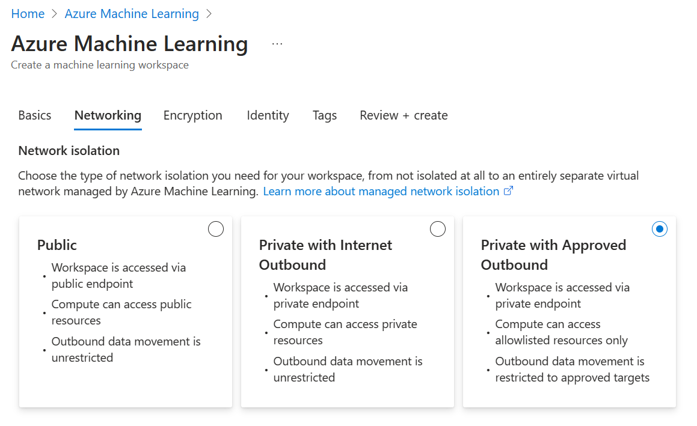

# Secure your RAG workflows with network isolation (preview)

You can secure your Retrieval Augmented Generation (RAG) flows by using private networks in Azure Machine Learning with two network management options. These options are: **Managed Virtual Network**, which is the in-house offering, or **"Bring Your Own" Virtual Network**, which is useful when you want full control over setup for your Virtual Networks / Subnets, Firewalls, Network Security Group rules, etc. 

Within the Azure Machine Learning managed network option, there are two secured suboptions offered which you can select from: **Allow Internet Outbound** and **Allow Only Approved Outbound**. 

Depending on your setup and scenario, RAG workflows in Azure Machine Learning may require other steps for network isolation.

## Prerequisites
* An Azure subscription.
* Access to Azure OpenAI Service.
* A secure Azure Machine Learning workspace: either with Workspace Managed Virtual Network or "Bring Your Own" Virtual Network setup.
* Prompt flows enabled in your Azure Machine Learning workspace. You can enable prompt flows by turning on Build AI solutions with Prompt flow on the Manage preview features panel.

## With Azure Machine Learning Workspace Managed VNet

1. Follow [Workspace managed network isolation](./how-to-managed-network.md) to enable workspace managed VNet.

2. Navigate to the [Azure portal](https://ms.portal.azure.com) and select **Networking** under the **Settings** tab in the left-hand menu.

3. To allow your RAG workflow to communicate with [<u>private</u> Azure Cognitive Services](./../ai-services/cognitive-services-virtual-networks.md) such as Azure Open AI or Azure AI Search during Vector Index creation, you need to define a related user outbound rule to a related resource. Select **Workspace managed outbound access** at the top of networking settings. Then select **+Add user-defined outbound rule**. Enter in a **Rule name**. Then select your resource you want to add the rule to using the **Resource name** text box.

   The Azure Machine Learning workspace creates a private endpoint in the related resource with autoapprove. If the status is stuck in pending, go to related resource to approve the private endpoint manually.

   :::image type="content" source="./media/how-to-secure-rag-workflows/add-private-cognitive-services.png" alt-text="Screenshot showing the location in Azure Studio to add private cognitive services user outbound rule." lightbox="./media/how-to-secure-rag-workflows/add-private-cognitive-services.png":::

4. Navigate to the settings of the storage account associated with your workspace. Select **Access Control (IAM)** in the left-hand menu. Select **Add Role Assignment**. Add **Storage Table Data Contributor** and **Storage Blob Data Contributor** access to Workspace Managed Identity. This can be done typing **Storage Table Data Contributor** and **Storage Blob Data Contributor** into the search bar. You'll need to complete this step and the next step twice. Once for Blob Contributor and the second time for Table Contributor. 

5. Ensure the **Managed Identity** option is selected. Then select **Select Members**. Select **Azure Machine Learning Workspace** under the drop-down for **Managed Identity**. Then select your managed identity of the workspace. 

   :::image type="content" source="./media/how-to-secure-rag-workflows/storage-add-blob-table-managed-identity.png" alt-text="Screenshot showing the location to add a Workspace Managed Identity to a Blob or Table access in Storage Account of the Azure Studio." lightbox="./media/how-to-secure-rag-workflows/storage-add-blob-table-managed-identity.png":::

7. (optional) To add an outgoing FQDN rule, in the Azure portal, select **Networking** under the **Settings** tab in the left-hand menu. Select **Workspace managed outbound access** at the top of networking settings. Then select **+Add user-defined outbound rule**. Select **FQDN Rule** under **Destination type**. Enter your endpoint URL in **FQDN Destination**. To find your endpoint URL, navigate to deployed endpoints in the Azure portal, select your desired endpoints and copy the endpoint URL from the details section.

If you're using an **Allow only approved outbound** Managed Vnet workspace and a `public` Azure Open AI resource, you need to **add an outgoing FQDN rule** for your Azure Open AI endpoint. This enables data plane operations, which are required to perform Embeddings in RAG. Without this, the AOAI resource, even if public, isn't allowed to be accessed.

7. (optional) In order to upload data files beforehand or to use **Local Folder Upload** for RAG when the storage account is made is private, the workspace must be accessed from a Virtual Machine behind a Vnet, and subnet must be allow-listed in the Storage Account. This can be done by selecting **Storage Account**, then **Networking setting**. Select **Enable for selected virtual network and IPs**, then add your workspace Subnet.

   :::image type="content" source="./media/how-to-secure-rag-workflows/storage-setting-for-private-data-upload.png" alt-text="Screenshot showing the private storage settings requirements for secure data upload." lightbox="./media/how-to-secure-rag-workflows/storage-setting-for-private-data-upload.png":::

    Follow this tutorial for [how to connect to a private storage](../private-link/tutorial-private-endpoint-storage-portal.md) from an Azure Virtual Machine.

## With BYO Custom Vnet

1. Select **Use my Own Virtual Network** when configuring your Azure Machine Learning workspace. In this scenario, it's up to the user to configure the network rules and private endpoints to related resources correctly, as the workspace doesn't autoconfigure it.

2. In the Vector Index creation Wizard, make sure to select **Compute Instance** or **Compute Cluster** from the compute options dropdown, as this scenario isn't supported with Serverless Compute.

## Troubleshooting Common Problems

- If your workspace runs into network related issues where your compute is unable to create or start a compute, try adding a placeholder FQDN rule in the **Networking** tab of your workspace in the Azure portal, in order to initiate a managed network update. Then, re-create the Compute in the Azure Machine Learning workspace.

- You might see an error message related to `< Resource > is not registered with Microsoft.Network resource provider.` In which case, you should **ensure the subscription which your AOAI/ACS resource is registered with a Microsoft Network resource provider**. To do so, navigate to **Subscription**, then **Resource Providers** for the same tenant as your Managed Vnet Workspace.

> [!NOTE]
> It's expected for a first-time serverless job in the workspace to be Queued an additional 10-15 minutes while Managed Network is provisioning Private Endpoints for the first time. With Compute Instance and Compute Cluster, this process happens during the compute creation.

## Next Steps

- [Secure your Prompt Flow](./prompt-flow/how-to-secure-prompt-flow.md)
