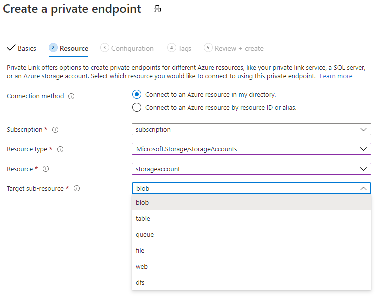

# Secure an Azure Machine Learning workspace with virtual networks

In this article, you learn how to secure an Azure Machine Learning workspace and its associated resources in a virtual network.

> [!TIP]
> This article is part of a series on securing an Azure Machine Learning workflow. See the other articles in this series:
>
> * [Virtual network overview](how-to-network-security-overview.md)
> * [Secure the training environment](how-to-secure-training-vnet.md)
> * [Secure the inference environment](how-to-secure-inferencing-vnet.md)
> * [Enable studio functionality](how-to-enable-studio-virtual-network.md)
> * [Use custom DNS](how-to-custom-dns.md)
> * [Use a firewall](how-to-access-azureml-behind-firewall.md)
>
> For a tutorial on creating a secure workspace, see [Tutorial: Create a secure workspace](tutorial-create-secure-workspace.md).

In this article you learn how to enable the following workspaces resources in a virtual network:
> [!div class="checklist"]
> - Azure Machine Learning workspace
> - Azure Storage accounts
> - Azure Machine Learning datastores and datasets
> - Azure Key Vault
> - Azure Container Registry

## Prerequisites

+ Read the [Network security overview](how-to-network-security-overview.md) article to understand common virtual network scenarios and overall virtual network architecture.

+ An existing virtual network and subnet to use with your compute resources.

    > [!TIP]
    > If you plan on using Azure Container Instances in the virtual network (to deploy models), then the workspace and virtual network must be in the same resource group. Otherwise, they can be in different groups.

+ To deploy resources into a virtual network or subnet, your user account must have permissions to the following actions in Azure role-based access control (Azure RBAC):

    - "Microsoft.Network/virtualNetworks/join/action" on the virtual network resource.
    - "Microsoft.Network/virtualNetworks/subnet/join/action" on the subnet resource.

    For more information on Azure RBAC with networking, see the [Networking built-in roles](../role-based-access-control/built-in-roles.md#networking)

### Azure Container Registry

* Your Azure Container Registry must be Premium version. For more information on upgrading, see [Changing SKUs](../container-registry/container-registry-skus.md#changing-tiers).

* Your Azure Container Registry must be in the same virtual network and subnet as the storage account and compute targets used for training or inference.

* Your Azure Machine Learning workspace must contain an [Azure Machine Learning compute cluster](how-to-create-attach-compute-cluster.md).

## Limitations

### Azure Container Registry

When ACR is behind a virtual network, Azure Machine Learning cannot use it to directly build Docker images. Instead, the compute cluster is used to build the images.

> [!IMPORTANT]
> The compute cluster used to build Docker images needs to be able to access the package repositories that are used to train and deploy your models. You may need to add network security rules that allow access to public repos, [use private Python packages](how-to-use-private-python-packages.md), or use [custom Docker images](how-to-train-with-custom-image.md) that already include the packages.

## Required public internet access

[!INCLUDE [machine-learning-required-public-internet-access](../../includes/machine-learning-public-internet-access.md)]

For information on using a firewall solution, see [Use a firewall with Azure Machine Learning](how-to-access-azureml-behind-firewall.md).

## Secure the workspace with private endpoint

Azure Private Link lets you connect to your workspace using a private endpoint. The private endpoint is a set of private IP addresses within your virtual network. You can then limit access to your workspace to only occur over the private IP addresses. A private endpoint helps reduce the risk of data exfiltration.

For more information on configuring a private endpoint for your workspace, see [How to configure a private endpoint](how-to-configure-private-link.md).

> [!WARNING]
> Securing a workspace with private endpoints does not ensure end-to-end security by itself. You must follow the steps in the rest of this article, and the VNet series, to secure individual components of your solution. For example, if you use a private endpoint for the workspace, but your Azure Storage Account is not behind the VNet, traffic between the workspace and storage does not use the VNet for security.

## Secure Azure storage accounts with service endpoints

Azure Machine Learning supports storage accounts configured to use either service endpoints or private endpoints. In this section, you learn how to secure an Azure storage account using service endpoints. For private endpoints, see the next section.

To use an Azure storage account for the workspace in a virtual network, use the following steps:

1. In the Azure portal, go to the storage service you want to use in your workspace.

   [](./media/how-to-enable-virtual-network/workspace-storage.png#lightbox)

1. On the storage service account page, select __Networking__.

   

1. On the __Firewalls and virtual networks__ tab, do the following actions:
    1. Select __Selected networks__.
    1. Under __Virtual networks__, select the __Add existing virtual network__ link. This action adds the virtual network where your compute resides (see step 1).

        > [!IMPORTANT]
        > The storage account must be in the same virtual network and subnet as the compute instances or clusters used for training or inference.

    1. Select the __Allow trusted Microsoft services to access this storage account__ check box. This change does not give all Azure services access to your storage account.
    
        * Resources of some services, **registered in your subscription**, can access the storage account **in the same subscription** for select operations. For example, writing logs or creating backups.
        * Resources of some services can be granted explicit access to your storage account by __assigning an Azure role__ to its system-assigned managed identity.

        For more information, see [Configure Azure Storage firewalls and virtual networks](../storage/common/storage-network-security.md#trusted-microsoft-services).

> [!TIP]
> When using a service endpoint, you can also disable public access. For more information, see [disallow public read access](../storage/blobs/anonymous-read-access-configure.md#allow-or-disallow-public-read-access-for-a-storage-account).

## Secure Azure storage accounts with private endpoints

Azure Machine Learning supports storage accounts configured to use either service endpoints or private endpoints. If the storage account uses private endpoints, you must configure two private endpoints for your default storage account:
1. A private endpoint with a **blob** target subresource.
1. A private endpoint with a **file** target subresource (fileshare).

> [!TIP]
> If you plan to use [ParallelRunStep](./tutorial-pipeline-batch-scoring-classification.md) in your pipeline, it is also required to configure private endpoints with a **queue** and a **table** target subresources. ParallelRunStep uses queue and table under the hood for task scheduling and dispatching.



To configure a private endpoint for a storage account that is **not** the default storage, select the **Target subresource** type that corresponds to the storage account you want to add.

For more information, see [Use private endpoints for Azure Storage](../storage/common/storage-private-endpoints.md)

> [!TIP]
> When using a private endpoint, you can also disable public access. For more information, see [disallow public read access](../storage/blobs/anonymous-read-access-configure.md#allow-or-disallow-public-read-access-for-a-storage-account).

## Secure Azure Key Vault

Azure Machine Learning uses an associated Key Vault instance to store the following credentials:
* The associated storage account connection string
* Passwords to Azure Container Repository instances
* Connection strings to data stores

Azure key vault can be configured to use either service endpoints or private endpoints. To use Azure Machine Learning experimentation capabilities with Azure Key Vault behind a virtual network, use the following steps:

1. Go to the Key Vault that's associated with the workspace.

1. On the __Key Vault__ page, in the left pane, select __Networking__.

1. On the __Firewalls and virtual networks__ tab, do the following actions:
    1. Under __Allow access from__, select __Private endpoint and selected networks__.
    1. Under __Virtual networks__, select __Add existing virtual networks__ to add the virtual network where your experimentation compute resides.
    1. Under __Allow trusted Microsoft services to bypass this firewall__, select __Yes__.

   [](./media/how-to-enable-virtual-network/key-vault-firewalls-and-virtual-networks-page.png#lightbox)

## Enable Azure Container Registry (ACR)

> [!TIP]
> If you did not use an existing Azure Container Registry when creating the workspace, one may not exist. By default, the workspace will not create an ACR instance until it needs one. To force the creation of one, train or deploy a model using your workspace before using the steps in this section.

Azure Container Registry can configured to use either service endpoints or private endpoints. Use the following steps to configure your workspace to use ACR when it is in the virtual network:

1. Find the name of the Azure Container Registry for your workspace, using one of the following methods:

    __Azure portal__

    From the overview section of your workspace, the __Registry__ value links to the Azure Container Registry.

    :::image type="content" source="./media/how-to-enable-virtual-network/azure-machine-learning-container-registry.png" alt-text="Azure Container Registry for the workspace" border="true":::

    __Azure CLI__

    If you have [installed the Machine Learning extension for Azure CLI](reference-azure-machine-learning-cli.md), you can use the `az ml workspace show` command to show the workspace information.

    ```azurecli-interactive
    az ml workspace show -w yourworkspacename -g resourcegroupname --query 'containerRegistry'
    ```

    This command returns a value similar to `"/subscriptions/{GUID}/resourceGroups/{resourcegroupname}/providers/Microsoft.ContainerRegistry/registries/{ACRname}"`. The last part of the string is the name of the Azure Container Registry for the workspace.

1. Limit access to your virtual network using the steps in [Configure network access for registry](../container-registry/container-registry-vnet.md#configure-network-access-for-registry). When adding the virtual network, select the virtual network and subnet for your Azure Machine Learning resources.

1. Configure the ACR for the workspace to [Allow access by trusted services](../container-registry/allow-access-trusted-services.md).

1. Create an Azure Machine Learning compute cluster. This is used to build Docker images when ACR is behind a VNet. For more information, see [Create a compute cluster](how-to-create-attach-compute-cluster.md).

1. Use the Azure Machine Learning Python SDK to configure the workspace to build Docker images using the compute instance. The following code snippet demonstrates how to update the workspace to set a build compute. Replace `mycomputecluster` with the name of the cluster to use:

    ```python
    from azureml.core import Workspace
    # Load workspace from an existing config file
    ws = Workspace.from_config()
    # Update the workspace to use an existing compute cluster
    ws.update(image_build_compute = 'mycomputecluster')
    # To switch back to using ACR to build (if ACR is not in the VNet):
    # ws.update(image_build_compute = '')
    ```

    > [!IMPORTANT]
    > Your storage account, compute cluster, and Azure Container Registry must all be in the same subnet of the virtual network.
    
    For more information, see the [update()](/python/api/azureml-core/azureml.core.workspace.workspace#update-friendly-name-none--description-none--tags-none--image-build-compute-none--enable-data-actions-none-) method reference.

> [!TIP]
> When ACR is behind a VNet, you can also [disable public access](../container-registry/container-registry-access-selected-networks.md#disable-public-network-access) to it.

## Datastores and datasets
The following table lists the services that you need to skip validation for:

| Service | Skip validation required? |
| ----- |:-----:|
| Azure Blob storage | Yes |
| Azure File share | Yes |
| Azure Data Lake Store Gen1 | No |
| Azure Data Lake Store Gen2 | No |
| Azure SQL Database | Yes |
| PostgreSql | Yes |

> [!NOTE]
> Azure Data Lake Store Gen1 and Azure Data Lake Store Gen2 skip validation by default, so you don't have to do anything.

The following code sample creates a new Azure Blob datastore and sets `skip_validation=True`.

```python
blob_datastore = Datastore.register_azure_blob_container(workspace=ws,  

                                                         datastore_name=blob_datastore_name,  

                                                         container_name=container_name,  

                                                         account_name=account_name, 

                                                         account_key=account_key, 

                                                         skip_validation=True ) // Set skip_validation to true
```

### Use datasets

The syntax to skip dataset validation is similar for the following dataset types:
- Delimited file
- JSON 
- Parquet
- SQL
- File

The following code creates a new JSON dataset and sets `validate=False`.

```python
json_ds = Dataset.Tabular.from_json_lines_files(path=datastore_paths, 

validate=False) 
```

## Securely connect to your workspace

The following methods can be used to connect to the secure workspace:

* [Azure VPN gateway](../vpn-gateway/vpn-gateway-about-vpngateways.md) - Connects on-premises networks to the VNet over a private connection. Connection is made over the public internet. There are two types of VPN gateways that you might use:

    * [Point-to-site](../vpn-gateway/vpn-gateway-howto-point-to-site-resource-manager-portal.md): Each client computer uses a VPN client to connect to the VNet.
    * [Site-to-site](../vpn-gateway/tutorial-site-to-site-portal.md): A VPN device connects the VNet to your on-premises network.

* [ExpressRoute](https://azure.microsoft.com/services/expressroute/) - Connects on-premises networks into the cloud over a private connection. Connection is made using a connectivity provider.
* [Azure Bastion](../bastion/bastion-overview.md) - In this scenario, you create an Azure Virtual Machine (sometimes called a jump box) inside the VNet. You then connect to the VM using Azure Bastion. Bastion allows you to connect to the VM using either an RDP or SSH session from your local web browser. You then use the jump box as your development environment. Since it is inside the VNet, it can directly access the workspace. For an example of using a jump box, see [Tutorial: Create a secure workspace](tutorial-create-secure-workspace.md).

> [!IMPORTANT]
> When using a __VPN gateway__ or __ExpressRoute__, you will need to plan how name resolution works between your on-premises resources and those in the VNet. For more information, see [Use a custom DNS server](how-to-custom-dns.md).

## Next steps

This article is part of a series on securing an Azure Machine Learning workflow. See the other articles in this series:

* [Virtual network overview](how-to-network-security-overview.md)
* [Secure the training environment](how-to-secure-training-vnet.md)
* [Secure the inference environment](how-to-secure-inferencing-vnet.md)
* [Enable studio functionality](how-to-enable-studio-virtual-network.md)
* [Use custom DNS](how-to-custom-dns.md)
* [Use a firewall](how-to-access-azureml-behind-firewall.md)
