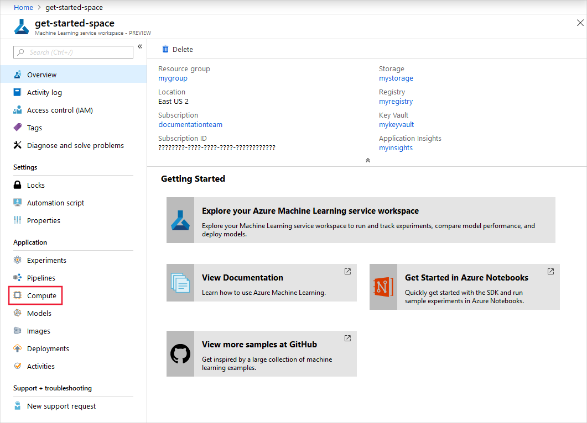
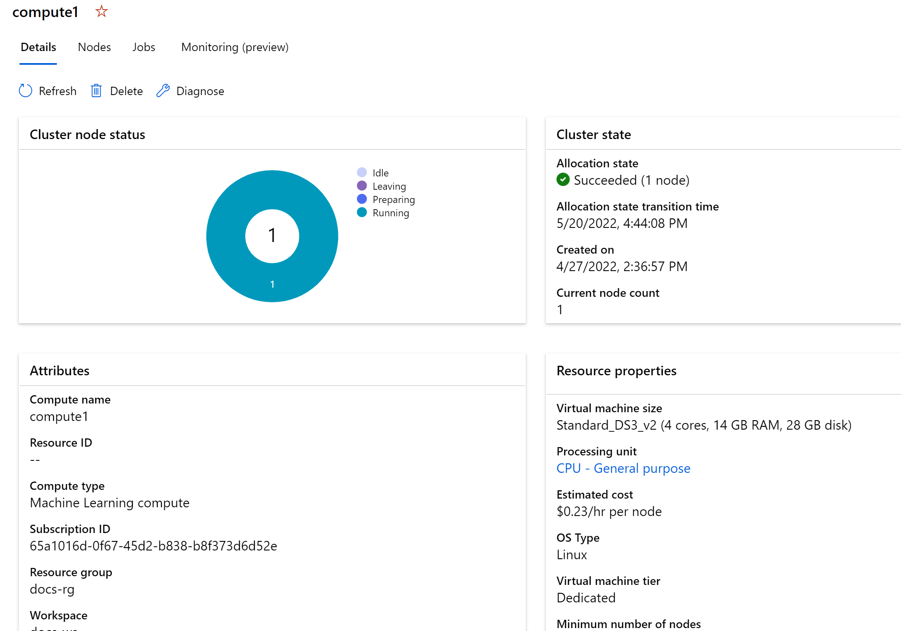

# Set up and use compute targets for model training 
[!INCLUDE [applies-to-skus](../../includes/aml-applies-to-basic-enterprise-sku.md)]

With Azure Machine Learning, you can train your model on a variety of resources or environments, collectively referred to as [__compute targets__](concept-azure-machine-learning-architecture.md#compute-targets). A compute target can be a local machine or a cloud resource, such as an Azure Machine Learning Compute, Azure HDInsight, or a remote virtual machine.  You can also create compute targets for model deployment as described in ["Where and how to deploy your models"](how-to-deploy-and-where.md).

You can create and manage a compute target using the Azure Machine Learning SDK, Azure Machine Learning studio, Azure CLI, or Azure Machine Learning VS Code extension. If you have compute targets that were created through another service (for example, an HDInsight cluster), you can use them by attaching them to your Azure Machine Learning workspace.
 
In this article, you learn how to use various compute targets for model training.  The steps for all compute targets follow the same workflow:
1. __Create__ a compute target if you don't already have one.
2. __Attach__ the compute target to your workspace.
3. __Configure__ the compute target so that it contains the Python environment and package dependencies needed by your script.


>[!NOTE]
> Code in this article was tested with Azure Machine Learning SDK version 1.0.74.

## Compute targets for training

Azure Machine Learning has varying support across different compute targets. A typical model development lifecycle starts with dev/experimentation on a small amount of data. At this stage, we recommend using a local environment. For example, your local computer or a cloud-based VM. As you scale up your training on larger data sets, or perform distributed training, we recommend using Azure Machine Learning Compute to create a single- or multi-node cluster that autoscales each time you submit a run. You can also attach your own compute resource, although support for various scenarios may vary as detailed below:

[!INCLUDE [aml-compute-target-train](../../includes/aml-compute-target-train.md)]


> [!NOTE]
> Azure Machine Learning Compute clusters can be created as a persistent resource or created dynamically when you request a run. Run-based creation removes the compute target after the training run is complete, so you cannot reuse compute targets created this way.

## What's a run configuration?

When training, it is common to start on your local computer, and later run that training script on a different compute target. With Azure Machine Learning, you can run your script on various compute targets without having to change your script.

All you need to do is define the environment for each compute target within a **run configuration**.  Then, when you want to run your training experiment on a different compute target, specify the run configuration for that compute. For details of specifying an environment and binding it to run configuration, see [Create and manage environments for training and deployment](how-to-use-environments.md).

Learn more about [submitting experiments](#submit) at the end of this article.

## What's an estimator?

To facilitate model training using popular frameworks, the Azure Machine Learning Python SDK provides an alternative higher-level abstraction, the estimator class.  This class allows you to easily construct run configurations. You can create and use a generic [Estimator](https://docs.microsoft.com/python/api/azureml-train-core/azureml.train.estimator?view=azure-ml-py) to submit training scripts that use any learning framework you choose (such as scikit-learn). We recommend using an estimator for training as it automatically constructs embedded objects like an environment or RunConfiguration objects for you. If you wish to have more control over how these objects are created and specify what packages to install for your experiment run, follow [these steps](#amlcompute) to submit your training experiments using a RunConfiguration object on an Azure Machine Learning Compute.

Azure Machine Learning provides specific estimators for [PyTorch](https://docs.microsoft.com/python/api/azureml-train-core/azureml.train.dnn.pytorch?view=azure-ml-py), [TensorFlow](https://docs.microsoft.com/python/api/azureml-train-core/azureml.train.dnn.tensorflow?view=azure-ml-py), [Chainer](https://docs.microsoft.com/python/api/azureml-train-core/azureml.train.dnn.chainer?view=azure-ml-py), and [Ray RLlib](how-to-use-reinforcement-learning.md).

For more information, see [Train ML Models with estimators](how-to-train-ml-models.md).

## What's an ML Pipeline?

With ML pipelines, you can optimize your workflow with simplicity, speed, portability, and reuse. When building pipelines with Azure Machine Learning, you can focus on your expertise, machine learning, rather than on infrastructure and automation.

ML pipelines are constructed from multiple **steps**, which are distinct computational units in the pipeline. Each step can run independently and use isolated compute resources. This approach allows multiple data scientists to work on the same pipeline at the same time without over-taxing compute resources, and also makes it easy to use different compute types/sizes for each step.

> [!TIP]
> ML Pipelines can use run configuration or estimators when training models.

While ML pipelines can train models, they can also prepare data before training and deploy models after training. One of the primary use cases for pipelines is batch scoring. For more information, see [Pipelines: Optimize machine learning workflows](concept-ml-pipelines.md).

## Set up in Python

Use the sections below to configure these compute targets:

* [Local computer](#local)
* [Azure Machine Learning compute cluster](#amlcompute)
* [Azure Machine Learning compute instance](#instance)
* [Remote virtual machines](#vm)
* [Azure HDInsight](#hdinsight)


### <a id="local"></a>Local computer

1. **Create and attach**: There's no need to create or attach a compute target to use your local computer as the training environment.  

1. **Configure**:  When you use your local computer as a compute target, the training code is run in your [development environment](how-to-configure-environment.md).  If that environment already has the Python packages you need, use the user-managed environment.

 [!code-python[](~/aml-sdk-samples/ignore/doc-qa/how-to-set-up-training-targets/local.py?name=run_local)]

Now that you've attached the compute and configured your run, the next step is to [submit the training run](#submit).

### <a id="amlcompute"></a>Azure Machine Learning compute cluster

Azure Machine Learning compute cluster is a managed-compute infrastructure that allows you to easily create a single or multi-node compute. The compute is created within your workspace region as a resource that can be shared with other users in your workspace. The compute scales up automatically when a job is submitted, and can be put in an Azure Virtual Network. The compute executes in a containerized environment and packages your model dependencies in a [Docker container](https://www.docker.com/why-docker).

You can use Azure Machine Learning Compute to distribute the training process across a cluster of CPU or GPU compute nodes in the cloud. For more information on the VM sizes that include GPUs, see [GPU-optimized virtual machine sizes](https://docs.microsoft.com/azure/virtual-machines/linux/sizes-gpu). 

Azure Machine Learning Compute has default limits, such as the number of cores that can be allocated. For more information, see [Manage and request quotas for Azure resources](https://docs.microsoft.com/azure/machine-learning/how-to-manage-quotas).

You may also choose to use low-priority VMs to run some or all of your workloads. These VMs do not have guaranteed availability and may be preempted while in use. A preempted job is restarted, not resumed.  Low-priority VMs have discounted rates compared to normal VMs, see [Plan and manage costs](https://docs.microsoft.com/azure/machine-learning/concept-plan-manage-cost).

> [!TIP]
> Clusters can generally scale up to 100 nodes as long as you have enough quota for the number of cores required. By default clusters are setup with inter-node communication enabled between the nodes of the cluster to support MPI jobs for example. However you can scale your clusters to 1000s of nodes by simply [raising a support ticket](https://portal.azure.com/#blade/Microsoft_Azure_Support/HelpAndSupportBlade/newsupportrequest), and requesting to whitelist your subscription, or workspace, or a specific cluster for disabling inter-node communication. 

Azure Machine Learning Compute can be reused across runs. The compute can be shared with other users in the workspace and is retained between runs, automatically scaling nodes up or down based on the number of runs submitted, and the max_nodes set on your cluster. The min_nodes setting controls the minimum nodes available.

[!INCLUDE [min-nodes-note](../../includes/machine-learning-min-nodes.md)]

1. **Create and attach**: To create a persistent Azure Machine Learning Compute resource in Python, specify the **vm_size** and **max_nodes** properties. Azure Machine Learning then uses smart defaults for the other properties. The compute autoscales down to zero nodes when it isn't used.   Dedicated VMs are created to run your jobs as needed.
    
    * **vm_size**: The VM family of the nodes created by Azure Machine Learning Compute.
    * **max_nodes**: The max number of nodes to autoscale up to when you run a job on Azure Machine Learning Compute.
    
   [!code-python[](~/aml-sdk-samples/ignore/doc-qa/how-to-set-up-training-targets/amlcompute2.py?name=cpu_cluster)]

   You can also configure several advanced properties when you create Azure Machine Learning Compute. The properties allow you to create a persistent cluster of fixed size, or within an existing Azure Virtual Network in your subscription.  See the [AmlCompute class](https://docs.microsoft.com/python/api/azureml-core/azureml.core.compute.amlcompute.amlcompute?view=azure-ml-py
    ) for details.
    
   Or you can create and attach a persistent Azure Machine Learning Compute resource in [Azure Machine Learning studio](#portal-create).

1. **Configure**: Create a run configuration for the persistent compute target.

   [!code-python[](~/aml-sdk-samples/ignore/doc-qa/how-to-set-up-training-targets/amlcompute2.py?name=run_amlcompute)]

Now that you've attached the compute and configured your run, the next step is to [submit the training run](#submit).


### <a id="instance"></a>Azure Machine Learning compute instance

[Azure Machine Learning compute instance](concept-compute-instance.md) is a managed-compute infrastructure that allows you to easily create a single VM. The compute is created within your workspace region, but unlike a compute cluster, an instance cannot be shared with other users in your workspace. Also the instance does not automatically scale down.  You must stop the resource to prevent ongoing charges.

A compute instance can run multiple jobs in parallel and has a job queue. 

Compute instances can run jobs securely in a [virtual network environment](how-to-enable-virtual-network.md#compute-instance), without requiring enterprises to open up SSH ports. The job executes in a containerized environment and packages your model dependencies in a Docker container. 

1. **Create and attach**: 
    
    [!notebook-python[] (~/MachineLearningNotebooks/how-to-use-azureml/training/train-on-computeinstance/train-on-computeinstance.ipynb?name=create_instance)]

1. **Configure**: Create a run configuration.
    
    ```python
    
    from azureml.core import ScriptRunConfig
    from azureml.core.runconfig import DEFAULT_CPU_IMAGE
    
    src = ScriptRunConfig(source_directory='', script='train.py')
    
    # Set compute target to the one created in previous step
    src.run_config.target = instance
    
    # Set environment
    src.run_config.environment = myenv
     
    run = experiment.submit(config=src)
    ```

For more commands useful for the compute instance, see the notebook [train-on-computeinstance](https://github.com/Azure/MachineLearningNotebooks/blob/master/how-to-use-azureml/training/train-on-computeinstance/train-on-computeinstance.ipynb). This notebook is also available in the studio **Samples** folder in *training/train-on-computeinstance*.

Now that you've attached the compute and configured your run, the next step is to [submit the training run](#submit)


### <a id="vm"></a>Remote virtual machines

Azure Machine Learning also supports bringing your own compute resource and attaching it to your workspace. One such resource type is an arbitrary remote VM, as long as it's accessible from Azure Machine Learning. The resource can be an Azure VM, a remote server in your organization, or on-premises. Specifically, given the IP address and credentials (user name and password, or SSH key), you can use any accessible VM for remote runs.

You can use a system-built conda environment, an already existing Python environment, or a Docker container. To execute on a Docker container, you must have a Docker Engine running on the VM. This functionality is especially useful when you want a more flexible, cloud-based dev/experimentation environment than your local machine.

Use the Azure Data Science Virtual Machine (DSVM) as the Azure VM of choice for this scenario. This VM is a pre-configured data science and AI development environment in Azure. The VM offers a curated choice of tools and frameworks for full-lifecycle machine learning development. For more information on how to use the DSVM with Azure Machine Learning, see [Configure a development environment](https://docs.microsoft.com/azure/machine-learning/how-to-configure-environment#dsvm).

1. **Create**: Create a DSVM before using it to train your model. To create this resource, see [Provision the Data Science Virtual Machine for Linux (Ubuntu)](https://docs.microsoft.com/azure/machine-learning/data-science-virtual-machine/dsvm-ubuntu-intro).

    > [!WARNING]
    > Azure Machine Learning only supports virtual machines that run **Ubuntu**. When you create a VM or choose an existing VM, you must select a VM that uses Ubuntu.
    > 
    > Azure Machine Learning also requires the virtual machine to have a __public IP address__.

1. **Attach**: To attach an existing virtual machine as a compute target, you must provide the resource ID, user name, and password for the virtual machine. The resource ID of the VM can be constructed using the subscription ID, resource group name, and VM name using the following string format: `/subscriptions/<subscription_id>/resourceGroups/<resource_group>/providers/Microsoft.Compute/virtualMachines/<vm_name>`

 
   ```python
   from azureml.core.compute import RemoteCompute, ComputeTarget

   # Create the compute config 
   compute_target_name = "attach-dsvm"
   
   attach_config = RemoteCompute.attach_configuration(resource_id='<resource_id>',
                                                   ssh_port=22,
                                                   username='<username>',
                                                   password="<password>")

   # Attach the compute
   compute = ComputeTarget.attach(ws, compute_target_name, attach_config)

   compute.wait_for_completion(show_output=True)
   ```

   Or you can attach the DSVM to your workspace [using Azure Machine Learning studio](#portal-reuse).

1. **Configure**: Create a run configuration for the DSVM compute target. Docker and conda are used to create and configure the training environment on the DSVM.

   [!code-python[](~/aml-sdk-samples/ignore/doc-qa/how-to-set-up-training-targets/dsvm.py?name=run_dsvm)]


Now that you've attached the compute and configured your run, the next step is to [submit the training run](#submit).

### <a id="hdinsight"></a>Azure HDInsight 

Azure HDInsight is a popular platform for big-data analytics. The platform provides Apache Spark, which can be used to train your model.

1. **Create**:  Create the HDInsight cluster before you use it to train your model. To create a Spark on HDInsight cluster, see [Create a Spark Cluster in HDInsight](https://docs.microsoft.com/azure/hdinsight/spark/apache-spark-jupyter-spark-sql). 

    > [!WARNING]
    > Azure Machine Learning requires the HDInsight cluster to have a __public IP address__.

    When you create the cluster, you must specify an SSH user name and password. Take note of these values, as you need them to use HDInsight as a compute target.
    
    After the cluster is created, connect to it with the hostname \<clustername>-ssh.azurehdinsight.net, where \<clustername> is the name that you provided for the cluster. 

1. **Attach**: To attach an HDInsight cluster as a compute target, you must provide the resource ID, user name, and password for the HDInsight cluster. The resource ID of the HDInsight cluster can be constructed using the subscription ID, resource group name, and HDInsight cluster name using the following string format: `/subscriptions/<subscription_id>/resourceGroups/<resource_group>/providers/Microsoft.HDInsight/clusters/<cluster_name>`

    ```python
   from azureml.core.compute import ComputeTarget, HDInsightCompute
   from azureml.exceptions import ComputeTargetException

   try:
    # if you want to connect using SSH key instead of username/password you can provide parameters private_key_file and private_key_passphrase

    attach_config = HDInsightCompute.attach_configuration(resource_id='<resource_id>',
                                                          ssh_port=22, 
                                                          username='<ssh-username>', 
                                                          password='<ssh-pwd>')
    hdi_compute = ComputeTarget.attach(workspace=ws, 
                                       name='myhdi', 
                                       attach_configuration=attach_config)

   except ComputeTargetException as e:
    print("Caught = {}".format(e.message))

   hdi_compute.wait_for_completion(show_output=True)
   ```

   Or you can attach the HDInsight cluster to your workspace [using Azure Machine Learning studio](#portal-reuse).

1. **Configure**: Create a run configuration for the HDI compute target. 

   [!code-python[](~/aml-sdk-samples/ignore/doc-qa/how-to-set-up-training-targets/hdi.py?name=run_hdi)]


Now that you've attached the compute and configured your run, the next step is to [submit the training run](#submit).


### <a id="azbatch"></a>Azure Batch 

Azure Batch is used to run large-scale parallel and high-performance computing (HPC) applications efficiently in the cloud. AzureBatchStep can be used in an Azure Machine Learning Pipeline to submit jobs to an Azure Batch pool of machines.

To attach Azure Batch as a compute target, you must use the Azure Machine Learning SDK and provide the following information:

-    **Azure Batch compute name**: A friendly name to be used for the compute within the workspace
-    **Azure Batch account name**: The name of the Azure Batch account
-    **Resource Group**: The resource group that contains the Azure Batch account.

The following code demonstrates how to attach Azure Batch as a compute target:

```python
from azureml.core.compute import ComputeTarget, BatchCompute
from azureml.exceptions import ComputeTargetException

# Name to associate with new compute in workspace
batch_compute_name = 'mybatchcompute'

# Batch account details needed to attach as compute to workspace
batch_account_name = "<batch_account_name>"  # Name of the Batch account
# Name of the resource group which contains this account
batch_resource_group = "<batch_resource_group>"

try:
    # check if the compute is already attached
    batch_compute = BatchCompute(ws, batch_compute_name)
except ComputeTargetException:
    print('Attaching Batch compute...')
    provisioning_config = BatchCompute.attach_configuration(
        resource_group=batch_resource_group, account_name=batch_account_name)
    batch_compute = ComputeTarget.attach(
        ws, batch_compute_name, provisioning_config)
    batch_compute.wait_for_completion()
    print("Provisioning state:{}".format(batch_compute.provisioning_state))
    print("Provisioning errors:{}".format(batch_compute.provisioning_errors))

print("Using Batch compute:{}".format(batch_compute.cluster_resource_id))
```

## Set up in Azure Machine Learning studio

You can access the compute targets that are associated with your workspace in the Azure Machine Learning studio.  You can use the studio to:

* [View  compute targets](#portal-view) attached to your workspace
* [Create a compute target](#portal-create) in your workspace
* [Attach a compute target](#portal-reuse) that was created outside the workspace


After a target is created and attached to your workspace, you will use it in your run configuration with a `ComputeTarget` object: 

```python
from azureml.core.compute import ComputeTarget
myvm = ComputeTarget(workspace=ws, name='my-vm-name')
```

### <a id="portal-view"></a>View compute targets


To see the compute targets for your workspace, use the following steps:

1. Navigate to [Azure Machine Learning studio](https://ml.azure.com).
 
1. Under __Applications__, select __Compute__.

    [](./media/how-to-set-up-training-targets/azure-machine-learning-service-workspace-expanded.png)

### <a id="portal-create"></a>Create a compute target

Follow the previous steps to view the list of compute targets. Then use these steps to create a compute target: 

1. Select the plus sign (+) to add a compute target.

     

1. Enter a name for the compute target. 

1. Select **Machine Learning Compute** as the type of compute to use for __Training__. 

    >[!NOTE]
    >Azure Machine Learning Compute is the only  managed-compute resource you can create in Azure Machine Learning studio.  All other compute resources can be attached after they are created.

1. Fill out the form. Provide values for the required properties, especially **VM Family**, and the **maximum nodes** to use to spin up the compute.  

1. Select __Create__.


1. View the status of the create operation by selecting the compute target from the list:

    

1. You then see the details for the compute target: 

     

### <a id="portal-reuse"></a>Attach compute targets

To use compute targets created outside the Azure Machine Learning workspace, you must attach them. Attaching a compute target makes it available to your workspace.

Follow the steps described earlier to view the list of compute targets. Then use the following steps to attach a compute target: 

1. Select the plus sign (+) to add a compute target. 
1. Enter a name for the compute target. 
1. Select the type of compute to attach for __Training__:

    > [!IMPORTANT]
    > Not all compute types can be attached from Azure Machine Learning studio. 
    > The compute types that can currently be attached for training include:
    >
    > * A remote VM
    > * Azure Databricks (for use in machine learning pipelines)
    > * Azure Data Lake Analytics (for use in machine learning pipelines)
    > * Azure HDInsight

1. Fill out the form and provide values for the required properties.

    > [!NOTE]
    > Microsoft recommends that you use SSH keys, which are more secure than passwords. Passwords are vulnerable to brute force attacks. SSH keys rely on cryptographic signatures. For information on how to create SSH keys for use with Azure Virtual Machines, see the following documents:
    >
    > * [Create and use SSH keys on Linux or macOS](https://docs.microsoft.com/azure/virtual-machines/linux/mac-create-ssh-keys)
    > * [Create and use SSH keys on Windows](https://docs.microsoft.com/azure/virtual-machines/linux/ssh-from-windows)

1. Select __Attach__. 
1. View the status of the attach operation by selecting the compute target from the list.

## Set up with CLI

You can access the compute targets that are associated with your workspace using the [CLI extension](reference-azure-machine-learning-cli.md) for Azure Machine Learning.  You can use the CLI to:

* Create a managed compute target
* Update a managed compute target
* Attach an unmanaged compute target

For more information, see [Resource management](reference-azure-machine-learning-cli.md#resource-management).

## Set up with VS Code

You can access, create, and manage the compute targets that are associated with your workspace using the [VS Code extension](tutorial-train-deploy-image-classification-model-vscode.md#configure-compute-targets) for Azure Machine Learning.

## <a id="submit"></a>Submit training run using Azure Machine Learning SDK

After you create a run configuration, you use it to run your experiment.  The code pattern to submit a training run is the same for all types of compute targets:

1. Create an experiment to run
1. Submit the run.
1. Wait for the run to complete.

> [!IMPORTANT]
> When you submit the training run, a snapshot of the directory that contains your training scripts is created and sent to the compute target. It is also stored as part of the experiment in your workspace. If you change files and submit the run again, only the changed files will be uploaded.
>
> [!INCLUDE [amlinclude-info](../../includes/machine-learning-amlignore-gitignore.md)]
> 
> For more information, see [Snapshots](concept-azure-machine-learning-architecture.md#snapshots).

### Create an experiment

First, create an experiment in your workspace.

[!code-python[](~/aml-sdk-samples/ignore/doc-qa/how-to-set-up-training-targets/local.py?name=experiment)]

### Submit the experiment

Submit the experiment with a `ScriptRunConfig` object.  This object includes the:

* **source_directory**: The source directory that contains your training script
* **script**: Identify the training script
* **run_config**: The run configuration, which in turn defines where the training will occur.

For example, to use [the local target](#local) configuration:

[!code-python[](~/aml-sdk-samples/ignore/doc-qa/how-to-set-up-training-targets/local.py?name=local_submit)]

Switch the same experiment to run in a different compute target by using a different run configuration, such as the [amlcompute target](#amlcompute):

[!code-python[](~/aml-sdk-samples/ignore/doc-qa/how-to-set-up-training-targets/amlcompute2.py?name=amlcompute_submit)]

> [!TIP]
> This example defaults to only using one node of the compute target for training. To use more than one node, set the `node_count` of the run configuration to the desired number of nodes. For example, the following code sets the number of nodes used for training to four:
>
> ```python
> src.run_config.node_count = 4
> ```

Or you can:

* Submit the experiment with an `Estimator` object as shown in [Train ML models with estimators](how-to-train-ml-models.md).
* Submit a HyperDrive run for [hyperparameter tuning](how-to-tune-hyperparameters.md).
* Submit an experiment via the [VS Code extension](tutorial-train-deploy-image-classification-model-vscode.md#train-the-model).

For more information, see the [ScriptRunConfig](https://docs.microsoft.com/python/api/azureml-core/azureml.core.scriptrunconfig?view=azure-ml-py) and [RunConfiguration](https://docs.microsoft.com/python/api/azureml-core/azureml.core.runconfiguration?view=azure-ml-py) documentation.

## Create run configuration and submit run using Azure Machine Learning CLI

You can use [Azure CLI](https://docs.microsoft.com/cli/azure/install-azure-cli?view=azure-cli-latest) and [Machine Learning CLI extension](reference-azure-machine-learning-cli.md) to create run configurations and submit runs on different compute targets. The following examples assume that you have an existing Azure Machine Learning Workspace and you have logged in to Azure using `az login` CLI command. 

[!INCLUDE [select-subscription](../../includes/machine-learning-cli-subscription.md)] 

### Create run configuration

The simplest way to create run configuration is to navigate the folder that contains your machine learning Python scripts, and use CLI command

```azurecli
az ml folder attach
```

This command creates a subfolder `.azureml` that contains template run configuration files for different compute targets. You can copy and edit these files to customize your configuration, for example to add Python packages or change Docker settings.  

### Structure of run configuration file

The run configuration file is YAML formatted, with following sections
 * The script to run and its arguments
 * Compute target name, either "local" or name of a compute under the workspace.
 * Parameters for executing the run: framework, communicator for distributed runs, maximum duration, and number of compute nodes.
 * Environment section. See [Create and manage environments for training and deployment](how-to-use-environments.md) for details of the fields in this section.
   * To specify Python packages to install for the run, create [conda environment file](https://docs.conda.io/projects/conda/en/latest/user-guide/tasks/manage-environments.html#create-env-file-manually), and set __condaDependenciesFile__ field.
 * Run history details to specify log file folder, and to enable or disable output collection and run history snapshots.
 * Configuration details specific to the framework selected.
 * Data reference and data store details.
 * Configuration details specific for Machine Learning Compute for creating a new cluster.

See the example [JSON file](https://github.com/microsoft/MLOps/blob/b4bdcf8c369d188e83f40be8b748b49821f71cf2/infra-as-code/runconfigschema.json) for a full runconfig schema.

### Create an experiment

First, create an experiment for your runs

```azurecli
az ml experiment create -n <experiment>
```

### Script run

To submit a script run, execute a command

```azurecli
az ml run submit-script -e <experiment> -c <runconfig> my_train.py
```

### HyperDrive run

You can use HyperDrive with Azure CLI to perform parameter tuning runs. First, create a HyperDrive configuration file in the following format. See [Tune hyperparameters for your model](how-to-tune-hyperparameters.md) article for details on hyperparameter tuning parameters.

```yml
# hdconfig.yml
sampling: 
    type: random # Supported options: Random, Grid, Bayesian
    parameter_space: # specify a name|expression|values tuple for each parameter.
    - name: --penalty # The name of a script parameter to generate values for.
      expression: choice # supported options: choice, randint, uniform, quniform, loguniform, qloguniform, normal, qnormal, lognormal, qlognormal
      values: [0.5, 1, 1.5] # The list of values, the number of values is dependent on the expression specified.
policy: 
    type: BanditPolicy # Supported options: BanditPolicy, MedianStoppingPolicy, TruncationSelectionPolicy, NoTerminationPolicy
    evaluation_interval: 1 # Policy properties are policy specific. See the above link for policy specific parameter details.
    slack_factor: 0.2
primary_metric_name: Accuracy # The metric used when evaluating the policy
primary_metric_goal: Maximize # Maximize|Minimize
max_total_runs: 8 # The maximum number of runs to generate
max_concurrent_runs: 2 # The number of runs that can run concurrently.
max_duration_minutes: 100 # The maximum length of time to run the experiment before cancelling.
```

Add this file alongside the run configuration files. Then submit a HyperDrive run using:
```azurecli
az ml run submit-hyperdrive -e <experiment> -c <runconfig> --hyperdrive-configuration-name <hdconfig> my_train.py
```

Note the *arguments* section in runconfig and *parameter space* in HyperDrive config. They contain the command-line arguments to be passed to training script. The value in runconfig stays the same for each iteration, while the range in HyperDrive config is iterated over. Do not specify the same argument in both files.

For more details on these ```az ml``` CLI commands, see 
[the reference documentation](reference-azure-machine-learning-cli.md).

<a id="gitintegration"></a>

## Git tracking and integration

When you start a training run where the source directory is a local Git repository, information about the repository is stored in the run history. For more information, see [Git integration for Azure Machine Learning](concept-train-model-git-integration.md).

## Notebook examples

See these notebooks for examples of training with various compute targets:
* [how-to-use-azureml/training](https://github.com/Azure/MachineLearningNotebooks/blob/master/how-to-use-azureml/training)
* [tutorials/img-classification-part1-training.ipynb](https://github.com/Azure/MachineLearningNotebooks/blob/master/tutorials/image-classification-mnist-data/img-classification-part1-training.ipynb)

[!INCLUDE [aml-clone-in-azure-notebook](../../includes/aml-clone-for-examples.md)]

## Next steps

* [Tutorial: Train a model](tutorial-train-models-with-aml.md) uses a managed compute target to  train a model.
* Learn how to [efficiently tune hyperparameters](how-to-tune-hyperparameters.md) to build better models.
* Once you have a trained model, learn [how and where to deploy models](how-to-deploy-and-where.md).
* View the [RunConfiguration class](https://docs.microsoft.com/python/api/azureml-core/azureml.core.runconfig.runconfiguration?view=azure-ml-py) SDK reference.
* [Use Azure Machine Learning with Azure Virtual Networks](how-to-enable-virtual-network.md)
