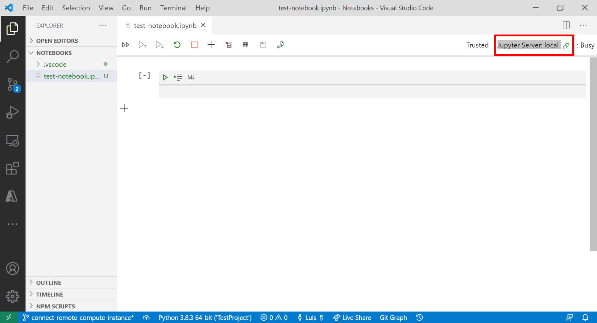

# Connect to an Azure Machine Learning compute instance in Visual Studio Code (preview)

In this article, you'll learn how to connect to an Azure Machine Learning compute instance using Visual Studio Code.

An [Azure Machine Learning Compute Instance](concept-compute-instance.md) is a fully managed cloud-based workstation for data scientists and provides management and enterprise readiness capabilities for IT administrators.

There are two ways you can connect to a compute instance from Visual Studio Code:

* Remote compute instance. This option provides you with a full-featured development environment for building your machine learning projects.
* Remote Jupyter Notebook server. This option allows you to set a compute instance as a remote Jupyter Notebook server.

## Configure a remote compute instance

To configure a remote compute instance for development, you'll need a few prerequisites.

* Azure Machine Learning Visual Studio Code extension. For more information, see the [Azure Machine Learning Visual Studio Code Extension setup guide](tutorial-setup-vscode-extension.md).
* Azure Machine Learning workspace. [Use the Azure Machine Learning Visual Studio Code extension to create a new workspace](how-to-manage-resources-vscode.md#create-a-workspace) if you don't already have one.
* Azure Machine Learning compute instance. [Use the Azure Machine Learning Visual Studio Code extension to create a new compute instance](how-to-manage-resources-vscode.md#create-compute-instance) if you don't have one.

To connect to your remote compute instance:

# [VS Code](#tab/extension)

### Azure Machine Learning Extension

1. In VS Code, launch the Azure Machine Learning extension.
1. Expand the **Compute instances** node in your extension.
1. Right-click the compute instance you want to connect to and select **Connect to Compute Instance**.

:::image type="content" source="media/how-to-set-up-vs-code-remote/vs-code-compute-instance-launch.png" alt-text="Connect to compute instance Visual Studio Code Azure ML Extension" lightbox="media/how-to-set-up-vs-code-remote/vs-code-compute-instance-launch.png":::

### Command Palette

1. In VS Code, open the command palette by selecting **View > Command Palette**.
1. Enter into the text box **Azure ML: Connect to Compute Instance**.
1. Select your subscription.
1. Select your workspace.
1. Select your compute instance or create a new one.

# [Studio](#tab/studio)

Navigate to [ml.azure.com](https://ml.azure.com)

> [!IMPORTANT]
> In order to connect to your remote compute instance from Visual Studio Code, make sure that the account you're logged into in Azure Machine Learning studio is the same one you use in Visual Studio Code.

### Compute

1. Select the **Compute** tab
1. In the *Application URI* column, select **VS Code** for the compute instance you want to connect to.

:::image type="content" source="media/how-to-set-up-vs-code-remote/studio-compute-instance-vs-code-launch.png" alt-text="Connect to Compute Instance VS Code Azure ML studio" lightbox="media/how-to-set-up-vs-code-remote/studio-compute-instance-vs-code-launch.png":::

### Notebook

1. Select the **Notebook** tab
1. In the *Notebook* tab, select the file you want to edit.
1. Select **Editors > Edit in VS Code (preview)**.

:::image type="content" source="media/how-to-set-up-vs-code-remote/studio-notebook-compute-instance-vs-code-launch.png" alt-text="Connect to Compute Instance VS Code Azure ML Notebook" lightbox="media/how-to-set-up-vs-code-remote/studio-notebook-compute-instance-vs-code-launch.png":::

---

A new window launches for your remote compute instance. When attempting to make a connection to a remote compute instance, the following tasks are taking place:

1. Authorization. Some checks are performed to make sure the user attempting to make a connection is authorized to use the compute instance.
1. VS Code Remote Server is installed on the compute instance.
1. A WebSocket connection is established for real-time interaction.

Once the connection is established, it's persisted. A token is issued at the start of the session which gets refreshed automatically to maintain the connection with your compute instance.

After you connect to your remote compute instance, use the editor to:

* [Author and manage files on your remote compute instance or file share](https://code.visualstudio.com/docs/editor/codebasics).
* Use the [VS Code integrated terminal](https://code.visualstudio.com/docs/editor/integrated-terminal) to [run commands and applications on your remote compute instance](how-to-access-terminal.md).
* [Debug your scripts and applications](https://code.visualstudio.com/Docs/editor/debugging)
* [Use VS Code to manage your Git repositories](concept-train-model-git-integration.md)

## Configure compute instance as remote notebook server

In order to configure a compute instance as a remote Jupyter Notebook server you'll need a few prerequisites:

* Azure Machine Learning Visual Studio Code extension. For more information, see the [Azure Machine Learning Visual Studio Code Extension setup guide](tutorial-setup-vscode-extension.md).
* Azure Machine Learning workspace. [Use the Azure Machine Learning Visual Studio Code extension to create a new workspace](how-to-manage-resources-vscode.md#create-a-workspace) if you don't already have one.

To connect to a compute instance:

1. Open a Jupyter Notebook in Visual Studio Code.
1. When the integrated notebook experience loads, select **Jupyter Server**.

    > [!div class="mx-imgBorder"]
    > 

    Alternatively, you also use the command palette:

    1. Open the command palette by selecting **View > Command Palette** from the menu bar.
    1. Enter into the text box `Azure ML: Connect to Compute instance Jupyter server`.

1. Choose `Azure ML Compute Instances` from the list of Jupyter server options.
1. Select your subscription from the list of subscriptions. If you have have previously configured your default Azure Machine Learning workspace, this step is skipped.
1. Select your workspace.
1. Select your compute instance from the list. If you don't have one, select **Create new Azure ML Compute Instance** and follow the prompts to create one.
1. For the changes to take effect, you have to reload Visual Studio Code.
1. Open a Jupyter Notebook and run a cell.

> [!IMPORTANT]
> You **MUST** run a cell in order to establish the connection.

At this point, you can continue to run cells in your Jupyter Notebook.

> [!TIP]
> You can also work with Python script files (.py) containing Jupyter-like code cells. For more information, see the [Visual Studio Code Python interactive documentation](https://code.visualstudio.com/docs/python/jupyter-support-py).

## Next steps

Now that you've set up Visual Studio Code Remote, you can use a compute instance as remote compute from Visual Studio Code to [interactively debug your code](how-to-debug-visual-studio-code.md).

[Tutorial: Train your first ML model](tutorial-1st-experiment-sdk-train.md) shows how to use a compute instance with an integrated notebook.
