# Set up MLOps with Azure DevOps

[!INCLUDE [dev v2](includes/machine-learning-dev-v2.md)]

Azure Machine Learning allows you to integrate with [Azure DevOps pipeline](/azure/devops/pipelines/) to automate the machine learning lifecycle. Some of the operations you can automate are:

* Deployment of Azure Machine Learning infrastructure
* Data preparation (extract, transform, load operations)
* Training machine learning models with on-demand scale-out and scale-up
* Deployment of machine learning models as public or private web services
* Monitoring deployed machine learning models (such as for performance analysis)

In this article, you learn about using Azure Machine Learning to set up an end-to-end MLOps pipeline that runs a linear regression to predict taxi fares in NYC. The pipeline is made up of components, each serving  different functions, which can be registered with the workspace, versioned, and reused with various inputs and outputs. you're going to be using the [recommended Azure architecture for MLOps](/azure/architecture/data-guide/technology-choices/machine-learning-operations-v2) and [AzureMLOps (v2) solution accelerator](https://github.com/Azure/mlops-v2) to quickly setup an MLOps project in Azure Machine Learning.

> [!TIP]
> We recommend you understand some of the [recommended Azure architectures](/azure/architecture/data-guide/technology-choices/machine-learning-operations-v2) for MLOps before implementing any solution. You'll need to pick the best architecture for your given Machine learning project.

## Prerequisites

- An Azure subscription. If you don't have an Azure subscription, create a free account before you begin. Try the [free or paid version of Azure Machine Learning](https://azure.microsoft.com/free/).
- An Azure Machine Learning workspace.
- Git running on your local machine.
- An [organization](/azure/devops/organizations/accounts/create-organization) in Azure DevOps.
- [Azure DevOps project](how-to-devops-machine-learning.md) that will host the source repositories and pipelines.
- The [Terraform extension for Azure DevOps](https://marketplace.visualstudio.com/items?itemName=ms-devlabs.custom-terraform-tasks) if you're using Azure DevOps + Terraform to spin up infrastructure

> [!NOTE]
>
>Git version 2.27 or newer is required. For more information on installing the Git command, see https://git-scm.com/downloads and select your operating system

> [!IMPORTANT]
>The CLI commands in this article were tested using Bash. If you use a different shell, you may encounter errors.

## Set up authentication with Azure and DevOps

Before you can set up an MLOps project with Azure Machine Learning, you need to set up authentication for Azure DevOps.

### Create service principal
   For the use of the demo, the creation of one or two service principles is required, depending on how many environments, you want to work on (Dev or Prod or Both). These principles can be created using one of the following methods:

# [Create from Azure Cloud Shell](#tab/azure-shell)

1. Launch the [Azure Cloud Shell](https://shell.azure.com).

    > [!TIP]
    > The first time you've launched the Cloud Shell, you'll be prompted to create a storage account for the Cloud Shell.

1. If prompted, choose **Bash** as the environment used in the Cloud Shell. You can also change environments in the drop-down on the top navigation bar

    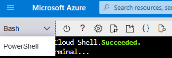

1. Copy the following bash commands to your computer and update the **projectName**, **subscriptionId**, and **environment** variables with the values for your project. If you're creating both a Dev and Prod environment, you'll need to run this script once for each environment, creating a service principal for each. This command will also grant the **Contributor** role to the service principal in the subscription provided. This is required for Azure DevOps to properly use resources in that subscription. 

    ``` bash
    projectName="<your project name>"
    roleName="Contributor"
    subscriptionId="<subscription Id>"
    environment="<Dev|Prod>" #First letter should be capitalized
    servicePrincipalName="Azure-ARM-${environment}-${projectName}"
    # Verify the ID of the active subscription
    echo "Using subscription ID $subscriptionID"
    echo "Creating SP for RBAC with name $servicePrincipalName, with role $roleName and in scopes     /subscriptions/$subscriptionId"
    az ad sp create-for-rbac --name $servicePrincipalName --role $roleName --scopes /subscriptions/$subscriptionId
    echo "Please ensure that the information created here is properly save for future use."
    ```

1. Copy your edited commands into the Azure Shell and run them (**Ctrl** + **Shift** + **v**).

1. After running these commands, you'll be presented with information related to the service principal. Save this information to a safe location, it will be use later in the demo to configure Azure DevOps.

    ```json
    {
       "appId": "<application id>",
       "displayName": "Azure-ARM-dev-Sample_Project_Name",
       "password": "<password>",
       "tenant": "<tenant id>"
    }
    ```

1. Repeat **Step 3** if you're creating service principals for Dev and Prod environments. For this demo, we'll be creating only one environment, which is Prod.

1. Close the Cloud Shell once the service principals are created. 
      

# [Create from Azure portal](#tab/azure-portal)

1. Navigate to [Azure App Registrations](https://entra.microsoft.com/#view/Microsoft_AAD_RegisteredApps/ApplicationsListBlade/quickStartType~/null/sourceTypeMicrosoft_AAD_IAM)

1. Select **New Registration**.

    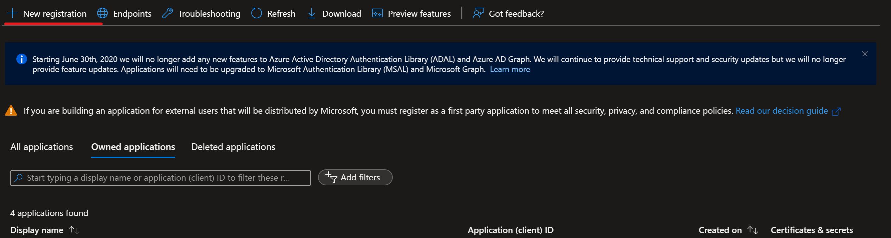

1. Go through the process of creating a Service Principle (SP) selecting **Accounts in any organizational directory (Any Microsoft Entra directory - Multitenant)** and name it  **Azure-ARM-Dev-ProjectName**. Once created, repeat and create a new SP named **Azure-ARM-Prod-ProjectName**. Replace **ProjectName** with the name of your project so that the service principal can be uniquely identified. 

1. Go to **Certificates & Secrets** and add for each SP **New client secret**, then store the value and secret separately.

1. To assign the necessary permissions to these principals, select your respective [subscription](https://portal.azure.com/#view/Microsoft_Azure_BillingSubscriptionsBlade?) and go to IAM. Select **+Add** then select **Add Role Assignment**.

    

1. Select Contributor and add members selecting + Select Members. Add the member **Azure-ARM-Dev-ProjectName** as create before.

    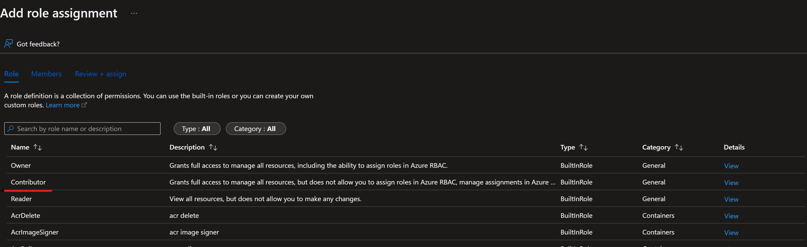

1. Repeat step here, if you deploy Dev and Prod into the same subscription, otherwise change to the prod subscription and repeat with **Azure-ARM-Prod-ProjectName**. The basic SP setup is successfully finished.

---

### Set up Azure DevOps

1. Navigate to [Azure DevOps](https://go.microsoft.com/fwlink/?LinkId=2014676&githubsi=true&clcid=0x409&WebUserId=2ecdcbf9a1ae497d934540f4edce2b7d). 
   
2. Select **create a new project** (Name the project `mlopsv2` for this tutorial).
   
     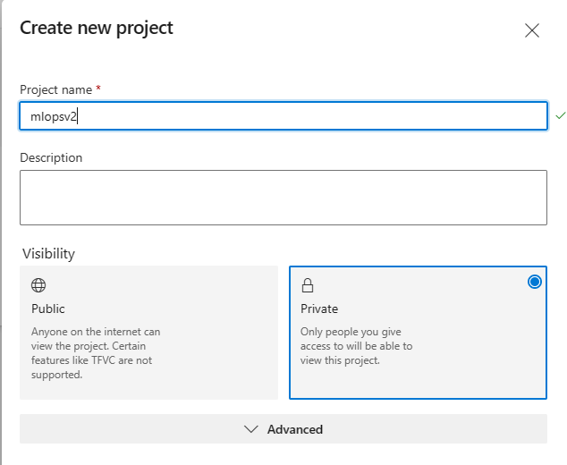
   
3. In the project under **Project Settings** (at the bottom left of the project page) select **Service Connections**.
   
4. Select **Create Service Connection**.

     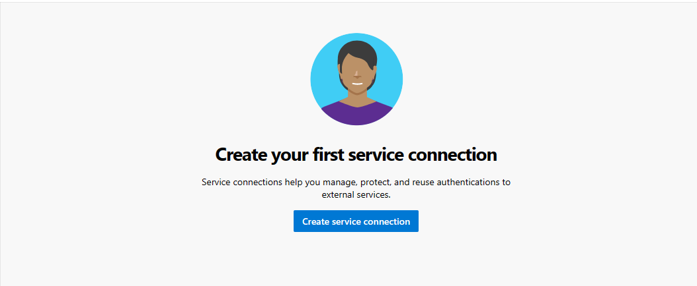

5. Select **Azure Resource Manager**, select **Next**, select **Service principal (manual)**, select **Next** and select the Scope Level **Subscription**.

     - **Subscription Name** - Use the name of the subscription where your service principal is stored.
     - **Subscription Id** - Use the `subscriptionId` you used in **Step 1** input as the Subscription ID
     - **Service Principal Id** - Use the `appId` from **Step 1** output as the Service Principal ID
     - **Service principal key** - Use the `password` from **Step 1** output as the Service Principal Key
     - **Tenant ID** - Use the `tenant` from **Step 1** output as the Tenant ID


6. Name the service connection **Azure-ARM-Prod**.  
 
7. Select **Grant access permission to all pipelines**, then select **Verify and Save**. 

The Azure DevOps setup is successfully finished.

### Set up source repository with Azure DevOps
   
1. Open the project you created in [Azure DevOps](https://dev.azure.com/)
   
1. Open the Repos section and select **Import Repository**

    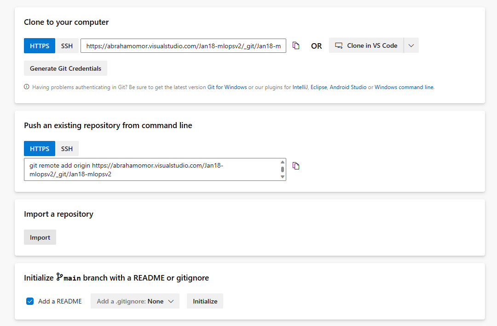

1. Enter https://github.com/Azure/mlops-v2-ado-demo into the Clone URL field. Select import at the bottom of the page

    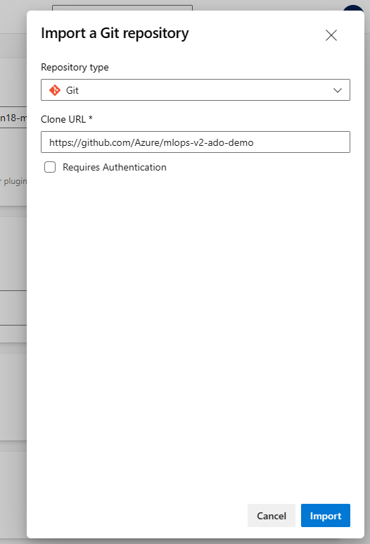

1. Open the **Project settings** at the bottom of the left hand navigation pane

1.  Under the Repos section, select **Repositories**. Select the repository you created in previous step Select the **Security** tab

1. Under the User permissions section, select the **mlopsv2 Build Service** user. Change the permission **Contribute** permission to **Allow** and the **Create branch** permission to **Allow**.
   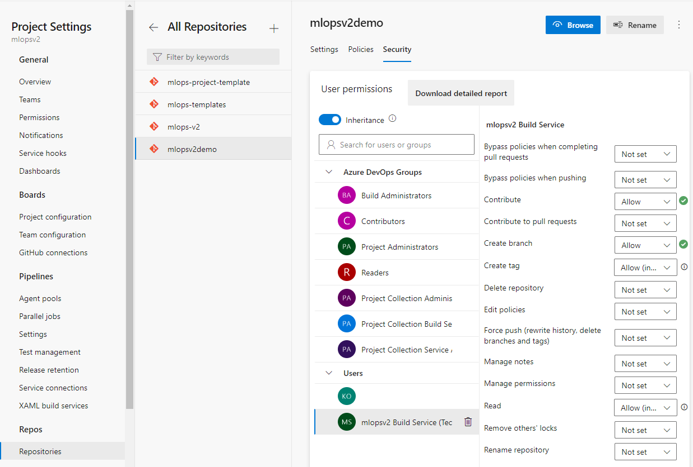

1. Open the **Pipelines** section in the left hand navigation pane and select on the 3 vertical dots next to the **Create Pipelines** button. Select **Manage Security**

   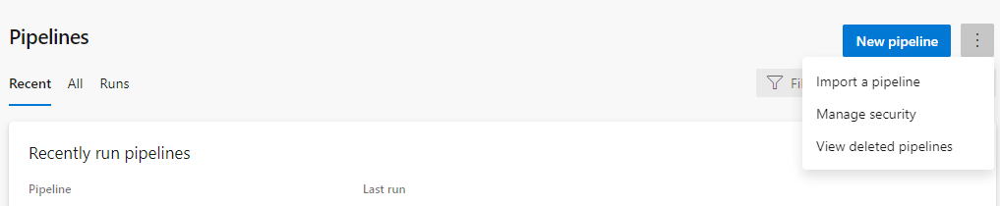

1. Select the **mlopsv2 Build Service** account for your project under the Users section. Change the permission **Edit build pipeline** to **Allow**

   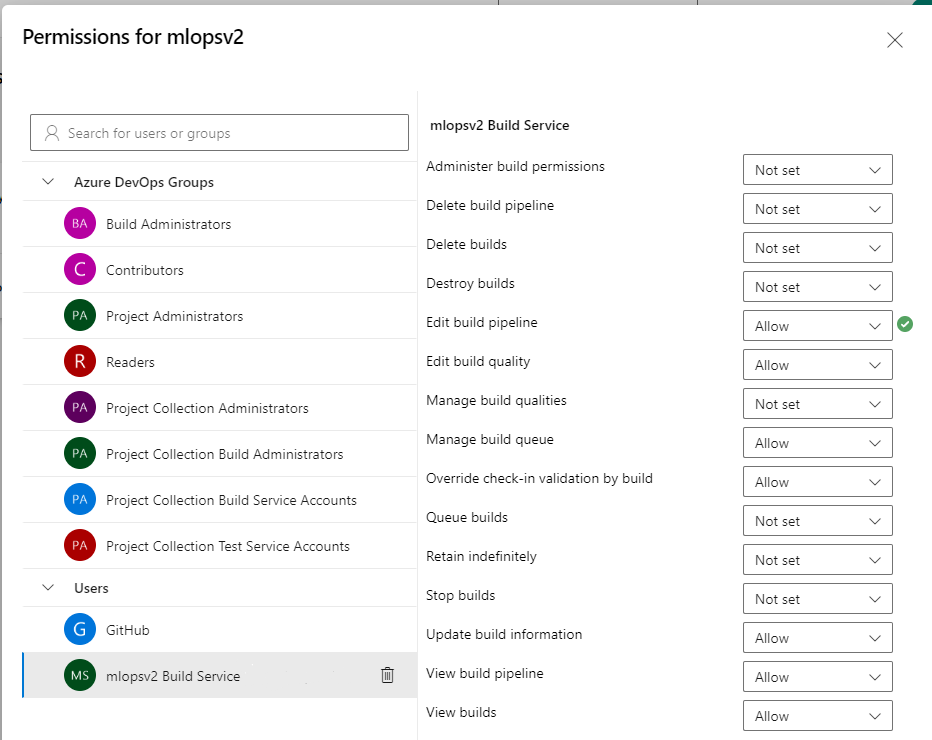

> [!NOTE]
> This finishes the prerequisite section and the deployment of the solution accelerator can happen accordingly.


## Deploying infrastructure via Azure DevOps
This step deploys the training pipeline to the Azure Machine Learning workspace created in the previous steps. 

> [!TIP]
> Make sure you understand the [Architectural Patterns](/azure/architecture/data-guide/technology-choices/machine-learning-operations-v2) of the solution accelerator before you checkout the MLOps v2 repo and deploy the infrastructure. In examples you'll use the [classical ML project type](/azure/architecture/data-guide/technology-choices/machine-learning-operations-v2#classical-machine-learning-architecture).

### Run Azure infrastructure pipeline
1. Go to your repository, `mlops-v2-ado-demo`, and select the **config-infra-prod.yml** file.

    > [!IMPORTANT]
    > Make sure you've selected the **main** branch of the repo.
   
   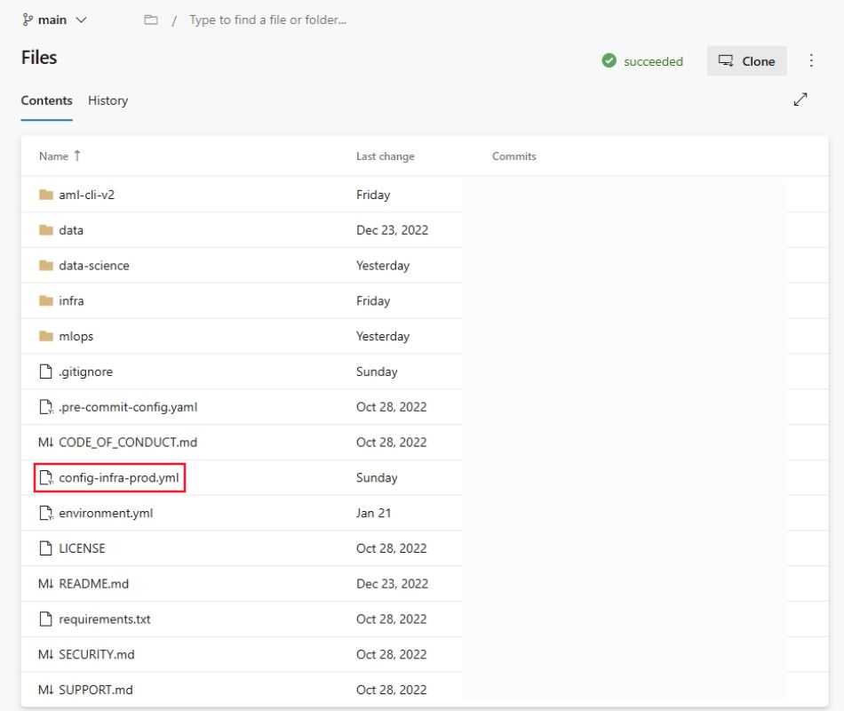
   
   This config file uses the namespace and postfix values the names of the artifacts to ensure uniqueness. Update the following section in the config to your liking.
   
   ```
    namespace: [5 max random new letters]
    postfix: [4 max random new digits]
    location: eastus
   ```
   > [!NOTE]
   > If you are running a Deep Learning workload such as CV or NLP, ensure your GPU compute is available in your deployment zone.

1. Select Commit and push code to get these values into the pipeline. 

1. Go to Pipelines section 
   
   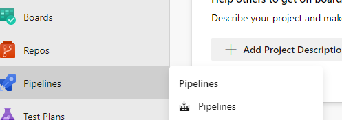
   
1. Select **Create Pipeline**.
   
1. Select **Azure Repos Git**.
   
   
   
1. Select the repository that you cloned in from the previous section `mlops-v2-ado-demo`
   
1. Select **Existing Azure Pipelines YAML file**
   
   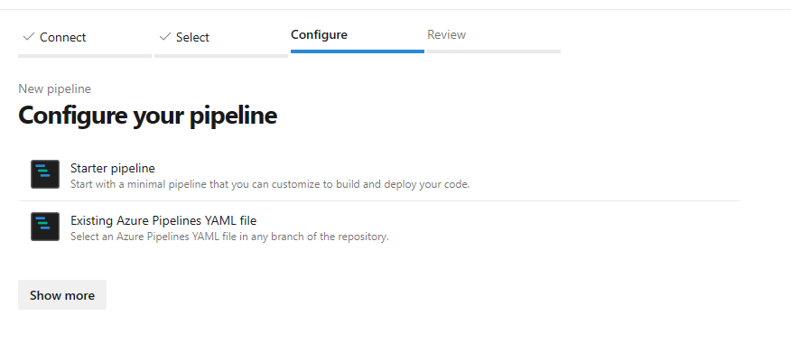
   
   
1. Select the `main` branch and choose `mlops/devops-pipelines/cli-ado-deploy-infra.yml`, then select **Continue**. 

1. Run the pipeline; it will take a few minutes to finish. The pipeline should create the following artifacts:
   * Resource Group for your Workspace including Storage Account, Container Registry, Application Insights, Keyvault and the Azure Machine Learning Workspace itself.
   * In the workspace, there's also a compute cluster created.
   
1. Now the infrastructure for your MLOps project is deployed.
    

    > [!NOTE]
    > The **Unable move and reuse existing repository to required location** warnings may be ignored.

## Sample Training and Deployment Scenario

The solution accelerator includes code and data for a sample end-to-end machine learning pipeline which runs a linear regression to predict taxi fares in NYC. The pipeline is made up of components, each serving different functions, which can be registered with the workspace, versioned, and reused with various inputs and outputs. Sample pipelines and workflows for the Computer Vision and NLP scenarios will have different steps and deployment steps.

This training pipeline contains the following steps:

**Prepare Data**
   - This component takes multiple taxi datasets (yellow and green) and merges/filters the data, and prepare the train/val and evaluation datasets.
   - Input: Local data under ./data/ (multiple .csv files)
   - Output: Single prepared dataset (.csv) and train/val/test datasets.

**Train Model**
   - This component trains a Linear Regressor with the training set.
   - Input: Training dataset
   - Output: Trained model (pickle format)
   
**Evaluate Model**
   - This component uses the trained model to predict taxi fares on the test set.
   - Input: ML model and Test dataset
   - Output: Performance of model and a deploy flag whether to deploy or not.
   - This component compares the performance of the model with all previous deployed models on the new test dataset and decides whether to promote or not model into production. Promoting model into production happens by registering the model in AML workspace.

**Register Model**
   - This component scores the model based on how accurate the predictions are in the test set.
   - Input: Trained model and the deploy flag.
   - Output: Registered model in Azure Machine Learning.

## Deploying model training pipeline

1. Go to ADO pipelines
   
   

1. Select **New Pipeline**.
   
   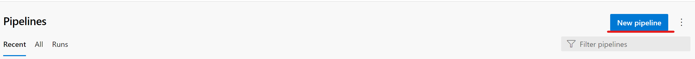
   
1. Select **Azure Repos Git**.
   
   
   
1. Select the repository that you cloned in from the previous section `mlopsv2`
   
1. Select **Existing Azure Pipelines YAML file**
   
   
   
1. Select `main` as a branch and choose `/mlops/devops-pipelines/deploy-model-training-pipeline.yml`, then select **Continue**.  

1. **Save and Run** the pipeline
   
> [!NOTE]
> At this point, the infrastructure is configured and the Prototyping Loop of the MLOps Architecture is deployed. you're ready to move to our trained model to production.      

## Deploying the Trained model 

This scenario includes prebuilt workflows for two approaches to deploying a trained model, batch scoring or a deploying a model to an endpoint for real-time scoring. You may run either or both of these workflows to test the performance of the model in your Azure ML workspace. IN this example we will be using real-time scoring.

### Deploy ML model endpoint
1. Go to ADO pipelines
   
   

1. Select **New Pipeline**.
   
   
   
1. Select **Azure Repos Git**.
   
   
   
1. Select the repository that you cloned in from the previous section `mlopsv2`
   
1. Select **Existing Azure Pipelines YAML file**
   
   
   
1. Select `main` as a branch and choose Managed Online Endpoint `/mlops/devops-pipelines/deploy-online-endpoint-pipeline.yml` then select **Continue**.  
   
1. Online endpoint names need to be unique, so change `taxi-online-$(namespace)$(postfix)$(environment)` to another unique name and then select **Run**. No need to change the default if it doesn't fail.

   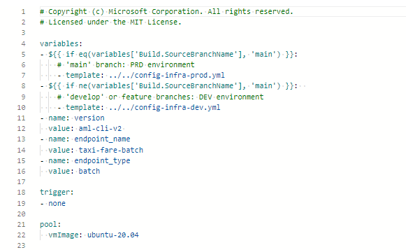
   
   > [!IMPORTANT]
   > If the run fails due to an existing online endpoint name, recreate the pipeline as described previously and change **[your endpoint-name]** to **[your endpoint-name (random number)]**
   
1. When the run completes, you'll see output similar to the following image:
   
   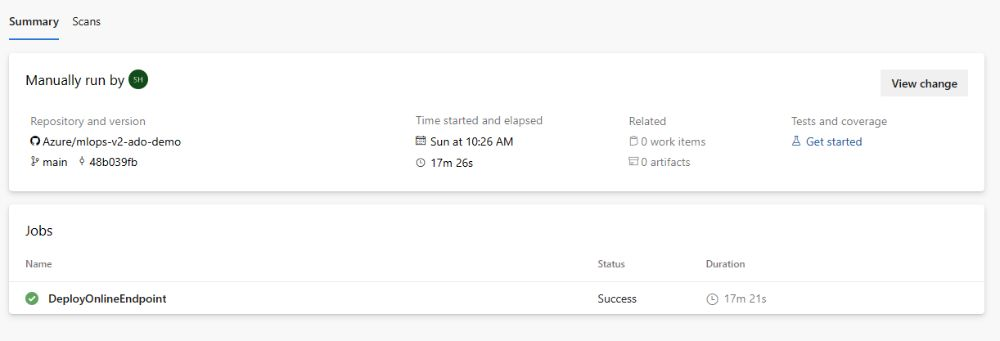

1. To test this deployment, go to the **Endpoints** tab in your AzureML workspace, select the endpoint and click the **Test** Tab. You can use the sample input data located in the cloned repo at `/data/taxi-request.json` to test the endpoint.

## Clean up resources

1. If you're not going to continue to use your pipeline, delete your Azure DevOps project. 
1. In Azure portal, delete your resource group and Azure Machine Learning instance.

## Next steps

* [Install and set up Python SDK v2](https://aka.ms/sdk-v2-install)
* [Install and set up Python CLI v2](how-to-configure-cli.md)
* [Azure MLOps (v2) solution accelerator](https://github.com/Azure/mlops-v2) on GitHub
* Training course on [MLOps with Machine Learning](/training/paths/introduction-machine-learn-operations/)
* Learn more about [Azure Pipelines with Azure Machine Learning](how-to-devops-machine-learning.md)
* Learn more about [GitHub Actions with Azure Machine Learning](how-to-github-actions-machine-learning.md)
* Deploy MLOps on Azure in Less Than an Hour - [Community MLOps V2 Accelerator video](https://www.youtube.com/watch?v=5yPDkWCMmtk)
