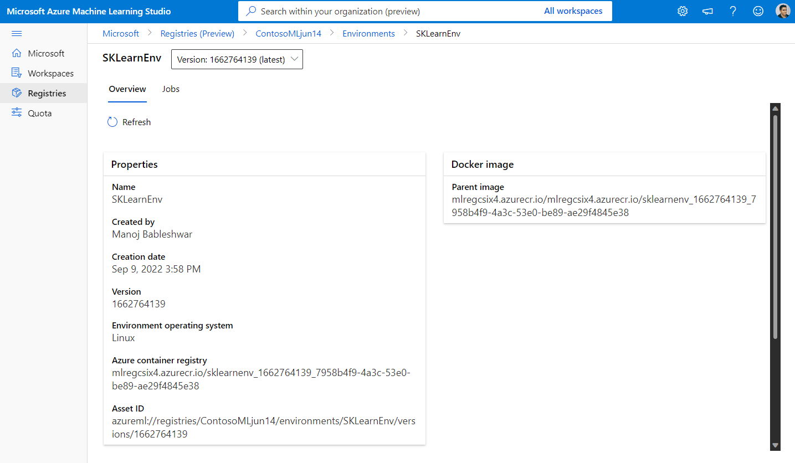
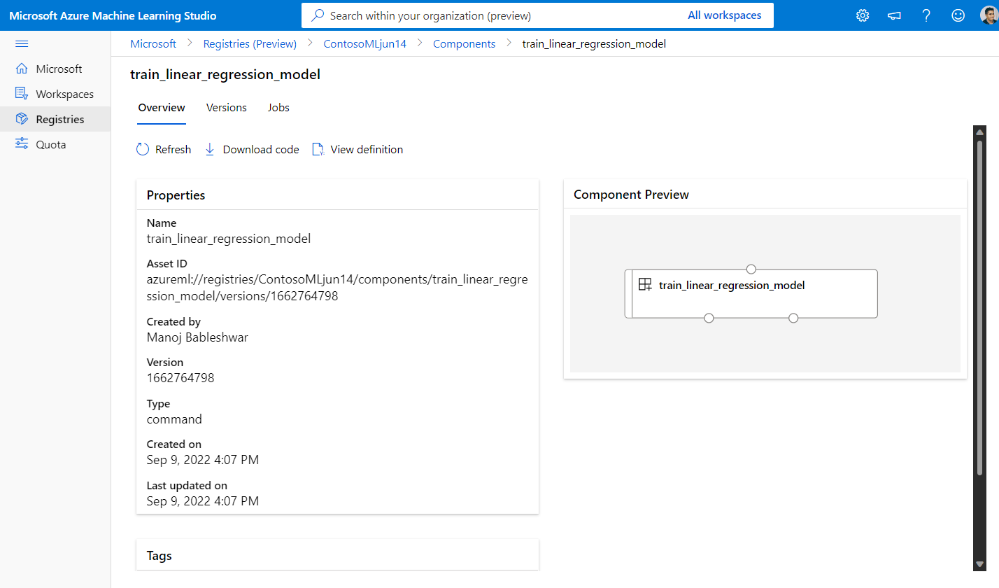
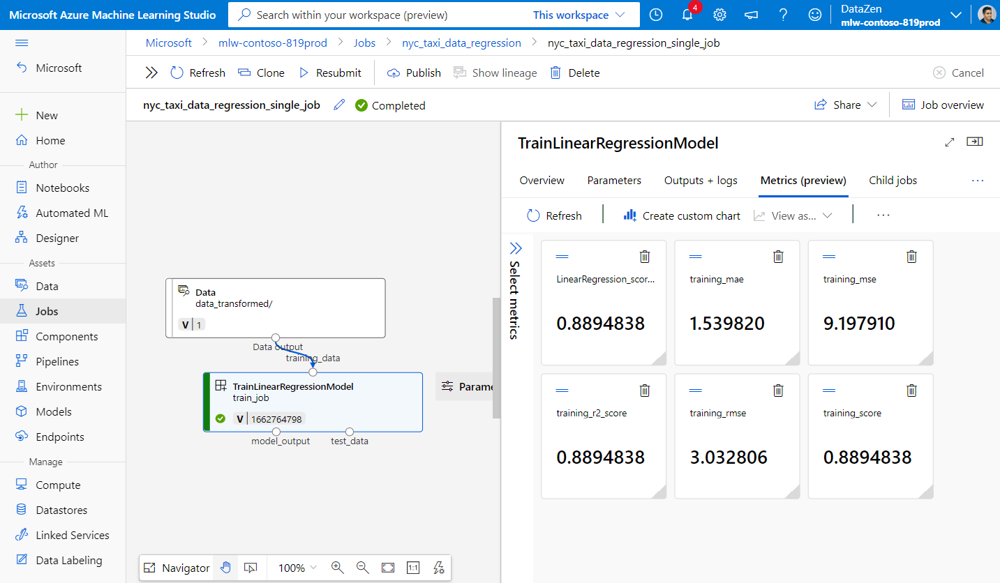
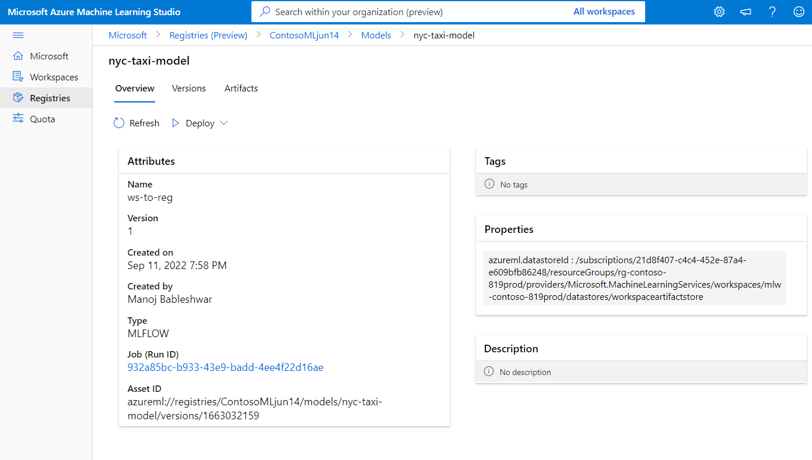

# Share models, components and environments across workspaces with registries using CLI v2 (preview)

Azure Machine Learning registry enables you collaborate across workspaces within your organization. Using registries, you can share models, components, and environments.
 
There are two scenarios where you'd want to use the same set of models, components and environments in multiple workspaces:

* __Cross-workspace MLOps__: You are training a model in a `dev` workspace and need to deploy it to `test` and `prod` workspaces. In this case you want to have end-to-end lineage between endpoints to which the model is deployed in `test` or `prod` workspaces and the training job, metrics, code, data and environment that was used to train the model in the `dev` workspace.
* __Share and reuse models and pipelines across different teams__: Sharing and reuse improves collaboration and productivity. In this scenario, you may want to publish a trained model and the associated components and environments used to train it to a central catalog. From there, colleagues from other teams can search and reuse the assets you shared in their own experiments.

## Prerequisites

- To use the CLI (v2), you must have an Azure subscription. If you don't have an Azure subscription, create a free account before you begin. Try the [free or paid version of Azure Machine Learning](https://azure.microsoft.com/free/) today.
- [Install and set up CLI (v2)](how-to-configure-cli.md).

    > [!TIP]
    > For a full-featured development environment with schema validation and autocompletion for job YAMLs, use Visual Studio Code and the [Azure Machine Learning extension](how-to-setup-vs-code.md).

- You need a registry to create models, components and environments. [Learn how to create a registry](todo)

- You need an Azure ML workspace to run jobs and deploy models. To create a new workspace, use one of the following options:
    - [Quickstart: Create workspace resources using the Azure portal](quickstart-create-resources.md).
    - [Create and manage a workspace using Azure CLI](how-to-manage-workspace-cli.md)

    > [!IMPORTANT]
    > Make sure that the Azure region (location) where you create the workspace is in the list of supported regions for Azure ML registry.

If you haven't already set the defaults for the Azure CLI, save your default settings. To avoid passing in the values for your subscription, workspace, and resource group multiple times, use the following commands. Replace the following parameters with values for your specific configuration:

* Replace `<subscription>` with your Azure subscription ID.
* Replace `<workspace>` with your Azure Machine Learning workspace name.
* Replace `<resource-group>` with the Azure resource group that contains your workspace.
* Replace `<location>` with the Azure region that contains your workspace.

> [!TIP]
> You can see what your current defaults are by using the `az configure -l` command.

```azurecli
az account set --subscription <subscription>
az configure --defaults workspace=<workspace> group=<resource-group> location=<location>
```

### Clone examples repository

We will use the `nyc_taxi_data_regression` sample from the the examples repository in this document. Clone the `github.com/Azure/azureml-examples` repository change into the `cli/jobs/pipelines-with-components/nyc_taxi_data_regression` directory:

```
git clone https://github.com/Azure/azureml-examples
# changing branch is temporary until samples merge to main
git checkout mabables/registry
cd cli/jobs/pipelines-with-components/nyc_taxi_data_regression
```

## Tasks you will learn in this document

* Create and environment and components in the registry.
* Use the component from registry to submit a model training job in a workspace.
* Register the trained model in the workspace.
* Deploy the model from the registry to an online-endpoint in the workspace and submit some inference requests.

To accomplish this flow, lets gets started by creating a connection to the a workspace and a registry. 


## Create Environment in Registry

Environments define the docker container and python dependencies required to run training jobs or deploy models. For more information, see thee [Environment concepts](./concept-environments.md) and [How to create environments](./how-to-manage-environments-v2.md) articles. 

> [!TIP]
> The same the CLI command `az ml environment create` can be used to create environments in a workspace or registry. Running the command with `--workspace-name` command creates the environment in a workspace whereas running the command with `--registry-name` creates the environment in the registry.

We will create an environment that uses the `python:3.8` docker image and installs Python packages required to run a training job using the SciKit Learn framework. If you have cloned the examples repo and are in the folder `cli/jobs/pipelines-with-components/nyc_taxi_data_regression`, you should be able to see environment definition file `env_train.yml` that references the the docker file `env_train/Dockerfile`. The `env_train.yml` is shown below for your reference:

```YAML
$schema: https://azuremlschemas.azureedge.net/latest/environment.schema.json
name: SKLearnEnv
version: 1
build:
  path: ./env_train
```

Create the environment using the `az ml environment create` as follows

```azurecli 
az ml environment create --file env_train.yml --registry-name <registry-name>
```

If you get an error that an environment with this name and version already exists in the registry, you can either edit the `version` field in `env_train.yml` or specify a different version on the CLI that overrides the version value in `env_train.yml`.

```azurecli 
# use shell epoch time as the version
version=$(date +%s)
az ml environment create --file env_train.yml --registry-name <registry-name> --set version=$version
```
> [!TIP]
> `version=$(date +%s)` works only in Linux. Replace `$version` with a random number if this does not work.`

Note down the `name` and `version` of the environment from the output of the `az ml environment create` command and use them with `az ml environment show` commands as follows. You will need the `name` and `version` in the next section when you create a component in the registry.

```azurecli
az ml environment show --name SKLearnEnv --version 1 --registry-name <registry-name>
```
> [!TIP]
> If you used a different environment name or version, replace the `--name` and `--version` parameters accordingly.

 You can also use `az ml environment list --registry-name <registry-name>` to list all environments in the registry or browse all environments in the AzureML Studio UI. Make sure you navigate to the global UI and look for the Registries hub.



 
## Create Component in Registry

Components are reusable building blocks of Machine Learning pipelines in AzureML. You can package the code, command, environment, input interface and output interface of an individual pipeline step into a component and then reuse it across pipelines without having to worry about porting dependencies and code each time you write a different pipeline with similar step. Creating a component in a workspace allows you to use the component in any pipeline job within that workspace. Creating a component in a registry allows you to use the component in any pipeline in any workspace within your organization. Creating components in a registry is a great way to build modular reusable utilities or shared training tasks that can be used for experimentation by different teams within your organization. Review [component concepts](concept-component.md) and [how to use components in pipelines](how-to-create-component-pipelines-cli.md) to learn how to develop components and use them in pipelines. 

Make sure you are in the folder `cli/jobs/pipelines-with-components/nyc_taxi_data_regression`. You will find the component definition file `train.yml` that packages a Scikit Learn training script `train_src/train.py` and the [curated environment](resource-curated-environments.md) `AzureML-sklearn-0.24-ubuntu18.04-py37-cpu`. We will use the Scikit Learn environment created in pervious step instead of the curated environment. You can edit `environment` field in the `train.yml` to refer to your Scikit Learn environment. The resulting component definition file `train.yml` will looking like the below after the edit. 

```YAML
# <component>
$schema: https://azuremlschemas.azureedge.net/latest/commandComponent.schema.json
name: train_linear_regression_model
display_name: TrainLinearRegressionModel
version: 1
type: command
inputs:
  training_data: 
    type: uri_folder
  test_split_ratio:
    type: number
    min: 0
    max: 1
    default: 0.2
outputs:
  model_output:
    type: mlflow_model
  test_data:
    type: uri_folder
code: ./train_src
environment: azureml://registries/<registry-name>/environments/SKLearnEnv/versions/1`
command: >-
  python train.py 
  --training_data ${{inputs.training_data}} 
  --test_data ${{outputs.test_data}} 
  --model_output ${{outputs.model_output}}
  --test_split_ratio ${{inputs.test_split_ratio}}

```
If you used different name or version, the more generic representation looks like this: `environment: azureml://registries/<registry-name>/environments/<sklearn-environment-name>/versions/<sklearn-environment-version>`, so make sure you replace the `<registry-name>`,  `<sklearn-environment-name>` and `<sklearn-environment-version>` accordingly. You then run the `az ml component create` command to create the component as follows.

```azurecli
az ml component create --file train.yml --registry-name <registry-name>` 
```
> [!TIP]
> The same the CLI command `az ml component create` can be used to create components in a workspace or registry. Running the command with `--workspace-name` command creates the component in a workspace whereas running the command with `--registry-name` creates the component in the registry.

If you prefer to not edit the `train.yml`, you can override the environment name on the CLI as follows.
```azurecli
az ml component create --file train.yml --registry-name <registry-name>` --set environment=azureml://registries/<registry-name>/environments/SKLearnEnv/versions/1
# or if you used a different name or version, replace `<sklearn-environment-name>` and `<sklearn-environment-version>` accordingly
az ml component create --file train.yml --registry-name <registry-name>` --set environment=azureml://registries/<registry-name>/environments/<sklearn-environment-name>/versions/<sklearn-environment-version>
```

> [!TIP]
> If you get an error that the name of the component already exists in the registry, you can either edit the version in `train.yml` or override the version on the CLI with a random version.

Note down the `name` and `version` of the component from the output of the `az ml component create` command and use them with `az ml component show` commands as follows. You will need the `name` and `version` in the next section when you create submit a training job in the workspace.

```azurecli 
az ml component show --name <component_name> --version <component_version> --registry-name <registry-name>
```
 You can also use `az ml component list --registry-name <registry-name>` to list all components in the registry or browse all components in the AzureML Studio UI. Make sure you navigate to the global UI and look for the Registries hub.

 

## Run a pipeline job in a workspace using component from registry

Review [running jobs with CLI (v2)](./how-to-train-cli.md) and [pipeline jobs with components](./how-to-create-component-pipelines-cli.md) to learn how to run jobs to process data, train models, evaluate models, or any utility commands.

We will run a pipeline job with the Scikit Learn training component created in the previous section to train a model. Check that you are in the folder `cli/jobs/pipelines-with-components/nyc_taxi_data_regression`. The training dataset is located in the `data_transformed` folder. Edit the `component` section in under the `train_job` section of the `single-job-pipeline.yml` file to refer to the training component created in the previous section.  The resulting `single-job-pipeline.yml` is shown below.

```YAML
$schema: https://azuremlschemas.azureedge.net/latest/pipelineJob.schema.json
type: pipeline
display_name: nyc_taxi_data_regression_single_job
description: Single job pipeline to train regression model based on nyc taxi dataset

jobs:
  train_job:
    type: command
    component: azureml://registries/<registry-name>/component/train_linear_regression_model/versions/1
    compute: azureml:cpu-cluster
    inputs:
      training_data: 
        type: uri_folder
        path: ./data_transformed
    outputs:
      model_output: 
        type: mlflow_model
      test_data: 
```  

The key aspect note here is that this pipeline is going to run in a workspace using a component that is not in the specific workspace, but in a registry that can be used with any workspace in your orgnization. This means you can run this training job in any workspace you have access to without having worry about making the training code and environment available in that workspace. 

> [!WARNING]
> Confirm that the workspace in which you will run this job is in a Azure location that is supported by the registry in which you created the component before you run the pipeline job.

> [!WARNING]
> Confirm that the workspace has a compute cluster with the name `cpu-cluster` or edit the `compute` field under `jobs.train_job.compute` with the name of your compute.

Run the pipeline job with the `az ml job create` command.

```azurecli
az ml job create --file single-job-pipeline.yml 
```

> [!TIP]
> If you have not configured the default workspace and resource group as explained in the prerequisites section, you will need to specify the `--workspace-name` and `--resource-group` parameters for the `az ml job create` to work.


Alternatively, ou can skip editing `single-job-pipeline.yml` and override the component name used by `train_job` in the CLI.
```azurecli
az ml job create --file single-job-pipeline.yml --set jobs.train_job.component=azureml://registries/<registry-name>/component/train_linear_regression_model/versions/1
```

You can click on the Studio endpoint link in the job output to view the the job in the Studio UI where you analyze training metrics, verify that the job is using component and environment from registry and review the trained model. Note down the `name` of the job from the json output of the `az ml model create` command or find the same from the job overview in the Studio UI. You will need this to download the trained model in the next section on creating models in registry. 



Since the component used in training job is shared through a registry, you can submit the job to any workspace that you have access to in your organization, even across different subscriptions. For example, if you have `dev-workspace`, `test-workspace` and `prod-workspace`, running the training job in these three workspaces is as easy as running three `az ml job create` commands. 

```azurecli
az ml job create --file single-job-pipeline.yml --workspace-name dev-workspace --resource-group <resource-group-of-dev-workspace>
az ml job create --file single-job-pipeline.yml --workspace-name test-workspace --resource-group <resource-group-of-test-workspace>
az ml job create --file single-job-pipeline.yml --workspace-name prod-workspace --resource-group <resource-group-of-prod-workspace>
```

## Create a model in registry

You will learn how to create models in a registry in this section. Review [manage models](./how-to-manage-models.md) to learn more about model management in AzureML. We will look at two different ways to create a model in a registry. First is from local files. Second, is to copy a model registered in the workspace to a registry. 

In both the options, you will create model with the [MLflow format](./how-to-manage-models-mlflow.md), which will help you to [deploy this model for inference without writing any inference code](./how-to-deploy-mlflow-models-online-endpoints.md). 

### Create a model in registry from local files

Download the model which is available as output of the `train_job` by replacing `<job-name>` with the name from the job from the previous section. The model along with MLflow metadata files should be available in the `./artifacts/model/`.

```azurecli
# fetch the name of the train_job by listing all child jobs of the pipeline job
train_job_name=$(az ml job list --parent-job-name <job-name> --query [0].name | sed 's/\"//g')
# download the default outputs of the train_job
az ml job download --name $train_job_name 
# review the model files
ls -l ./artifacts/model/
```
> [!TIP]
> If you have not configured the default workspace and resource group as explained in the prerequisites section, you will need to specify the `--workspace-name` and `--resource-group` parameters for the `az ml model create` to work.

If you are unable to download the model, you can find sample MLflow model trained by the training job in the previous section in `cli/jobs/pipelines-with-components/nyc_taxi_data_regression/artifacts/model/` folder.

Create the model in the registry
```azurecli
# create model in registry
az ml model create --name nyc-taxi-model --version 1 --type mlflow_model --path ./artifacts/model/ --registry-name <registry-name>
```
> [!TIP]
> Use a random number for the `version` parameter if you get an error that model name and version exists.

> [!TIP]
> The same the CLI command `az ml model create` can be used to create models in a workspace or registry. Running the command with `--workspace-name` command creates the model in a workspace whereas running the command with `--registry-name` creates the model in the registry.

### Copy a model from workspace to registry 

In this option, you will first create a the model in workspace and then copy it to registry. This is helpful when you want to register the model in the workspace, deploy it to endpoints, try out inference with some test data and then copy the model to a registry if everything looks good. Another scenario where this many be useful is you are developing a series of models using different techniques, frameworks or parameters and want to promote just one of them to the registry as a production candidate. 

Make sure you have the name of the pipeline job from the previous section and replace that in the command to fetch the training job name below. You will then register the model from the output of the training job into the workspace. Note how the `--path` parameter refers to the output `train_job` output with the `azureml://jobs/$train_job_name/outputs/default/model` syntax. 

```
# fetch the name of the train_job by listing all child jobs of the pipeline job
train_job_name=$(az ml job list --parent-job-name <job-name> --workspace-name <workspace-name> --resource-group <workspace-resource-group> --query [0].name | sed 's/\"//g')
# create model in workspace
az ml model create --name nyc-taxi-model --version 1 --type mlflow_model --path azureml://jobs/$train_job_name/outputs/default/model 
```
> [!TIP]
> Use a random number for the `version` parameter if you get an error that model name and version exists.`

> [!TIP]
> If you have not configured the default workspace and resource group as explained in the prerequisites section, you will need to specify the `--workspace-name` and `--resource-group` parameters for the `az ml model create` to work.

Note down the model name and version. You can validate if the model is registered in the workspace by browsing it in the Studio UI or using `az ml model show --name nyc-taxi-model --version $model_version` command.  

Next, you will now copy the model from the workspace to the registry. Note now the `--path` parameter is referring to the model with the workspace with the `azureml://subscriptions/<subscription-id-of-workspace>/resourceGroups/<resource-group-of-workspace>/workspaces/<workspace-name>/models/<model-name>/versions/<model-version>` syntax.


```azurecli
# copy model registered in workspace to registry
az ml model create --registry-name ContosoMLjun14 --path azureml://subscriptions/<subscription-id-of-workspace>/resourceGroups/<resource-group-of-workspace>/workspaces/<workspace-name>/models/nyc-taxi-model/versions/1
```

> [!TIP]
> Make sure to use the right model name and version if you changed it in the `az ml model create` command.

Note down the `name` and `version` of the model from the output of the `az ml model create` command and use them with `az ml model show` commands as follows. You will need the `name` and `version` in the next section when you deploy the model to an online endpoint for inference. 

```azurecli 
az ml model show --name <model_name> --version <model_version> --registry-name <registry-name>
```
 You can also use `az ml model list --registry-name <registry-name>` to list all models in the registry or browse all components in the AzureML Studio UI. Make sure you navigate to the global UI and look for the Registries hub.


Below screenshot shows a model in a registry in AzureML Studio UI. If you created a model from the job output and then copied the model from the workspace to registry, you will see that the model has a link to the job that trained the model. You can use that link to navigate to the training job to review the code, environment and data used to train the model.

 

## Deploy model from registry to online endpoint in workspace

In the last section, you will deploy a model from registry to an online endpoint in a workspace. You can choose to deploy any workspace you have access to in your orgnization, provided the location of the workspace is one of the locations supported by the registry. This capability is helpful if you trained a model in a `dev` workspace and now need to deploy the model to `test` or `prod` workspace, while preserving the lineage information around the code, environment and data used to train the model.

Online endpoints let you deploy model and submit inference requests through the REST APIs. Review [managed endpoints](https://docs.microsoft.com/en-us/azure/machine-learning/how-to-deploy-managed-online-endpoints) to learn more. 

Create a online endpoint. 

```azurecli
az ml online-endpoint create --name reg-ep-1234
```

Update the `model:` line `deploy.yml` available in the `cli/jobs/pipelines-with-components/nyc_taxi_data_regression` folder to refer the the model name and version from the pervious step. Create an online deployment to the online endpoint.The `deploy.yml` is shown below for reference.

```YAML
$schema: https://azuremlschemas.azureedge.net/latest/managedOnlineDeployment.schema.json
name: demo
endpoint_name: reg-ep-1234
model: azureml://registries/<registry-name>/models/nyc-taxi-model/versions/1
instance_type: Standard_DS2_v2
instance_count: 1
```
Create the online deployment. The deployment takes several minutes to complete. 

```azurecli
az ml online-deployment create --file deploy.yml --all-traffic
```

Fetch the scoring URI and submit a sample scoring request. Sample data for the scoring request is available in the `scoring-data.json` in the `cli/jobs/pipelines-with-components/nyc_taxi_data_regression` folder. 

```azurecli
ENDPOINT_KEY=$(az ml online-endpoint get-credentials -n reg-ep-1234 -o tsv --query primaryKey)
SCORING_URI=$(az ml online-endpoint show -n $ep_name -o tsv --query scoring_uri)
curl --request POST "$SCORING_URI" --header "Authorization: Bearer $ENDPOINT_KEY" --header 'Content-Type: application/json' --data @./scoring-data.json
```

> [!TIP]
> `curl` command works only on Linux

> [!TIP]
> If you have not configured the default workspace and resource group as explained in the prerequisites section, you will need to specify the `--workspace-name` and `--resource-group` parameters for the `az ml online-endpoint` and `az ml online-deployment` commands to work.

## Clean up resources

If you aren't going use the deployment, you should delete it by running the following code (it deletes the endpoint and all the underlying deployments):

```azurecli
az ml online-endpoint delete --name reg-ep-1234 --yes --no-wait
```

If you aren't going use the registry, you should delete the registry. Refer to the <todo> document to delete the registry.


