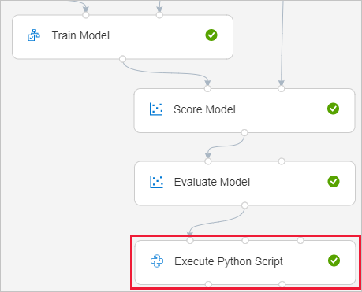
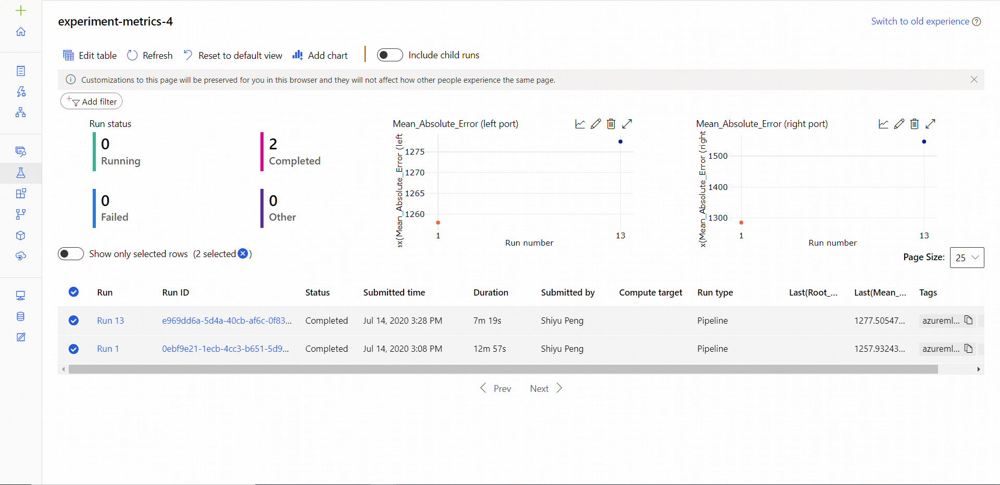

# Add logging to Azure Machine Learning designer (preview) pipelines
[!INCLUDE [applies-to-skus](../../includes/aml-applies-to-basic-enterprise-sku.md)]

In this article, you learn how to add custom logging to your designer pipelines. You also learn how to view logs using the studio web portal.

For more information on logging metrics in the SDK authoring experience, see [Monitor Azure ML experiment runs and metrics](how-to-track-experiments.md).

## Prerequisites

- An Azure Machine Learning workspace with Enterprise SKU
- A [designer pipeline draft](tutorial-designer-automobile-price-train-score.md). 


## Log designer pipelines

Use the __Execute Python Script__ module to add logging code to your designer pipelines. Although you can log any value with this workflow, it's especially useful to log metrics from the __Evaluate Model__ module to track model performance across runs.

The following example shows you how to log the mean squared error of two trained models using the __Evaluate Model__ and __Execute Python Script__ modules.

1. Connect an __Execute Python Script__ module to the output of the __Evaluate Model__ module. __Evaluate Model__, which can can output evaluation results of 2 models. 

    

1. Paste the following code into the __Execute Python Script__ code editor to log the mean absolute error for your trained model:

    ```python
    # dataframe1 contains the values from Evaluate Model
    def azureml_main(dataframe1=None, dataframe2=None):
        print(f'Input pandas.DataFrame #1: {dataframe1}')
    
        from azureml.core import Run
    
        run = Run.get_context()
    
        # Log the mean absolute error to the parent run to see the metric in the run details page.
        # Note: 'run.parent.log()' should not be called multiple times because of performance issues.
        # If repeated calls are necessary, cache 'run.parent' as a local variable and call 'log()' on that variable.

        # Log left output port result of Evaluate Model. This also works when evaluate only 1 model.
        run.parent.log(name='Mean_Absolute_Error (left port)', value=dataframe1['Mean_Absolute_Error'][0])

        # Log right output port result of Evaluate Model.
        run.parent.log(name='Mean_Absolute_Error (right port)', value=dataframe1['Mean_Absolute_Error'][1])
    
        return dataframe1,
    ```

1. After the pipeline run is completed, you can see the *Mean_Absolute_Error* in the Experiment page.

    

## Next steps

Try these next steps to learn how to use the Azure Machine Learning SDK for Python:

* See an example of how to register the best model and deploy it in the tutorial, [Train an image classification model with Azure Machine Learning](tutorial-train-models-with-aml.md).

* Learn how to [Train PyTorch Models with Azure Machine Learning](how-to-train-pytorch.md).
