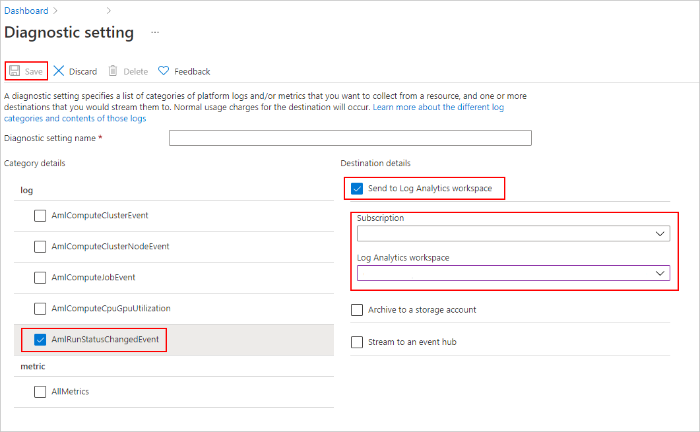
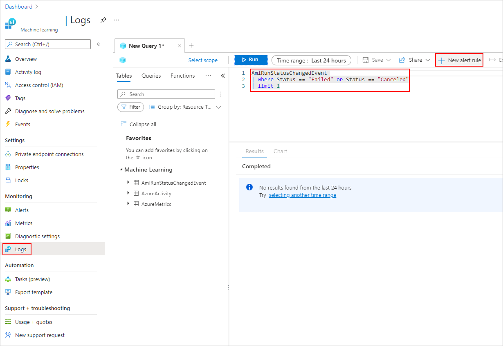

# Start, monitor, and track run history

The [Azure Machine Learning SDK for Python](/python/api/overview/azure/ml/intro), [Machine Learning CLI](reference-azure-machine-learning-cli.md), and [Azure Machine Learning studio](https://ml.azure.com) provide various methods to monitor, organize, and track your runs for training and experimentation. Your ML run history is an important part of an explainable and repeatable ML development process.

This article shows how to do the following tasks:

* Monitor run performance.
* Create a custom view. 
* Add a run description. 
* Tag and find runs.
* Run search over your run history. 
* Cancel or fail runs.
* Create child runs.
* Monitor the run status by email notification.
 

> [!TIP]
> If you're looking for information on monitoring the Azure Machine Learning service and associated Azure services, see [How to monitor Azure Machine Learning](monitor-azure-machine-learning.md).
> If you're looking for information on monitoring models deployed as web services or IoT Edge modules, see [Collect model data](how-to-enable-data-collection.md) and [Monitor with Application Insights](how-to-enable-app-insights.md).

## Prerequisites

You'll need the following items:

* An Azure subscription. If you don't have an Azure subscription, create a free account before you begin. Try the [free or paid version of Azure Machine Learning](https://aka.ms/AMLFree) today.

* An [Azure Machine Learning workspace](how-to-manage-workspace.md).

* The Azure Machine Learning SDK for Python (version 1.0.21 or later). To install or update to the latest version of the SDK, see [Install or update the SDK](/python/api/overview/azure/ml/install).

    To check your version of the Azure Machine Learning SDK, use the following code:

    ```python
    print(azureml.core.VERSION)
    ```

* The [Azure CLI](/cli/azure/?preserve-view=true&view=azure-cli-latest) and [CLI extension for Azure Machine Learning](reference-azure-machine-learning-cli.md).


## Monitor run performance

* Start a run and its logging process

    # [Python](#tab/python)
    
    1. Set up your experiment by importing the [Workspace](/python/api/azureml-core/azureml.core.workspace.workspace), [Experiment](/python/api/azureml-core/azureml.core.experiment.experiment), [Run](/python/api/azureml-core/azureml.core.run%28class%29), and [ScriptRunConfig](/python/api/azureml-core/azureml.core.scriptrunconfig) classes from the [azureml.core](/python/api/azureml-core/azureml.core) package.
    
        ```python
        import azureml.core
        from azureml.core import Workspace, Experiment, Run
        from azureml.core import ScriptRunConfig
        
        ws = Workspace.from_config()
        exp = Experiment(workspace=ws, name="explore-runs")
        ```
    
    1. Start a run and its logging process with the [`start_logging()`](/python/api/azureml-core/azureml.core.experiment%28class%29#start-logging--args----kwargs-) method.
    
        ```python
        notebook_run = exp.start_logging()
        notebook_run.log(name="message", value="Hello from run!")
        ```
        
    # [Azure CLI](#tab/azure-cli)
    
    To start a run of your experiment, use the following steps:
    
    1. From a shell or command prompt, use the Azure CLI to authenticate to your Azure subscription:
    
        ```azurecli-interactive
        az login
        ```
        
        [!INCLUDE [select-subscription](../../includes/machine-learning-cli-subscription.md)] 
    
    1. Attach a workspace configuration to the folder that contains your training script. Replace `myworkspace` with your Azure Machine Learning workspace. Replace `myresourcegroup` with the Azure resource group that contains your workspace:
    
        ```azurecli-interactive
        az ml folder attach -w myworkspace -g myresourcegroup
        ```
    
        This command creates a `.azureml` subdirectory that contains example runconfig and conda environment files. It also contains a `config.json` file that is used to communicate with your Azure Machine Learning workspace.
    
        For more information, see [az ml folder attach](/cli/azure/ext/azure-cli-ml/ml/folder?preserve-view=true&view=azure-cli-latest#ext-azure-cli-ml-az-ml-folder-attach).
    
    2. To start the run, use the following command. When using this command, specify the name of the runconfig file (the text before \*.runconfig if you're looking at your file system) against the -c parameter.
    
        ```azurecli-interactive
        az ml run submit-script -c sklearn -e testexperiment train.py
        ```
    
        > [!TIP]
        > The `az ml folder attach` command created a `.azureml` subdirectory, which contains two example runconfig files.
        >
        > If you have a Python script that creates a run configuration object programmatically, you can use [RunConfig.save()](/python/api/azureml-core/azureml.core.runconfiguration#save-path-none--name-none--separate-environment-yaml-false-) to save it as a runconfig file.
        >
        > For more example runconfig files, see [https://github.com/MicrosoftDocs/pipelines-azureml/](https://github.com/MicrosoftDocs/pipelines-azureml/).
    
        For more information, see [az ml run submit-script](/cli/azure/ext/azure-cli-ml/ml/run?preserve-view=true&view=azure-cli-latest#ext-azure-cli-ml-az-ml-run-submit-script).

    # [Studio](#tab/azure-studio)

    For an example of training a model in the Azure Machine Learning designer, see [Tutorial: Predict automobile price with the designer](tutorial-designer-automobile-price-train-score.md).

    ---

* Monitor the status of a run

    # [Python](#tab/python)
    
    * Get the status of a run with the [`get_status()`](/python/api/azureml-core/azureml.core.run%28class%29#get-status--) method.
    
        ```python
        print(notebook_run.get_status())
        ```
    
    * To get the run ID, execution time, and other details about the run, use the [`get_details()`](/python/api/azureml-core/azureml.core.workspace.workspace#get-details--) method.
    
        ```python
        print(notebook_run.get_details())
        ```
    
    * When your run finishes successfully, use the [`complete()`](/python/api/azureml-core/azureml.core.run%28class%29#complete--set-status-true-) method to mark it as completed.
    
        ```python
        notebook_run.complete()
        print(notebook_run.get_status())
        ```
    
    * If you use Python's `with...as` design pattern, the run will automatically mark itself as completed when the run is out of scope. You don't need to manually mark the run as completed.
        
        ```python
        with exp.start_logging() as notebook_run:
            notebook_run.log(name="message", value="Hello from run!")
            print(notebook_run.get_status())
        
        print(notebook_run.get_status())
        ```
    
    # [Azure CLI](#tab/azure-cli)
    
    * To view a list of runs for your experiment, use the following command. Replace `experiment` with the name of your experiment:
    
        ```azurecli-interactive
        az ml run list --experiment-name experiment
        ```
    
        This command returns a JSON document that lists information about runs for this experiment.
    
        For more information, see [az ml experiment list](/cli/azure/ext/azure-cli-ml/ml/experiment?preserve-view=true&view=azure-cli-latest#ext-azure-cli-ml-az-ml-experiment-list).
    
    * To view information on a specific run, use the following command. Replace `runid` with the ID of the run:
    
        ```azurecli-interactive
        az ml run show -r runid
        ```
    
        This command returns a JSON document that lists information about the run.
    
        For more information, see [az ml run show](/cli/azure/ext/azure-cli-ml/ml/run?preserve-view=true&view=azure-cli-latest#ext-azure-cli-ml-az-ml-run-show).
    
    
    # [Studio](#tab/azure-studio)
    
    ---
## Custom View 
    
To view your runs in the studio: 
    
1. Navigate to the **Experiments** tab.
    
1. Select either **All experiments** to view all the runs in an experiment or select **All runs** to view all the runs submitted in the Workspace.
    
In the **All runs'** page, you can filter the runs list by tags, experiments, compute target and more to better organize and scope your work.  
    
1. Make customizations to the page by selecting runs to compare, adding charts or applying filters. These changes can be saved as a **Custom View** so you can easily return to your work. Users with workspace permissions can edit, or view the custom view. Also, share the custom view with team members for enhanced collaboration by selecting **Share view**.   
    
:::image type="content" source="media/how-to-track-monitor-analyze-runs/custom-views.gif" alt-text="Screenshot: create a custom view":::
    
1. To view the run logs, select a specific run and in the **Outputs + logs** tab, you can find diagnostic and error logs for your run.

## Run description 

A run description can be added to a run to provide more context and information to the run. You can also search on these descriptions from the runs list and add the run description as a column in the runs list. 

Navigate to the **Run Details** page for your run and select the edit or pencil icon to add, edit, or delete descriptions for your run. To persist the changes to the runs list, save the changes to your existing Custom View or a new Custom View. Markdown format is supported for run descriptions, which allows images to be embedded and deep linking as shown below.

:::image type="content" source="media/how-to-track-monitor-analyze-runs/run-description.gif" alt-text="Screenshot: create a run description"::: 

## Tag and find runs

In Azure Machine Learning, you can use properties and tags to help organize and query your runs for important information.

* Add properties and tags

    # [Python](#tab/python)
    
    To add searchable metadata to your runs, use the [`add_properties()`](/python/api/azureml-core/azureml.core.run%28class%29#add-properties-properties-) method. For example, the following code adds the `"author"` property to the run:
    
    ```Python
    local_run.add_properties({"author":"azureml-user"})
    print(local_run.get_properties())
    ```
    
    Properties are immutable, so they create a permanent record for auditing purposes. The following code example results in an error, because we already added `"azureml-user"` as the `"author"` property value in the preceding code:
    
    ```Python
    try:
        local_run.add_properties({"author":"different-user"})
    except Exception as e:
        print(e)
    ```
    
    Unlike properties, tags are mutable. To add searchable and meaningful information for consumers of your experiment, use the [`tag()`](/python/api/azureml-core/azureml.core.run%28class%29#tag-key--value-none-) method.
    
    ```Python
    local_run.tag("quality", "great run")
    print(local_run.get_tags())
    
    local_run.tag("quality", "fantastic run")
    print(local_run.get_tags())
    ```
    
    You can also add simple string tags. When these tags appear in the tag dictionary as keys, they have a value of `None`.
    
    ```Python
    local_run.tag("worth another look")
    print(local_run.get_tags())
    ```
    
    # [Azure CLI](#tab/azure-cli)
    
    > [!NOTE]
    > Using the CLI, you can only add or update tags.
    
    To add or update a tag, use the following command:
    
    ```azurecli-interactive
    az ml run update -r runid --add-tag quality='fantastic run'
    ```
    
    For more information, see [az ml run update](/cli/azure/ext/azure-cli-ml/ml/run?preserve-view=true&view=azure-cli-latest#ext-azure-cli-ml-az-ml-run-update).
    
    # [Studio](#tab/azure-studio)
    
    You can add, edit, or delete run tags from the studio. Navigate to the **Run Details** page for your run and select the edit, or pencil icon to add, edit, or delete tags for your runs. You can also search and filter on these tags from the runs list page.
    
    :::image type="content" source="media/how-to-track-monitor-analyze-runs/run-tags.gif" alt-text="Screenshot: Add, edit, or delete run tags":::
    
    ---

* Query properties and tags

    You can query runs within an experiment to return a list of runs that match specific properties and tags.

    # [Python](#tab/python)
    
    ```Python
    list(exp.get_runs(properties={"author":"azureml-user"},tags={"quality":"fantastic run"}))
    list(exp.get_runs(properties={"author":"azureml-user"},tags="worth another look"))
    ```
    
    # [Azure CLI](#tab/azure-cli)
    
    The Azure CLI supports [JMESPath](http://jmespath.org) queries, which can be used to filter runs based on properties and tags. To use a JMESPath query with the Azure CLI, specify it with the `--query` parameter. The following examples show some queries using properties and tags:
    
    ```azurecli-interactive
    # list runs where the author property = 'azureml-user'
    az ml run list --experiment-name experiment [?properties.author=='azureml-user']
    # list runs where the tag contains a key that starts with 'worth another look'
    az ml run list --experiment-name experiment [?tags.keys(@)[?starts_with(@, 'worth another look')]]
    # list runs where the author property = 'azureml-user' and the 'quality' tag starts with 'fantastic run'
    az ml run list --experiment-name experiment [?properties.author=='azureml-user' && tags.quality=='fantastic run']
    ```
    
    For more information on querying Azure CLI results, see [Query Azure CLI command output](/cli/azure/query-azure-cli?preserve-view=true&view=azure-cli-latest).
    
    # [Studio](#tab/azure-studio)
    
    To search for specific runs, navigate to the  **All runs** list. From there you have two options:
    
    1. Use the **Add filter** button and select filter on tags to filter your runs by tag that was assigned to the run(s). <br><br>
    OR
    
    1. Use the search bar to quickly find runs by searching on the run metadata like the run status, descriptions, experiment names, and submitter name. 
    
## Cancel or fail runs

If you notice a mistake or if your run is taking too long to finish, you can cancel the run.

# [Python](#tab/python)

To cancel a run using the SDK, use the [`cancel()`](/python/api/azureml-core/azureml.core.run%28class%29#cancel--) method:

```python
src = ScriptRunConfig(source_directory='.', script='hello_with_delay.py')
local_run = exp.submit(src)
print(local_run.get_status())

local_run.cancel()
print(local_run.get_status())
```

If your run finishes, but it contains an error (for example, the incorrect training script was used), you can use the [`fail()`](/python/api/azureml-core/azureml.core.run%28class%29#fail-error-details-none--error-code-none---set-status-true-) method to mark it as failed.

```python
local_run = exp.submit(src)
local_run.fail()
print(local_run.get_status())
```

# [Azure CLI](#tab/azure-cli)

To cancel a run using the CLI, use the following command. Replace `runid` with the ID of the run

```azurecli-interactive
az ml run cancel -r runid -w workspace_name -e experiment_name
```

For more information, see [az ml run cancel](/cli/azure/ext/azure-cli-ml/ml/run?preserve-view=true&view=azure-cli-latest#ext-azure-cli-ml-az-ml-run-cancel).

# [Studio](#tab/azure-studio)

To cancel a run in the studio, using the following steps:

1. Go to the running pipeline in either the **Experiments** or **Pipelines** section. 

1. Select the pipeline run number you want to cancel.

1. In the toolbar, select **Cancel**

---

## Create child runs

Create child runs to group together related runs, such as for different hyperparameter-tuning iterations.

> [!NOTE]
> Child runs can only be created using the SDK.

This code example uses the `hello_with_children.py` script to create a batch of five child runs from within a submitted run by using the [`child_run()`](/python/api/azureml-core/azureml.core.run%28class%29#child-run-name-none--run-id-none--outputs-none-) method:

```python
!more hello_with_children.py
src = ScriptRunConfig(source_directory='.', script='hello_with_children.py')

local_run = exp.submit(src)
local_run.wait_for_completion(show_output=True)
print(local_run.get_status())

with exp.start_logging() as parent_run:
    for c,count in enumerate(range(5)):
        with parent_run.child_run() as child:
            child.log(name="Hello from child run", value=c)
```

> [!NOTE]
> As they move out of scope, child runs are automatically marked as completed.

To create many child runs efficiently, use the [`create_children()`](/python/api/azureml-core/azureml.core.run.run#create-children-count-none--tag-key-none--tag-values-none-) method. Because each creation results in a network call, 
creating a batch of runs is more efficient than creating them one by one.

### Submit child runs

Child runs can also be submitted from a parent run. This allows you to create hierarchies of parent and child runs. You can't create a parentless child run: even if the parent run does nothing but launch child runs, it's still necessary to create the hierarchy. The statuses of all runs are independent: a parent can be in the `"Completed"` successful state even if one or more child runs were canceled or failed.  

You may wish your child runs to use a different run configuration than the parent run. For instance, you might use a less-powerful, CPU-based configuration for the parent, while using GPU-based configurations for your children. Another common wish is to pass each child different arguments and data. To customize a child run, create a `ScriptRunConfig` object for the child run. 

> [!IMPORTANT]
> To submit a child run from a parent run on a remote compute, you must sign in to the workspace in the parent run code first. By default, the run context object in a remote run does not have credentials to submit child runs. Use a service principal or managed identity credentials to sign in. For more information on authenticating, see [set up authentication](how-to-setup-authentication.md).

The below code:

- Retrieves a compute resource named `"gpu-cluster"` from the workspace `ws`
- Iterates over different argument values to be passed to the children `ScriptRunConfig` objects
- Creates and submits a new child run, using the custom compute resource and argument
- Blocks until all of the child runs complete

```python
# parent.py
# This script controls the launching of child scripts
from azureml.core import Run, ScriptRunConfig

compute_target = ws.compute_targets["gpu-cluster"]

run = Run.get_context()

child_args = ['Apple', 'Banana', 'Orange']
for arg in child_args: 
    run.log('Status', f'Launching {arg}')
    child_config = ScriptRunConfig(source_directory=".", script='child.py', arguments=['--fruit', arg], compute_target=compute_target)
    # Starts the run asynchronously
    run.submit_child(child_config)

# Experiment will "complete" successfully at this point. 
# Instead of returning immediately, block until child runs complete

for child in run.get_children():
    child.wait_for_completion()
```

To create many child runs with identical configurations, arguments, and inputs efficiently, use the [`create_children()`](/python/api/azureml-core/azureml.core.run.run#create-children-count-none--tag-key-none--tag-values-none-) method. Because each creation results in a network call, creating a batch of runs is more efficient than creating them one by one.

Within a child run, you can view the parent run ID:

```python
## In child run script
child_run = Run.get_context()
child_run.parent.id
```

### Query child runs

To query the child runs of a specific parent, use the [`get_children()`](/python/api/azureml-core/azureml.core.run%28class%29#get-children-recursive-false--tags-none--properties-none--type-none--status-none---rehydrate-runs-true-) method. 
The ``recursive = True`` argument allows you to query a nested tree of children and grandchildren.

```python
print(parent_run.get_children())
```

### Log to parent or root run

You can use the `Run.parent` field to access the run that launched the current child run. A common use-case for using `Run.parent` is to combine log results in a single place. Child runs execute asynchronously and there's no guarantee of ordering or synchronization beyond the ability of the parent to wait for its child runs to complete.

```python
# in child (or even grandchild) run

def root_run(self : Run) -> Run :
    if self.parent is None : 
        return self
    return root_run(self.parent)

current_child_run = Run.get_context()
root_run(current_child_run).log("MyMetric", f"Data from child run {current_child_run.id}")

```

## Monitor the run status by email notification

1. In the [Azure portal](https://ms.portal.azure.com/), in the left navigation bar, select the **Monitor** tab. 

1. Select **Diagnostic settings** and then select **+ Add diagnostic setting**.

    

1. In the Diagnostic Setting, 
    1. under the **Category details**, select the **AmlRunStatusChangedEvent**. 
    1. In the **Destination details**, select the **Send to Log Analytics workspace**  and specify the **Subscription** and **Log Analytics workspace**. 

    > [!NOTE]
    > The **Azure Log Analytics Workspace** is a different type of Azure Resource than the **Azure Machine Learning service Workspace**. If there are no options in that list, you can [create a Log Analytics Workspace](../azure-monitor/logs/quick-create-workspace.md). 
    
    

1. In the **Logs** tab, add a **New alert rule**. 

    

1. See [how to create and manage log alerts using Azure Monitor](../azure-monitor/alerts/alerts-log.md).

## Example notebooks

The following notebooks demonstrate the concepts in this article:

* To learn more about the logging APIs, see the [logging API notebook](https://github.com/Azure/MachineLearningNotebooks/blob/master/how-to-use-azureml/track-and-monitor-experiments/logging-api/logging-api.ipynb).

* For more information about managing runs with the Azure Machine Learning SDK, see the [manage runs notebook](https://github.com/Azure/MachineLearningNotebooks/blob/master/how-to-use-azureml/track-and-monitor-experiments/manage-runs/manage-runs.ipynb).

## Next steps

* To learn how to log metrics for your experiments, see [Log metrics during training runs](how-to-log-view-metrics.md).
* To learn how to monitor resources and logs from Azure Machine Learning, see [Monitoring Azure Machine Learning](monitor-azure-machine-learning.md).