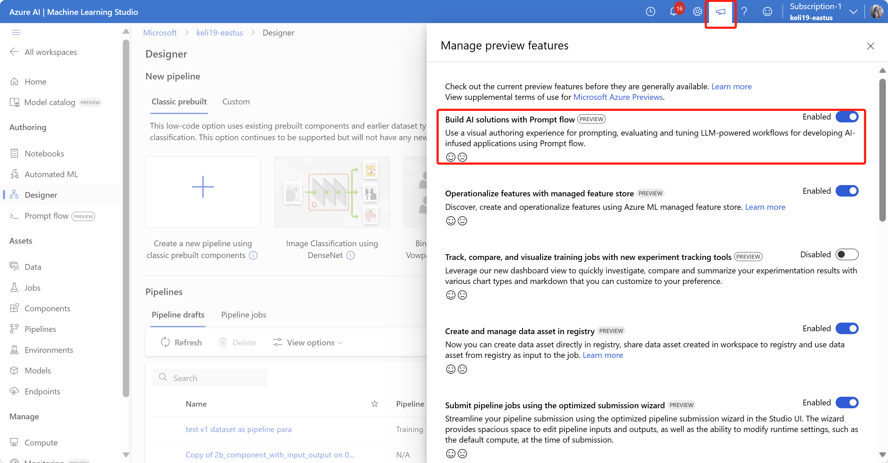
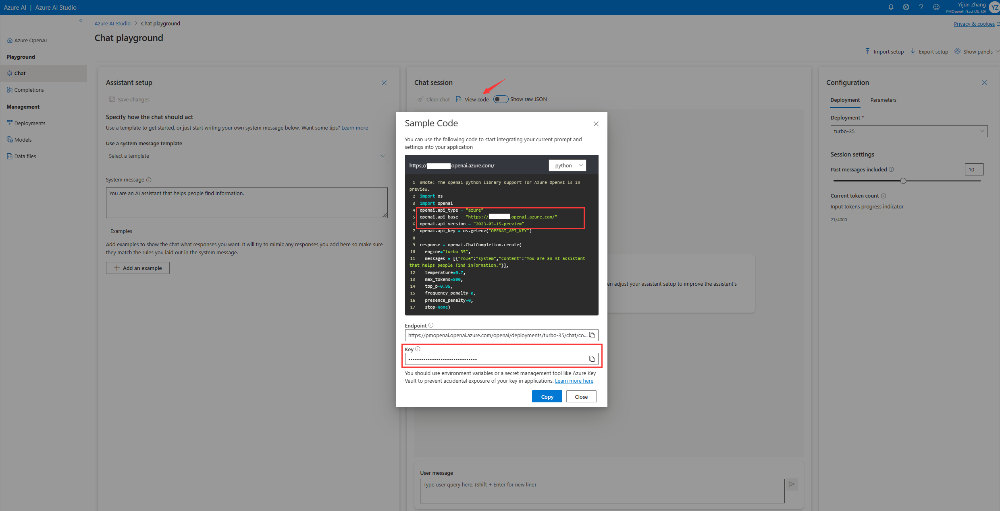
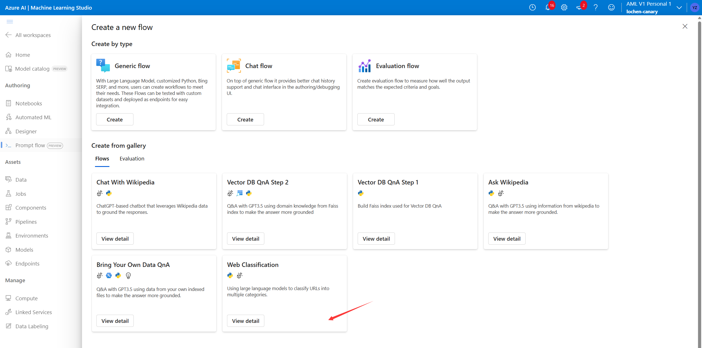
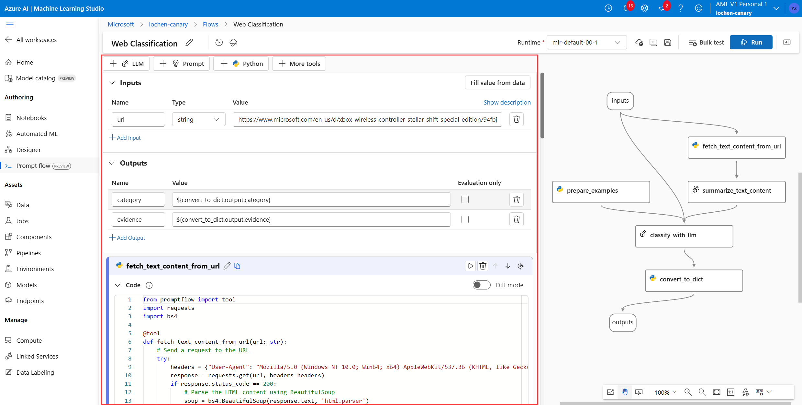
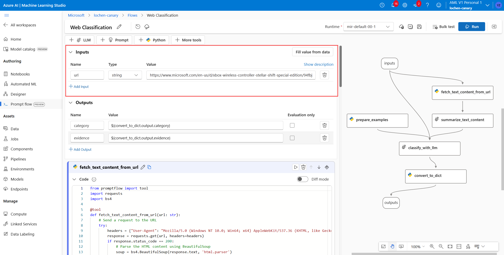
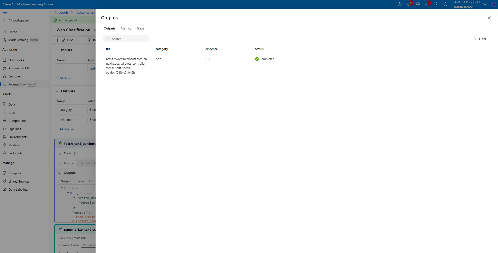
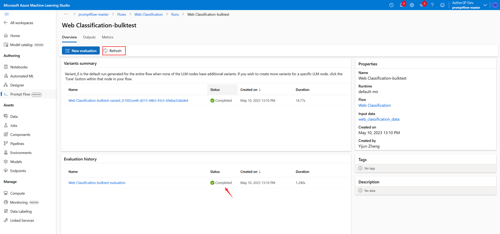
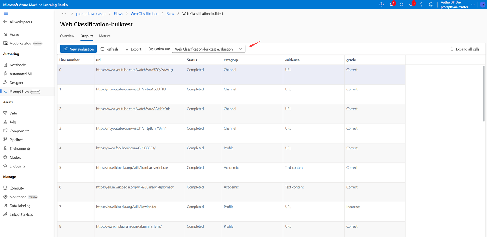
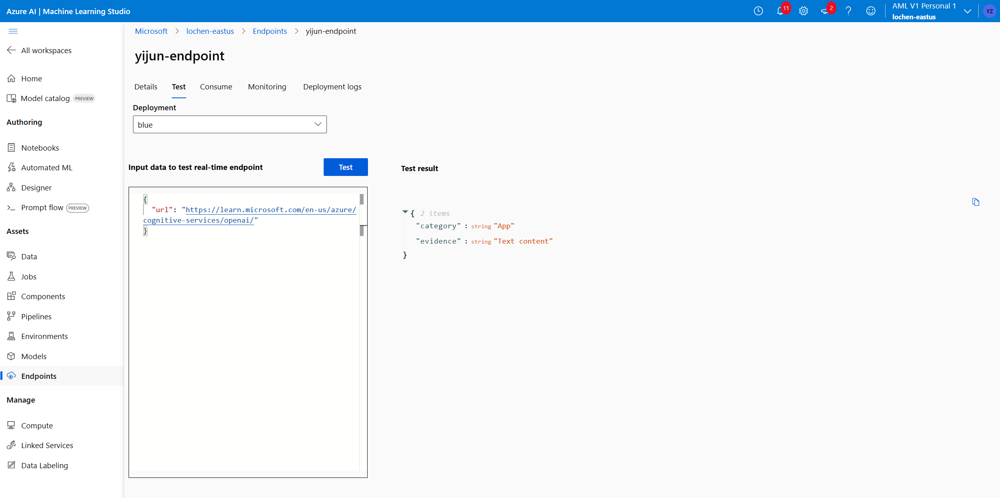

# Train and Deploy Large Language Models (LLMs) with Azure Machine Learning prompt flow (preview)

[!INCLUDE [machine-learning-preview-generic-disclaimer](../../includes/machine-learning-preview-generic-disclaimer.md)]


This guide walks you through using Azure Machine Learning prompt flow. You learn how to enable prompt flow in your Azure Machine Learning workspace. Then you create and develop your first prompt flow, test and evaluate it, then deploy it to production.

If you'd like video reference you can follow this video tutorial to start your prompt flow journey in your workspace:

[](https://www.youtube.com/watch?v=kYqRtjDBci8)

## Prerequisites

* An Azure subscription. If you don't have an Azure subscription, create a [free account](https://azure.microsoft.com/free/).

* Access to Azure Open AI. [Follow this link to register](../cognitive-services/openai/limited-access#registration-process)

* Enable prompt flow in your Azure Machine Learning workspace

In your Azure Machine Learning workspace, you can enable prompt flow by turn-on **Build AI solutions with Prompt flow** in the **Manage preview features** panel.

 


## Create a connection

To use prompt flow, you need to create at least one connection in your workspace. A connection helps securely store and manage secret keys or other
sensitive credentials required for interacting with LLM and other
external tools, for example Azure Content Safety.

Navigate to the prompt flow homepage, select **Connections** tab. Connection is a shared resource to all members in the workspace. So, if you already see a connection whose provider is AzureOpenAI, you can skip this step, go to create runtime.

If not, select **Create** button then AzureOpenAI from the drop-down.

 

Then a right-hand panel appears. Here, you need to provide the connection name, API key, API base, API type, and API version before selecting the **Save** button.


To obtain the API key, base, type, and version, you can navigate to the [chat playground](https://oai.azure.com/portal/chat) in the Azure OpenAI portal and select the **View code** button. From here, you can copy the necessary information and paste it into the connection creation panel. You need a subscription with access to the Azure OpenAI key.




After inputting the required fields, select **Save** to create the connection.


## Create a runtime

Runtime serves as the computing resources required for the application
to run, including a Docker image that contains all necessary dependency
packages. It's a must-have for flow execution. So, we suggest before
starting flow authoring, you should set up your runtime.


In this guide, we recommend creating a runtime from a Compute Instance. If you're a Subscription Owner, you have all the permissions needed. If not, first go ask your Subscription Owner to follow this [guide](https://github.com/Azure/azureml-insiders/blob/main/previews/prompt-flow/how-to-guides/how-to-create-manage-runtime.md#grant-sufficient-permissions-to-use-the-runtime) to grant your permissions.


Meanwhile check if you have a Compute Instance assigned to you in the workspace. If not, follow this [article](/how-to-create-manage-compute-instance.md) to create one. A memory optimized compute is recommended.

Once you have your Compute Instance running, 
you can start to create a runtime. Go to **Runtime** tab, select **Create** button.

We support 2 types of runtimes, use **Compute Instance** in the quick start. Then In the runtime creation right panel, specify a name, select your running compute instance, select **Authenticate** (if you see the warning message as shown in the screenshot), and use the default
environment, then **Create**.


If you want to learn more about runtime type, how to customize conda
packages in runtime, limitations, etc.,
visit [how to create and manage runtime](https://github.com/Azure/azureml-insiders/blob/main/previews/prompt-flow/how-to-guides/how-to-create-manage-runtime.md).

## Create and develop your prompt flow

In **Flows** tab of prompt flow home page, select **Create** to create
your first prompt flow. You can create a flow by cloning the samples in
the gallery.

### Clone from sample

The built-in samples are shown in the gallery. 

In this guide, we use **Web Classification** sample to walk you
through the main user journey, so select **View
detail** on Web Classification tile to preview the sample.



Then a preview window is popped up. You can browse the sample
introduction to see if the sample is similar to your scenario. The
samples are stored in a GitHub repo. You can select **Clone** to clone
the sample, then check the flow, test it, modify it.

### Authoring page

After selecting **Clone**, You'll enter the authoring page.

At the left, it's the flatten view, the main working area where you can
author the flow, for example add a new node, edit the prompt, select the
flow input data, etc.



At the right, it's the graph view for visualization only. You can zoom
in, zoom out, auto layout, etc.


In this guide, we use **Web Classification** sample to walk you
through the main user journey. Web Classification is a flow
demonstrating multi-class classification with LLM. Given a URL, it classifies the URL into a web category with just a few shots, simple
summarization and classification prompts. For example, given
\"https://www.imbd.com/\", it classifies this URL into \"Movie\". 


In the graph view, you can see how the sample flow looks. The input is a URL to classify, then it uses a Python script to fetch text content from the URL. The script uses an LLM to summarize the text content within 100 words to classify based on the URL and summarized text content. The Python script then converts the LLM output into a dictionary. The prepare_examples node is to feed few-shot examples to classification node's prompt.

### Select runtime

Before you start authoring, you should first select a runtime here.


### Flow input data

When unfolding **Inputs** section, you can create and view inputs. For
Web Classification sample as shown the screenshot, the flow input
is a URL of string type.



The input schema (name: url; type: string) and value are already set when cloning samples. You can change to another value manually, for example \"https://www.imbd.com/\".

### Select connection

For each LLM node, you need to select a connection to set your LLM API
keys.


We have two LLM nodes (summarize_text_content and classify_with_llm) in the flow, so you need to set the connection for each respectively.

### Run single node

To test and debug a single node, select the **Run** icon on node in
flatten view. Run status is shown at the top, once running completed, check output in node
output section.


Run fetch_text_content_from_url then summarize_text_content, check if the flow can successfully fetch content from web, and summarize the web content.

The single node status is shown in the graph view as well. You can also
change the flow input URL to test the node behavior for different URLs.

### Run the whole flow

To test and debug the whole flow, select the **Run** button at the right
top.


Then you can check the run status and output of each node. The node
statuses are shown in the graph view as well. Similarly, you can change
the flow input URL to test how the flow behaves for different URLs.

### Set and check flow output

When the flow is complicated, instead of checking outputs on each node,
you can set flow output and check outputs of multiple nodes in one
place. Moreover, flow output helps:

-   check bulk test results in one single table
-   define evaluation interface mapping
-   set deployment response schema

When you clone the sample, the flow outputs (category and evidence) are already set. You can select **View outputs** to check the outputs in a table.



## Test and Evaluation

After the flow runs successfully with a single row of data, you might
want to test it against a large set of data. To run on a large set of data, you can run a bulk test and choose the desired evaluation methods and view their metrics.

### Prepare data

You need to prepare test data first. We support csv and txt file for
now.

Go to [GitHub](https://github.com/Azure/azureml-assets/blob/main/promptflow/data/web-classification/data.csv) to download raw file for Web Classification sample.

### Bulk test

Select **Bulk test** button, then a right panel pops up. It's a wizard
that guides you to submit a bulk test and to select the evaluation
method (optional).​​​​​​​


You need to set a bulk test name, description, then select a runtime
first.

Then select **Upload new data** to upload the data you downloaded now. After uploading the data or if your colleagues in the workspace already created a dataset, you
can choose the dataset from the drop-down and preview first 50 rows.


The dataset selection drop down supports search and autosuggestion.

### Evaluate

Select **Next**, then you can use an evaluation method to evaluate your flow.
The evaluation methods are also flows that use Python or LLM etc., to
calculate metrics like accuracy, relevance score. The built-in
evaluation flows and customized ones are listed in the drop-down.


Since Web classification is a classification scenario, it's suitable to
select the **Accuracy** to evaluate.

If you're interested in how the metrics are defined for built-in
evaluation methods, you can preview the evaluation flows by
selecting **View details**.

After selecting **Accuracy** as evaluation method, you can set interface
mapping to map the ground truth to flow input and category to flow output. 

Then select **Submit** to submit a bulk test and the selected evaluation. 

### Check evaluation results

When completed,
select the link, go to bulk test detail page.


Select **Refresh** until the evaluation run is completed.



Then go to the **Metrics** tab, check accuracy.


To understand in which case the flow classifies incorrectly, you need to
see the evaluation results for each row of data. Go to **Outputs** tab,
select the evaluation run, you can see in the table for most
cases the flow classifies correctly except for few rows.



You can adjust column width, hide/unhide columns, and export table to
csv file for further investigation. 

As you might know, accuracy isn't the only metric that can evaluate a
classification task, for example you can also use recall to evaluate. In
this case, you can select **New evaluation**, choose other evaluation
methods to evaluate.

## Deployment

After you build and test a flow, you can deploy it as an endpoint and invoke the endpoint for real-time inference.

### Configure the endpoint

When you are in the bulk test **Overview** tab, select bulk test link.


Then you're directed to the bulk test detail page, select **Deploy**. A wizard pops up to allow you to configure the endpoint. Specify an endpoint name, use the default settings, set connections, and select a virtual machine, select **Deploy** to start the deployment.


If you're a Workspace Owner or Subscription Owner, follow this [guide](https://github.com/Azure/azureml-insiders/blob/main/previews/prompt-flow/how-to-guides/how-to-deploy-for-real-time-inference.md#grant-permissions-to-the-endpoint) to grant permissions to the endpoint. If not, go ask your Workspace Owner or Subscription Owner to it for you.

### Test the endpoint

It takes several minutes to deploy the endpoint. After the endpoint is deployed successfully, you can test it in the **Test** tab. 

Copy following sample input data, paste to the input box, and select **Test**, then you see the result predicted by your endpoint.

```json
{
  "url": "https://learn.microsoft.com/en-us/azure/cognitive-services/openai/"
}
```



## Next steps

[Get started with RAG using a prompt flow sample (preview)](how-to-use-pipelines-prompt-flow.md)

[How to create vector index in Azure Machine Learning prompt flow (preview)](how-to-create-vector-index.md)