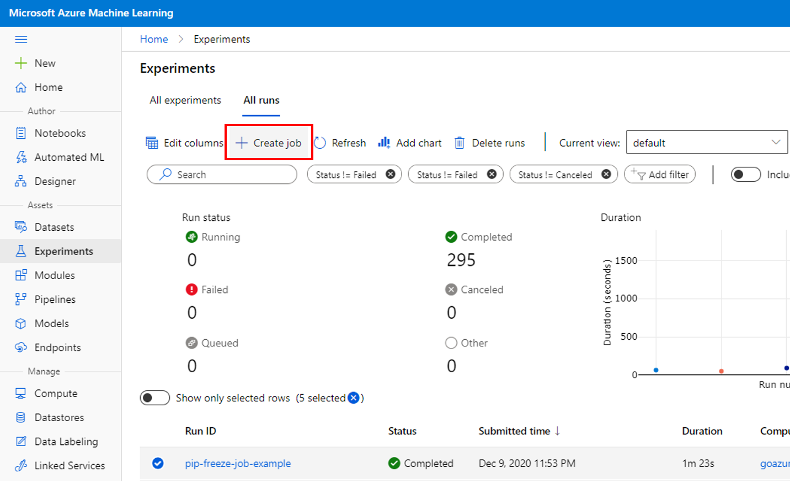
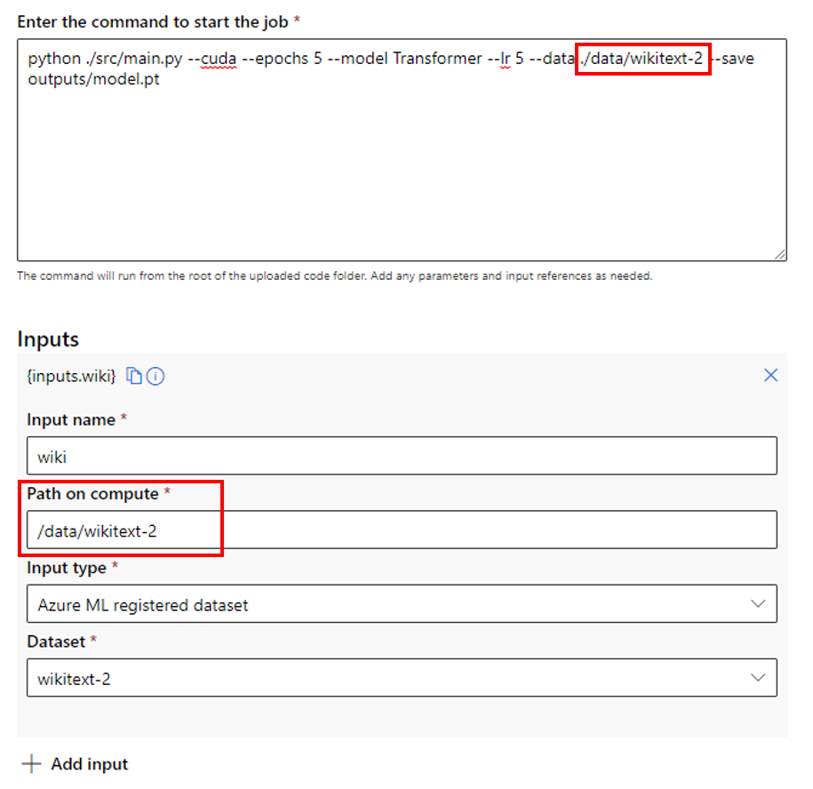

# Create a training job with Job Creation UI (preview)

There are many ways to create a training job with Azure Machine Learning. You can use CLI, REST API, or you can also use the UI to directly create a training job without the need to learn CLI or REST APIs. In this article, you will learn how to use your own data and code to train a machine learning model with the job creation UI in Azure Machine Learning Studio.

## Prerequisites

* An Azure subscription. If you don't have an Azure subscription, create a free account before you begin. Try the [free or paid version of Azure Machine Learning](https://aka.ms/AMLFree) today.

* An Azure Machine Learning workspace. See [Create an Azure Machine Learning workspace](how-to-manage-workspace.md). 

* Understand [what a job is](https://docs.microsoft.com/en-us/azure/machine-learning/how-to-train-cli#introducing-jobs) in Azure Machine Learning. 

## Get started
1. Sign in to [Azure Machine Learning studio](https://ml.azure.com). 

1. Select your subscription and workspace.
 
1. The first option to enter the job creation UI is from the homepage. Click **Create new** and select **Job**. 
[](media/how-to-train-with-ui/home-entry.png)

1. The second option is to navigate to the left pane. Click **+New** and select **Job**. 
[](media/how-to-train-with-ui/left-nav-entry.png)

1. If you are in the Experiment page and you would like to create a new job, you can go to the **All runs** tab and click **Create job**. 
[](media/how-to-train-with-ui/experiment-entry.png)

Then you will land in to the job creation panel, you can follow the steps in the wizard to configure and create a training job. 

## Compute
The first step in the job creation UI is to select the compute target you would like your job to run on. Job creation UI supports a lot of different compute types: compute cluster, compute instance, attached Kubernetes cluster. You can select a compute type first and select from your existing compute targets. You can see the node information and SKU type in the dropdown to help you better choose. For compute cluster or Kubernetes cluster, you can also specify how many nodes you need for this job in **Instance count**. If omitted, we will set the default number for instance count as 1. You can then click **Next** to go to the next step. 
 [](media/how-to-train-with-ui/compute-cluster.png)

If this is your first time using Azure Machine Learning, you'll see an empty list and links to create a new compute. You can learn how to [create a compute instance](how-to-create-manage-compute-instance.md), [create a compute cluster](how-to-create-attach-compute-cluster.md), or [attach an Azure Arc enabled Kubernetes cluster](how-to-attach-arc-kubernetes.md). 
 [](media/how-to-train-with-ui/create-new-compute.png)

## Environment
After selecting a compute target, you can specify the environment. Job creation UI supports three types of environment:
* Curated environments
* Custom environments
* Container registry image 
### Curated environments
Curated environments contain collections of Python packages and are available in your workspace by default. These environments are backed by cached Docker images which reduces the run preparation cost. You can see detailed information about the contents of each curated environment in the card.
 [](media/how-to-train-with-ui/curated-env.png)

### Custom environments
Custom environments are the environments created by the users.You can select an environment that you created before and reuse it for different jobs. You can learn more about [how to create an environment](https://docs.microsoft.com/en-us/azure/machine-learning/how-to-manage-environments-in-studio#create-an-environment). 

### Container registry image
If you don't want to create a new environment or use the Azure Machine Learning curated environments, you can pull the docker image from public container registry like [Docker Hub](https://hub.docker.com/) with the image path. If the image is in your private container, you can turn on the toggle **This is a private container registry** and put your username and password, so we can pull the image from there. 
[](media/how-to-train-with-ui/container-registry-image.png)

## Job Settings
After specifying the environment, you can configure your job with more settings. 

|Field| Description|
|------| ------|
|Job name| The job name field is used to uniquely identify your job. It is also set as the display name for your job. This field is optional and we will generate a GUID for you if you don't enter anything. Please noted that the job name cannot be duplicated.|
|Experiment name| Tags the job for better organization in the Azure Machine Learning studio. Each job's run record will be organized under the corresponding experiment in the studio's "Experiment" tab. We will set as **Default** experiment by default.|
|Code| You can upload a code file or a folder from local, or upload a code file from workspace default blob storage. We will show the files to be uploaded after you make the selection. |
|Command| The command to execute. Command-line arguments can be explicitly written into the command or inferred from other sections, specifically **inputs** using curly braces notation.|
|Inputs| Specify the input binding. We support three types of inputs: 1) Azure Machine Learning registered dataset; 2) workspace default blob storage; 3) upload local file. You can add multiple inputs. |
|Environment variables| Setting environment variables allows you to provide dynamic configuration of the job. You can add the variable and value here.|
|Tags| Add tags to your job to help with organization.|

### Refer to your code and inputs in the command box
#### Code
The command will run from the root directory of the uploaded code folder. After you select your code file or folder, you will be able to see the files to be uploaded. You can copy the relative path for the code and paste it in the command box. 

If the code is in the root directory, you can directly refer to it in the command like `python main.py`.

If the code is not in the root directory, you should use the relative path. For example, look at the [word language model](https://github.com/Azure/azureml-examples/tree/main/cli/jobs/train/pytorch/word-language-model) example, if you upload the entire folder:

```tree
.
├── job.yml
├── data
└── src
    └── main.py
```
This directory contains two subdirectory, and the source code is in the subdirectory `src`. In this case, when you refer your source code in the command, you should use `python ./src/main.py`.

[](media/how-to-train-with-ui/code-command.png)

#### Inputs
There are two ways for input binding: 
1. Input name: When you add input, you need to specify the input name, and you can see a curly braces notation in the UI `{inputs.name}`. You can copy and paste it in the command line to refer to your input like `--data {inputs.name}`. 
[](media/how-to-train-with-ui/input-command-name.png)

1. Path: You can use `--data .path` to specify a cloud location where the path is what you enter in the **Path on compute** field. 
[](media/how-to-train-with-ui/input-command-path.png)

## Review and Create 
After setting up all your job configuration in the job setting, you can click **Next** and go to the Review page. You can review all your settings and click the pencil button to modify. 

You can also click **view the YAML spec** to review and download the yaml file generated by this job configuration. This job yaml file can be used to submit the job from the 2.0 CLI as well. 
[](media/how-to-train-with-ui/view-yaml.png)
[](media/how-to-train-with-ui/yaml-spec.png)

After you click **Create**, you will be landed to the run details page, where you can monitor and manage your training job. 

## Coming soon
* Run a quick start sample with the job creation UI
* Create an interactive job with the job creation UI
* Create a sweep job for hyperparameter tuning with the job creation UI

## Next steps

* [Deploy and score a machine learning model with a managed online endpoint (preview)](how-to-deploy-managed-online-endpoints.md).

* [Train models (create jobs) with the 2.0 CLI (preview)](how-to-train-cli.md)