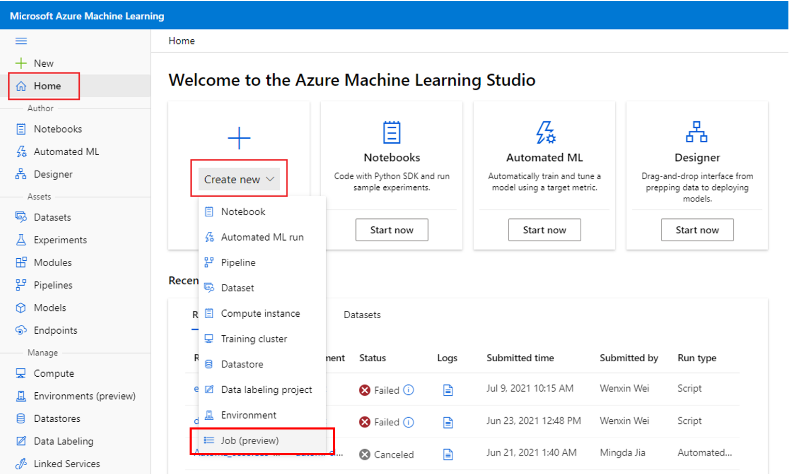
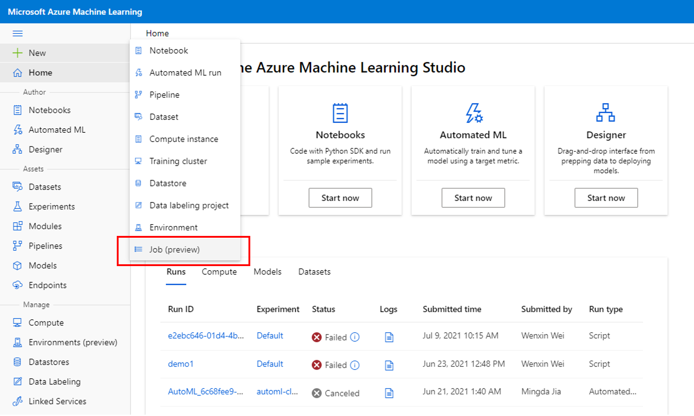
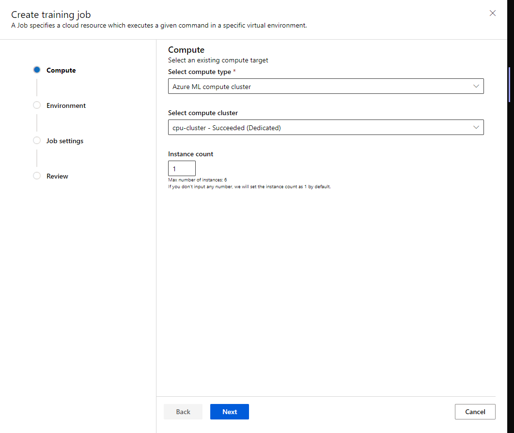
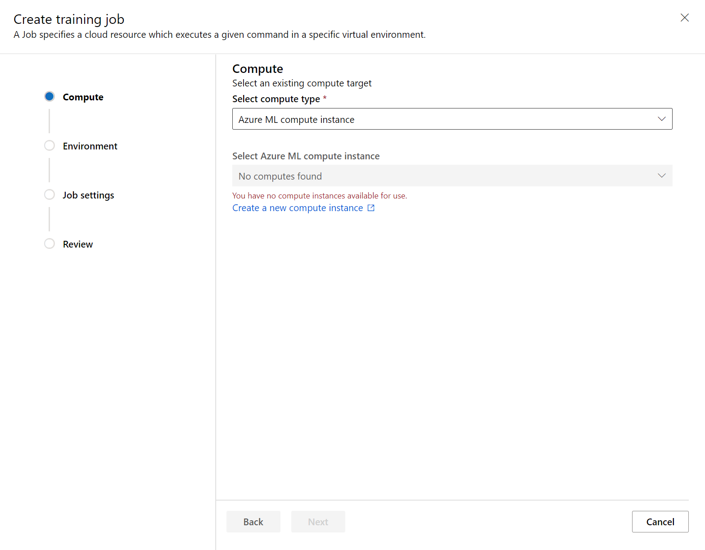
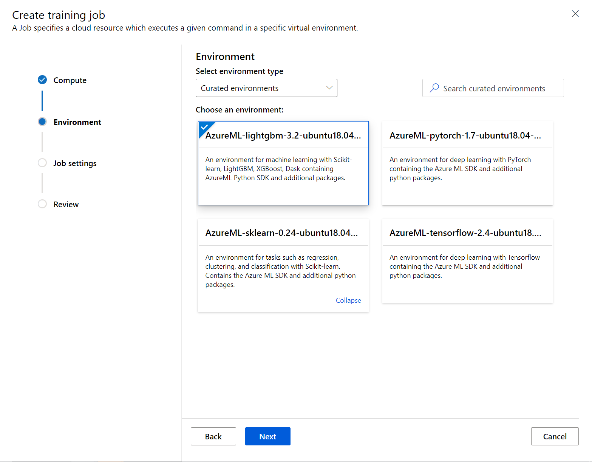
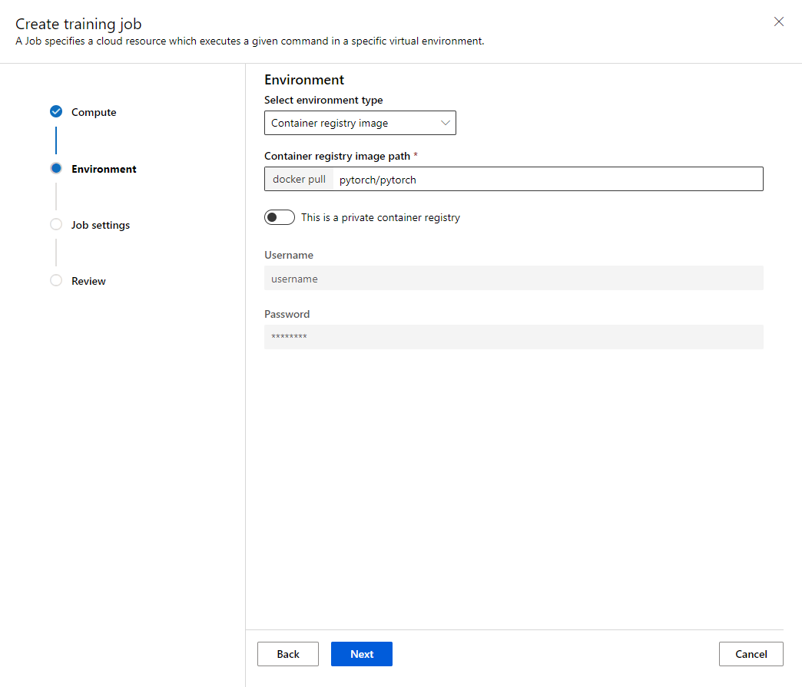
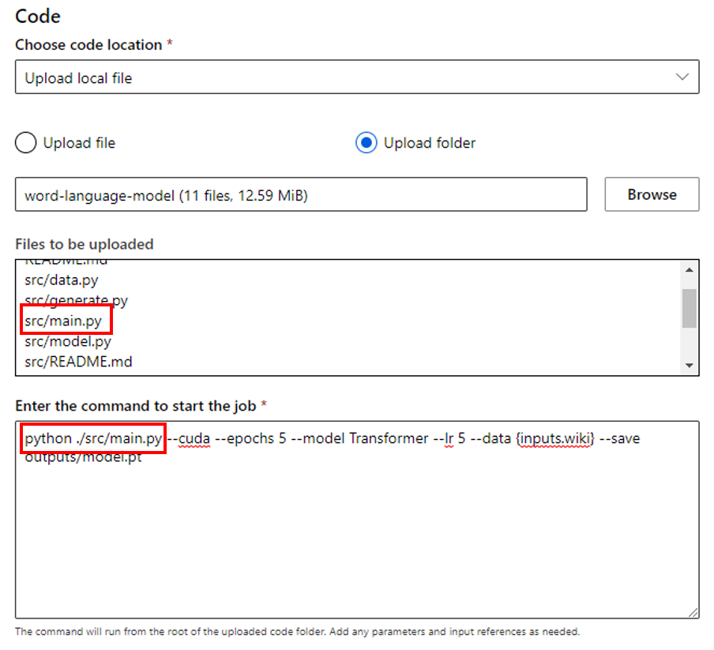
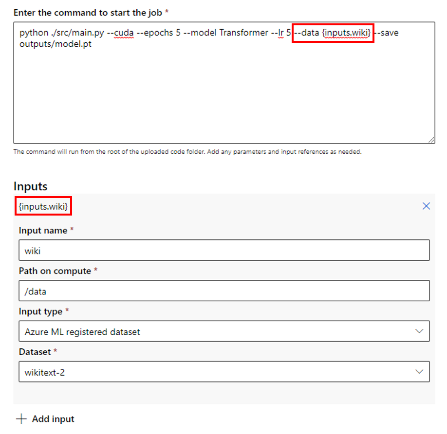
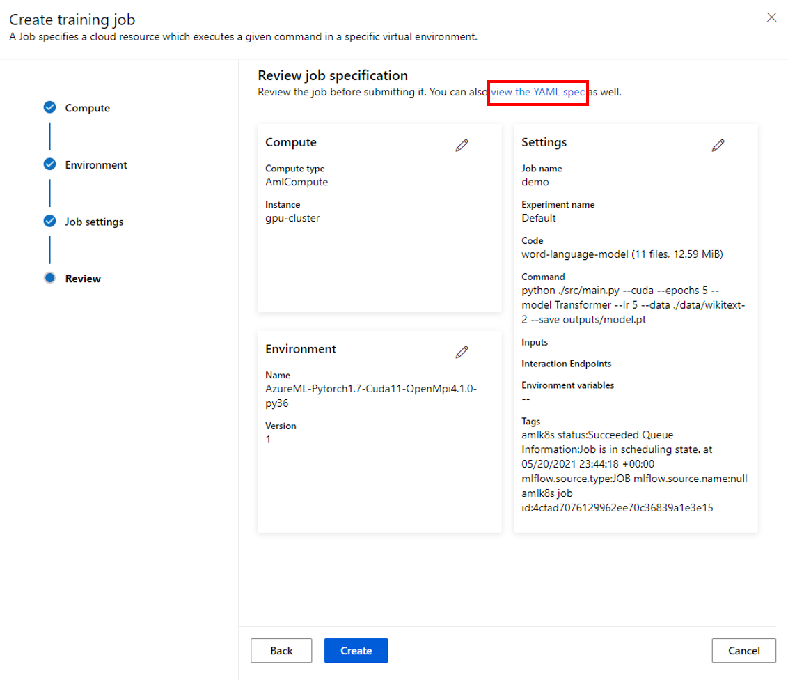
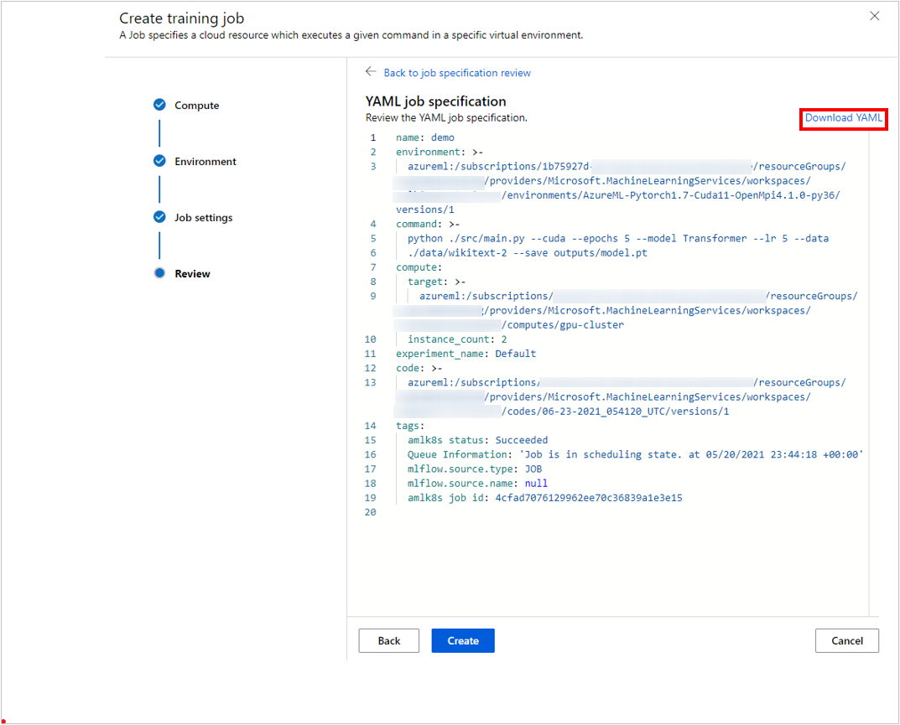

# Create a training job with the job creation UI (preview)

There are many ways to create a training job with Azure Machine Learning. You can use the CLI (see [Train models (create jobs)](how-to-train-model.md)), the REST API (see [Train models with REST (preview)](how-to-train-with-rest.md)), or you can use the UI to directly create a training job. In this article, you'll learn how to use your own data and code to train a machine learning model with the job creation UI in Azure Machine Learning studio.

[!INCLUDE [machine-learning-preview-generic-disclaimer](../../includes/machine-learning-preview-generic-disclaimer.md)]

## Prerequisites

* An Azure subscription. If you don't have an Azure subscription, create a free account before you begin. Try the [free or paid version of Azure Machine Learning](https://azure.microsoft.com/free/machine-learning/search/) today.

* An Azure Machine Learning workspace. See [Create workspace resources](quickstart-create-resources.md). 

* Understanding of what a job is in Azure Machine Learning. See [how to train models]how-to-train-model.md).

## Get started

1. Sign in to [Azure Machine Learning studio](https://ml.azure.com). 

1. Select your subscription and workspace.
 
* You may enter the job creation UI from the homepage. Click **Create new** and select **Job**. 
[](media/how-to-train-with-ui/home-entry.png)

* Or, you may enter the job creation from the left pane. Click **+New** and select **Job**. 
[](media/how-to-train-with-ui/left-nav-entry.png)


These options will all take you to the job creation panel, which has a wizard for configuring and creating a training job. 

## Select compute resources

The first step in the job creation UI is to select the compute target on which you'd like your job to run. The job creation UI supports several compute types:

| Compute Type | Introduction | 
| --- | --- | 
| Compute instance | [What is an Azure Machine Learning compute instance?](concept-compute-instance.md) | 
| Compute cluster | [What is a compute cluster?](how-to-create-attach-compute-cluster.md#what-is-a-compute-cluster) | 
| Attached Compute (Kubernetes cluster) | [Configure and attach Kubernetes cluster anywhere (preview)](how-to-attach-kubernetes-anywhere.md). | 

1. Select a compute type
1. Select an existing compute resource. The dropdown shows the node information and SKU type to help your choice.
1. For a compute cluster or a Kubernetes cluster, you may also specify how many nodes you want for the job in **Instance count**. The default number of instances is 1. 
1. When you're satisfied with your choices, choose **Next**. 
 [](media/how-to-train-with-ui/compute-cluster.png)

If you're using Azure Machine Learning for the first time, you'll see an empty list and a link to create a new compute. 

 [](media/how-to-train-with-ui/create-new-compute.png)

For more information on creating the various types, see:

| Compute Type | How to | 
| --- | --- | 
| Compute instance | [Create and manage an Azure Machine Learning compute instance](how-to-create-manage-compute-instance.md) | 
| Compute cluster | [Create an Azure Machine Learning compute cluster](how-to-create-attach-compute-cluster.md) | 
| Attached Kubernetes cluster | [Attach an Azure Arc-enabled Kubernetes cluster](how-to-attach-kubernetes-anywhere.md) | 

## Specify the necessary environment

After selecting a compute target, you need to specify the runtime environment for your job. The job creation UI supports three types of environment:

* Curated environments
* Custom environments
* Container registry image 

### Curated environments

Curated environments are Azure-defined collections of Python packages used in common ML workloads. Curated environments are available in your workspace by default. These environments are backed by cached Docker images, which reduce the job preparation overhead. The cards displayed in the "Curated environments" page show details of each environment. To learn more, see [curated environments in Azure Machine Learning](resource-curated-environments.md).

 [](media/how-to-train-with-ui/curated-env.png)

### Custom environments

Custom environments are environments you've specified yourself. You can specify an environment or reuse an environment that you've already created. To learn more, see [Manage software environments in Azure Machine Learning studio (preview)](how-to-manage-environments-in-studio.md#create-an-environment). 

### Container registry image

If you don't want to use the Azure Machine Learning curated environments or specify your own custom environment, you can use a docker image from a public container registry such as [Docker Hub](https://hub.docker.com/). If the image is in a private container, toggle **This is a private container registry**. For private registries, you will need to enter a valid username and password so Azure can get the image. 
[](media/how-to-train-with-ui/container-registry-image.png)

## Configure your job

After specifying the environment, you can configure your job with more settings. 

|Field| Description|
|------| ------|
|Job name| The job name field is used to uniquely identify your job. It's also used as the display name for your job. Setting this field is optional; Azure will generate a GUID name for the job if you don't enter anything. Note: the job name must be unique.|
|Experiment name| This helps organize the job in Azure Machine Learning studio. Each job's run record will be organized under the corresponding experiment in the studio's "Experiment" tab. By default, Azure will put the job in the **Default** experiment.|
|Code| You can upload a code file or a folder from your machine, or upload a code file from the workspace's default blob storage. Azure will show the files to be uploaded after you make the selection. |
|Command| The command to execute. Command-line arguments can be explicitly written into the command or inferred from other sections, specifically **inputs** using curly braces notation, as discussed in the next section.|
|Inputs| Specify the input binding. We support three types of inputs: 1) Azure Machine Learning registered dataset; 2) workspace default blob storage; 3) upload local file. You can add multiple inputs. |
|Environment variables| Setting environment variables allows you to provide dynamic configuration of the job. You can add the variable and value here.|
|Tags| Add tags to your job to help with organization.|

### Specify code and inputs in the command box

#### Code

The command is run from the root directory of the uploaded code folder. After you select your code file or folder, you can see the files to be uploaded. Copy the relative path to the code containing your entry point and paste it into the box labeled **Enter the command to start the job**. 

If the code is in the root directory, you can directly refer to it in the command. For instance, `python main.py`.

If the code isn't in the root directory, you should use the relative path. For example, the structure of the [word language model](https://github.com/Azure/azureml-examples/tree/main/cli/jobs/single-step/pytorch/word-language-model) is:

```tree
.
├── job.yml
├── data
└── src
    └── main.py
```
Here, the source code is in the `src` subdirectory. The command would be `python ./src/main.py` (plus other command-line arguments).

[](media/how-to-train-with-ui/code-command.png)

#### Inputs

When you use an input in the command, you need to specify the input name. To indicate an input variable, use the form `${{inputs.input_name}}`. For instance, `${{inputs.wiki}}`. You can then refer to it in the command, for instance, `--data ${{inputs.wiki}}`.

[](media/how-to-train-with-ui/input-command-name.png)

## Review and Create 

Once you've configured your job, choose **Next** to go to the **Review** page. To modify a setting, choose the pencil icon and make the change. 

You may choose **view the YAML spec** to review and download the yaml file generated by this job configuration. This job yaml file can be used to submit the job from the CLI (v2). (See [Train models (create jobs) with the CLI (v2)](how-to-train-cli.md).)
[](media/how-to-train-with-ui/view-yaml.png)
[](media/how-to-train-with-ui/yaml-spec.png)

To launch the job, choose **Create**. Once the job is created, Azure will show you the job details page, where you can monitor and manage your training job. 

  [!INCLUDE [Email Notification Include](../../includes/machine-learning-email-notifications.md)]

## Next steps

* [Deploy and score a machine learning model by using an online endpoint](how-to-deploy-online-endpoints.md).

* [Train models (create jobs) with the CLI, SDK, and REST API](how-to-train-model.md)
