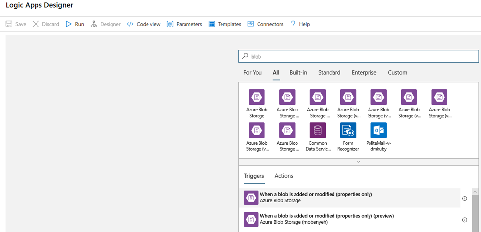
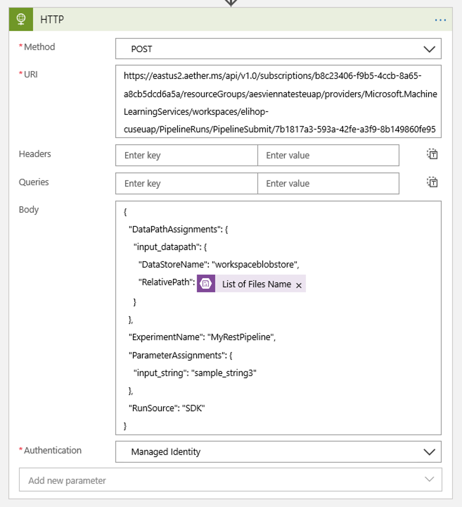

# Trigger a run of a Machine Learning pipeline from a Logic App

Trigger the run of your Azure Machine Learning Pipeline when new data appears. For example, you may want to trigger the pipeline to train a new model when new data appears in the blob storage account. Set up the trigger with [Azure Logic Apps](../logic-apps/logic-apps-overview.md).

## Prerequisites

* An Azure Machine Learning workspace. For more information, see [Create an Azure Machine Learning workspace](how-to-manage-workspace.md).

* The REST endpoint for a published Machine Learning pipeline. [Create and publish your pipeline](how-to-create-your-first-pipeline.md). Then find the REST endpoint of your PublishedPipeline by using the pipeline ID:
    
     ```
    # You can find the pipeline ID in Azure Machine Learning studio
    
    published_pipeline = PublishedPipeline.get(ws, id="<pipeline-id-here>")
    published_pipeline.endpoint 
    ```
* [Azure blob storage](../storage/blobs/storage-blobs-overview.md) to store your data.
* [A datastore](how-to-access-data.md) in your workspace that contains the details of your blob storage account.

## Create a Logic App

Now create an [Azure Logic App](../logic-apps/logic-apps-overview.md) instance. If you wish, [use an integration service environment (ISE)](../logic-apps/connect-virtual-network-vnet-isolated-environment.md) and [set up a customer-managed key](../logic-apps/customer-managed-keys-integration-service-environment.md) for use by your Logic App.

Once your Logic App has been provisioned, use these steps to configure a trigger for your pipeline:

1. [Create a system-assigned managed identity](../logic-apps/create-managed-service-identity.md) to give the app access to your Azure Machine Learning Workspace.

1. Navigate to the Logic App Designer view and select the Blank Logic App template. 
    > [!div class="mx-imgBorder"]
    > 

1. In the Designer, search for **blob**. Select the **When a blob is added or modified (properties only)** trigger and add this trigger to your Logic App.
    > [!div class="mx-imgBorder"]
    > 

1. Fill in the connection info for the Blob storage account you wish to monitor for blob additions or modifications. Select the Container to monitor. 
 
    Choose the **Interval** and **Frequency** to poll for updates that work for you.  

    > [!NOTE]
    > This trigger will monitor the selected Container but will not monitor subfolders.

1. Add an HTTP action that will run when a new or modified blob is detected. Select **+ New Step**, then search for and select the HTTP action.

  > [!div class="mx-imgBorder"]
  > 

  Use the following settings to configure your action:

  | Setting | Value | 
  |---|---|
  | HTTP action | POST |
  | URI |the endpoint to the published pipeline that you found as a [Prerequisite](#prerequisites) |
  | Authentication mode | Managed Identity |

1. Set up your schedule to set the value of any [DataPath PipelineParameters](https://github.com/Azure/MachineLearningNotebooks/blob/master/how-to-use-azureml/machine-learning-pipelines/intro-to-pipelines/aml-pipelines-showcasing-datapath-and-pipelineparameter.ipynb) you may have:

    ```json
    "DataPathAssignments": { 
         "input_datapath": { 
                            "DataStoreName": "<datastore-name>", 
                            "RelativePath": "@triggerBody()?['Name']" 
    } 
    }, 
    "ExperimentName": "MyRestPipeline", 
    "ParameterAssignments": { 
    "input_string": "sample_string3" 
    },
    ```

    Use the `DataStoreName` you added to your workspace as a [Prerequisite](#prerequisites).
     
    > [!div class="mx-imgBorder"]
    > 

1. Select **Save** and your schedule is now ready.
