# ParallelRunStep Performance Tuning Guide
This guide helps users to measure and tune parameters in term of performance when using ParallelRunStep. It includes how to:
1. Select virtual machine. Decide virtual machine type, priority and size.
1. Choose node count and the number of worker processes per node.
1. Choose mini batch size.
1. Check performance metrics.

>[!NOTE]
>Note that we're continuously improving log and metrics. The content here may not match the actual prod exactly at arbitrary time. We'll align them with on-going releases.

## How to Choose Compute Target

Here are the quick steps for choosing compute target. For the concept of compute target, please refer to: [What are compute targets in Azure Machine Learning](https://docs.microsoft.com/azure/machine-learning/concept-compute-target)

1. Choose CPU or GPU virtual machine. For the sizes and options for Azure virtual machines, please refer to: [Sizes for virtual machines in Azure](https://docs.microsoft.com/azure/virtual-machines/sizes)
1. Choose virtual machine size based on your rough estimation of cores, RAM, local storage, cost requirements. This is a **rough estimation** and you can change to new cluster based on your tuning result.
1. Choose `Dedicated` or `Low priority`. For dev purpose, you can always use a few Dedicated virtual machines to ensure you can have a quick response.
1. Minimum number of nodes that you want to provision. If you want a number of dedicated  nodes, set that count here. For dev purpose, keep the nodes in provisioned state can save the time of provisioning when start a job.

> [!div class="mx-imgBorder"]
> 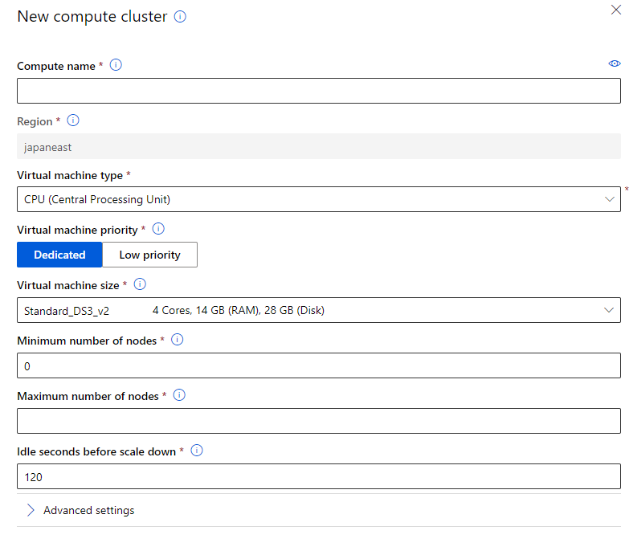

## How To Choose Node Count

Node count determines the number of compute nodes to be used for running the user script. It should not exceed the maximum number of nodes of compute target.
In general, more node counts can provide better parallelism and save more job running time. The number of mini-batches processed by each node can be found in `logs/sys/job_report/node_summary.csv`. If the report shows mini-batches allocation skews a lot among all nodes, a possible explanation is that the compute resource is more than sufficient for current job. User can consider reducing node count to save budget.

## How to Choose Process Count Per Node

Process count per node determines the parallelism on node level. The best practice is to set it to the core number of GPU or CPU on one node. If too many processes are used, the synchronization overhead will increase and will not save overall runtime.

The max number of worker processes running in parallel is `node_count * process_count_per_node`.
In dev phase, you have tested out the duration per mini batch locally and use the following formula to estimate the suitable parameters.

`node_count * process_count_per_node = desired_total_duration / duration_per_mini_batch`

## How To Choose Mini-batch Size

Mini batch size is the approximate amount of input data passed to each run() invocation. 

- For FileDataset input, this is number of files user script can process in one run() call. 
- For TabularDataset input it is approximate size of data user script can process in one run() call. E.g. 1024, 1024KB, 10MB, 1GB (optional, default value 10 files for FileDataset and 1MB for TabularDataset.)

A general suggestion is to ensure the execution time of each mini batch is more than 10 seconds to reduce the impact of scheduling and invocation overhead. 

To investigate the performance of mini-batch processing, a detailed log can be found in `logs/sys/job_report/processed_mini-batch.csv`. There are three metrics which are helpful:

- Elapsed Seconds: The total duration of mini-batch processing.
- Process Seconds: The CPU time of mini-batch processing. This metric indicates the busyness of CPU.
- Run Method Seconds: The duration of run() in entry script.

# Check performance metrics
You can check the detailed metric of PRS and its relying resources to find the bottleneck of your job.

Here are some sections that shows how to understand the performance of Parallel Run Step job by using some metrics, reports and tools.

- [Mini batch processing metrics](##Mini batch processing metrics, including durations of entry script functions)
- [Resource usage reports](##Resource usage report)
- [Mini batch scheduling performance](##Mini batch scheduling performance)
- [How to do profiling with Python profilers](##How to do profiling with Python profilers)

## Progress overview
The file is `logs/job_progress_overview.yyyymmddhh.txt`. It is `logs/overview.txt` in old versions.
It has scheduling progress, mini batch processing progress and file concatenating progress for append_row. It provides a user readable text as the job is running.


## Mini batch processing metrics, including durations of entry script functions
`logs/sys/job_report/processed_mini-batches.csv` (`logs/sys/report/processed_tasks.csv` in previous versions).
This file includes the durations for calling entry script methods and the methods themselves.

> [!div class="mx-imgBorder"]
> 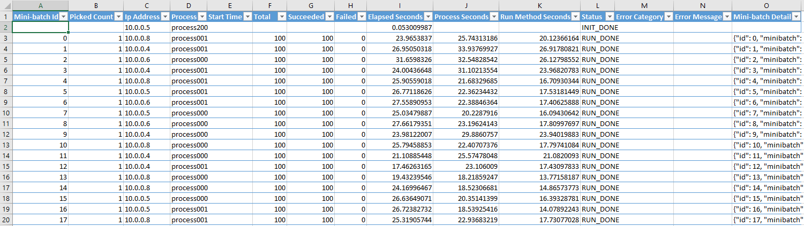

### Columns of the table
Column Name       | Note
---               |---
Mini-batch Id      | The Id of a mini batch.
Picked Count       | The round of processing a mini batch.
Process            | The name of the process. It will be used in log file names.
Process	Start Time | The start time in Utc of processing a mini batch in the term of ParallelRunStep.
Total	           | The number of total items in the mini batch.
Succeeded	       | The number of succeeded items in the mini batch. This is from the returned value of run().
Failed	           | The number of failed items. Failed = Total - Succeeded.
Elapsed Seconds    | The duration of processing a mini batch.
Process Seconds    | The sum of the system and user CPU time of the current process. It does not include time elapsed during sleep. It is process-wide by definition. See [process_time() in Python doc](https://docs.python.org/3/library/time.html#time.process_time). If Process Seconds > Elapsed Seconds, it means more than one core is used. For CPU intensive work, the ratio `Process Seconds / Elapsed Seconds` tells if a machine's capacity is well used. Given the operating system and services running on it also need CPU, the ratio should usually be less than 70%.
Run Method Seconds | The duration of the run() method itself, by excluding the pre-processing and pos-processing.
Status             | The type of the metric.
Error Category     | The classification of the exception if it failed.
Error Message      | The error message of a failed mini batch.
Mini-batch Detail  | The json string of the mini batch.

### Analysis Using PivotTable

You can use Excel PivotTable to arrange and summarize mini batch processing data easily. For example, you can check:
1. The number of processed tasks over minute/hour and status. This is a way to check if there is performance degradation.
1. Mini batch distribution over processes/nodes and status.
1. The distribution of entry script function call status. Such as LOAD_DONE, LOAD_TIMEOUT, RUN_DONE, RUN_TIMEOUT, RUN_EXCEPTION, etc.
1. Retried mini batch, where Picked Count > 1, over time and status.

One common operation is to convert start_time in the UTC time string into Excel Date/Time.
Assume E2 has value "2020-10-24T02:59:04.227237", the formulas can be:
```VBScript
=DATEVALUE(LEFT(E2,10))+TIMEVALUE(MID(E2,12,8)) 'This truncates to second.
```

Below is a pivot table shows the number of processed mini batches over time and node. `StartSecond` is converted from `Start Time` using above formula. In this table you can drill down and up to the granularity you care.

> [!div class="mx-imgBorder"]
> 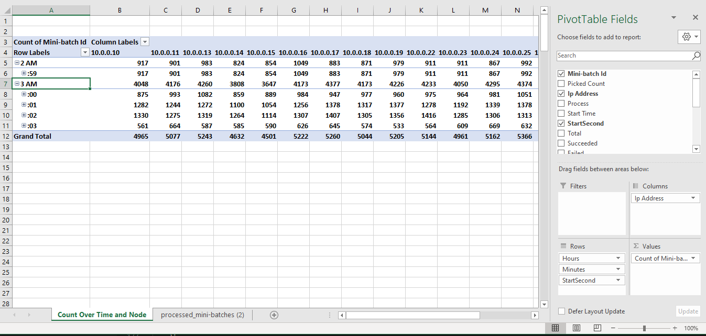

Assume the durations of processing a mini batch among all the mini batches are similar, the count over time and node should be similar.
1. If the count decreases over time, there is a performance degradation. This may come from run() method itself or the piling up of external storage accessing.

    1. `Run Method Seconds` (run() method duration) doesn't increase over time. This shows run() function in your entry script doesn't have performance degradation. Skip to **item d**.
    1. `Run Method Seconds` increases over time. The indicts there is performance degradation in run() function. You need to check your entry script to see if there is anything related. If you're using GPU, check if GPU is always well used over time. There is knowns issue that a GPU cannot be reused in some cases. After GPU became unavailable, the `Process Seconds` will increase significantly and the number of mini batches per time unit will decrease significantly. If you cannot find, you can check section **How to Do Profiling** to profile you code.
    1. `Elapsed Seconds` doesn't increase over time. This should not happen as the job does have performance degradation.
    1. `Elapsed Seconds` increases over time. This is usually from storage. Check **Storage Metrics** to narrow down the cause.
1. If there are a number of mini batches with RUN_TIMEOUT and the number should not be ignored, you should check the expected duration to process a mini batch and increase `--run_invocation_timeout` if needed.

### process_summary.csv
This is a view of processed_mini-batches.csv. It summarizes by process.

### node_summary.csv
This is a view of processed_mini-batches.csv. It summarizes by node.


## Resource usage report
The performance report is located in `logs/sys/perf/`. It consists of resource usage reports in several dimensions. All reports are grouped by node. Under folder of each node, the below files are included:

- `node_resource_usage.csv`: This file provides an overview of resource usage of a node.

> [!div class="mx-imgBorder"]
> 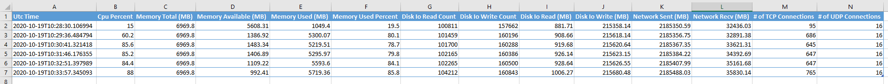


- `node_disk_usage.csv`: This file provides detailed disk usage of a node.

> [!div class="mx-imgBorder"]
> 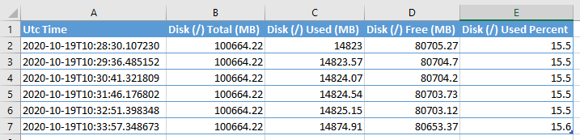


- `processes_resource_usage.csv`: This file provides an overview of resource usage of each worker process in a node.

> [!div class="mx-imgBorder"]
> 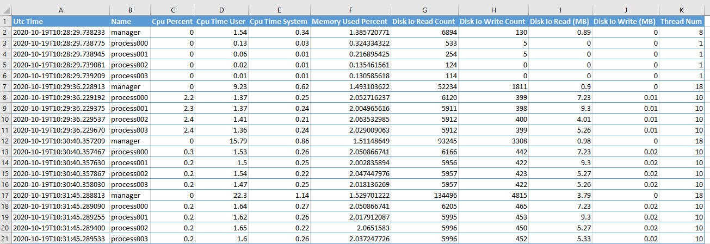


### Node resource usage
> [!div class="mx-imgBorder"]
> 

### Columns of the table
Column Name       | Note
---               |---
Utc Time	      | The UTC time of writing the row.
Cpu Percent | The percentage of CPU usage.
Memory Total (MB) | The total physical memory (exclusive swap). See [Memory in psutil doc](https://psutil.readthedocs.io/en/latest/#memory).
Memory Available (MB) | The memory that can be given instantly to processes without the system going into swap. This is calculated by summing different memory values depending on the platform and it is supposed to be used to monitor actual memory usage in a cross platform fashion.
Memory Used (MB)	| The memory used, calculated differently depending on the platform and designed for informational purposes only. total - free does not necessarily match used.
Memory Used Percent    | The memory used in term of percentage.
Disk Io Read Count | The number of reads. See [Disks in psutil doc](https://psutil.readthedocs.io/en/latest/#disks).
Disk Io Write Count	| The number of writes.
Disk Io Read (MB)	| The number of MB read.
Disk Io Write (MB)	| The number of MB writes.
Network Sent (MB)	| The number of MB sent. See [Network in psutil doc](https://psutil.readthedocs.io/en/latest/#network)
Network Recv (MB)	| The number of MB received.
‘#’ of TCP Connections	| The number of TCP connections.
‘#’ of UDP Connections | The number of UDP connections.


### CPU and Memory
The internal scripts of ParallelRunStep requires minor CPU and memory. In common, users only need to take care of CPU and memory usage of their own scripts.

The monitor dumps CPU and memory usage every minute, grouped by hour. The folder is `logs/sys/perf/<node>/processes_cpu_memory_usage/`

CPU Memory Usage Sorted by CPU Usage Percent Descending
> [!div class="mx-imgBorder"]
> 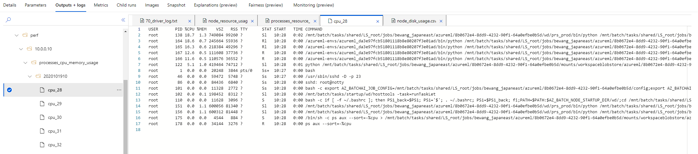


CPU Memory Usage Sorted by Memory Usage Percent Descending
> [!div class="mx-imgBorder"]
> 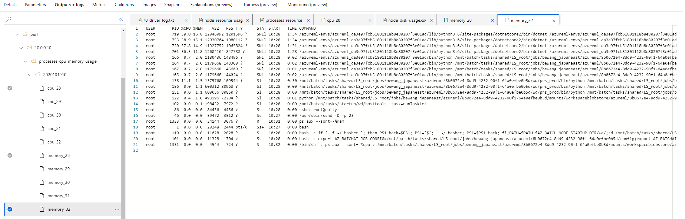

### Network
ParallelRunStep requires a lot of network I/O operation to support dataset processing, mini-batch scheduling and processing. Bandwidth and latency are the primary concerns of network.

### Disk
Logs of ParallelRunStep are stored in temporary location of local disk which cost minor disk usage.
Under specific circumstances where dataset is consumed in "download" mode, users have to ensure computes have enough disk space to handle mini-batch. For example, there is a job where the size of each mini-match is 500 MB and the process_count_per_node is 4. If this job is running on Windows compute, where ParallelRunStep will cache each mini-batch to local disk by default, the minimum disk space should be 2000 MB.

Disk size limit, VM size

Dataset limit link to Dataset doc

### Storage Metrics
1. View all properties of your workspace.
1. Click the storage link on the right pane.
1. Click Metrics or Metrics (classic) on the left.
1. Add the metrics you want to observe.

> [!div class="mx-imgBorder"]
> 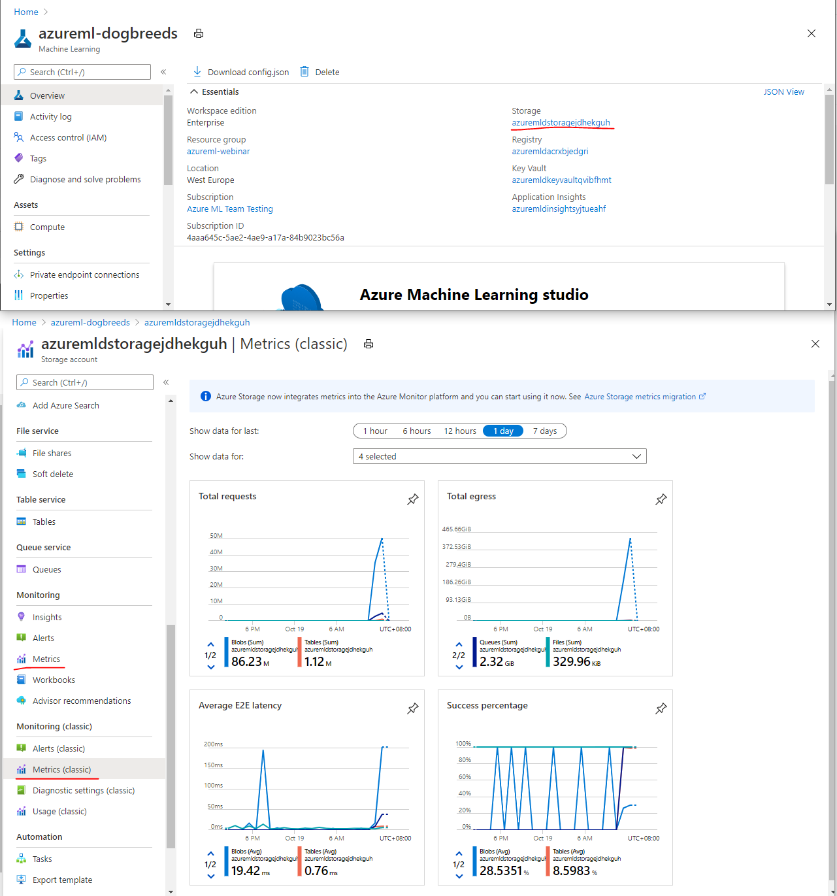

## Mini batch scheduling performance

Generally, scheduling performance in Parallel Run Step is good enough for scaling out smoothly. If your input dataset has more than 1 million records/files,  you may observe some scheduling latencies. Then, you need to go through this section.

To make good use of all nodes, ensure:

> [!div class="mx-imgBorder"]
> 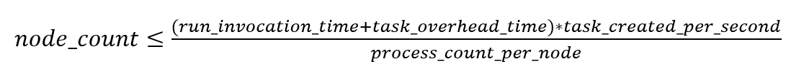

task_created_per_second: by average, it will schedule 400 mini batches per second. This is a constant unless there is any storage issue or connectivity issue.
E.g, 10 seconds per mini batch, a task producer can serve about 4000 agents (processes). If process_count_per_node = 4, node_count can be 1000 to achieve max throughput.

So far, AmlCompute support up to 100 nodes for non-ParallelTask mode.
Task_overhead_time is ~0.05 second/task. This is from it took 2hours to process 1m tasks with 8 processes. Overhead = 7200 seconds * 8 / 1m

> [!div class="mx-imgBorder"]
> 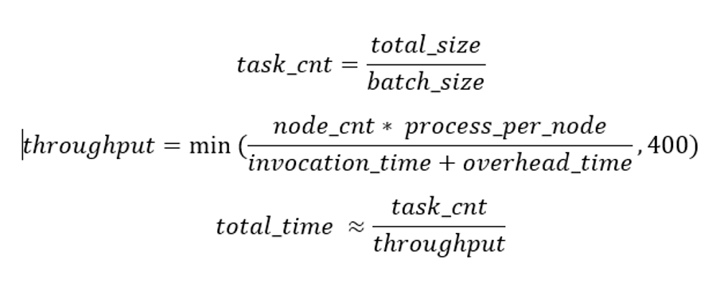

A reasonable mini_batch_size is to keep the mini batch take 10+ seconds
This will keep the overhead below 0.5%.
Excluding the overhead part, the run_invocation_time is linear to the mini_batch_size.

> [!NOTE]
> A small mini_batch_size help us to know the progress in fine grain. So it’s not the large size the better.
> Based on talking to multiple customer, we should clearly mention in our document that user should avoid setting mini_batch_size > 1 and add for loop inside run method. We ourselves do it in file dataset notebook which we should remove.

Having for loop inside run method is not helpful because if other worker is free then they can process that file.

Max mini batch size

1. A queue message can be up to 64 KB in size.
2. The path is long, base name is not. Share the path.
3. Compress before sending. Support ~40k files like the below pattern.

### The duration to create the first task

This matters for if there is a folder with a large number of files, it will take time to load the list and then pick up the first set of files. For example, given a folder with 1m files in blob in the same region as the run, it will take about 5 minutes to pick up the first one. If the folder is in other region than the run, it will take much longer time.

To reduce the waiting time, we suggest to keep a single folder up to 1m files.
If you want to have more files to process, for example, 20m files. You can create 20 folders with each has 1m files. Then pass 20 inputs like:

```python
step = ParallelRunStep(
    ...
    inputs=[input0, input1, input2, ..., input19]
    ...
)
```

In this way, it will pick up files from one folder and then move to next. It won't list a single folder will 20m files.
To reduce the costing of progress tracking, increase mini_batch_size, such as to 100 or 1000. If 1000 is used, there will be total of 200k mini batches.

Check `logs/sys/master_role.*.txt`. Usually, this is in the first `master_role` file if there are more than one. One round of master role failover will create a `master_role` log file.

```html
2020-10-09 01:38:51,269|INFO|356|140501711763200|Start scheduling.
2020-10-09 01:38:51,288|INFO|356|140501711763200|The task provider type is FileDatasetProvider.
2020-10-09 01:38:51,830|INFO|356|140501711763200|Input folders ['/mnt/batch/tasks/shared/LS_root/jobs/[workspace]/azureml/e01a2bf3-8fa7-4231-a904-3eeba3345e97/mounts/stress_data_datastore_small_files/input_1m'], from index 0.
2020-10-09 01:38:51,830|INFO|356|140501711763200|Scheduling tasks for input 0: /mnt/batch/tasks/shared/LS_root/jobs/[workspace]/azureml/e01a2bf3-8fa7-4231-a904-3eeba3345e97/mounts/stress_data_datastore_small_files/input_1m.
[There are five minute between next line and prior line.]
2020-10-09 01:43:13,674|INFO|356|140501711763200|Save checkpoint for folder 0, offset 0, task_id 0, total_items 1, finished=False.
2020-10-09 01:43:16,124|INFO|356|140501711763200|10.0.0.6: setting job stage to FIRST_TASK_SCHEDULED, reason: The first task created at 2020-10-09 01:43:16.124027.
2020-10-09 01:43:16,124|INFO|356|140501711763200|Setting job stage to FIRST_TASK_SCHEDULED.
```

[TBD for tabular dataset]

## How to do profiling with Python profilers
You can set the argument ```profiling_module``` to enable profiling.
The accepted values are:
1. Not specified, default value. Don't do profiling.
2. cProfile
3. profile
The generated profile file will be saved in logs/sys/.

Check [The Python Profilers](https://docs.python.org/3/library/profile.html#the-python-profilers) for more details.

You can download them and inspect with viewers, such as [profile-viewer](https://pypi.org/project/profile-viewer/). Here is a sample:
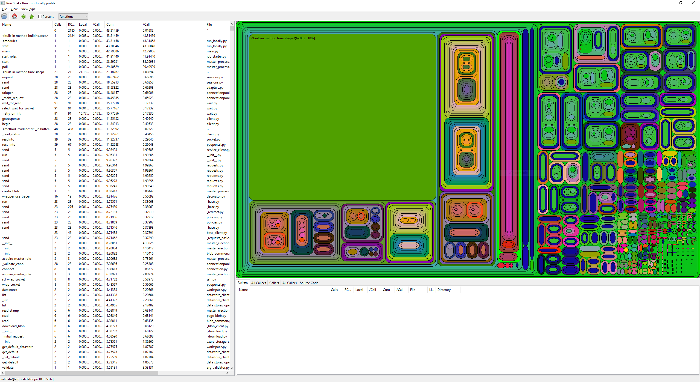


## FAQ on Performance Issues
Performance degradation
Understand ParallelRunStep flow
1. scheduling
1. processing
1. agent manager
1. entry script init(), run(), shutdown()

Limits
100 nodes,
1m folder per folder
1m mini batches
1000 files in one mini batch, 64K limit


ParallelTask
1000 nodes, 65536?

Understand ParallelRunStep
Tune PRS parameters
Tune nodes

> [!div class="mx-imgBorder"]
> 


## append_row

## Beyond mini batch processing
job preparation
job release

Pipeline lifecycle

1. provision nodes. before ParallelTask, a run will start after all required nodes provisioned.
2. build image. This is required for the first time of a run and then it will be cached. **Link to the cache doc**
3. job preparation.
4. start PRS launcher on the master node and then give control to PRS.
5. a master role start task scheduling. scheduling logs to `logs/sys/master_role....`.
6. while scheduling tasks, an agent manager on each node start worker process up to the number specified by `process_count_per_node`.
7. each worker process calls init(), then picks mini batch up and call run() by passing the mini batch and turn control to user code. meanwhile, the agent manager monitors the progress of a worker process.
8. the master role collect the progress.
9. the master role concatenate the temp files.