# Understand automated machine learning results
[!INCLUDE [applies-to-skus](../../includes/aml-applies-to-basic-enterprise-sku.md)]

In this article, you learn how to view and understand the charts and metrics for each of your automated machine learning runs. 

Learn more about:
+ [Metrics, charts, and curves for classification models](#classification)
+ [Metrics, charts, and graphs for regression models](#regression)
+ [Model interpretability and feature importance](#explain-model)

## Prerequisites

* An Azure subscription. If you don't have an Azure subscription, create a free account before you begin. Try the [free or paid version of Azure Machine Learning](https://aka.ms/AMLFree) today.

* Create an experiment for your automated machine learning run, either with the SDK, or in Azure Machine Learning studio.

    * Use the SDK to build a [classification model](how-to-auto-train-remote.md) or [regression model](tutorial-auto-train-models.md)
    * Use [Azure Machine Learning studio](how-to-use-automated-ml-for-ml-models.md) to create a classification or regression model by uploading the appropriate data.

## View the run

After running an automated machine learning experiment, a history of the runs can be found in your machine learning workspace. 

1. Go to your workspace.

1. In the left panel of the workspace, select **Experiments**.

   

1. In the list of experiments, select the one you want to explore.

   

1. In the bottom table, select the **Run**.

   )

1. In the Models, select the **Algorithm name** for the model that you want to explore further.

   [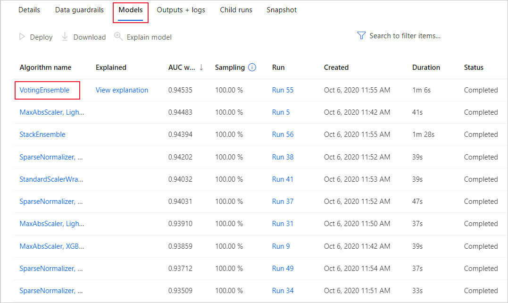](./media/how-to-understand-automated-ml/azure-machine-learning-auto-ml-experiment-model-expanded.png)

You also see these same results during a run when you use the `RunDetails`[Jupyter widget](https://docs.microsoft.com/python/api/azureml-widgets/azureml.widgets?view=azure-ml-py).

##  Classification results

Thee following metrics and charts are available for every classification model that you build using the automated machine learning capabilities of Azure Machine Learning

+ [Metrics](#classification-metrics)
+ [Confusion matrix](#confusion-matrix)
+ [Precision-Recall chart](#precision-recall-chart)
+ [Receiver operating characteristics (or ROC)](#roc)
+ [Lift curve](#lift-curve)
+ [Gains curve](#gains-curve)
+ [Calibration plot](#calibration-plot)

### Classification metrics

The following metrics are saved in each run iteration for a classification task.

Metric|Description|Calculation|Extra Parameters
--|--|--|--
AUC_Macro| AUC is the Area under the Receiver Operating Characteristic Curve. Macro is the arithmetic mean of the AUC for each class.  | [Calculation](https://scikit-learn.org/stable/modules/generated/sklearn.metrics.roc_auc_score.html) | average="macro"|
AUC_Micro| AUC is the Area under the Receiver Operating Characteristic Curve. Micro is computed globally by combining the true positives and false positives from each class.| [Calculation](https://scikit-learn.org/stable/modules/generated/sklearn.metrics.roc_auc_score.html) | average="micro"|
AUC_Weighted  | AUC is the Area under the Receiver Operating Characteristic Curve. Weighted is the arithmetic mean of the score for each class, weighted by the number of true instances in each class.| [Calculation](https://scikit-learn.org/stable/modules/generated/sklearn.metrics.roc_auc_score.html)|average="weighted"
accuracy|Accuracy is the percent of predicted labels that exactly match the true labels. |[Calculation](https://scikit-learn.org/stable/modules/generated/sklearn.metrics.accuracy_score.html) |None|
average_precision_score_macro|Average precision summarizes a precision-recall curve as the weighted mean of precisions achieved at each threshold, with the increase in recall from the previous threshold used as the weight. Macro is the arithmetic mean of the average precision score of each class.|[Calculation](https://scikit-learn.org/stable/modules/generated/sklearn.metrics.average_precision_score.html)|average="macro"|
average_precision_score_micro|Average precision summarizes a precision-recall curve as the weighted mean of precisions achieved at each threshold, with the increase in recall from the previous threshold used as the weight. Micro is computed globally by combining the true positives and false positives at each cutoff.|[Calculation](https://scikit-learn.org/stable/modules/generated/sklearn.metrics.average_precision_score.html)|average="micro"|
average_precision_score_weighted|Average precision summarizes a precision-recall curve as the weighted mean of precisions achieved at each threshold, with the increase in recall from the previous threshold used as the weight. Weighted is the arithmetic mean of the average precision score for each class, weighted by the number of true instances in each class.|[Calculation](https://scikit-learn.org/stable/modules/generated/sklearn.metrics.average_precision_score.html)|average="weighted"|
balanced_accuracy|Balanced accuracy is the arithmetic mean of recall for each class.|[Calculation](https://scikit-learn.org/stable/modules/generated/sklearn.metrics.recall_score.html)|average="macro"|
f1_score_macro|F1 score is the harmonic mean of precision and recall. Macro is the arithmetic mean of F1 score for each class.|[Calculation](https://scikit-learn.org/stable/modules/generated/sklearn.metrics.f1_score.html)|average="macro"|
f1_score_micro|F1 score is the harmonic mean of precision and recall. Micro is computed globally by counting the total true positives, false negatives, and false positives.|[Calculation](https://scikit-learn.org/stable/modules/generated/sklearn.metrics.f1_score.html)|average="micro"|
f1_score_weighted|F1 score is the harmonic mean of precision and recall. Weighted mean by class frequency of F1 score for each class|[Calculation](https://scikit-learn.org/stable/modules/generated/sklearn.metrics.f1_score.html)|average="weighted"|
log_loss|This is the loss function used in (multinomial) logistic regression and extensions of it such as neural networks, defined as the negative log-likelihood of the true labels given a probabilistic classifier's predictions. For a single sample with true label yt in {0,1} and estimated probability yp that yt = 1, the log loss is -log P(yt&#124;yp) = -(yt log(yp) + (1 - yt) log(1 - yp)).|[Calculation](https://scikit-learn.org/stable/modules/generated/sklearn.metrics.log_loss.html)|None|
norm_macro_recall|Normalized Macro Recall is Macro Recall normalized so that random performance has a score of 0 and perfect performance has a score of 1. This is achieved by norm_macro_recall := (recall_score_macro - R)/(1 - R), where R is the expected value of recall_score_macro for random predictions (i.e., R=0.5 for binary classification and R=(1/C) for C-class classification problems).|[Calculation](https://scikit-learn.org/stable/modules/generated/sklearn.metrics.recall_score.html)|average = "macro" |
precision_score_macro|Precision is the percent of positively predicted elements that are correctly labeled. Macro is the arithmetic mean of precision for each class.|[Calculation](https://scikit-learn.org/stable/modules/generated/sklearn.metrics.precision_score.html)|average="macro"|
precision_score_micro|Precision is the percent of positively predicted elements that are correctly labeled. Micro is computed globally by counting the total true positives and false positives.|[Calculation](https://scikit-learn.org/stable/modules/generated/sklearn.metrics.precision_score.html)|average="micro"|
precision_score_weighted|Precision is the percent of positively predicted elements that are correctly labeled. Weighted is the arithmetic mean of precision for each class, weighted by number of true instances in each class.|[Calculation](https://scikit-learn.org/stable/modules/generated/sklearn.metrics.precision_score.html)|average="weighted"|
recall_score_macro|Recall is the percent of correctly labeled elements of a certain class. Macro is the arithmetic mean of recall for each class.|[Calculation](https://scikit-learn.org/stable/modules/generated/sklearn.metrics.recall_score.html)|average="macro"|
recall_score_micro|Recall is the percent of correctly labeled elements of a certain class. Micro is computed globally by counting the total true positives, false negatives and false positives|[Calculation](https://scikit-learn.org/stable/modules/generated/sklearn.metrics.recall_score.html)|average="micro"|
recall_score_weighted|Recall is the percent of correctly labeled elements of a certain class. Weighted is the arithmetic mean of recall for each class, weighted by number of true instances in each class.|[Calculation](https://scikit-learn.org/stable/modules/generated/sklearn.metrics.recall_score.html)|average="weighted"|
weighted_accuracy|Weighted accuracy is accuracy where the weight given to each example is equal to the proportion of true instances in that example's true class.|[Calculation](https://scikit-learn.org/stable/modules/generated/sklearn.metrics.accuracy_score.html)|sample_weight is a vector equal to the proportion of that class for each element in the target|

### Confusion matrix

#### What is a confusion matrix?
A confusion matrix is used to describe the performance of a classification model. Each row displays the instances of the true, or actual class in your dataset, and each column represents the instances of the class that was predicted by the model. 

#### What does automated ML do with the confusion matrix?
For classification problems, Azure Machine Learning automatically provides a confusion matrix for each model that is built. For each confusion matrix, automated ML will show the frequency of each predicted label (column) compared against the true label (row). The darker the color, the higher the count in that particular part of the matrix. 

#### What does a good model look like?
We are comparing the actual value of the dataset against the predicted values that the model gave. Because of this, machine learning models have higher accuracy if the model has most of its values along the diagonal, meaning the model predicted the correct value. If a model has class imbalance, the confusion matrix will help to detect a biased model.

##### Example 1: A classification model with poor accuracy

##### Example 2: A classification model with high accuracy 
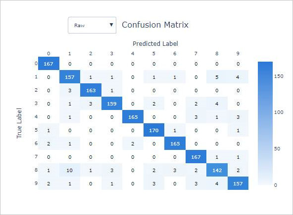

##### Example 3: A classification model with high accuracy and high bias in model predictions
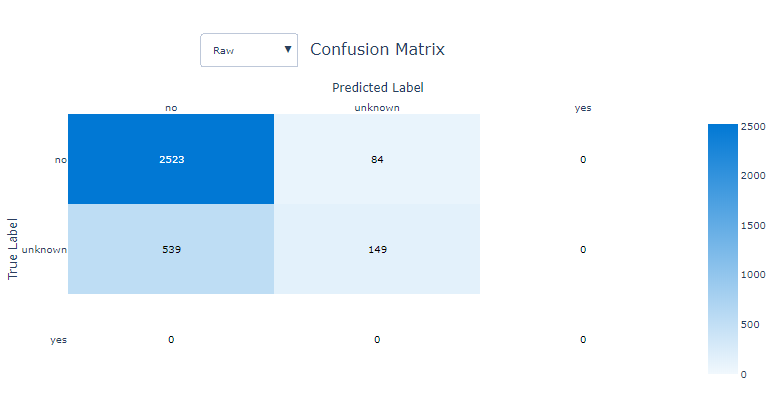

### Precision-recall chart
#### What is a precision-recall chart?
The precision-recall curve shows the relationship between precision and recall from a model. The term precision represents that ability for a model to label all instances correctly. Recall represents the ability for a classifier to find all instances of a particular label.

#### What does automated ML do with the precision-recall chart?

With this chart, you can compare the precision-recall curves for each model to determine which model has an acceptable relationship between precision and recall for your particular business problem. This chart shows Macro Average Precision-Recall, Micro Average Precision-Recall, and the precision-recall associated with all classes for a model. 

Macro-average will compute the metric independently of each class and then take the average, treating all classes equally. However, micro-average will aggregate the contributions of all the classes to compute the average. Micro-average is preferable if there is class imbalance present in the dataset.

#### What does a good model look like?
Depending on the goal of the business problem, the ideal precision-recall curve could differ. Some examples are given below

##### Example 1: A classification model with low precision and low recall

##### Example 2: A classification model with ~100% precision and ~100% recall 
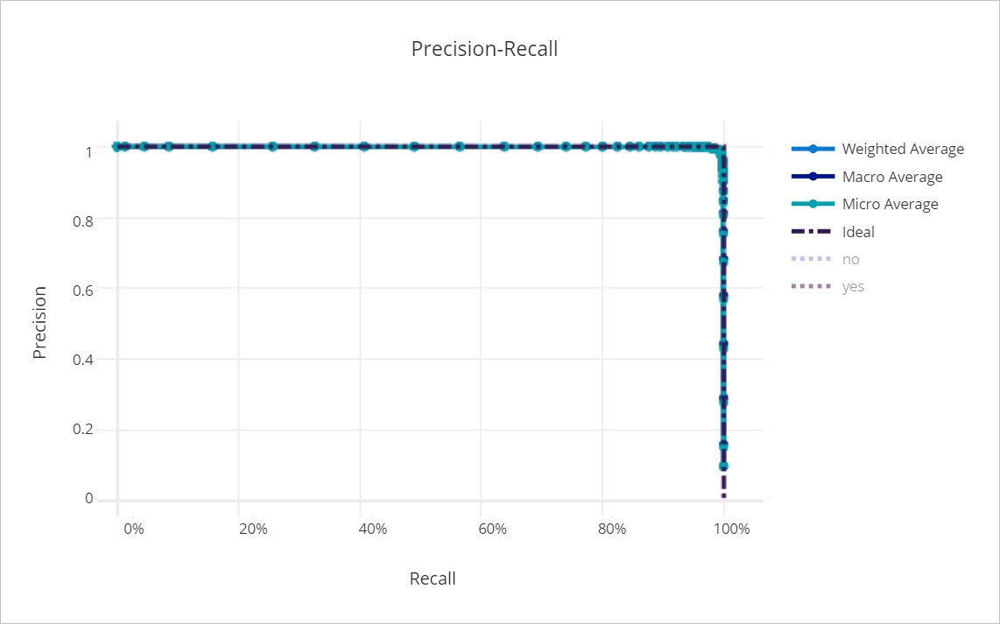

### ROC chart

#### What is a ROC chart?
Receiver operating characteristic (or ROC) is a plot of the correctly classified labels vs. the incorrectly classified labels for a particular model. The ROC curve can be less informative when training models on datasets with high bias, as it will not show the false positive labels.

#### What does automated ML do with the ROC chart?
Automated ML generates Macro Average Precision-Recall, Micro Average Precision-Recall, and the precision-recall associated with all classes for a model. 

Macro-average will compute the metric independently of each class and then take the average, treating all classes equally. However, micro-average will aggregate the contributions of all the classes to compute the average. Micro-average is preferable if there is class imbalance present in the dataset.

#### What does a good model look like?
Ideally, the model will have closer to 100% true positive rate and closer to 0% false positive rate. 

##### Example 1: A classification model with low true labels and high false labels
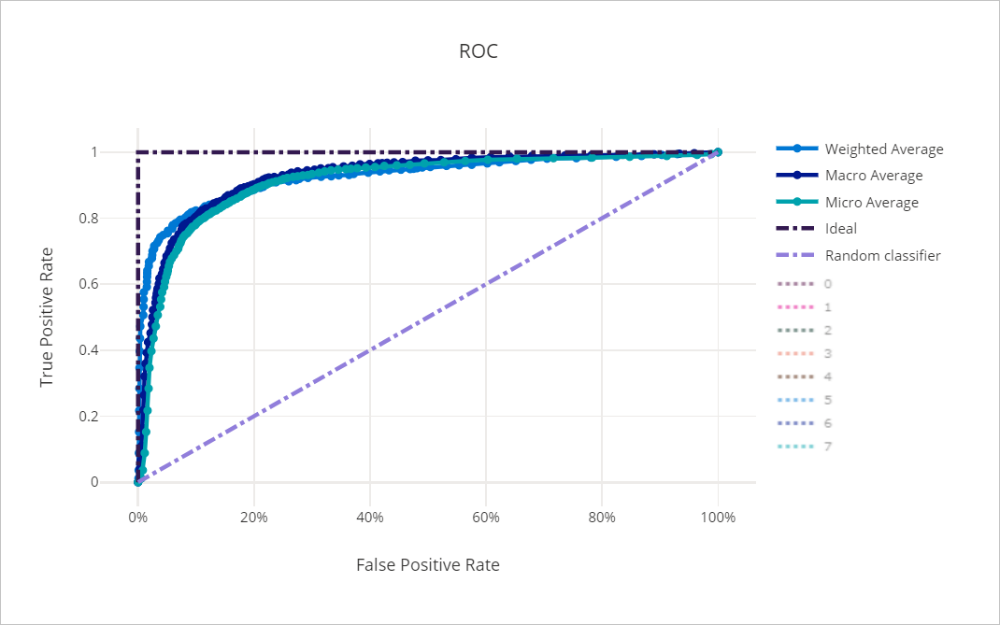

##### Example 2: A classification model with high true labels and low false labels
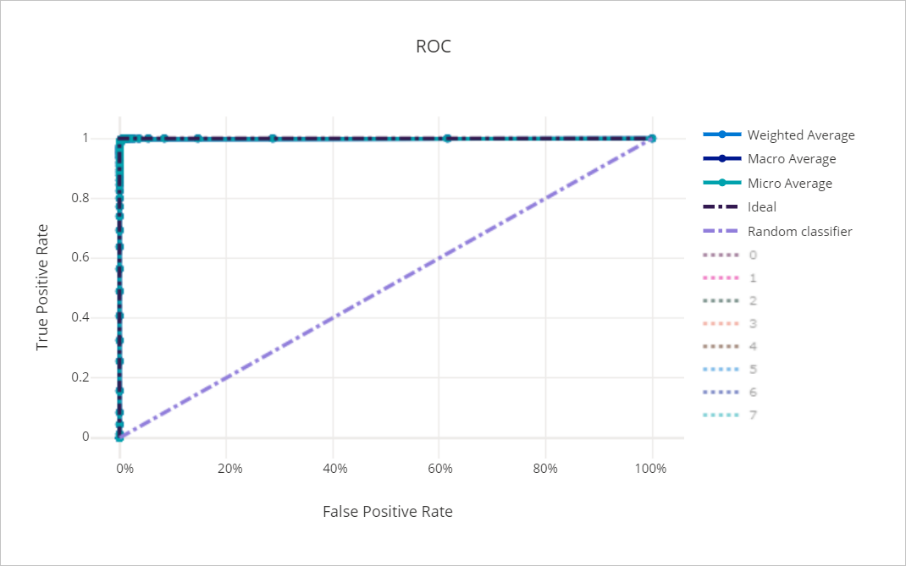

### Lift chart
#### What is a lift chart?
Lift charts are used to evaluate the performance of a classification model. It shows how much better you can expect to do with the generated model compared to without a model in terms of accuracy.
#### What does automated ML do with the lift chart?
You can compare the lift of the model built automatically with Azure Machine Learning to the baseline in order to view the value gain of that particular model.
#### What does a good model look like?

##### Example 1: A classification model that does worse than a random selection model

##### Example 2: A classification model that performs better than a random selection model
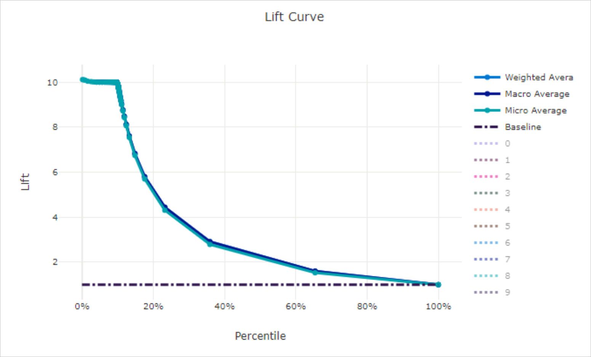

### Gains chart
#### What is a gains chart?

A gains chart evaluates the performance of a classification model by each portion of the data. It shows for each percentile of the data set, how much better you can expect to perform compared against a random selection model.

#### What does automated ML do with the gains chart?
Use the cumulative gains chart to help you choose the classification cutoff using a percentage that corresponds to a desired gain from the model. This information provides another way of looking at the results in the accompanying lift chart.

#### What does a good model look like?
##### Example 1: A classification model with minimal gain
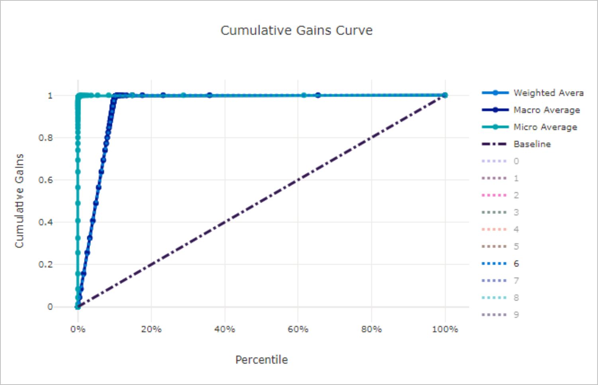

##### Example 2: A classification model with significant gain
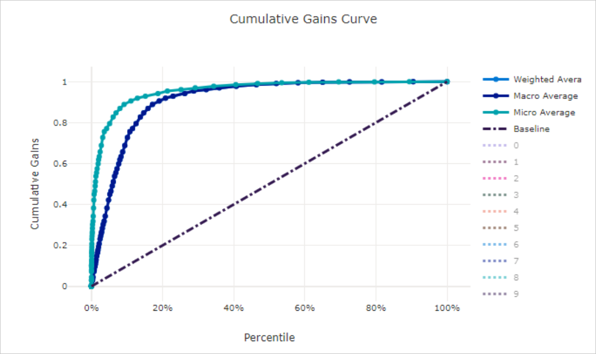

### Calibration chart

#### What is a calibration chart?
A calibration plot is used to display the confidence of a predictive model. It does this by showing the relationship between the predicted probability and the actual probability, where "probability" represents the likelihood that a particular instance belongs under some label.
#### What does automated ML do with the calibration chart?
For all classification problems, you can review the calibration line for micro-average, macro-average, and each class in a given predictive model.

Macro-average will compute the metric independently of each class and then take the average, treating all classes equally. However, micro-average will aggregate the contributions of all the classes to compute the average. 
#### What does a good model look like?
 A well-calibrated model  aligns with the y=x line, where it is reasonably confident in its predictions. An over-confident model  aligns with the y=0 line, where the predicted probability is present but there is no actual probability. 

##### Example 1: A well-calibrated model
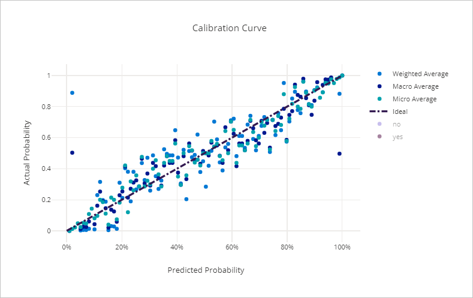

##### Example 2: An over-confident model
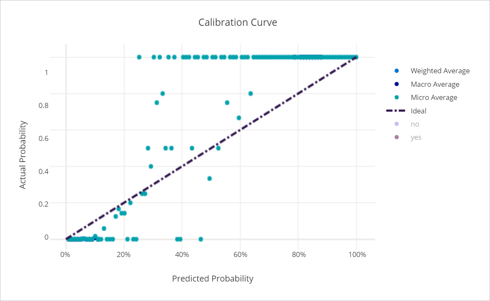

##  Regression results

Thee following metrics and charts are available for every regression model that you build using the automated machine learning capabilities of Azure Machine Learning

+ [Metrics](#reg-metrics)
+ [Predicted vs. True](#pvt)
+ [Histogram of residuals](#histo)

###  Regression metrics

The following metrics are saved in each run iteration for a regression or forecasting task.

|Metric|Description|Calculation|Extra Parameters
--|--|--|--|
explained_variance|Explained variance is  the proportion to which a mathematical model accounts for the variation of a given data set. It is the percent decrease in variance of the original data to the variance of the errors. When the mean of the errors is 0, it is equal to explained variance.|[Calculation](https://scikit-learn.org/stable/modules/generated/sklearn.metrics.explained_variance_score.html)|None|
r2_score|R2 is the coefficient of determination or the percent reduction in squared errors compared to a baseline model that outputs the mean. |[Calculation](https://scikit-learn.org/0.16/modules/generated/sklearn.metrics.r2_score.html)|None|
spearman_correlation|Spearman correlation is a nonparametric measure of the monotonicity of the relationship between two datasets. Unlike the Pearson correlation, the Spearman correlation does not assume that both datasets are normally distributed. Like other correlation coefficients, this one varies between -1 and +1 with 0 implying no correlation. Correlations of -1 or +1 imply an exact monotonic relationship. Positive correlations imply that as x increases, so does y. Negative correlations imply that as x increases, y decreases.|[Calculation](https://docs.scipy.org/doc/scipy-0.16.1/reference/generated/scipy.stats.spearmanr.html)|None|
mean_absolute_error|Mean absolute error is the expected value of absolute value of difference between the target and the prediction|[Calculation](https://scikit-learn.org/stable/modules/generated/sklearn.metrics.mean_absolute_error.html)|None|
normalized_mean_absolute_error|Normalized mean absolute error is mean Absolute Error divided by the range of the data|[Calculation](https://scikit-learn.org/stable/modules/generated/sklearn.metrics.mean_absolute_error.html)|Divide by range of the data|
median_absolute_error|Median absolute error is the median of all absolute differences between the target and the prediction. This loss is robust to outliers.|[Calculation](https://scikit-learn.org/stable/modules/generated/sklearn.metrics.median_absolute_error.html)|None|
normalized_median_absolute_error|Normalized median absolute error is median absolute error divided by the range of the data|[Calculation](https://scikit-learn.org/stable/modules/generated/sklearn.metrics.median_absolute_error.html)|Divide by range of the data|
root_mean_squared_error|Root mean squared error is the square root of the expected squared difference between the target and the prediction|[Calculation](https://scikit-learn.org/stable/modules/generated/sklearn.metrics.mean_squared_error.html)|None|
normalized_root_mean_squared_error|Normalized root mean squared error is root mean squared error divided by the range of the data|[Calculation](https://scikit-learn.org/stable/modules/generated/sklearn.metrics.mean_squared_error.html)|Divide by range of the data|
root_mean_squared_log_error|Root mean squared log error is the square root of the expected squared logarithmic error|[Calculation](https://scikit-learn.org/stable/modules/generated/sklearn.metrics.mean_squared_log_error.html)|None|
normalized_root_mean_squared_log_error|Normalized Root mean squared log error is root mean squared log error divided by the range of the data|[Calculation](https://scikit-learn.org/stable/modules/generated/sklearn.metrics.mean_squared_log_error.html)|Divide by range of the data|

###  Predicted vs. True chart
#### What is a Predicted vs. True chart?
Predicted vs. True shows the relationship between a predicted value and its correlating true value for a regression problem. This graph can be used to measure performance of a model as the closer to the y=x line the predicted values are, the better the accuracy of a predictive model.

#### What does automated ML do with the Predicted vs. True chart?
After each run, you can see a predicted vs. true graph for each regression model. To protect data privacy, values are binned together and the size of each bin is shown as a bar graph on the bottom portion of the chart area. You can compare the predictive model, with the lighter shade area showing error margins, against the ideal value of where the model should be.

#### What does a good model look like?
##### Example 1: A classification model with low accuracy
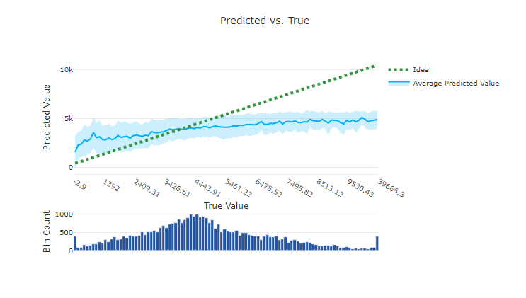

##### Example 2: A regression model with high accuracy 
[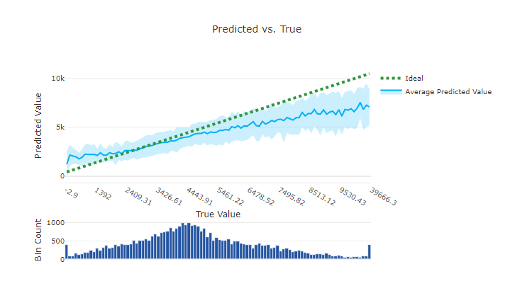](./media/how-to-understand-automated-ml/azure-machine-learning-auto-ml-regression2-expanded.png)

###  Histogram of residuals chart
#### What is a residuals chart?
A residual represents an observed y – the predicted y. To show a margin of error with low bias, the histogram of residuals should be shaped as a bell curve, centered around 0. 
#### What does automated ML do with the residuals chart?
Automated ML automatically provides a residuals chart to show the distribution of errors in the predictions.
#### What does a good model look like?
A good model will typically have a bell curve or errors around zero.

##### Example 1: A regression model with bias in its errors
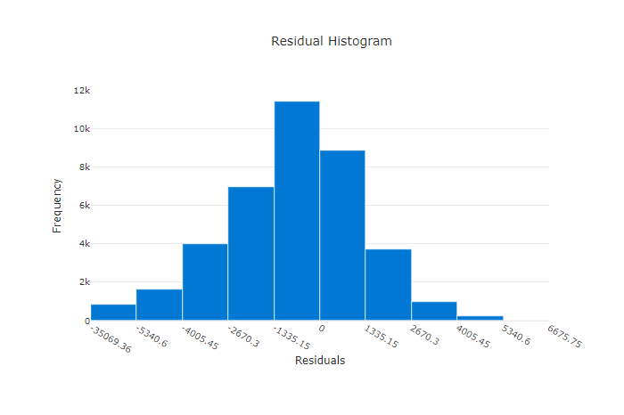

##### Example 2: A regression model with more even distribution of errors
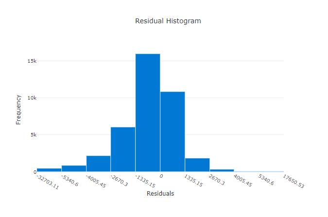

##  Model interpretability and feature importance
Automated ML provides a machine learning interpretability dashboard for your runs.
For more information on enabling interpretability features, see the [how-to](how-to-machine-learning-interpretability-automl.md) on enabling interpretability in automated ML experiments.

## Next steps

+ Learn more about [automated ml](concept-automated-ml.md) in Azure Machine Learning.
+ Try the [Automated Machine Learning Model Explanation](https://github.com/Azure/MachineLearningNotebooks/tree/master/how-to-use-azureml/explain-model) sample notebooks.
