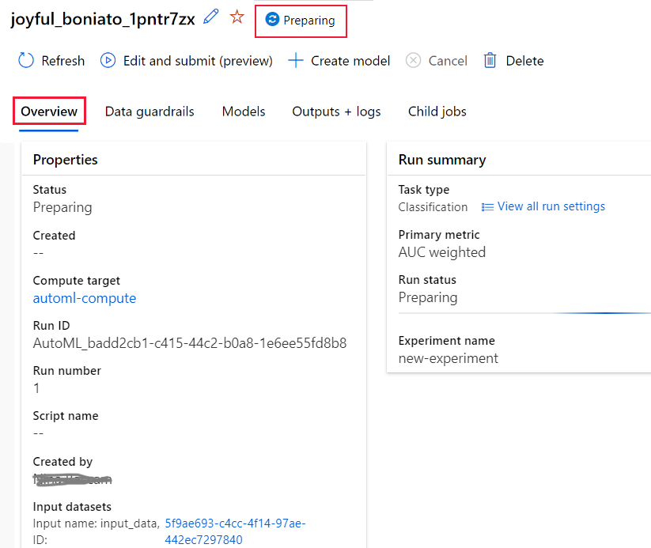

# Create, review, and deploy automated machine learning models with Azure Machine Learning
[!INCLUDE [applies-to-skus](../../includes/aml-applies-to-enterprise-sku.md)]

In this article, you learn how to create, explore, and deploy automated machine learning models without a single line of code in Azure Machine Learning's studio interface. Automated machine learning is a process in which the best machine learning algorithm to use for your specific data is selected for you. This process enables you to generate machine learning models quickly. [Learn more about automated machine learning](concept-automated-ml.md).
 
For an end to end example, try the [tutorial for creating a classification model with Azure Machine Learning's automated ML interface](tutorial-first-experiment-automated-ml.md). 

For a Python code-based experience, [configure your automated machine learning experiments](how-to-configure-auto-train.md) with the Azure Machine Learning SDK.

## Prerequisites

* An Azure subscription. If you don't have an Azure subscription, create a free account before you begin. Try the [free or paid version of Azure Machine Learning](https://aka.ms/AMLFree) today.

* An Azure Machine Learning workspace with a type of **Enterprise edition**. See [Create an Azure Machine Learning workspace](how-to-manage-workspace.md).  To upgrade an existing workspace to Enterprise edition, see [Upgrade to Enterprise edition](how-to-manage-workspace.md#upgrade).

## Get started

1. Sign in to Azure Machine Learning at https://ml.azure.com. 

1. Select your subscription and workspace. 

1. Navigate to the left pane. Select **Automated ML** under the **Author** section.

[](media/how-to-use-automated-ml-for-ml-models/nav-pane-expanded.png)

 If this is your first time doing any experiments, you'll see an empty list and links to documentation. 

Otherwise, you'll see a list of your recent automated machine learning experiments, including those created with the SDK. 

## Create and run experiment

1. Select **+ New automated ML run** and populate the form.

1. Select a dataset from your storage container, or create a new dataset. Datasets can be created from local files, web urls, datastores, or Azure open datasets. 

    >[!Important]
    > Requirements for training data:
    >* Data must be in tabular form.
    >* The value you want to predict (target column) must be present in the data.

    1. To create a new dataset from a file on your local computer, select **Browse** and then select the file. 

    1. Give your dataset a unique name and provide an optional description. 

    1. Select **Next** to open the **Datastore and file selection form**. On this form you select where to upload your dataset; the default storage container that's automatically created with your workspace, or choose a storage container that you want to use for the experiment. 

    1. Review the **Settings and preview** form for accuracy. The form is intelligently populated based on the file type. 

        Field| Description
        ----|----
        File format| Defines the layout and type of data stored in a file.
        Delimiter| One or more characters for specifying the boundary between separate, independent regions in plain text or other data streams.
        Encoding| Identifies what bit to character schema table to use to read your dataset.
        Column headers| Indicates how the headers of the dataset, if any, will be treated.
        Skip rows | Indicates how many, if any, rows are skipped in the dataset.
    
        Select **Next**.

    1. The **Schema** form is intelligently populated based on the selections in the **Settings and preview** form. Here configure the data type for each column, review the column names, and select which columns to **Not include** for your experiment. 
            
        Select **Next.**

    1. The **Confirm details** form is a summary of the information previously populated in the **Basic info** and **Settings and preview** forms. You also have the option to create a data profile for your dataset using a profiling enabled compute. Learn more about [data profiling](#profile).

        Select **Next**.
1. Select your newly created dataset once it appears. You are also able to view a preview of the dataset and sample statistics. 

1. On the **Configure run** form, enter a unique experiment name.

1. Select a target column; this is the column that you would like to do predictions on.

1. Select a compute for the data profiling and training job. A list of your existing computes is available in the dropdown. To create a new compute, follow the instructions in step 7.

1. Select **Create a new compute** to configure your compute context for this experiment.

    Field|Description
    ---|---
    Compute name| Enter a unique name that identifies your compute context.
    Virtual machine size| Select the virtual machine size for your compute.
    Min / Max nodes (in Advanced Settings)| To profile data, you must specify 1 or more nodes. Enter the maximum number of nodes for your compute. The default is 6 nodes for an AML Compute.
    
    Select **Create**. Creation of a new compute can take a few minutes.

    >[!NOTE]
    > Your compute name will indicate if the compute you select/create is *profiling enabled*. (See the section [data profiling](#profile) for more details).

    Select **Next**.

1. On the **Task type and settings** form, select the task type: classification, regression, or forecasting. See [how to define task types](how-to-define-task-type.md) for more information.

    1. For classification, you can also enable deep learning which is used for text featurizations.

    1. For forecasting:
        1. Select time column: This column contains the time data to be used.

        1. Select forecast horizon: Indicate how many time units (minutes/hours/days/weeks/months/years) will the model be able to predict to the future. The further the model is required to predict into the future, the less accurate it will become. [Learn more about forecasting and forecast horizon](how-to-auto-train-forecast.md).

1. (Optional) View addition configuration settings: additional settings you can use to better control the training job. Otherwise, defaults are applied based on experiment selection and data. 

    Additional configurations|Description
    ------|------
    Primary metric| Main metric used for scoring your model. [Learn more about model metrics](how-to-configure-auto-train.md#explore-model-metrics).
    Automatic featurization| Select to enable or disable the preprocessing done by automated machine learning. Preprocessing includes automatic data cleansing, preparing, and transformation to generate synthetic features. Not supported for the time series forecasting task type. [Learn more about preprocessing](#featurization). 
    Explain best model | Select to enable or disable to show explainability of the recommended best model
    Blocked algorithm| Select algorithms you want to exclude from the training job.
    Exit criterion| When any of these criteria are met, the training job is stopped. <br> *Training job time (hours)*: How long to allow the training job to run. <br> *Metric score threshold*:  Minimum metric score for all pipelines. This ensures that if you have a defined target metric you want to reach, you do not spend more time on the training job than necessary.
    Validation| Select one of the cross validation options to use in the training job. [Learn more about cross validation](how-to-configure-auto-train.md).
    Concurrency| *Max concurrent iterations*: Maximum number of pipelines (iterations) to test in the training job. The job will not run more than the specified number of iterations.

1. (Optional) View featurization settings: if you choose to enable **Automatic featurization** in the **Additional configuration settings** form, this form is where you specify which columns to perform those featurizations on, and select which statistical value to use for missing value imputations.

<a name="profile"></a>

## Data profiling & summary stats

You can get a vast variety of summary statistics across your data set to verify whether your data set is ML-ready. For non-numeric columns, they include only basic statistics like min, max, and error count. For numeric columns, you can also review their statistical moments and estimated quantiles. Specifically, our data profile includes:

>[!NOTE]
> Blank entries appear for features with irrelevant types.

Statistic|Description
------|------
Feature| Name of the column that is being summarized.
Profile| In-line visualization based on the type inferred. For example, strings, booleans, and dates will have value counts, while decimals (numerics) have approximated histograms. This allows you to gain a quick understanding of the distribution of the data.
Type distribution| In-line value count of types within a column. Nulls are their own type, so this visualization is useful for detecting odd or missing values.
Type|Inferred type of the column. Possible values include: strings, booleans, dates, and decimals.
Min| Minimum value of the column. Blank entries appear for features whose type does not have an inherent ordering (e.g. booleans).
Max| Maximum value of the column. 
Count| Total number of missing and non-missing entries in the column.
Not missing count| Number of entries in the column that are not missing. Empty strings and errors are treated as values, so they will not contribute to the "not missing count."
Quantiles| Approximated values at each quantile to provide a sense of the distribution of the data.
Mean| Arithmetic mean or average of the column.
Standard deviation| Measure of the amount of dispersion or variation of this column's data.
Variance| Measure of how far spread out this column's data is from its average value. 
Skewness| Measure of how different this column's data is from a normal distribution.
Kurtosis| Measure of how heavily tailed this column's data is compared to a normal distribution.


<a name="featurization"></a>

## Advanced featurization options

Automated machine learning offers preprocessing and data guardrails automatically, to help you identify and manage potential issues with your data. 

### Preprocessing

|Preprocessing&nbsp;steps| Description |
| ------------- | ------------- |
|Drop high cardinality or no variance features|Drop these from training and validation sets, including features with all values missing, same value across all rows or with extremely high cardinality (for example, hashes, IDs, or GUIDs).|
|Impute missing values|For numerical features, impute with average of values in the column.<br/><br/>For categorical features, impute with most frequent value.|
|Generate additional features|For DateTime features: Year, Month, Day, Day of week, Day of year, Quarter, Week of the year, Hour, Minute, Second.<br/><br/>For Text features: Term frequency based on unigrams, bi-grams, and tri-character-grams.|
|Transform and encode |Numeric features with few unique values are transformed into categorical features.<br/><br/>One-hot encoding is performed for low cardinality categorical; for high cardinality, one-hot-hash encoding.|
|Word embeddings|Text featurizer that converts vectors of text tokens into sentence vectors using a pre-trained model. Each word's embedding vector in a document is aggregated together to produce a document feature vector.|
|Target encodings|For categorical features, maps each category with averaged target value for regression problems, and to the class probability for each class for classification problems. Frequency-based weighting and k-fold cross validation is applied to reduce over fitting of the mapping and noise caused by sparse data categories.|
|Text target encoding|For text input, a stacked linear model with bag-of-words is used to generate the probability of each class.|
|Weight of Evidence (WoE)|Calculates WoE as a measure of correlation of categorical columns to the target column. It is calculated as the log of the ratio of in-class vs out-of-class probabilities. This step outputs one numerical feature column per class and removes the need to explicitly impute missing values and outlier treatment.|
|Cluster Distance|Trains a k-means clustering model on all numerical columns.  Outputs k new features, one new numerical feature per cluster, containing the distance of each sample to the centroid of each cluster.|

### Data guardrails

Data guardrails are applied when automatic featurization is enabled or validation is set to auto. Data guardrails help you identify potential issues with your data (e.g., missing values, class imbalance) and help take corrective actions for improved results. There are many best practices that are available and can be applied to achieve reliable results. Users can review data guardrails in the studio within the **Data guardrails** tab of an Automated ML run or by setting ```show_output=True``` when submitting an experiment using the Python SDK. The following table describes the data guardrails currently supported, and the associated statuses that users may come across when submitting their experiment.

Guardrail|Status|Condition&nbsp;for&nbsp;trigger
---|---|---
Missing feature values imputation |**Passed** <br><br><br> **Done**| No missing feature values were detected in your training data. Learn more about [missing value imputation.](https://docs.microsoft.com/azure/machine-learning/how-to-use-automated-ml-for-ml-models#advanced-featurization-options) <br><br> Missing feature values were detected in your training data and imputed.
High cardinality feature handling |**Passed** <br><br><br> **Done**| Your inputs were analyzed, and no high cardinality features were detected. Learn more about [high cardinality feature detection.](https://docs.microsoft.com/azure/machine-learning/how-to-use-automated-ml-for-ml-models#advanced-featurization-options) <br><br> High cardinality features were detected in your inputs and were handled.
Validation split handling |**Done**| *The validation configuration was set to 'auto' and the training data contained **less** than 20,000 rows.* <br> Each iteration of the trained model was validated through cross-validation. Learn more about [validation data.](https://docs.microsoft.com/azure/machine-learning/how-to-configure-auto-train#train-and-validation-data) <br><br> *The validation configuration was set to 'auto' and the training data contained **more** than 20,000 rows.* <br> The input data has been split into a training dataset and a validation dataset for validation of the model.
Class balancing detection |**Passed** <br><br><br><br> **Alerted** | Your inputs were analyzed, and all classes are balanced in your training data. A dataset is considered balanced if each class has good representation in the dataset, as measured by number and ratio of samples. <br><br><br> Imbalanced classes were detected in your inputs. To fix model bias fix the balancing problem. Learn more about [imbalanced data.](https://docs.microsoft.com/azure/machine-learning/concept-automated-ml#imbalance)
Memory issues detection |**Passed** <br><br><br><br> **Done** |<br> The selected {horizon, lag, rolling window} value(s) were analyzed, and no potential out-of-memory issues were detected. Learn more about time-series [forecasting configurations.](https://docs.microsoft.com/azure/machine-learning/how-to-auto-train-forecast#configure-and-run-experiment) <br><br><br>The selected {horizon, lag, rolling window} values were analyzed and will potentially cause your experiment to run out of memory. The lag or rolling window configurations have been turned off.
Frequency detection |**Passed** <br><br><br><br> **Done** |<br> The time series was analyzed and all data points are aligned with the detected frequency. <br> <br> The time series was analyzed and data points that do not align with the detected frequency were detected. These data points were removed from the dataset. Learn more about [data preparation for time-series forecasting.](https://docs.microsoft.com/azure/machine-learning/how-to-auto-train-forecast#preparing-data)

#### Data Guardrail States
Data guardrails will display one of three states: 'Passed', 'Done, or 'Alerted'.

State| Description
----|----
Passed| No data problems were detected and no user action is required. 
Done| Changes were applied to your data. We encourage users to review the corrective actions Automated ML took to ensure the changes align with the expected results. 
Alerted| A data issue that could not be remedied was detected. We encourage users to revise and fix the issue. 

Previous version of the Automated ML displayed a fourth state: 'Fixed'. Newer experiments will not display this state, and all guardrails which displayed the 'Fixed' state will now display 'Done'.   

## Run experiment and view results

Select **Finish** to run your experiment. The experiment preparing process can take up to 10 minutes. Training jobs can take an additional 2-3 minutes more for each pipeline to finish running.

### View experiment details

The **Run Detail** screen opens to the **Details** tab. This screen shows you a summary of the experiment run including a status bar at the top next to the run number. 

The **Models** tab contains a list of the models created ordered by the metric score. By default, the model that scores the highest based on the chosen metric is at the top of the list. As the training job tries out more models, they are added to the list. Use this to get a quick comparison of the metrics for the models produced so far.

[](media/how-to-use-automated-ml-for-ml-models/run-details-expanded.png#lightbox)

### View training run details

Drill down on any of the completed models to see training run details, like run metrics on the **Model details** tab or performance charts on the **Visualizations** tab. [Learn more about charts](how-to-understand-automated-ml.md).

[](media/how-to-use-automated-ml-for-ml-models/iteration-details-expanded.png)

## Deploy your model

Once you have the best model at hand, it is time to deploy it as a web service to predict on new data.

Automated ML helps you with deploying the model without writing code:

1. You have a couple options for deployment. 

    + Option 1: To deploy the best model (according to the metric criteria you defined), select the **Deploy best model** button on the **Details** tab.

    + Option 2: To deploy a specific model iteration from this experiment, drill down on the model to open its **Model details** tab and select **Deploy model**.

1. Populate the **Deploy model** pane.

    Field| Value
    ----|----
    Name| Enter a unique name for your deployment.
    Description| Enter a description to better identify what this deployment is for.
    Compute type| Select the type of endpoint you want to deploy: *Azure Kubernetes Service (AKS)* or *Azure Container Instance (ACI)*.
    Compute name| *Applies to AKS only:* Select the name of the AKS cluster you wish to deploy to.
    Enable authentication | Select to allow for token-based or key-based authentication.
    Use custom deployment assets| Enable this feature if you want to upload your own scoring script and environment file. [Learn more about scoring scripts](how-to-deploy-and-where.md#script).

    >[!Important]
    > File names must be under 32 characters and must begin and end with alphanumerics. May include dashes, underscores, dots, and alphanumerics between. Spaces are not allowed.

    The *Advanced* menu offers default deployment features such as [data collection](how-to-enable-app-insights.md) and resource utilization settings. If you wish to override these defaults do so in this menu.

1. Select **Deploy**. Deployment can take about 20 minutes to complete.

Now you have an operational web service to generate predictions! You can test the predictions by querying the service from [Power BI's built in Azure Machine Learning support](how-to-consume-web-service.md#consume-the-service-from-power-bi).

## Next steps

* [Learn how to consume a web service](https://docs.microsoft.com/azure/machine-learning/how-to-consume-web-service).
* [Understand automated machine learning results](how-to-understand-automated-ml.md).
* [Learn more about automated machine learning](concept-automated-ml.md) and Azure Machine Learning.
