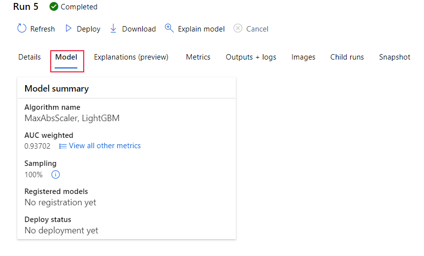
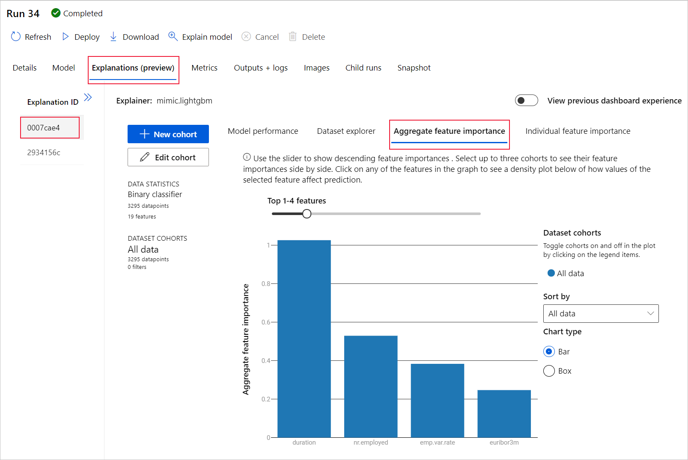

# Create, review, and deploy automated machine learning models with Azure Machine Learning

In this article, you learn how to create, explore, and deploy automated machine learning models without a single line of code in Azure Machine Learning studio.

Automated machine learning is a process in which the best machine learning algorithm to use for your specific data is selected for you. This process enables you to generate machine learning models quickly. [Learn more about automated machine learning](concept-automated-ml.md).
 
For an end to end example, try the [tutorial for creating a classification model with Azure Machine Learning's automated ML interface](tutorial-first-experiment-automated-ml.md). 

For a Python code-based experience, [configure your automated machine learning experiments](how-to-configure-auto-train.md) with the Azure Machine Learning SDK.

## Prerequisites

* An Azure subscription. If you don't have an Azure subscription, create a free account before you begin. Try the [free or paid version of Azure Machine Learning](https://aka.ms/AMLFree) today.

* An Azure Machine Learning workspace. See [Create an Azure Machine Learning workspace](how-to-manage-workspace.md). 

## Get started

1. Sign in to [Azure Machine Learning studio](https://ml.azure.com). 

1. Select your subscription and workspace. 

1. Navigate to the left pane. Select **Automated ML** under the **Author** section.

 If this is your first time doing any experiments, you'll see an empty list and links to documentation. 

Otherwise, you'll see a list of your recent automated machine learning experiments, including those created with the SDK. 

## Create and run experiment

1. Select **+ New automated ML run** and populate the form.

1. Select a dataset from your storage container, or create a new dataset. Datasets can be created from local files, web urls, datastores, or Azure open datasets. Learn more about [dataset creation](how-to-create-register-datasets.md).  

    >[!Important]
    > Requirements for training data:
    >* Data must be in tabular form.
    >* The value you want to predict (target column) must be present in the data.

    1. To create a new dataset from a file on your local computer, select **+Create dataset** and then select **From local file**. 

    1. In the **Basic info** form, give your dataset a unique name and provide an optional description. 

    1. Select **Next** to open the **Datastore and file selection form**. On this form you select where to upload your dataset; the default storage container that's automatically created with your workspace, or choose a storage container that you want to use for the experiment. 
    
        1. If your data is behind a virtual network, you need to enable the **skip the validation** function to ensure that the workspace can access your data. For more information, see [Use Azure Machine Learning studio in an Azure virtual network](how-to-enable-studio-virtual-network.md). 
    
    1. Select **Browse** to upload the data file for your dataset. 

    1. Review the **Settings and preview** form for accuracy. The form is intelligently populated based on the file type. 

        Field| Description
        ----|----
        File format| Defines the layout and type of data stored in a file.
        Delimiter| One or more characters for specifying the boundary between separate, independent regions in plain text or other data streams.
        Encoding| Identifies what bit to character schema table to use to read your dataset.
        Column headers| Indicates how the headers of the dataset, if any, will be treated.
        Skip rows | Indicates how many, if any, rows are skipped in the dataset.
    
        Select **Next**.

    1. The **Schema** form is intelligently populated based on the selections in the **Settings and preview** form. Here configure the data type for each column, review the column names, and select which columns to **Not include** for your experiment. 
            
        Select **Next.**

    1. The **Confirm details** form is a summary of the information previously populated in the **Basic info** and **Settings and preview** forms. You also have the option to create a data profile for your dataset using a profiling enabled compute. Learn more about [data profiling](how-to-connect-data-ui.md#profile).

        Select **Next**.
1. Select your newly created dataset once it appears. You are also able to view a preview of the dataset and sample statistics. 

1. On the **Configure run** form, select **Create new** and enter **Tutorial-automl-deploy** for the experiment name.

1. Select a target column; this is the column that you would like to do predictions on.

1. Select a compute for the data profiling and training job. A list of your existing computes is available in the dropdown. To create a new compute, follow the instructions in step 7.

1. Select **Create a new compute** to configure your compute context for this experiment.

    Field|Description
    ---|---
    Compute name| Enter a unique name that identifies your compute context.
    Virtual machine priority| Low priority virtual machines are cheaper but don't guarantee the compute nodes. 
    Virtual machine type| Select CPU or GPU for virtual machine type.
    Virtual machine size| Select the virtual machine size for your compute.
    Min / Max nodes| To profile data, you must specify 1 or more nodes. Enter the maximum number of nodes for your compute. The default is 6 nodes for an AML Compute.
    Advanced settings | These settings allow you to configure a user account and existing virtual network for your experiment. 
    
    Select **Create**. Creation of a new compute can take a few minutes.

    >[!NOTE]
    > Your compute name will indicate if the compute you select/create is *profiling enabled*. (See the section [data profiling](how-to-connect-data-ui.md#profile) for more details).

    Select **Next**.

1. On the **Task type and settings** form, select the task type: classification, regression, or forecasting. See [supported task types](concept-automated-ml.md#when-to-use-automl-classify-regression--forecast) for more information.

    1. For **classification**, you can also enable deep learning.
    
        If deep learning is enabled, validation is limited to _train_validation split_. [Learn more about validation options](how-to-configure-cross-validation-data-splits.md).

    1. For **forecasting** you can, 
    
        1. Enable deep learning.
    
        1. Select *time column*: This column contains the time data to be used.

        1. Select *forecast horizon*: Indicate how many time units (minutes/hours/days/weeks/months/years) will the model be able to predict to the future. The further the model is required to predict into the future, the less accurate it will become. [Learn more about forecasting and forecast horizon](how-to-auto-train-forecast.md).

1. (Optional) View addition configuration settings: additional settings you can use to better control the training job. Otherwise, defaults are applied based on experiment selection and data. 

    Additional configurations|Description
    ------|------
    Primary metric| Main metric used for scoring your model. [Learn more about model metrics](how-to-configure-auto-train.md#primary-metric).
    Explain best model | Select to enable or disable, in order to show explanations for the recommended best model.   This functionality is not currently available for [certain forecasting algorithms](how-to-machine-learning-interpretability-automl.md#interpretability-during-training-for-the-best-model). 
    Blocked algorithm| Select algorithms you want to exclude from the training job.    Allowing algorithms is only available for [SDK experiments](how-to-configure-auto-train.md#supported-models).   See the [supported models for each task type](/python/api/azureml-automl-core/azureml.automl.core.shared.constants.supportedmodels).
    Exit criterion| When any of these criteria are met, the training job is stopped.   *Training job time (hours)*: How long to allow the training job to run.   *Metric score threshold*:  Minimum metric score for all pipelines. This ensures that if you have a defined target metric you want to reach, you do not spend more time on the training job than necessary.
    Validation| Select one of the cross validation options to use in the training job.   [Learn more about cross validation](how-to-configure-cross-validation-data-splits.md#prerequisites).   Forecasting only supports k-fold cross validation.
    Concurrency| *Max concurrent iterations*: Maximum number of pipelines (iterations) to test in the training job. The job will not run more than the specified number of iterations. Learn more about how automated ML performs [multiple child runs on clusters](how-to-configure-auto-train.md#multiple-child-runs-on-clusters).

1. (Optional) View featurization settings: if you choose to enable **Automatic featurization** in the **Additional configuration settings** form, default featurization techniques are applied. In the **View featurization settings** you can change these defaults and customize accordingly. Learn how to [customize featurizations](#customize-featurization). 

    

## Customize featurization

In the **Featurization** form, you can enable/disable automatic featurization and customize the automatic featurization settings for your experiment. To open this form, see step 10 in the [Create and run experiment](#create-and-run-experiment) section. 

The following table summarizes the customizations currently available via the studio. 

Column| Customization
---|---
Included | Specifies which columns to include for training.
Feature type| Change the value type for the selected column.
Impute with| Select what value to impute missing values with in your data.

## Run experiment and view results

Select **Finish** to run your experiment. The experiment preparing process can take up to 10 minutes. Training jobs can take an additional 2-3 minutes more for each pipeline to finish running.

> [!NOTE]
> The algorithms automated ML employs have inherent randomness that can cause slight variation in a recommended model's final metrics score, like accuracy. Automated ML also performs operations on data such as train-test split, train-validation split or cross-validation when necessary. So if you run an experiment with the same configuration settings and primary metric multiple times, you'll likely see variation in each experiments final metrics score due to these factors. 

### View experiment details

The **Run Detail** screen opens to the **Details** tab. This screen shows you a summary of the experiment run including a status bar at the top next to the run number. 

The **Models** tab contains a list of the models created ordered by the metric score. By default, the model that scores the highest based on the chosen metric is at the top of the list. As the training job tries out more models, they are added to the list. Use this to get a quick comparison of the metrics for the models produced so far.

### View training run details

Drill down on any of the completed models to see training run details, like a model summary on the **Model** tab or performance metric charts on the **Metrics** tab. [Learn more about charts](how-to-understand-automated-ml.md).

## Model explanations (preview)

To better understand your model, you can see which data features (raw or engineered) influenced the model's predictions with the model explanations dashboard. 

The model explanations dashboard provides an overall analysis of the trained model along with its predictions and explanations. It also lets you drill into an individual data point and its individual feature importances. [Learn more about the explanation dashboard visualizations](how-to-machine-learning-interpretability-aml.md#visualizations).

To get explanations for a particular model, 

1. On the **Models** tab, select the model you want to understand. 
1. Select the **Explain model** button, and provide a compute that can be used to generate the explanations.
1. Check the **Child runs** tab for the status. 
1. Once complete, navigate to the **Explanations (preview)** tab which contains the explanations dashboard. 

    

## Deploy your model

Once you have the best model at hand, it is time to deploy it as a web service to predict on new data.

>[!TIP]
> If you are looking to deploy a model that was generated via the `automl` package with the Python SDK, you must [register your model](how-to-deploy-and-where.md?tabs=python#register-a-model-from-an-azure-ml-training-run-1) to the workspace. 
>
> Once you're model is registered, find it in the studio by selecting **Models** on the left pane. Once you open your model, you can select the **Deploy** button at the top of the screen, and then follow the instructions as described in **step 2** of the **Deploy your model** section.

Automated ML helps you with deploying the model without writing code:

1. You have a couple options for deployment. 

    + Option 1: Deploy the best model, according to the metric criteria you defined. 
        1. After the experiment is complete, navigate to the parent run page by selecting **Run 1** at the top of the screen. 
        1.  Select the model listed in the **Best model summary** section. 
        1. Select **Deploy** on the top left of the window. 

    + Option 2: To deploy a specific model iteration from this experiment.
        1. Select the desired model from the **Models** tab
        1. Select **Deploy** on the top left of the window.

1. Populate the **Deploy model** pane.

    Field| Value
    ----|----
    Name| Enter a unique name for your deployment.
    Description| Enter a description to better identify what this deployment is for.
    Compute type| Select the type of endpoint you want to deploy: *Azure Kubernetes Service (AKS)* or *Azure Container Instance (ACI)*.
    Compute name| *Applies to AKS only:* Select the name of the AKS cluster you wish to deploy to.
    Enable authentication | Select to allow for token-based or key-based authentication.
    Use custom deployment assets| Enable this feature if you want to upload your own scoring script and environment file. [Learn more about scoring scripts](how-to-deploy-and-where.md).

    >[!Important]
    > File names must be under 32 characters and must begin and end with alphanumerics. May include dashes, underscores, dots, and alphanumerics between. Spaces are not allowed.

    The *Advanced* menu offers default deployment features such as [data collection](how-to-enable-app-insights.md) and resource utilization settings. If you wish to override these defaults do so in this menu.

1. Select **Deploy**. Deployment can take about 20 minutes to complete.
    Once deployment begins, the **Model summary** tab appears. See the deployment progress under the **Deploy status** section. 

Now you have an operational web service to generate predictions! You can test the predictions by querying the service from [Power BI's built in Azure Machine Learning support](/power-bi/connect-data/service-aml-integrate?context=azure%2fmachine-learning%2fcontext%2fml-context).

## Next steps

* [Learn how to consume a web service](how-to-consume-web-service.md).
* [Understand automated machine learning results](how-to-understand-automated-ml.md).
* [Learn more about automated machine learning](concept-automated-ml.md) and Azure Machine Learning.