# Set up no-code AutoML training for tabular data with the studio UI 

In this article, you learn how to set up AutoML training jobs without a single line of code using Azure Machine Learning automated ML in the [Azure Machine Learning studio](overview-what-is-azure-machine-learning.md#studio).

Automated machine learning, AutoML, is a process in which the best machine learning algorithm to use for your specific data is selected for you. This process enables you to generate machine learning models quickly. [Learn more about how Azure Machine Learning implements automated machine learning](concept-automated-ml.md).
 
For an end to end example, try the [Tutorial: AutoML- train no-code classification models](tutorial-first-experiment-automated-ml.md). 

For a Python code-based experience, [configure your automated machine learning experiments](how-to-configure-auto-train.md) with the Azure Machine Learning SDK.

## Prerequisites

* An Azure subscription. If you don't have an Azure subscription, create a free account before you begin. Try the [free or paid version of Azure Machine Learning](https://azure.microsoft.com/free/) today.

* An Azure Machine Learning workspace. See [Create workspace resources](quickstart-create-resources.md). 

## Get started

1. Sign in to [Azure Machine Learning studio](https://ml.azure.com). 

1. Select your subscription and workspace. 

1. Navigate to the left pane. Select **Automated ML** under the **Authoring** section.

[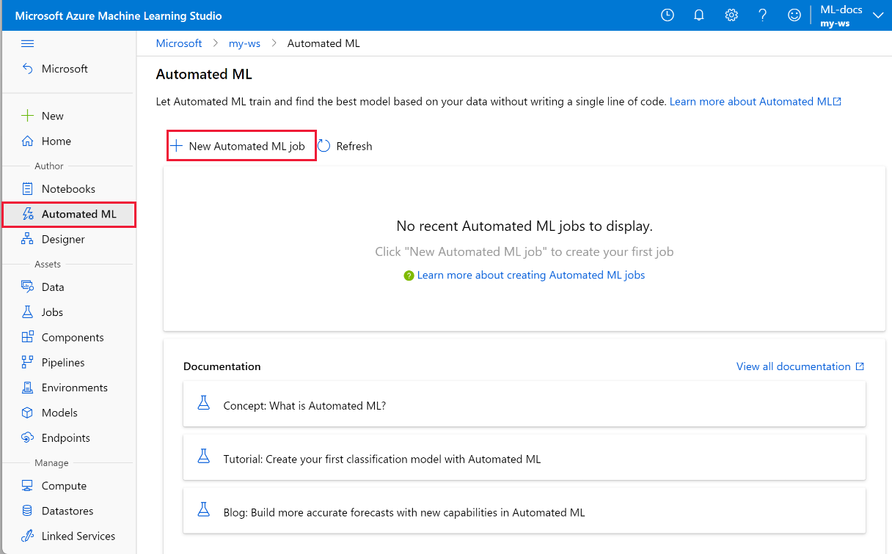](media/how-to-use-automated-ml-for-ml-models/nav-pane-expanded.png#lightbox)

 If this is your first time doing any experiments, you see an empty list and links to documentation. 

Otherwise, you see a list of your recent automated  ML experiments, including those created with the SDK. 

## Create and run experiment

1. Select **+ New automated ML job** and populate the form.

1. Select a data asset from your storage container, or create a new data asset. Data asset can be created from local files, web urls, datastores, or Azure open datasets. Learn more about [data asset creation](how-to-create-data-assets.md).  

    >[!Important]
    > Requirements for training data:
    >* Data must be in tabular form.
    >* The value you want to predict (target column) must be present in the data.

    1. To create a new dataset from a file on your local computer, select **+Create dataset** and then select **From local file**. 

    1. Select **Next** to open the **Datastore and file selection form**. , you select where to upload your dataset; the default storage container that's automatically created with your workspace, or choose a storage container that you want to use for the experiment. 
    
        1. If your data is behind a virtual network, you need to enable the **skip the validation** function to ensure that the workspace can access your data. For more information, see [Use Azure Machine Learning studio in an Azure virtual network](how-to-enable-studio-virtual-network.md). 
    
    1. Select **Browse** to upload the data file for your dataset. 

    1. Review the **Settings and preview** form for accuracy. The form is intelligently populated based on the file type. 

        Field| Description
        ----|----
        File format| Defines the layout and type of data stored in a file.
        Delimiter| One or more characters for specifying the boundary between separate, independent regions in plain text or other data streams.
        Encoding| Identifies what bit to character schema table to use to read your dataset.
        Column headers| Indicates how the headers of the dataset, if any, will be treated.
        Skip rows | Indicates how many, if any, rows are skipped in the dataset.
    
        Select **Next**.

    1. The **Schema** form is intelligently populated based on the selections in the **Settings and preview** form. Here configure the data type for each column, review the column names, and select which columns to **Not include** for your experiment. 
            
        Select **Next.**

    1. The **Confirm details** form is a summary of the information previously populated in the **Basic info** and **Settings and preview** forms. You also have the option to create a data profile for your dataset using a profiling enabled compute. 

        Select **Next**.
1. Select your newly created dataset once it appears. You're also able to view a preview of the dataset and sample statistics. 

1. On the **Configure job** form, select **Create new** and enter **Tutorial-automl-deploy** for the experiment name.

1. Select a target column; this is the column that you would like to do predictions on.

1. Select a compute type for the data profiling and training job. You can select a [compute cluster](concept-compute-target.md#azure-machine-learning-compute-managed) or [compute instance](concept-compute-instance.md). 
    
1. Select a compute from the dropdown list of your existing computes.  To create a new compute, follow the instructions in step 8.

1. Select **Create a new compute** to configure your compute context for this experiment.

    Field|Description
    ---|---
    Compute name| Enter a unique name that identifies your compute context.
    Virtual machine priority| Low priority virtual machines are cheaper but don't guarantee the compute nodes. 
    Virtual machine type| Select CPU or GPU for virtual machine type.
    Virtual machine size| Select the virtual machine size for your compute.
    Min / Max nodes| To profile data, you must specify one or more nodes. Enter the maximum number of nodes for your compute. The default is six nodes for an Azure Machine Learning Compute.
    Advanced settings | These settings allow you to configure a user account and existing virtual network for your experiment. 
    
    Select **Create**. Creation of a new compute can take a few minutes.

    Select **Next**.

1. On the **Task type and settings** form, select the task type: classification, regression, or forecasting. See [supported task types](concept-automated-ml.md#when-to-use-automl-classification-regression-forecasting-computer-vision--nlp) for more information.

    1. For **classification**, you can also enable deep learning.

    1. For **forecasting** you can, 
    
        1. Enable deep learning.
    
        1. Select *time column*: This column contains the time data to be used.

        1. Select *forecast horizon*: Indicate how many time units (minutes/hours/days/weeks/months/years) will the model be able to predict to the future. The further into the future the model is required to predict, the less accurate the model becomes. [Learn more about forecasting and forecast horizon](how-to-auto-train-forecast.md).

1. (Optional) View addition configuration settings: additional settings you can use to better control the training job. Otherwise, defaults are applied based on experiment selection and data. 

    Additional configurations|Description
    ------|------
    Primary metric| Main metric used for scoring your model. [Learn more about model metrics](how-to-configure-auto-train.md#primary-metric).
    Enable ensemble stacking | Ensemble learning improves machine learning results and predictive performance by combining multiple models as opposed to using single models. [Learn more about ensemble models](concept-automated-ml.md#ensemble).
    Blocked algorithm| Select algorithms you want to exclude from the training job.    Allowing algorithms is only available for [SDK experiments](how-to-configure-auto-train.md#supported-algorithms).   See the [supported algorithms for each task type](/python/api/azureml-automl-core/azureml.automl.core.shared.constants.supportedmodels).
    Explain best model| Automatically shows explainability on the best model created by Automated ML.
 

1. (Optional) View featurization settings: if you choose to enable **Automatic featurization** in the **Additional configuration settings** form, default featurization techniques are applied. In the **View featurization settings**, you can change these defaults and customize accordingly. Learn how to [customize featurizations](#customize-featurization). 

    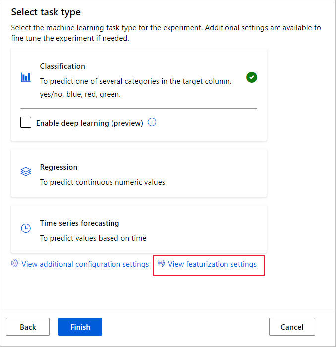

1. The **[Optional] Limits** form allows you to do the following.

   | Option | Description |
   |---|-----|
   |**Max trials**| Maximum number of trials, each with different combination of algorithm and hyperparameters to try during the AutoML job. Must be an integer between 1 and 1000.
   |**Max concurrent trials**| Maximum number of trial jobs that can be executed in parallel. Must be an integer between 1 and 1000.
   |**Max nodes**| Maximum number of nodes this job can use from selected compute target.
   |**Metric score threshold**| When this threshold value will be reached for an iteration metric the training job will terminate. Keep in mind that meaningful models have correlation > 0, otherwise they are as good as guessing the average Metric threshold should be between bounds [0, 10].
   |**Experiment timeout (minutes)**| Maximum time in minutes the entire experiment is allowed to run. Once this limit is reached the system will cancel the AutoML job, including all its trials (children jobs).
   |**Iteration timeout (minutes)**| Maximum time in minutes each trial job is allowed to run. Once this limit is reached the system will cancel the trial.
   |**Enable early termination**| Select to end the job if the score is not improving in the short term.

1. The **[Optional] Validate and test** form allows you to do the following. 

a. Specify the type of validation to be used for your training job. If you do not explicitly specify either a `validation_data` or `n_cross_validations` parameter, automated ML applies default techniques depending on the number of rows provided in the single dataset `training_data`.

| Training data size | Validation technique |
|---|-----|
|**Larger than 20,000 rows**| Train/validation data split is applied. The default is to take 10% of the initial training data set as the validation set. In turn, that validation set is used for metrics calculation.
|**Smaller than 20,000& rows**| Cross-validation approach is applied. The default number of folds depends on the number of rows.   **If the dataset is less than 1,000 rows**, 10 folds are used.   **If the rows are between 1,000 and 20,000**, then three folds are used.
    
b. Provide a test dataset (preview) to evaluate the recommended model that automated ML generates for you at the end of your experiment. When you provide test data, a test job is automatically triggered at the end of your experiment. This test job is only job on the best model that is recommended by automated ML. Learn how to get the [results of the remote test job](#view-remote-test-job-results-preview).
    
>[!IMPORTANT]
> Providing a test dataset to evaluate generated models is a preview feature. This capability is an [experimental](/python/api/overview/azure/ml/#stable-vs-experimental) preview feature, and may change at any time.
     * Test data is considered a separate from training and validation, so as to not bias the results of the test job of the recommended model. [Learn more about bias during model validation](concept-automated-ml.md#training-validation-and-test-data).
     * You can either provide your own test dataset or opt to use a percentage of your training dataset. Test data must be in the form of an [Azure Machine Learning TabularDataset](how-to-create-data-assets.md#create-data-assets).         
     * The schema of the test dataset should match the training dataset. The target column is optional, but if no target column is indicated no test metrics are calculated.
     * The test dataset shouldn't be the same as the training dataset or the validation dataset.
     * Forecasting jobs don't support train/test split.
        
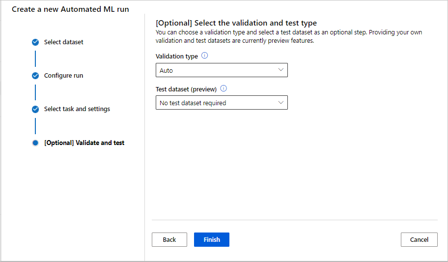
        
## Customize featurization

In the **Featurization** form, you can enable/disable automatic featurization and customize the automatic featurization settings for your experiment. To open this form, see step 10 in the [Create and run experiment](#create-and-run-experiment) section. 

The following table summarizes the customizations currently available via the studio. 

Column| Customization
---|---
Included | Specifies which columns to include for training.
Feature type| Change the value type for the selected column.
Impute with| Select what value to impute missing values with in your data.

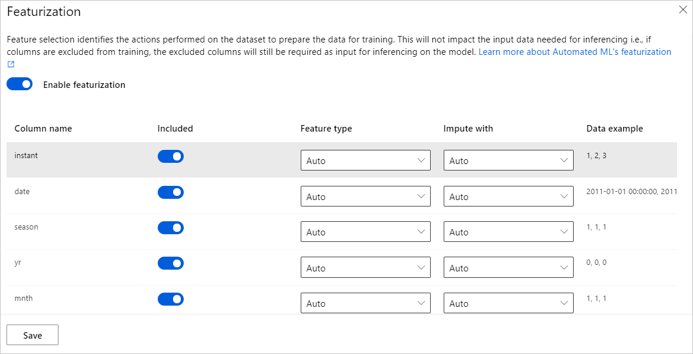

## Run experiment and view results

Select **Finish** to run your experiment. The experiment preparing process can take up to 10 minutes. Training jobs can take an additional 2-3 minutes more for each pipeline to finish running. If you have specified to generate RAI dashboard for the best recommended model, it may take up to 40 minutes.

> [!NOTE]
> The algorithms automated ML employs have inherent randomness that can cause slight variation in a recommended model's final metrics score, like accuracy. Automated ML also performs operations on data such as train-test split, train-validation split or cross-validation when necessary. So if you run an experiment with the same configuration settings and primary metric multiple times, you'll likely see variation in each experiments final metrics score due to these factors. 

### View experiment details

The **Job Detail** screen opens to the **Details** tab. This screen shows you a summary of the experiment job including a status bar at the top next to the job number. 

The **Models** tab contains a list of the models created ordered by the metric score. By default, the model that scores the highest based on the chosen metric is at the top of the list. As the training job tries out more models, they're added to the list. Use this to get a quick comparison of the metrics for the models produced so far.

### View training job details

Drill down on any of the completed models to see training job details. In the **Model** tab, you can view details like a model summary and the hyperparameters used for the selected model. 

[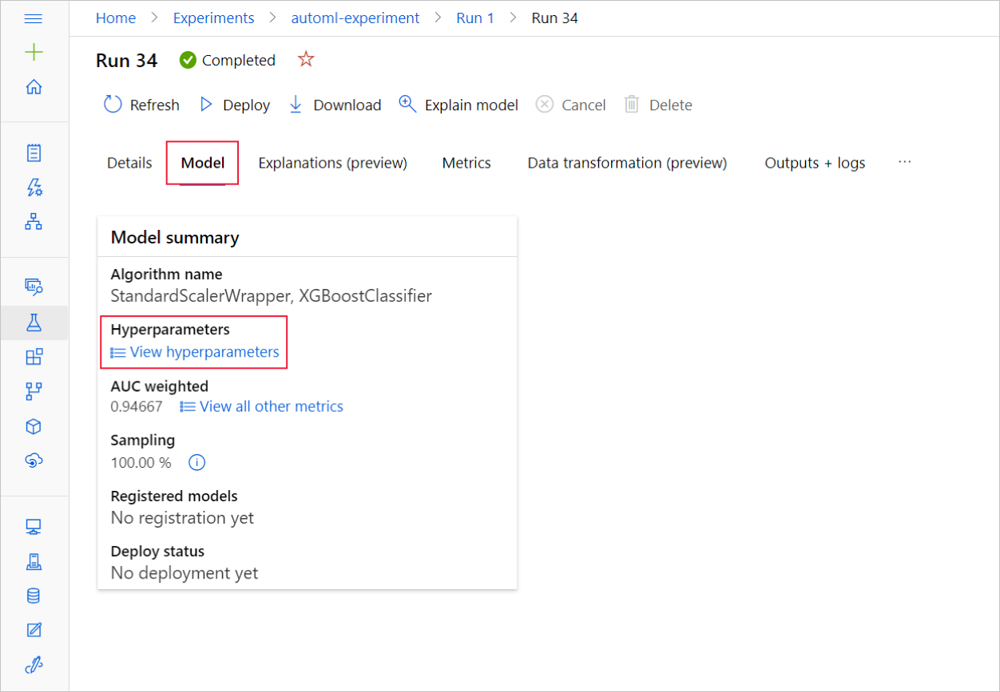](media/how-to-use-automated-ml-for-ml-models/hyperparameter-details.png#lightbox)

 You can also see model specific performance metric charts on the **Metrics** tab. [Learn more about charts](how-to-understand-automated-ml.md).

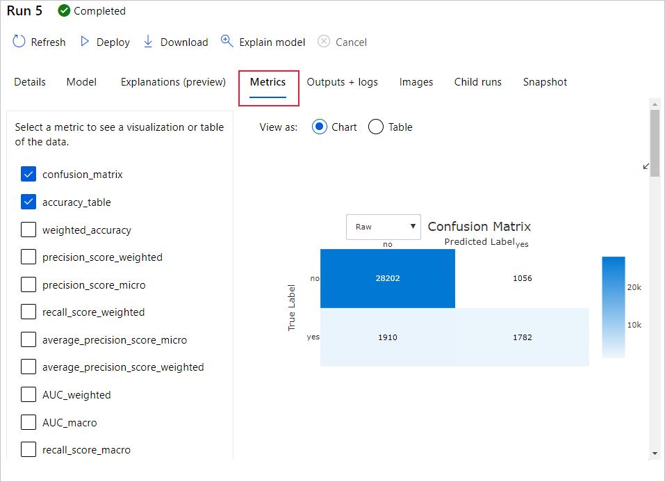

On the Data transformation tab, you can see a diagram of what data preprocessing, feature engineering, scaling techniques and the machine learning algorithm that were applied to generate this model.

>[!IMPORTANT]
> The Data transformation tab is in preview. This capability should be considered [experimental](/python/api/overview/azure/ml/#stable-vs-experimental) and may change at any time.

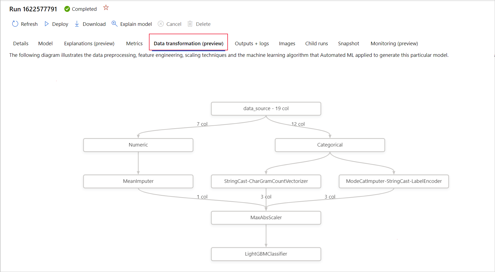

## View remote test job results (preview)

If you specified a test dataset or opted for a train/test split during your experiment setup--on the **Validate and test** form, automated ML automatically tests the recommended model by default. As a result, automated ML calculates test metrics to determine the quality of the recommended model and its predictions. 

>[!IMPORTANT]
> Testing your models with a test dataset to evaluate generated models is a preview feature. This capability is an [experimental](/python/api/overview/azure/ml/#stable-vs-experimental) preview feature, and may change at any time.

> [!WARNING]
> This feature is not available for the following automated ML scenarios
>  * [Computer vision tasks](how-to-auto-train-image-models.md)
>  * [Many models and hiearchical time series forecasting training (preview)](how-to-auto-train-forecast.md)
>  * [Forecasting tasks where deep learning neural networks (DNN) are enabled](how-to-auto-train-forecast.md#enable-deep-learning)
>  * [Automated ML jobs from local computes or Azure Databricks clusters](how-to-configure-auto-train.md#compute-to-run-experiment)

To view the test job metrics of the recommended model,
 
1. Navigate to the **Models** page, select the best model. 
1. Select the **Test results (preview)** tab. 
1. Select the job you want, and view the **Metrics** tab.
    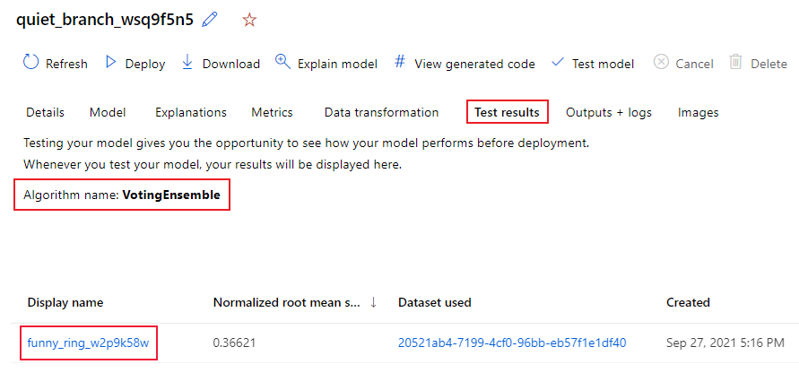
    
To view the test predictions used to calculate the test metrics, 

1. Navigate to the bottom of the page and select the link under **Outputs dataset** to open the dataset. 
1. On the **Datasets** page, select the **Explore** tab to view the predictions from the test job.
    1. Alternatively, the prediction file can also be viewed/downloaded from the **Outputs + logs** tab, expand the **Predictions** folder to locate your `predicted.csv` file.

Alternatively, the predictions file can also be viewed/downloaded from the Outputs + logs tab, expand Predictions folder to locate your predictions.csv file.

The model test job generates the predictions.csv file that's stored in the default datastore created with the workspace. This datastore is visible to all users with the same subscription. Test jobs aren't recommended for scenarios if any of the information used for or created by the test job needs to remain private.

## Test an existing automated ML model (preview)

>[!IMPORTANT]
> Testing your models with a test dataset to evaluate generated models is a preview feature. This capability is an [experimental](/python/api/overview/azure/ml/#stable-vs-experimental) preview feature, and may change at any time.

> [!WARNING]
> This feature is not available for the following automated ML scenarios
>  * [Computer vision tasks](how-to-auto-train-image-models.md)
>  * [Many models and hiearchical time series forecasting training (preview)](how-to-auto-train-forecast.md)
>  * [Forecasting tasks where deep learning neural networks (DNN) are enabled](how-to-auto-train-forecast.md#enable-deep-learning)
>  * [Automated ML runs from local computes or Azure Databricks clusters](how-to-configure-auto-train.md#compute-to-run-experiment)

After your experiment completes, you can test the model(s) that automated ML generates for you. If you want to test a different automated ML generated model, not the recommended model, you can do so with the following steps. 

1. Select an existing automated ML experiment job.  
1. Navigate to the **Models** tab of the job and select the completed model you want to test.
1. On the model **Details** page, select the **Test model(preview)** button to open the **Test model** pane.
1. On the **Test model** pane, select the compute cluster and a test dataset you want to use for your test job. 
1. Select the **Test** button. The schema of the test dataset should match the training dataset, but the **target column** is optional.
1. Upon successful creation of model test job, the **Details** page displays a success message. Select the **Test results** tab to see the progress of the job.

1. To view the results of the test job, open the **Details** page and follow the steps in the [view results of the remote test job](#view-remote-test-job-results-preview) section. 

    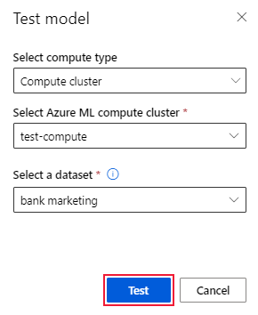
    

## Responsible AI dashboard (preview)

To better understand your model, you can see various insights about your model using the Responsible Ai dashboard. It allows you to evaluate and debug your best Automated machine learning model. The Responsible AI dashboard will evaluate model errors and fairness issues, diagnose why those errors are happening by evaluating your train and/or test data, and observing model explanations. Together, these insights could help you build trust with your model and pass the audit processes. Responsible AI dashboards can't be generated for an existing Automated machine learning model. It is only created for the best recommended model when a new AutoML job is created. Users should continue to just use Model Explanations (preview) until support is provided for existing models. 

To generate a Responsible AI dashboard for a particular model, 

1. While submitting an Automated ML job, proceed to the **Task settings** section on the left nav bar and select the **View additional configuration settings** option.
   
2. In the new form appearing post that selection, select the **Explain best model** checkbox. 

    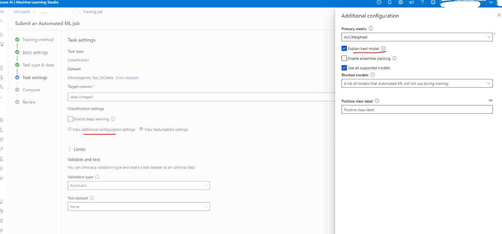

3. Proceed to the **Compute** page of the setup form and choose the **Serverless** option for your compute.

    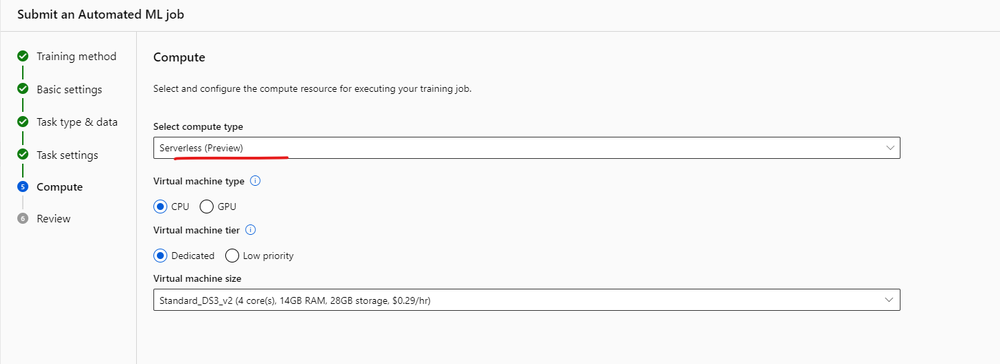

4. Once complete, navigate to the Models page of your Automated ML job, which contains a list of your trained models. Select on the **View Responsible AI dashboard** link: 

    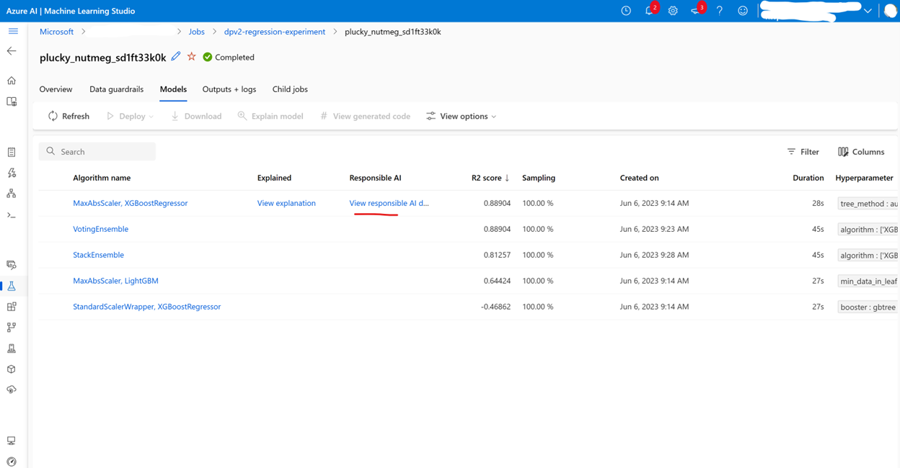

The Responsible AI dashboard appears for that model as shown in this image:

   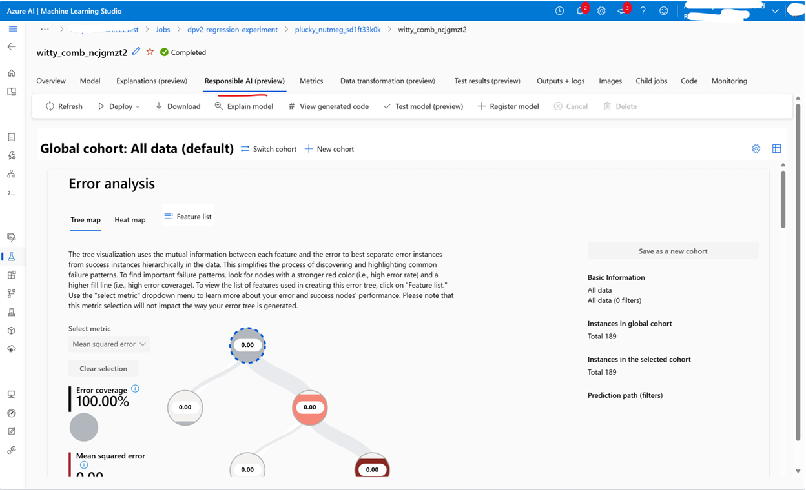

In the dashboard, you'll find four components activated for your Automated ML’s best model: 

| Component | What does the component show? | How to read the chart?  |
| ---- | ---- | ---- |
| [Error Analysis](concept-error-analysis.md) | Use error analysis when you need to:   Gain a deep understanding of how model failures are distributed across a dataset and across several input and feature dimensions.   Break down the aggregate performance metrics to automatically discover erroneous cohorts in order to inform your targeted mitigation steps. |  [Error Analysis Charts](how-to-responsible-ai-dashboard.md) |
| [Model Overview and Fairness](concept-fairness-ml.md) | Use this component to:   Gain a deep understanding of your model performance across different cohorts of data.   Understand your model fairness issues by looking at the disparity metrics. These metrics can evaluate and compare model behavior across subgroups identified in terms of sensitive (or nonsensitive) features.  | [Model Overview and Fairness Charts](how-to-responsible-ai-dashboard.md#model-overview-and-fairness-metrics) |
| [Model Explanations](how-to-machine-learning-interpretability.md) | Use the model explanation component to generate human-understandable descriptions of the predictions of a machine learning model by looking at:   Global explanations: For example, what features affect the overall behavior of a loan allocation model?   Local explanations: For example, why was a customer's loan application approved or rejected? | [Model Explainability Charts](how-to-responsible-ai-dashboard.md#feature-importances-model-explanations) |
| [Data Analysis](concept-data-analysis.md) | Use data analysis when you need to:   Explore your dataset statistics by selecting different filters to slice your data into different dimensions (also known as cohorts).   Understand the distribution of your dataset across different cohorts and feature groups.   Determine whether your findings related to fairness, error analysis, and causality (derived from other dashboard components) are a result of your dataset's distribution.   Decide in which areas to collect more data to mitigate errors that come from representation issues, label noise, feature noise, label bias, and similar factors. | [Data Explorer Charts](how-to-responsible-ai-dashboard.md#data-analysis) |

5. You can further create cohorts (subgroups of data points that share specified characteristics) to focus your analysis of each component on different cohorts. The name of the cohort that's currently applied to the dashboard is always shown at the top left of your dashboard. The default view in your dashboard is your whole dataset, titled "All data" (by default). Learn more about the [global control of your dashboard here.](how-to-responsible-ai-dashboard.md#global-controls)

## Edit and submit jobs (preview)

>[!IMPORTANT]
> The ability to copy, edit and submit a new experiment based on an existing experiment is a preview feature. This capability is an [experimental](/python/api/overview/azure/ml/#stable-vs-experimental) preview feature, and may change at any time.

In scenarios where you would like to create a new experiment based on the settings of an existing experiment, automated ML provides the option to do so with the **Edit and submit** button in the studio UI.  

This functionality is limited to experiments initiated from the studio UI and requires the data schema for the new experiment to match that of the original experiment. 

The **Edit and submit** button opens the **Create a new Automated ML job** wizard with the data, compute and experiment settings prepopulated. You can go through each form and edit selections as needed for your new experiment. 

## Deploy your model

Once you have the best model at hand, it's time to deploy it as a web service to predict on new data.

>[!TIP]
> If you are looking to deploy a model that was generated via the `automl` package with the Python SDK, you must [register your model)](./how-to-deploy-online-endpoints.md) to the workspace. 
>
> Once you're model is registered, find it in the studio by selecting **Models** on the left pane. Once you open your model, you can select the **Deploy** button at the top of the screen, and then follow the instructions as described in **step 2** of the **Deploy your model** section.

Automated ML helps you with deploying the model without writing code:

1. You have a couple options for deployment. 

    + Option 1: Deploy the best model, according to the metric criteria you defined. 
        1. After the experiment is complete, navigate to the parent job page by selecting **Job 1** at the top of the screen. 
        1.  Select the model listed in the **Best model summary** section. 
        1. Select **Deploy** on the top left of the window. 

    + Option 2: To deploy a specific model iteration from this experiment.
        1. Select the desired model from the **Models** tab
        1. Select **Deploy** on the top left of the window.

1. Populate the **Deploy model** pane.

    Field| Value
    ----|----
    Name| Enter a unique name for your deployment.
    Description| Enter a description to better identify what this deployment is for.
    Compute type| Select the type of endpoint you want to deploy: [*Azure Kubernetes Service (AKS)*](../aks/intro-kubernetes.md) or [*Azure Container Instance (ACI)*](../container-instances/container-instances-overview.md).
    Compute name| *Applies to AKS only:* Select the name of the AKS cluster you wish to deploy to.
    Enable authentication | Select to allow for token-based or key-based authentication.
    Use custom deployment assets| Enable this feature if you want to upload your own scoring script and environment file. Otherwise, automated ML provides these assets for you by default. [Learn more about scoring scripts](how-to-deploy-online-endpoints.md).

    >[!Important]
    > File names must be under 32 characters and must begin and end with alphanumerics. May include dashes, underscores, dots, and alphanumerics between. Spaces are not allowed.

    The *Advanced* menu offers default deployment features such as [data collection](how-to-enable-app-insights.md) and resource utilization settings. If you wish to override these defaults do so in this menu.

1. Select **Deploy**. Deployment can take about 20 minutes to complete.
    Once deployment begins, the **Model summary** tab appears. See the deployment progress under the **Deploy status** section. 

Now you have an operational web service to generate predictions! You can test the predictions by querying the service from [Power BI's built in Azure Machine Learning support](/power-bi/connect-data/service-aml-integrate?context=azure%2fmachine-learning%2fcontext%2fml-context).

## Next steps

* [Understand automated machine learning results](how-to-understand-automated-ml.md).
* [Learn more about automated machine learning](concept-automated-ml.md) and Azure Machine Learning.
