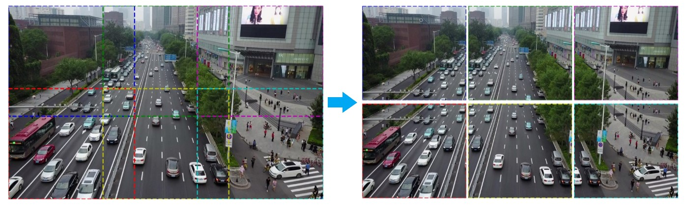
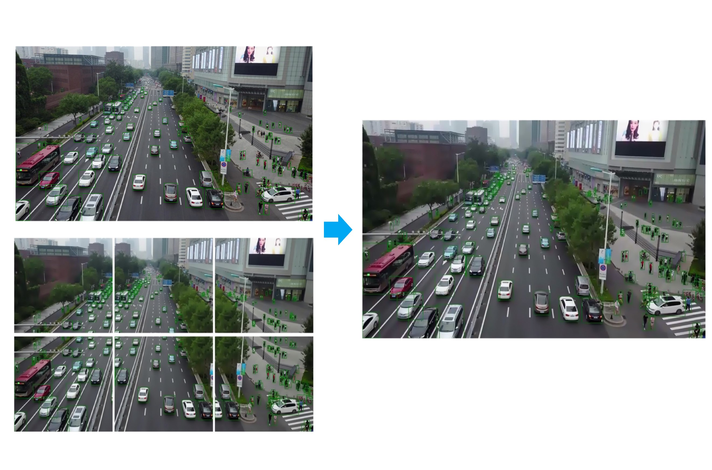

# Train a small object detection model with AutoML

> [!IMPORTANT]
> This feature is currently in public preview. This preview version is provided without a service-level agreement. Certain features might not be supported or might have constrained capabilities. For more information, see Supplemental Terms of Use for Microsoft Azure Previews.

In this article, you'll learn how to train an object detection model to detect small objects in high-resolution images with automated ML in Azure Machine Learning.

## Prerequisites

* An Azure Machine Learning workspace. To create the workspace, see [Create an Azure Machine Learning workspace](how-to-manage-workspace.md).

* This article assumes some familiarity with how to configure an [automated machine learning experiment for computer vision tasks](how-to-auto-train-image-models.md). 

[!INCLUDE [automl-sdk-version](../../includes/machine-learning-automl-sdk-version.md)]


## Small object detection

Vision models for object detection work well for datasets with relatively large objects, but they don't do well in detecting small objects in high-resolution images. Models can't process such images in original dimensions because of memory and computational constraints. So, images are resized before being passed to the model, which limits their capability to detect smaller objects (relative to the initial image size).

To help with this problem, AutoML for Images exposes the functionality of tiling.

When tiling is enabled, each image is divided into a grid of tiles. Adjacent tiles overlap with each other in width and height dimensions. The tiles are cropped from the original image as shown in the image below.



In training phase, the generated tiles and the entire image are passed through the model, along with the corresponding ground truth bounding boxes.

The tiles and entire image are passed through the model in the validation/inference phase as well. The object proposals from them are merged to output final predictions as shown in the image below.



## Enable tiling

To enable tiling, you can set the `tile_grid_size` parameter to a value like (3, 2). When this parameter is set to (3, 2), each image is split into a grid of 3 * 2 tiles as shown in the above image. Each tile has an overlap of 25% with the adjacent tiles so that any objects that fall on the tile border are included completely in one of the tiles.

When tiling is enabled, the generated tiles and the entire image corresponding to each image are passed through the model. The computation time increases proportionally because of processing this extra data. For example, when the tile_grid_size parameter is (3, 2), the computation time would be approximately seven times when compared to no tiling.

You can specify the value for tile_grid_size in your hyperparameter space as shown below. You need to specify the value as a string.

```python
parameter_space = {
	'model_name': choice('fasterrcnn_resnet50_fpn'),
	'tile_grid_size': choice('(3, 2)'),
	...
}
```

The value for `tile_grid_size` parameter depends on the image dimensions and size of objects within the image. For example, larger number of tiles would be helpful when there are smaller objects in the images.

To choose the optimal value for this parameter for your dataset, you can use hyperparameter search. To do so, you can specify a choice of values for this parameter in your hyperparameter space as shown below.

```python
parameter_space = {
	'model_name': choice('fasterrcnn_resnet50_fpn'),
	'tile_grid_size': choice('(2, 1)', '(3, 2)', '(5, 3)'),
	...
}
```

### Hyperparameters

The following are the parameters you can use to control the tiling feature.

| Parameter Name	| Description	| Default |
| --------------- |-------------| -------|
| tile_grid_size |  Can be used in  training, validation, and inference phases. The grid size to use for tiling each image. This parameter is used to control the overlap ratio between adjacent tiles in width and height dimensions. Should be a tuple of two integers passed as a string. Example: --tile_grid_size "(3, 2)" <br> Setting this parameter would increase the computation time proportionally, since all the tiles and the images are processed by the model.| no default value |
| tile_overlap_ratio | Control the overlap ratio between adjacent tiles in each dimension. If the objects, which fall on tile boundary are large enough to not fit completely in one of the tiles, you can change this parameter. In such cases, you can increase the value of this parameter so that the objects fit in at least one of the tiles completely. <br> `Optional, float in [0, 1)` | 0.25 |
| tile_predictions_nms_thresh | The intersection over union (iou) threshold to use to do NMS while merging predictions from tiles and image. Used in validation/inference. If there are multiple boxes detected per object in the final predictions, you can change this parameter.Two proposals are considered to be overlapping when the iou  between them is greater than tile_predictions_nms_thresh parameter. While merging the object proposals from the tiles and the image, it might be possible that the same object is detected from multiple tiles. Duplication detection is done to remove such duplicates. <br> `Optional, float in [0, 1]` | 0.25 |

### Tiling during inference

When a model trained with tiling is deployed, it does tiling during inference as well. It uses the tile_grid_size value from training to generate the tiles during inference.

However, enabling tiling only in inference without enabling it in training might give performance boost for some datasets. You won't incur the extra cost that comes with tiling at training time in this case. To do so, you can train a model without tiling and set the tile_grid_size parameter only during inference.

### Supported models

Small object detection using tiling is currently supported for the following models:

* fasterrcnn_resnet50_fpn
* fasterrcnn_resnet34_fpn
* fasterrcnn_resnet18_fpn
* retinanet_resnet50_fpn

## Example notebooks

See the [object detection sample notebook](https://github.com/swatig007/automlForImages/blob/main/ObjectDetection/AutoMLImage_ObjectDetection_SampleNotebook.ipynb) for detailed code examples of setting up and training a small object detection model.

## Next steps

