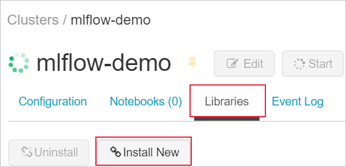
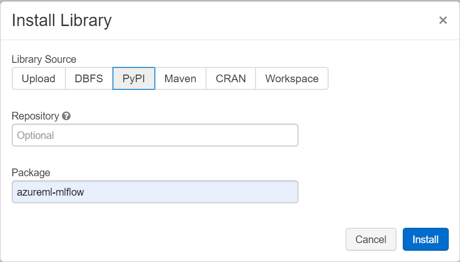
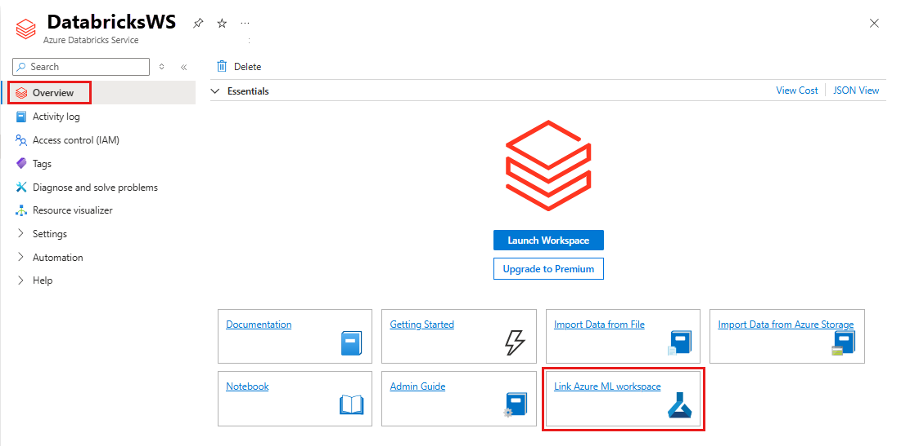

# Track Azure Databricks ML experiments with MLflow and Azure Machine Learning (preview)

In this article, learn how to enable MLflow's tracking URI and logging API, collectively known as [MLflow Tracking](https://mlflow.org/docs/latest/quickstart.html#using-the-tracking-api), to connect your Azure Databricks (ADB) experiments, MLflow, and Azure Machine Learning.

[MLflow](https://www.mlflow.org) is an open-source library for managing the life cycle of your machine learning experiments. MLFlow Tracking is a component of MLflow that logs and tracks your training run metrics and model artifacts. Learn more about [Azure Databricks and MLflow](/azure/databricks/applications/mlflow/). 

See [Track experiment runs with MLflow and Azure Machine Learning](how-to-use-mlflow.md) for additional MLflow and Azure Machine Learning functionality integrations.

>[!NOTE]
> As an open source library, MLflow changes frequently. As such, the functionality made available via the Azure Machine Learning and MLflow integration should be considered as a preview, and not fully supported by Microsoft.

> [!TIP]
> The information in this document is primarily for data scientists and developers who want to monitor the model training process. If you are an administrator interested in monitoring resource usage and events from Azure Machine Learning, such as quotas, completed training runs, or completed model deployments, see [Monitoring Azure Machine Learning](monitor-azure-machine-learning.md).

## Prerequisites

* Install the `azureml-mlflow` package. 
    * This package automatically brings in `azureml-core` of the [The Azure Machine Learning Python SDK](/python/api/overview/azure/ml/install), which provides the connectivity for MLflow to access your workspace.
* An [Azure Databricks workspace and cluster](/azure/databricks/scenarios/quickstart-create-databricks-workspace-portal).
* [Create an Azure Machine Learning Workspace](how-to-manage-workspace.md).
    * See which [access permissions you need to perform your MLflow operations with your workspace](how-to-assign-roles.md#mlflow-operations).

## Track Azure Databricks runs

MLflow Tracking with Azure Machine Learning lets you store the logged metrics and artifacts from your Azure Databricks runs into both your: 

* Azure Databricks workspace.
* Azure Machine Learning workspace

After you create your Azure Databricks workspace and cluster, 

1. Install the *azureml-mlflow* library from PyPi, to ensure that your cluster has access to the necessary functions and classes.

1. Set up your experiment notebook.

1. Connect your Azure Databricks workspace and Azure Machine Learning workspace.

Additional detail for these steps are in the following sections  so you can successfully run your MLflow experiments with Azure Databricks. 

## Install libraries

To install libraries on your cluster, navigate to the **Libraries** tab and select **Install New**

 

In the **Package** field, type azureml-mlflow and then select install. Repeat this step as necessary to install other additional packages to your cluster for your experiment.

 

## Set up your notebook 

Once your ADB cluster is set up, 
1. Select **Workspaces** on the left navigation pane. 
1. Expand the workspaces drop down menu and select **Import**
1. Drag and drop, or browse to find, your experiment notebook to import your ADB workspace.
1. Select **Import**. Your experiment notebook opens automatically.
1. Under the notebook title on the top left, select the cluster want to attach to your experiment notebook. 

## Connect your Azure Databricks and Azure Machine Learning workspaces

Linking your ADB workspace to your Azure Machine Learning workspace enables you to track your experiment data in the Azure Machine Learning workspace.

To link your ADB workspace to a new or existing Azure Machine Learning workspace, 
1. Sign in to [Azure portal](https://ms.portal.azure.com).
1. Navigate to your ADB workspace's **Overview** page.
1. Select the **Link Azure Machine Learning workspace** button on the bottom right. 

 

## MLflow Tracking in your workspaces

After you instantiate your workspace, MLflow Tracking is automatically set to be tracked in
all of the following places:

* The linked Azure Machine Learning workspace.
* Your original ADB workspace. 

All your experiments land in the managed Azure Machine Learning tracking service.

The following code should be in your experiment notebook to get your linked Azure Machine Learning workspace. 

This code, 

*  Gets the details of your Azure subscription to instantiate your Azure Machine Learning workspace. 

* Assumes you have an existing resource group and Azure Machine Learning workspace, otherwise you can [create them](how-to-manage-workspace.md). 

* Sets the experiment name. The `user_name` here is consistent with the `user_name` associated with the Azure Databricks workspace.

```python
import mlflow
import mlflow.azureml
import azureml.mlflow
import azureml.core

from azureml.core import Workspace

subscription_id = 'subscription_id'

# Azure Machine Learning resource group NOT the managed resource group
resource_group = 'resource_group_name' 

#Azure Machine Learning workspace name, NOT Azure Databricks workspace
workspace_name = 'workspace_name'  

# Instantiate Azure Machine Learning workspace
ws = Workspace.get(name=workspace_name,
                   subscription_id=subscription_id,
                   resource_group=resource_group)

#Set MLflow experiment. 
experimentName = "/Users/{user_name}/{experiment_folder}/{experiment_name}" 
mlflow.set_experiment(experimentName) 

```

### Set MLflow Tracking to only track in your Azure Machine Learning workspace

If you prefer to manage your tracked experiments in a centralized location, you can set MLflow tracking  to **only** track in your Azure Machine Learning workspace. 

Include the following code in your script:

```python
uri = ws.get_mlflow_tracking_uri()
mlflow.set_tracking_uri(uri)
```

In your training script, import `mlflow` to use the MLflow logging APIs, and start logging your run metrics. The following example, logs the epoch loss metric. 

```python
import mlflow 
mlflow.log_metric('epoch_loss', loss.item()) 
```

## Register models with MLflow

After your model is trained, you can log and register your models to the backend tracking server with the `mlflow.<model_flavor>.log_model()` method. `<model_flavor>`, refers to the framework associated with the model. [Learn what model flavors are supported](https://mlflow.org/docs/latest/models.html#model-api). 

The backend tracking server is the Azure Databricks workspace by default; unless you chose to [set MLflow Tracking to only track in your Azure Machine Learning workspace](#set-mlflow-tracking-to-only-track-in-your-azure-machine-learning-workspace), then the backend tracking server is the Azure Machine Learning workspace.   

* **If a registered model with the name doesn’t exist**, the method registers a new model, creates version 1, and returns a ModelVersion MLflow object. 

* **If a registered model with the name already exists**, the method creates a new model version and returns the version object. 

```python
mlflow.spark.log_model(model, artifact_path = "model", 
                       registered_model_name = 'model_name')  

mlflow.sklearn.log_model(model, artifact_path = "model", 
                         registered_model_name = 'model_name') 
```

## Create endpoints for MLflow models

When you are ready to create an endpoint for your ML models. You can deploy as, 

* An Azure Machine Learning Request-Response web service for interactive scoring. This deployment allows you to leverage and apply the Azure Machine Learning model management, and data drift detection capabilities to your production models. 

* MLFlow model objects, which can be used in streaming or batch pipelines as Python functions or Pandas UDFs in Azure Databricks workspace.

### Deploy models to Azure Machine Learning endpoints 
You can leverage the [mlflow.azureml.deploy](https://www.mlflow.org/docs/latest/python_api/mlflow.azureml.html#mlflow.azureml.deploy) API to deploy a model to your Azure Machine Learning workspace. If you only registered the model to the Azure Databricks workspace, as described in the [register models with MLflow](#register-models-with-mlflow) section, specify the `model_name` parameter to register the model into Azure Machine Learning workspace. 

Azure Databricks runs can be deployed to the following endpoints, 
* [Azure Container Instance](how-to-deploy-mlflow-models.md#deploy-to-azure-container-instance-aci)
* [Azure Kubernetes Service](how-to-deploy-mlflow-models.md#deploy-to-azure-kubernetes-service-aks)

### Deploy models to ADB endpoints for batch scoring 

You can choose Azure Databricks clusters for batch scoring. The MLFlow model is loaded and used as a Spark Pandas UDF to score new data. 

```python
from pyspark.sql.types import ArrayType, FloatType 

model_uri = "runs:/"+last_run_id+ {model_path} 

#Create a Spark UDF for the MLFlow model 

pyfunc_udf = mlflow.pyfunc.spark_udf(spark, model_uri) 

#Load Scoring Data into Spark Dataframe 

scoreDf = spark.table({table_name}).where({required_conditions}) 


#Make Prediction 

preds = (scoreDf 

           .withColumn('target_column_name', pyfunc_udf('Input_column1', 'Input_column2', ' Input_column3', …)) 

        ) 

display(preds) 
```

## Clean up resources

If you don't plan to use the logged metrics and artifacts in your workspace, the ability to delete them individually is currently unavailable. Instead, delete the resource group that contains the storage account and workspace, so you don't incur any charges:

1. In the Azure portal, select **Resource groups** on the far left.

   

1. From the list, select the resource group you created.

1. Select **Delete resource group**.

1. Enter the resource group name. Then select **Delete**.

## Example notebooks

The [MLflow with Azure Machine Learning notebooks](https://github.com/Azure/MachineLearningNotebooks/tree/master/how-to-use-azureml/track-and-monitor-experiments/using-mlflow) demonstrate and expand upon concepts presented in this article.

## Next steps
* [Deploy MLflow models as an Azure web service](how-to-deploy-mlflow-models.md). 
* [Manage your models](concept-model-management-and-deployment.md).
* [Track experiment runs with MLflow and Azure Machine Learning](how-to-use-mlflow.md). 
* Learn more about [Azure Databricks and MLflow](/azure/databricks/applications/mlflow/).