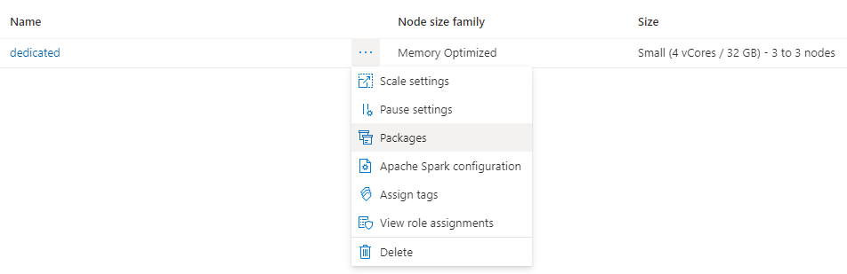

# Track Azure Synapse Analytics ML experiments with MLflow and Azure Machine Learning

In this article, learn how to enable MLflow to connect to Azure Machine Learning while working in an Azure Synapse Analytics workspace. You can leverage this configuration for tracking, model management and model deployment.

[MLflow](https://www.mlflow.org) is an open-source library for managing the life cycle of your machine learning experiments. MLFlow Tracking is a component of MLflow that logs and tracks your training run metrics and model artifacts. Learn more about [MLflow](concept-mlflow.md). 

If you have an MLflow Project to train with Azure Machine Learning, see [Train ML models with MLflow Projects and Azure Machine Learning (preview)](how-to-train-mlflow-projects.md).

## Prerequisites

* An [Azure Synapse Analytics workspace and cluster](/azure/synapse-analytics/quickstart-create-workspace.md).
* An [Azure Machine Learning Workspace](quickstart-create-resources.md).

## Install libraries

To install libraries on your dedicated cluster in Azure Synapse Analytics:

1. Create a `requirements.txt` file with the packages your experiments requires, but making sure it also includes the following packages:

    __requirements.txt__

    ```pip
    mlflow
    azureml-mlflow
    azure-ai-ml
    ```

3. Navigate to Azure Analytics Workspace portal.

4. Navigate to the **Manage** tab and select **Apache Spark Pools**.

5. Click the three dots next to the cluster name, and select **Packages**.

    

6. On the **Requirements files** section, click on **Upload**.

7. Upload the `requirements.txt` file.

8. Wait for your cluster to restart.

## Track experiments with MLflow

Azure Synapse Analytics can be configured to track experiments using MLflow to Azure Machine Learning workspace. Azure Machine Learning provides a centralized repository to manage the entire lifecycle of experiments, models and deployments. It also has the advantage of enabling easier path to deployment using Azure Machine Learning deployment options.

### Configuring your notebooks to use MLflow connected to Azure Machine Learning

To use Azure Machine Learning as your centralized repository for experiments, you can leverage MLflow. On each notebook where you are working on, you have to configure the tracking URI to point to the workspace you will be using. The following example shows how it can be done:

   # [Using the Azure ML SDK v2](#tab/sdkv2)
   
   [!INCLUDE [dev v2](../../includes/machine-learning-dev-v2.md)]
   
   You can get the Azure ML MLflow tracking URI using the [Azure Machine Learning SDK v2 for Python](concept-v2.md). Ensure you have the library `azure-ai-ml` installed in the cluster you're using:
   
   ```python
   from azure.ai.ml import MLClient
   from azure.identity import DeviceCodeCredential
   
   subscription_id = ""
   aml_resource_group = ""
   aml_workspace_name = ""
   
   ml_client = MLClient(credential=DeviceCodeCredential(),
                        subscription_id=subscription_id, 
                        resource_group_name=aml_resource_group)
                        
   azureml_mlflow_uri = ml_client.workspaces.get(aml_workspace_name).mlflow_tracking_uri
   mlflow.set_tracking_uri(azureml_mlflow_uri)
   ```
   
   # [Building the MLflow tracking URI](#tab/custom)
   
   The Azure Machine Learning Tracking URI can be constructed using the subscription ID, region of where the resource is deployed, resource group name and workspace name. The following code sample shows how:
   
   ```python
   import mlflow

   aml_region = ""
   subscription_id = ""
   aml_resource_group = ""
   aml_workspace_name = ""

   azureml_mlflow_uri = f"azureml://{aml_region}.api.azureml.ms/mlflow/v1.0/subscriptions/{subscription_id}/resourceGroups/{aml_resource_group}/providers/Microsoft.MachineLearningServices/workspaces/{aml_workspace_name}"
   mlflow.set_tracking_uri(azureml_mlflow_uri)
   ```
   
   > [!NOTE]
   > You can also get this URL by: 
   > 1. Navigate to the [Azure ML Studio web portal](https://ml.azure.com).
   > 2. Click on the uper-right corner of the page -> View all properties in Azure Portal -> MLflow tracking URI.
   > 3. Copy the URI and use it with the method `mlflow.set_tracking_uri`.

   ---

### Experiment's names in Azure Machine Learning

By default, Azure Machine Learning tracks runs in a default experiment called `Default`. It is usually a good idea to set the experiment you will be going to work on. Use the following syntax to set the experiment's name:

```python
mlflow.set_experiment(experiment_name="experiment-name")
```

### Tracking parameters, metrics and artifacts

You can use then MLflow in Azure Synapse Analytics in the same way as you're used to. For details see [Log & view metrics and log files](how-to-log-view-metrics.md).

## Registering models in the registry with MLflow

Models can be registered in Azure Machine Learning workspace, which offers a centralized repository to manage their lifecycle. The following example logs a model trained with Spark MLLib and also registers it in the registry.

```python
mlflow.spark.log_model(model, 
                       artifact_path = "model", 
                       registered_model_name = "model_name")  
```

* **If a registered model with the name doesn’t exist**, the method registers a new model, creates version 1, and returns a ModelVersion MLflow object. 

* **If a registered model with the name already exists**, the method creates a new model version and returns the version object. 

You can manage models registered in Azure Machine Learning using MLflow. View [Manage models registries in Azure Machine Learning with MLflow](how-to-manage-models-mlflow.md) for more details.

## Deploying and consuming models registered in Azure Machine Learning

Models registered in Azure Machine Learning Service using MLflow can be consumed as: 

* An Azure Machine Learning endpoint (real-time and batch): This deployment allows you to leverage Azure Machine Learning deployment capabilities for both real-time and batch inference in Azure Container Instances (ACI), Azure Kubernetes (AKS) or our Managed Endpoints. 

* MLFlow model objects or Pandas UDFs, which can be used in Azure Synapse Analytics notebooks in streaming or batch pipelines.

### Deploy models to Azure Machine Learning endpoints 
You can leverage the `azureml-mlflow` plugin to deploy a model to your Azure Machine Learning workspace. Check [How to deploy MLflow models](how-to-deploy-mlflow-models.md) page for a complete detail about how to deploy models to the different targets.

> [!IMPORTANT]
> Models need to be registered in Azure Machine Learning registry in order to deploy them. Deployment of unregistered models is not supported in Azure Machine Learning.

### Deploy models for batch scoring using UDFs

You can choose Azure Synapse Analytics clusters for batch scoring. The MLFlow model is loaded and used as a Spark Pandas UDF to score new data. 

```python
from pyspark.sql.types import ArrayType, FloatType 

model_uri = "runs:/"+last_run_id+ {model_path} 

#Create a Spark UDF for the MLFlow model 
pyfunc_udf = mlflow.pyfunc.spark_udf(spark, model_uri) 

#Load Scoring Data into Spark Dataframe 
scoreDf = spark.table({table_name}).where({required_conditions}) 

#Make Prediction 
preds = (scoreDf 
           .withColumn('target_column_name', pyfunc_udf('Input_column1', 'Input_column2', ' Input_column3', …)) 
        ) 

display(preds) 
```

## Clean up resources

If you wish to keep your Azure Synapse Analytics workspace, but no longer need the Azure ML workspace, you can delete the Azure ML workspace. If you don't plan to use the logged metrics and artifacts in your workspace, the ability to delete them individually is unavailable at this time. Instead, delete the resource group that contains the storage account and workspace, so you don't incur any charges:

1. In the Azure portal, select **Resource groups** on the far left.

   

1. From the list, select the resource group you created.

1. Select **Delete resource group**.

1. Enter the resource group name. Then select **Delete**.


## Next steps
* [Track experiment runs with MLflow and Azure Machine Learning](how-to-use-mlflow.md). 
* [Deploy MLflow models in Azure Machine Learning](how-to-deploy-mlflow-models.md). 
* [Manage your models with MLflow](how-to-manage-models-mlflow.md).
