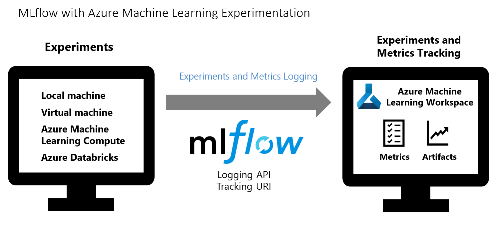
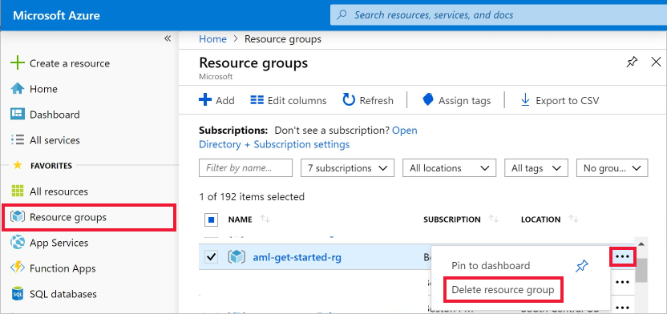

# Train and track ML models with MLflow and Azure Machine Learning (preview)

In this article, learn how to enable MLflow's tracking URI and logging API, collectively known as [MLflow Tracking](https://mlflow.org/docs/latest/quickstart.html#using-the-tracking-api), to connect Azure Machine Learning as the backend of your MLflow experiments. 

Supported capabilities include: 

+ Track and log experiment metrics and artifacts in your [Azure Machine Learning workspace](./concept-azure-machine-learning-architecture.md#workspace). If you already use MLflow Tracking for your experiments, the workspace provides a centralized, secure, and scalable location to store training metrics and models.

+ Submit training jobs with [MLflow Projects](https://www.mlflow.org/docs/latest/projects.html) with Azure Machine Learning backend support (preview). You can submit jobs locally with Azure Machine Learning tracking or migrate your runs to the cloud like via an [Azure Machine Learning Compute](./how-to-create-attach-compute-cluster.md).

+ Track and manage models in MLflow and Azure Machine Learning model registry.

[MLflow](https://www.mlflow.org) is an open-source library for managing the life cycle of your machine learning experiments. MLFlow Tracking is a component of MLflow that logs and tracks your training run metrics and model artifacts, no matter your experiment's environment--locally on your computer, on a remote compute target, a virtual machine, or an [Azure Databricks cluster](how-to-use-mlflow-azure-databricks.md). 

>[!NOTE]
> As an open source library, MLflow changes frequently. As such, the functionality made available via the Azure Machine Learning and MLflow integration should be considered as a preview, and not fully supported by Microsoft.

The following diagram illustrates that with MLflow Tracking, you track an experiment's run metrics and store model artifacts in your Azure Machine Learning workspace.



> [!TIP]
> The information in this document is primarily for data scientists and developers who want to monitor the model training process. If you are an administrator interested in monitoring resource usage and events from Azure Machine Learning, such as quotas, completed training runs, or completed model deployments, see [Monitoring Azure Machine Learning](monitor-azure-machine-learning.md).

## Compare MLflow and Azure Machine Learning clients

 The following table summarizes the different clients that can use Azure Machine Learning, and their respective function capabilities.

 MLflow Tracking offers metric logging and artifact storage functionalities that are only otherwise available via the [Azure Machine Learning Python SDK](/python/api/overview/azure/ml/intro).

| Capability | MLflow Tracking & Deployment | Azure Machine Learning Python SDK |  Azure Machine Learning CLI | Azure Machine Learning studio|
|---|---|---|---|---|
| Manage workspace |   | ✓ | ✓ | ✓ |
| Use data stores  |   | ✓ | ✓ | |
| Log metrics      | ✓ | ✓ |   | |
| Upload artifacts | ✓ | ✓ |   | |
| View metrics     | ✓ | ✓ | ✓ | ✓ |
| Manage compute   |   | ✓ | ✓ | ✓ |
| Deploy models    | ✓ | ✓ | ✓ | ✓ |
|Monitor model performance||✓|  |   |
| Detect data drift |   | ✓ |   | ✓ |

## Prerequisites

* Install the `azureml-mlflow` package. 
    * This package automatically brings in `azureml-core` of the [The Azure Machine Learning Python SDK](/python/api/overview/azure/ml/install), which provides the connectivity for MLflow to access your workspace.
* [Create an Azure Machine Learning Workspace](how-to-manage-workspace.md).
    * See which [access permissions you need to perform your MLflow operations with your workspace](how-to-assign-roles.md#mlflow-operations).

## Track local runs

MLflow Tracking with Azure Machine Learning lets you store the logged metrics and artifacts from your local runs into your Azure Machine Learning workspace.

Import the `mlflow` and [`Workspace`](/python/api/azureml-core/azureml.core.workspace%28class%29) classes to access MLflow's tracking URI and configure your workspace.

In the following code, the `get_mlflow_tracking_uri()` method assigns a unique tracking URI address to the workspace, `ws`, and `set_tracking_uri()` points the MLflow tracking URI to that address.

```Python
import mlflow
from azureml.core import Workspace

ws = Workspace.from_config()

mlflow.set_tracking_uri(ws.get_mlflow_tracking_uri())
```

>[!NOTE]
>The tracking URI is valid up to an hour or less. If you restart your script after some idle time, use the get_mlflow_tracking_uri API to get a new URI.

Set the MLflow experiment name with `set_experiment()` and start your training run with `start_run()`. Then use `log_metric()` to activate the MLflow logging API and begin logging your training run metrics.

```Python
experiment_name = 'experiment_with_mlflow'
mlflow.set_experiment(experiment_name)

with mlflow.start_run():
    mlflow.log_metric('alpha', 0.03)
```

## Track remote runs

Remote runs let you train your models on more powerful computes, such as GPU enabled virtual machines, or Machine Learning Compute clusters. See [Use compute targets for model training](how-to-set-up-training-targets.md) to learn about different compute options.

MLflow Tracking with Azure Machine Learning lets you store the logged metrics and artifacts from your remote runs into your Azure Machine Learning workspace. Any run with MLflow Tracking code in it will have metrics logged automatically to the workspace. 

The following example conda environment includes `mlflow` and `azureml-mlflow` as pip packages. 


```yaml
name: sklearn-example
dependencies:
  - python=3.6.2
  - scikit-learn
  - matplotlib
  - numpy
  - pip:
    - azureml-mlflow
    - numpy
```

In your script, configure your compute and training run environment with the [`Environment`](/python/api/azureml-core/azureml.core.environment.environment) class. Then, construct  [`ScriptRunConfig`](/python/api/azureml-core/azureml.core.script_run_config.scriptrunconfig) with your remote compute as the compute target.

```Python
import mlflow

with mlflow.start_run():
    mlflow.log_metric('example', 1.23)
```

With this compute and training run configuration, use the `Experiment.submit()` method to submit a run. This method automatically sets the MLflow tracking URI and directs the logging from MLflow to your Workspace.

```Python
run = exp.submit(src)
```

## Train with MLflow Projects

[MLflow Projects](https://mlflow.org/docs/latest/projects.html) allow for you to organize and describe your code to let other data scientists (or automated tools) run it. MLflow Projects with Azure Machine Learning enables you to track and manage your training runs in your workspace. 

This example shows how to submit MLflow projects locally with Azure Machine Learning tracking.

Install the `azureml-mlflow` package to use MLflow Tracking with Azure Machine Learning on your experiments locally. Your experiments can run via a Jupyter Notebook or code editor.

```shell
pip install azureml-mlflow
```

Import the `mlflow` and [`Workspace`](/python/api/azureml-core/azureml.core.workspace%28class%29) classes to access MLflow's tracking URI and configure your workspace.

```Python
import mlflow
from azureml.core import Workspace

ws = Workspace.from_config()

mlflow.set_tracking_uri(ws.get_mlflow_tracking_uri())
```

Set the MLflow experiment name with `set_experiment()` and start your training run with `start_run()`. Then, use `log_metric()` to activate the MLflow logging API and begin logging your training run metrics.

```Python
experiment_name = 'experiment-with-mlflow-projects'
mlflow.set_experiment(experiment_name)
```

Create the backend configuration object to store necessary information for the integration such as, the compute target and which type of managed environment to use.

```python
backend_config = {"USE_CONDA": False}
```
Add the `azureml-mlflow` package as a pip dependency to your environment configuration file in order to track metrics and key artifacts in your workspace. 

``` shell
name: mlflow-example
channels:
  - defaults
  - anaconda
  - conda-forge
dependencies:
  - python=3.6
  - scikit-learn=0.19.1
  - pip
  - pip:
    - mlflow
    - azureml-mlflow
```
Submit the local run and ensure you set the parameter `backend = "azureml" `. With this setting, you can submit runs locally and get the added support of automatic output tracking, log files, snapshots, and printed errors in your workspace. 

View your runs and metrics in the [Azure Machine Learning studio](overview-what-is-machine-learning-studio.md). 


```python
local_env_run = mlflow.projects.run(uri=".", 
                                    parameters={"alpha":0.3},
                                    backend = "azureml",
                                    use_conda=False,
                                    backend_config = backend_config, 
                                    )

```

## View metrics and artifacts in your workspace

The metrics and artifacts from MLflow logging are kept in your workspace. To view them anytime, navigate to your workspace and find the experiment by name in your workspace in [Azure Machine Learning studio](https://ml.azure.com).  Or run the below code. 

```python
run.get_metrics()
```

## Manage models 

Register and track your models with the [Azure Machine Learning model registry](concept-model-management-and-deployment.md#register-package-and-deploy-models-from-anywhere) which supports the MLflow model registry. Azure Machine Learning models are aligned with the MLflow model schema making it easy to export and import these models across different workflows. The MLflow related metadata such as, run ID is also tagged with the registered model for traceability. Users can submit training runs, register, and deploy models produced from MLflow runs. 

If you want to deploy and register your production ready model in one step, see [Deploy and register MLflow models](how-to-deploy-mlflow-models.md).

To register and view a model from a run, use the following steps:

1. Once the run is complete call the `register_model()` method.

    ```python
    # the model folder produced from the run is registered. This includes the MLmodel file, model.pkl and the conda.yaml.
    run.register_model(model_name = 'my-model', model_path = 'model')
    ```

1. View the registered model in your workspace with [Azure Machine Learning studio](overview-what-is-machine-learning-studio.md).

    In the following example the registered model, `my-model` has MLflow tracking metadata tagged. 

    

1. Select the **Artifacts** tab to see all the model files that align with the MLflow model schema (conda.yaml, MLmodel, model.pkl).

    

1. Select MLmodel to see the MLmodel file generated by the run.

    


## Clean up resources

If you don't plan to use the logged metrics and artifacts in your workspace, the ability to delete them individually is currently unavailable. Instead, delete the resource group that contains the storage account and workspace, so you don't incur any charges:

1. In the Azure portal, select **Resource groups** on the far left.

   

1. From the list, select the resource group you created.

1. Select **Delete resource group**.

1. Enter the resource group name. Then select **Delete**.

## Example notebooks

The [MLflow with Azure ML notebooks](https://github.com/Azure/MachineLearningNotebooks/tree/master/how-to-use-azureml/track-and-monitor-experiments/using-mlflow) demonstrate and expand upon concepts presented in this article.

> [!NOTE]
> A community-driven repository of examples using mlflow can be found at https://github.com/Azure/azureml-examples.

## Next steps

* [Deploy models with MLflow](how-to-deploy-mlflow-models.md).
* Monitor your production models for [data drift](./how-to-enable-data-collection.md).
* [Track Azure Databricks runs with MLflow](how-to-use-mlflow-azure-databricks.md).
* [Manage your models](concept-model-management-and-deployment.md).