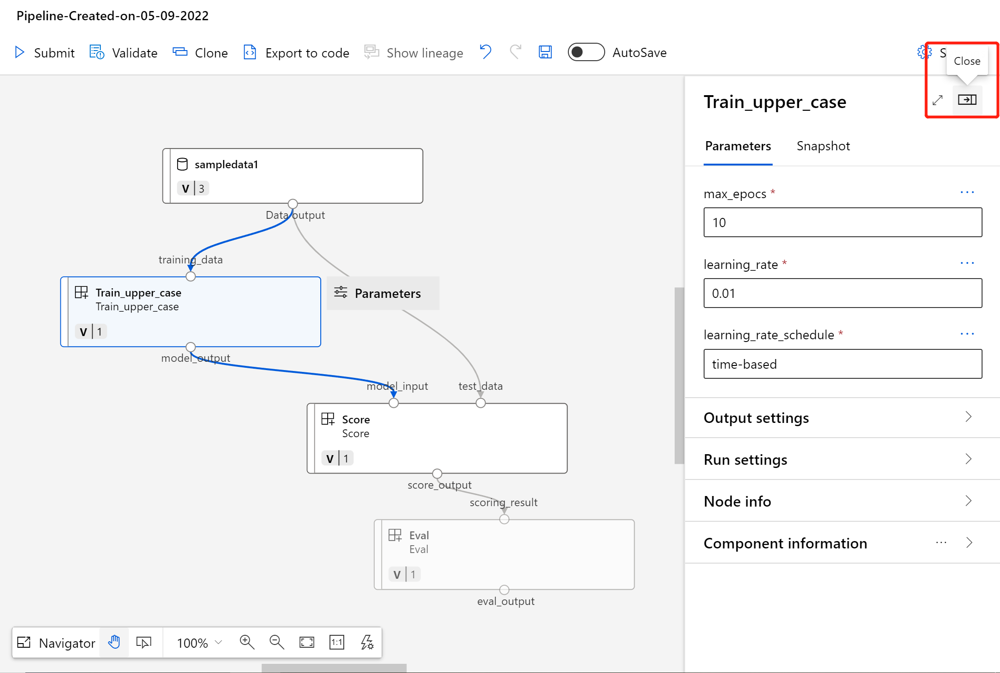
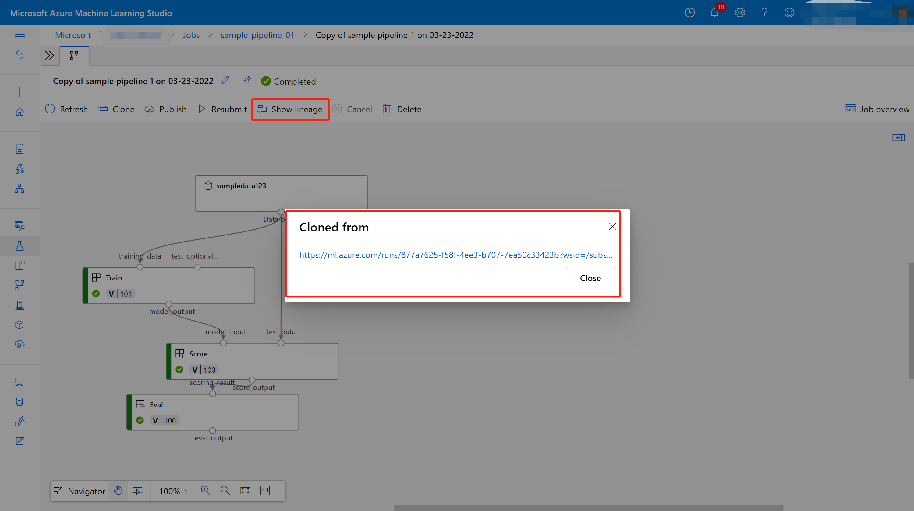
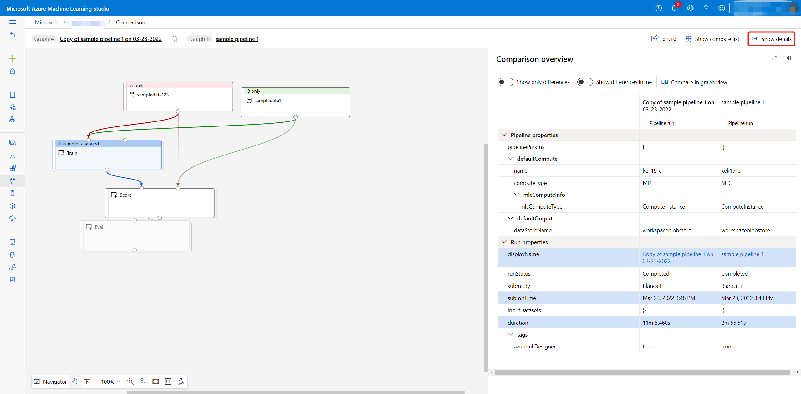
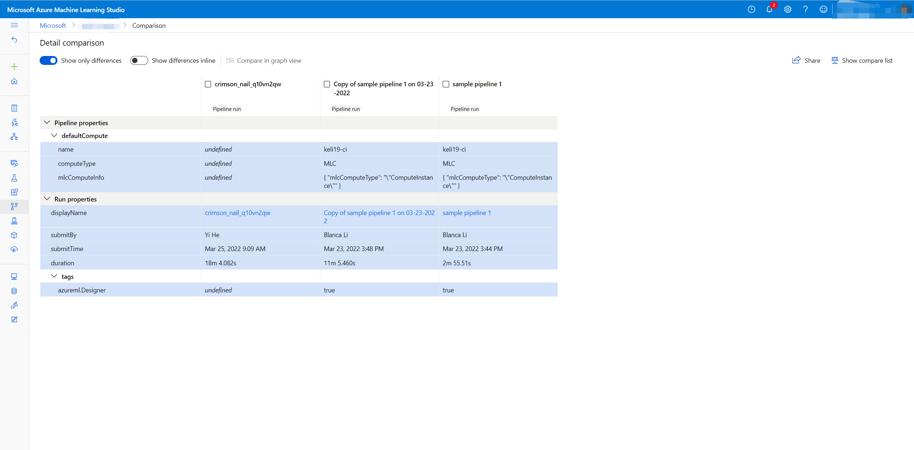

# How to use studio UI to build and debug Azure Machine Learning pipelines

Azure Machine Learning studio provides UI to build and debug your pipeline. You can use components to author a pipeline in the designer, and you can debug your pipeline in the job detail page.

This article will introduce how to use the studio UI to build and debug machine learning pipelines.

## Build machien learning pipeline

<!-- *************
Custom component
Asset library
Subgraph actions/Tab view (Post GA)
Right pane
************* -->

### Drag and drop components to build pipeline

In the designer homepage, you can click "New" to open a blank pipeline draft. 

In the asset library left to the canvas, there are "Component" and "Data" tab, which contains components and data registered to the workspace. Under "Component" tab, there are built-in components and custom components. For how to create custom component, you can refer to [this article](concept-component.md). 

Then you can use drag and drop either built-in components or custom components to the canvas. You can always hide the right pane to construct your pipeline first, and then open the right pane to configure your component.

> [!NOTE]
> Currently built-in components and custom components cannot be used together.
>

<!-- #### Pipeline component - Post GA

If your pipeline contains too many components, you can multi-select some components for the same purpose like a bunch of components for data preprocessing, and group them into a pipeline component.

 -->

### Submit pipeline

<!-- *************
submission list
************* -->

After you submit your pipeline job, you will see a submitted job list in the left pane, which shows all the pipeline job you create from the current pipeline draft in the same session. There is also notification popping up from the notification center. You can click throught the pipeline job link in the submission list or the notification for further debugging.

> [!NOTE]
> Pipeline job status and resuls will not be filled back to the authoring page.
> You can continuouly submit jobs from the same pipeline draft, without having to wait for the previous job completes.

> [!NOTE]
> The submission list only contains jobs submitted in the same session.
> If you refresh current page, it will not preserve the previous submitted job list.

In pipeline job detail page, you can check status of the overall job and each node inside, as well as logs of each node.

## Debug your pipeline in job detail page

<!-- *************
Outline
Quick filter, sort (for step view users)
Profiling (Tuning pipeline performance)
************* -->

### Using outline to quickly find node

In pipeline job detail page, there is an outline left to the canvas, which shows the overall structure of your pipeline job. Hoverring on any row, you can click the "Locate" button to locate that node in the canvas.

You can also quickly filter failed or completed nodes, or filter only components or dataset for further search. Then the left pane will show matched nodes with richer information including status, duration, and created time.

You can also sort the filted nodes.

### Check logs and outputs of component

If your pipeline fails or gets stuck on some node, taking a look at logs are firstly recommended. 

1. You can select the specific node and open the right pane.

1. Select **Outputs+logs** tab and you can explore all the outputs and logs of this node.

    The **user_logs folder** contains information about user code generated logs. This folder is open by default, and the **std_log.txt** log is selected. The **std_log.txt** is where your code's logs (for example, print statements) show up.
    
    The **system_logs folder** contains logs generated by Azure Machine Learning. Learn more about [how to view and download log files for a run](how-to-log-view-metrics.md#view-and-download-log-files-for-a-run).

    
    

    If you do not see those folders, this is due to the compute run time update is not released to the compute cluster yet, and you can look at **70_driver_log.txt** under **azureml-logs** folder first.

    

<!-- ### Understand your pipeline job performance

If you would like to optimize your pipeline performance, you might need to firstly understand which part of pipeline cost compute time most. 

In pipeline UI, you can understand youe pipeline job performance leveraging "Profiling".

You can click "Profiling" button above canvas. Then you can check the detailed perfomance analysis of your pipeline job.

By default it will show the critical path of your whole pipeline job. Critical path is a series of child jobs (or sometimes only a single job) that controls the calculated start or complete time of the pipeline. The child jobs that make up the critical path are typically interrelated by job dependencies. When the last job in the critical path is completed, the pipeline is also completed. -->

## Clone a pipeline job to continue editing

<!-- *************
Find and replace (Post GA)
Show lineage
************* -->

If you would like to work based on an existing pipeline job in the workspace, you can easily clone it into a new pipeline draft to continue editing.

After cloning, you can also know which pipeline job it is cloned from by clicking **Showing lineage**.

You can edit your pipeline and then submit again. After submitting, you can also easily the lineage between the job you submit and the original job by **Show lineage**.

## Compare pipelines

<!-- *************
Compare
************* -->

When you have multiple pipeline jobs for the same project but with different settings, you can easily compare the graph structure, piepline configurations, component configurations, and pipeline job properties in the studio portal.

1. In each detail page of pipeline jobs you would like to compare, select **Add to compare**.

    Select **Show compare list** and you will see all the selected pipeline jobs. You can also remove jobs which you do not need to compare anymore.
    

1. In the compare list, if you want to see the piepline graph structure comparison result first, you can select the two pipeline jobs you want to compare, and then select **Compare graph** to compare graph structure and components in the graph.
    > [!NOTE]
    > Currently **Compare graph** only supports comparing **2** pipeline jobs.
    >  **Compare detail** supports multiple pipelines comparison.

    

    In the screenshot above, you can see the detailed difference of each node in the two pipelines your compare.
    - The red and green color mean those nodes only occurs in Copy of sample pipeline1 and sample pipeline 1 respectively. 
    - The "Train" node shows that it has parameter changed. You can select that node to see which parameters are changed. The blue lines are different values for same parameters.
        

    In the comparison page, you can select **Show details** to see the difference of the two pipeline job properties.

    By default, in the comparison table, it will only show difference and show difference inline, and you can uncheck on the top of comparison table.

    

1. If you want to directly see the difference of pipeline job properties, in the compare list, you can select **Compare detail**. 

    

    Then it will show job property comparison detail.

    

    From the detail comparison list, you can also select two pipeline jobs to compare the graph.

    

## Next steps

In this article, you learned the key features in how to create, explore and debug a pipeline in UI. To learn more about how you can use the pipeline, see the following links:

+ [How to train a model in the designer](tutorial-designer-automobile-price-train-score.md)
+ [How to deploy model to real-time endpoint in the designer](tutorial-designer-automobile-price-deploy.md)
+ [What is machine learning component](concept-component.md)

