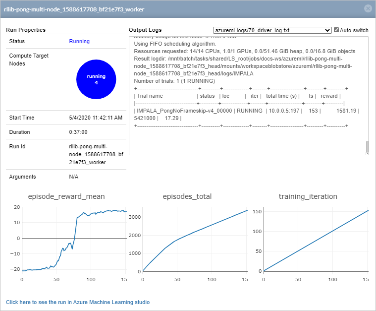

# Reinforcement learning (preview) with Azure Machine Learning

[!INCLUDE [applies-to-skus](../../includes/aml-applies-to-basic-enterprise-sku.md)]

> [!NOTE]
> Azure Machine Learning Reinforcement Learning is currently a preview feature. Only Ray and RLlib frameworks are supported at this time.

In this article, you learn how to train a reinforcement learning (RL) agent to play the video game Pong. You will use the open-source Python library [Ray RLlib](https://ray.readthedocs.io/en/master/rllib.html) with Azure Machine Learning to manage the complexity of distributed RL jobs.

In this article you will learn how to:
> [!div class="checklist"]
> * Set up an experiment
> * Define head and worker nodes
> * Create an RL estimator
> * Submit an experiment to start a run
> * View results

This article is based on the [RLlib Pong example](https://aka.ms/azureml-rl-pong) that can be found in the Azure Machine Learning notebook [GitHub repository](https://aka.ms/azureml-rl-notebooks).

## Prerequisites

Run this code in either of the following environments. We recommend that you try Azure Machine Learning compute instance for the fastest start-up experience. The reinforcement sample notebooks are available to quickly clone and run on Azure Machine Learning compute instance.

 - Azure Machine Learning compute instance

     - Learn how to clone sample notebooks in [Tutorial: Setup environment and workspace](tutorial-1st-experiment-sdk-setup.md).
         - Clone the **how-to-use-azureml** folder instead of **tutorials**
     - Run the virtual network setup notebook located at `/how-to-use-azureml/reinforcement-learning/setup/devenv_setup.ipynb` to open network ports used for distributed reinforcement learning.
     - Run the sample notebook `/how-to-use-azureml/reinforcement-learning/atari-on-distributed-compute/pong_rllib.ipynb`
 
 - Your own Jupyter Notebook server

    - Install the [Azure Machine Learning SDK](https://docs.microsoft.com/python/api/overview/azure/ml/install?view=azure-ml-py).
    - Install the [Azure Machine Learning RL SDK](https://docs.microsoft.com/python/api/azureml-contrib-reinforcementlearning/?view=azure-ml-py): `pip install --upgrade azureml-contrib-reinforcementlearning`
    - Create a [workspace configuration file](how-to-configure-environment.md#workspace).
    - Run the virtual network [setup notebook](https://aka.ms/azure-rl-env-setup) to open network ports used for distributed reinforcement learning.


## How to train a Pong-playing agent

Reinforcement learning (RL) is an approach to machine learning that learns by doing. While other machine learning techniques learn by passively taking input data and finding patterns within it, RL uses **training agents** to actively make decisions and learn from their outcomes.

Your training agents learn to play Pong in a **simulated environment**. Training agents make a decision every frame of the game to move the paddle up, down, or stay in place. It looks at the state of the game (an RGB image of the screen) to make a decision.

RL uses **rewards** to tell the agent if its decisions are successful. In this environment, the agent gets a positive reward when it scores a point and a negative reward when a point is scored against it. Over many iterations, the training agent learns to choose the action, based on its current state, that optimizes for the sum of expected future rewards.

It's common to use a **deep neural network** (DNN) model to perform this optimization in RL. Initially, the learning agent will perform poorly, but every game will generate additional samples to further improve the model.

Training ends when the agent reaches an average reward score of 18 in a training epoch. This means that the agent has beaten its opponent by an average of at least 18 points in matches up to 21.

The process of iterating through simulation and retraining a DNN is computationally expensive, and requires large amounts of data. One way to improve performance of RL jobs is by **parallelizing work** so that multiple training agents can act and learn simultaneously. However, managing a distributed RL environment can be a complex undertaking.

Azure Machine Learning provides the framework to manage these complexities to scale out your RL workloads.

## Set up the environment

Set up the local RL environment by loading the required Python packages, initializing your workspace, creating an experiment, and specifying a configured virtual network.

### Import libraries

Import the necessary Python packages to run the rest of this example.

```python
# Azure ML Core imports
import azureml.core
from azureml.core import Workspace
from azureml.core import Experiment
from azureml.core.compute import AmlCompute
from azureml.core.compute import ComputeTarget
from azureml.core.runconfig import EnvironmentDefinition
from azureml.widgets import RunDetails
from azureml.tensorboard import Tensorboard

# Azure ML Reinforcement Learning imports
from azureml.contrib.train.rl import ReinforcementLearningEstimator, Ray
from azureml.contrib.train.rl import WorkerConfiguration
```

### Initialize a workspace

The [Azure Machine Learning workspace](concept-workspace.md) is the top-level resource for Azure Machine Learning. It provides you with a centralized place to work with all the artifacts you create.

Initialize a workspace object from the `config.json` file created in the [prerequisites section](#prerequisites). If you are executing this code in an Azure Machine Learning Compute Instance, the configuration file has already been created for you.

```Python
ws = Workspace.from_config()
```

### Create a reinforcement learning experiment

Create an [experiment](https://docs.microsoft.com/python/api/azureml-core/azureml.core.experiment.experiment?view=azure-ml-py) to track your reinforcement learning run. In Azure Machine Learning, experiments are logical collections of related trials to organize run logs, history, outputs, and more.

```python
experiment_name='rllib-pong-multi-node'

exp = Experiment(workspace=ws, name=experiment_name)
```

### Specify a virtual network

For RL jobs that use multiple compute targets, you must specify a virtual network with open ports that allow worker nodes and head nodes to communicate with each other. The virtual network can be in any resource group, but it should be in the same region as your workspace. For more information on setting up your virtual network, see the [workspace setup notebook](https://aka.ms/azure-rl-env-setup) that can found in the prerequisites section. Here, you specify the name of the virtual network in your resource group.

```python
vnet = 'your_vnet'
```

## Define head and worker compute targets

This example uses separate compute targets for the Ray head and workers nodes. These settings let you scale your compute resources up and down depending on the expected workload. Set the number of nodes, and the size of each node, based on your experiment's needs.

### Head computing target

This example uses a GPU-equipped head cluster to optimize deep learning performance. The head node trains the neural network that the agent uses to make decisions. The head node also collects data points from the worker nodes to further train the neural network.

The head compute uses a single [`STANDARD_NC6` virtual machine](https://docs.microsoft.com/azure/virtual-machines/nc-series) (VM). It has 6 virtual CPUs, which means that it can distribute work across 6 working CPUs.


```python
from azureml.core.compute import AmlCompute, ComputeTarget

# choose a name for the Ray head cluster
head_compute_name = 'head-gpu'
head_compute_min_nodes = 0
head_compute_max_nodes = 2

# This example uses GPU VM. For using CPU VM, set SKU to STANDARD_D2_V2
head_vm_size = 'STANDARD_NC6'

if head_compute_name in ws.compute_targets:
    head_compute_target = ws.compute_targets[head_compute_name]
    if head_compute_target and type(head_compute_target) is AmlCompute:
        print(f'found head compute target. just use it {head_compute_name}')
else:
    print('creating a new head compute target...')
    provisioning_config = AmlCompute.provisioning_configuration(vm_size = head_vm_size,
                                                                min_nodes = head_compute_min_nodes, 
                                                                max_nodes = head_compute_max_nodes,
                                                                vnet_resourcegroup_name = ws.resource_group,
                                                                vnet_name = vnet_name,
                                                                subnet_name = 'default')

    # create the cluster
    head_compute_target = ComputeTarget.create(ws, head_compute_name, provisioning_config)
    
    # can poll for a minimum number of nodes and for a specific timeout. 
    # if no min node count is provided it will use the scale settings for the cluster
    head_compute_target.wait_for_completion(show_output=True, min_node_count=None, timeout_in_minutes=20)
    
     # For a more detailed view of current AmlCompute status, use get_status()
    print(head_compute_target.get_status().serialize())
```

### Worker computing cluster

This example uses four [`STANDARD_D2_V2` VMs](https://docs.microsoft.com/azure/virtual-machines/nc-series) for the worker compute target. Each worker node has 2 available CPUs for a total of 8 available CPUs to parallelize work.

GPUs aren't necessary for the worker nodes since they aren't performing deep learning. The workers run the game simulations and collect data.

```python
# choose a name for your Ray worker cluster
worker_compute_name = 'worker-cpu'
worker_compute_min_nodes = 0 
worker_compute_max_nodes = 4

# This example uses CPU VM. For using GPU VM, set SKU to STANDARD_NC6
worker_vm_size = 'STANDARD_D2_V2'

# Create the compute target if it hasn't been created already
if worker_compute_name in ws.compute_targets:
    worker_compute_target = ws.compute_targets[worker_compute_name]
    if worker_compute_target and type(worker_compute_target) is AmlCompute:
        print(f'found worker compute target. just use it {worker_compute_name}')
else:
    print('creating a new worker compute target...')
    provisioning_config = AmlCompute.provisioning_configuration(vm_size = worker_vm_size,
                                                                min_nodes = worker_compute_min_nodes, 
                                                                max_nodes = worker_compute_max_nodes,
                                                                vnet_resourcegroup_name = ws.resource_group,
                                                                vnet_name = vnet_name,
                                                                subnet_name = 'default')

    # create the cluster
    worker_compute_target = ComputeTarget.create(ws, worker_compute_name, provisioning_config)
    
    # can poll for a minimum number of nodes and for a specific timeout. 
    # if no min node count is provided it will use the scale settings for the cluster
    worker_compute_target.wait_for_completion(show_output=True, min_node_count=None, timeout_in_minutes=20)
    
     # For a more detailed view of current AmlCompute status, use get_status()
    print(worker_compute_target.get_status().serialize())
```

## Create a reinforcement learning estimator

In this section, you learn how to use the [ReinforcementLearningEstimator](https://docs.microsoft.com/python/api/azureml-contrib-reinforcementlearning/azureml.contrib.train.rl.reinforcementlearningestimator?view=azure-ml-py) to submit a training job to Azure Machine Learning.

Azure Machine Learning uses estimator classes to encapsulate run configuration information. This lets you easily specify how to configure a script execution. For more information on the Azure Machine Learning estimator pattern, see [How to train models using estimators](how-to-train-ml-models.md).

### Define a worker configuration

The WorkerConfiguration object tells Azure Machine Learning how to initialize the worker cluster that will run the entry script.

```python
# Pip packages we will use for both head and worker
pip_packages=["ray[rllib]==0.8.3"] # Latest version of Ray has fixes for isses related to object transfers

# Specify the Ray worker configuration
worker_conf = WorkerConfiguration(
    
    # Azure ML compute cluster to run Ray workers
    compute_target=worker_compute_target, 
    
    # Number of worker nodes
    node_count=4,
    
    # GPU
    use_gpu=False, 
    
    # PIP packages to use
    pip_packages=pip_packages
)
```

### Define script parameters

The entry script `pong_rllib.py` accepts a list of parameters that defines how to execute the training job. Passing these parameters through the estimator as a layer of encapsulation makes it easy to change script parameters and run configurations independently of each other.

Specifying the correct `num_workers` will make the most out of your parallelization efforts. Set the number of workers to the same as the number of available CPUs. For this example you can calculate this as follows:

The head node is a [Standard_NC6](https://docs.microsoft.com/azure/virtual-machines/nc-series) with 6 vCPUs. The worker cluster is 4 [Standard_D2_V2 VMs](https://docs.microsoft.com/azure/cloud-services/cloud-services-sizes-specs#dv2-series) with 2 CPUs each, for a total of 8 CPUs. However, you must subtract 1 CPU from the worker count since 1 must be dedicated to the head node role. 6 CPUs + 8 CPUs - 1 head CPU = 13 simultaneous workers. Azure Machine Learning uses head and worker clusters to distinguish compute resources. However, Ray does not distinguish between head and workers, and all CPUs are available CPUs for worker thread execution.


```python
training_algorithm = "IMPALA"
rl_environment = "PongNoFrameskip-v4"

# Training script parameters
script_params = {
    
    # Training algorithm, IMPALA in this case
    "--run": training_algorithm,
    
    # Environment, Pong in this case
    "--env": rl_environment,
    
    # Add additional single quotes at the both ends of string values as we have spaces in the 
    # string parameters, outermost quotes are not passed to scripts as they are not actually part of string
    # Number of GPUs
    # Number of ray workers
    "--config": '\'{"num_gpus": 1, "num_workers": 13}\'',
    
    # Target episode reward mean to stop the training
    # Total training time in seconds
    "--stop": '\'{"episode_reward_mean": 18, "time_total_s": 3600}\'',
}
```

### Define the reinforcement learning estimator

Use the parameter list and the worker configuration object to construct the estimator.

```python
# RL estimator
rl_estimator = ReinforcementLearningEstimator(
    
    # Location of source files
    source_directory='files',
    
    # Python script file
    entry_script="pong_rllib.py",
    
    # Parameters to pass to the script file
    # Defined above.
    script_params=script_params,
    
    # The Azure ML compute target set up for Ray head nodes
    compute_target=head_compute_target,
    
    # Pip packages
    pip_packages=pip_packages,
    
    # GPU usage
    use_gpu=True,
    
    # RL framework. Currently must be Ray.
    rl_framework=Ray(),
    
    # Ray worker configuration defined above.
    worker_configuration=worker_conf,
    
    # How long to wait for whole cluster to start
    cluster_coordination_timeout_seconds=3600,
    
    # Maximum time for the whole Ray job to run
    # This will cut off the run after an hour
    max_run_duration_seconds=3600,
    
    # Allow the docker container Ray runs in to make full use
    # of the shared memory available from the host OS.
    shm_size=24*1024*1024*1024
)
```

### Entry script

The [entry script](https://aka.ms/azure-rl-pong-script) `pong_rllib.py` trains a neural network using the [OpenAI Gym environment](https://github.com/openai/gym/) `PongNoFrameSkip-v4`. OpenAI Gyms are standardized interfaces to test reinforcement learning algorithms on classic Atari games.

This example uses a training algorithm known as [IMPALA](https://arxiv.org/abs/1802.01561) (Importance Weighted Actor-Learner Architecture). IMPALA parallelizes each individual learning actor to scale across many compute nodes without sacrificing speed or stability.

[Ray Tune](https://ray.readthedocs.io/en/latest/tune.html) orchestrates the IMPALA worker tasks.

```python
import ray
import ray.tune as tune
from ray.rllib import train

import os
import sys

from azureml.core import Run
from utils import callbacks

DEFAULT_RAY_ADDRESS = 'localhost:6379'

if __name__ == "__main__":

    # Parse arguments
    train_parser = train.create_parser()

    args = train_parser.parse_args()
    print("Algorithm config:", args.config)

    if args.ray_address is None:
        args.ray_address = DEFAULT_RAY_ADDRESS

    ray.init(address=args.ray_address)

    tune.run(run_or_experiment=args.run,
             config={
                 "env": args.env,
                 "num_gpus": args.config["num_gpus"],
                 "num_workers": args.config["num_workers"],
                 "callbacks": {"on_train_result": callbacks.on_train_result},
                 "sample_batch_size": 50,
                 "train_batch_size": 1000,
                 "num_sgd_iter": 2,
                 "num_data_loader_buffers": 2,
                 "model": {
                    "dim": 42
                 },
             },
             stop=args.stop,
             local_dir='./logs')
```

### Logging callback function


The entry script uses a utility function to define a [custom RLlib callback function](https://docs.ray.io/en/latest/rllib-training.html#callbacks-and-custom-metrics) to log metrics to your Azure Machine Learning workspace. Learn how to view these metrics in the [Monitor and view results](#monitor-and-view-results) section.

```python
'''RLlib callbacks module:
    Common callback methods to be passed to RLlib trainer.
'''
from azureml.core import Run

def on_train_result(info):
    '''Callback on train result to record metrics returned by trainer.
    '''
    run = Run.get_context()
    run.log(
        name='episode_reward_mean',
        value=info["result"]["episode_reward_mean"])
    run.log(
        name='episodes_total',
        value=info["result"]["episodes_total"])
```

## Submit a run

[Run](https://docs.microsoft.com/python/api/azureml-core/azureml.core.run(class)?view=azure-ml-py) handles the run history of in-progress or complete jobs. 

```python
run = exp.submit(config=rl_estimator)
```
> [!NOTE]
> The run may take up to 30 to 45 minutes to complete.

## Monitor and view results

Use the Azure Machine Learning Jupyter widget to see the status of your runs in real time. In this example, the widget shows two child runs: one for head and one for workers. 

```python
from azureml.widgets import RunDetails

RunDetails(run).show()
run.wait_for_completion()
```

1. Wait for the widget to load.
1. Select the head run in the list of runs.

Select **Click here to see the run in Azure Machine Learning studio** for additional run information in the studio. You can access this information while the run is in progress, or after it has completed.



The **episode_reward_mean** plot shows the mean number of points scored per training epoch. You can see that the training agent initially performed poorly, losing its matches without scoring a single point (shown by a reward_mean of -21). Within 100 iterations, the training agent learned to beat the computer opponent by an average of 18 points.

If you browse logs of the child run, you can see the evaluation results recorded in driver_log.txt file. You may need to wait several minutes before these metrics become available on the Run page.

In short work, you have learned to configure multiple compute resources to train a reinforcement learning agent to play Pong very well.

## Next steps

In this article, you learned how to train a reinforcement learning agent using an IMPALA learning agent. To see additional examples, go to the [Azure Machine Learning Reinforcement Learning GitHub repository](https://aka.ms/azureml-rl-notebooks).
