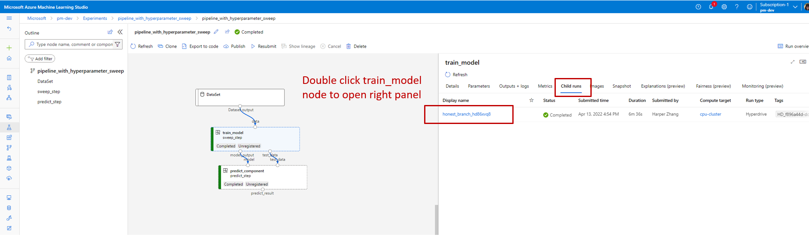
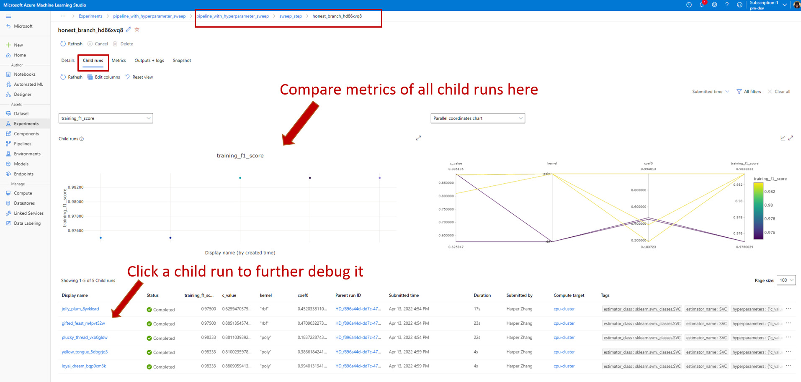
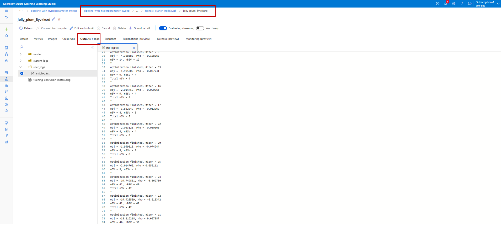

# How to do hyperparameter sweep in pipeline (V2) (preview)


[!INCLUDE [sdk v2](../../includes/machine-learning-sdk-v2.md)]
[!INCLUDE [cli v2](../../includes/machine-learning-cli-v2.md)]

In this article, you will learn how to do hyperparameter sweep in Azure Machine Learning pipeline.

## Prerequisite

1. Understand what is [hyperparameter sweep](how-to-tune-hyperparameters.md#what-is-hyperparameter-tuning), and how to do sweep in Azure Machine Learning start from a single step job. It's highly suggested going through the single step sweep job example to understand how hyperparameter sweep works in Azure Machine Learning, before using it in a pipeline.
2. Understand what a [Azure Machine Learning pipeline](concept-ml-pipelines.md) is and how to build your first pipeline.
3. Build a command component with the [Azure ML CLI v2](how-to-create-component-pipeline-cli) or the [Azure ML Python SDK v2](how-to-create-component-pipeline-python-v2.md)

## How to use sweep in Azure Machine Learning pipeline

This section explains how to use sweep to do hyperparameter tuning in Azure Machine Learning pipeline using CLI v2 and Python SDK(preview). Both approaches share the same prerequisite: you already have a command component created and the command component takes hyperparameters as inputs. If you don't have a command component yet. Follow [this article](link to how-to create component article) to create a command component first.

### CLI v2

[!INCLUDE [cli v2 how to update](../../includes/machine-learning-cli-v2-update-note.md)]

The example used in this article can be found in [azureml-example repo](https://github.com/Azure/azureml-examples). Navigate to *azureml-examples/cli/jobs/pipelines-with-components/pipeline_with_hyperparameter_sweep* to check the example.

Assume you already have a command component defined in `train.yaml`. A two step pipeline job YAML looks like below.

<to-do> remove the hard code YAML after example merge to main

```yaml
$schema: https://azuremlschemas.azureedge.net/latest/pipelineJob.schema.json
type: pipeline
display_name: pipeline_with_hyperparameter_sweep
description: Tune hyperparameters using TF component
settings:
    default_compute: azureml:cpu-cluster
jobs:
  sweep_step:
    type: sweep
    inputs:
      data: 
        type: uri_file
        path: wasbs://datasets@azuremlexamples.blob.core.windows.net/iris.csv
      degree: 3
      gamma: "scale"
      shrinking: False
      probability: False
      tol: 0.001
      cache_size: 1024
      verbose: False
      max_iter: -1
      decision_function_shape: "ovr"
      break_ties: False
      random_state: 42
    outputs:
      model_output:
      test_data:
    sampling_algorithm: random
    trial: file:./train.yml
    search_space:
      c_value:
        type: uniform
        min_value: 0.5
        max_value: 0.9
      kernel:
        type: choice
        values: ["rbf", "linear", "poly"]
      coef0:
        type: uniform
        min_value: 0.1
        max_value: 1
    objective:
      goal: minimize
      primary_metric: training_f1_score
    limits:
      max_total_trials: 5
      max_concurrent_trials: 3
      timeout: 7200

  predict_step:
    type: command
    inputs:
      model: ${{parent.jobs.sweep_step.outputs.model_output}}
      test_data: ${{parent.jobs.sweep_step.outputs.test_data}}
    outputs:
      predict_result:
    component: file:./predict.yml
```


The `sweep_step` is the step for hyperparameter sweep. Step type needs to be `sweep`.  And `trial` refers to the command component defined in `train.yaml`. From the `search sapce` we can see three hyparmeters(`c_value`, `kernel`, and `coef`) are added to the search space. After submitting this pipeline job, Azure Machine Learning will run the trial component multiple times to sweep over hypermaters based on the search space and terminate policy you defined in `sweep_step`. Check [sweep job YAML schema](reference-yaml-job-sweep,md) for full schema of sweep job.

Below is the trial component (`train.yml`) definition. The hyperparamters added to search space need to be input for the component.

```yaml
$schema: https://azuremlschemas.azureedge.net/latest/commandComponent.schema.json
type: command

name: train_model
display_name: train_model
version: 1

inputs: 
  data:
    type: uri_folder
  c_value:
    type: number
    default: 1.0
  kernel:
    type: string
    default: rbf
  degree:
    type: integer
    default: 3
  gamma:
    type: string
    default: scale
  coef0: 
    type: number
    default: 0
  shrinking:
    type: boolean
    default: false
  probability:
    type: boolean
    default: false
  tol:
    type: number
    default: 1e-3
  cache_size:
    type: number
    default: 1024
  verbose:
    type: boolean
    default: false
  max_iter:
    type: integer
    default: -1
  decision_function_shape:
    type: string
    default: ovr
  break_ties:
    type: boolean
    default: false
  random_state:
    type: integer
    default: 42

outputs:
  model_output:
    type: mlflow_model
  test_data:
    type: uri_folder
  
code: ./train-src

environment: azureml:AzureML-sklearn-0.24-ubuntu18.04-py37-cpu@latest

command: >-
  python train.py 
    --data ${{inputs.data}}
    --C ${{inputs.c_value}}
    --kernel ${{inputs.kernel}}
    --degree ${{inputs.degree}}
    --gamma ${{inputs.gamma}}
    --coef0 ${{inputs.coef0}}
    --shrinking ${{inputs.shrinking}}
    --probability ${{inputs.probability}}
    --tol ${{inputs.tol}}
    --cache_size ${{inputs.cache_size}}
    --verbose ${{inputs.verbose}}
    --max_iter ${{inputs.max_iter}}
    --decision_function_shape ${{inputs.decision_function_shape}}
    --break_ties ${{inputs.break_ties}}
    --random_state ${{inputs.random_state}}
    --model_output ${{outputs.model_output}}
    --test_data ${{outputs.test_data}}
```

You can see the source code of trial component in  `train.py` file (stored under `train-src` folder). This is the code that will be executed in every trial of the sweep job. Make sure in your training script, you log the metric with exactly the same name as `primary_metric` value in pipeline YAML. In this example, we use `mlflow.autolog()`. We suggest using mlflow to track your ML experiments. See more about mlflow [here](./how-to-use-mlflow-cli-runs.md)  

### Python SDK

The python SDK example can be found in [azureml-example repo](https://github.com/Azure/azureml-examples). Navigate to azureml-examples/sdk/jobs/pipelines/1c_pipeline_with_hyperparameter_sweep to check the example.

In Azure Machine Learning Python SDK, sweep is a method of command component class. You can enable sweep for any command component by calling the `.sweep()` method of a command component.

Below code snipe shows how to enable sweep for command component `train`. It assumes you already define the `train` component in `train.yml` file. `train` component takes 15 inputs(line 209-233). Now let's enable hyperparameter sweep for `c_value`, `kernel` and `coef0`. Line 209-211 defines the search space for the three hyperparameters. Line 224-229 defines the sampling algorithm, primary metrics etc. 

**to-do: remove below hard copy of code and reference to azureml-example-main after example release to main**

```Python
from azure.ml import dsl
from azure.ml.entities import load_component
from azure.ml.entities import (
    BanditPolicy, 
    Choice,
    Randint,
    QUniform,
    QLogNormal,
    QLogUniform,
    QNormal,
    LogNormal,
    LogUniform,
    Normal,
    Uniform,
)

train_component_func = load_component(yaml_file="./train.yml")
score_component_func = load_component(yaml_file="./predict.yml")

# define a pipeline with dsl component
@dsl.pipeline(
    description="Tune hyperparameters using sample components",
    default_compute="cpu-cluster",
)
def pipeline_with_hyperparameter_sweep():
    train_model = train_component_func(
        data=Input(type="uri_file", path="wasbs://datasets@azuremlexamples.blob.core.windows.net/iris.csv"),
        c_value=Uniform(min_value=0.5, max_value=0.9),
        kernel=Choice(["rbf", "linear", "poly"]),
        coef0=Uniform(min_value=0.1, max_value=1),
        degree=3,
        gamma="scale",
        shrinking=False,
        probability=False,
        tol=0.001,
        cache_size=1024,
        verbose=False,
        max_iter=-1,
        decision_function_shape="ovr",
        break_ties=False,
        random_state=42
    )
    sweep_step = train_model.sweep(
        primary_metric="training_f1_score",
        goal="minimize",
        sampling_algorithm="random",
        compute="cpu-cluster",
    )
    sweep_step.set_limits(max_total_trials=20, max_concurrent_trials=10, timeout=7200)

    score_data = score_component_func(
        model=sweep_step.outputs.model_output, 
        test_data=sweep_step.outputs.test_data
    )
    

pipeline = pipeline_with_hyperparameter_sweep()
```

**[to-do] add code snnipet of train.py**

## Debug pipeline job with sweep node in Studio

After submitting a pipeline job, the SDK or CLI widget will give you a web URL link to Studio UI. The link will guide you to the pipeline graph view by default.

To check details of the sweep step, double click the sweep node and navigate to the **child run** tab in the panel on the right.



This will link you to the sweep job page as seen in the below screenshot. Navigate to **child run** tab, here you can see the metrics of all child runs and list of all child runs.



If a child runs failed, click the name of that child run to enter detail page of that specific child run(looks like below screenshot). The useful debug information is under **Outputs + Logs**.



## Next steps