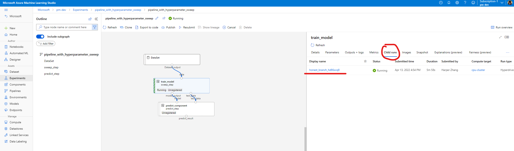
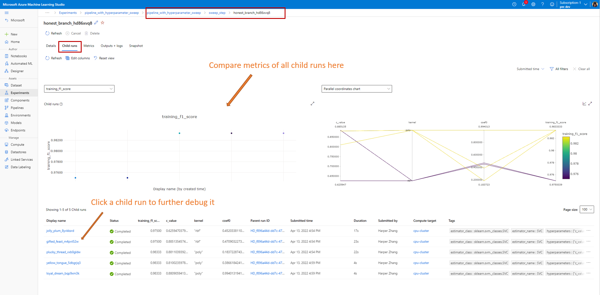
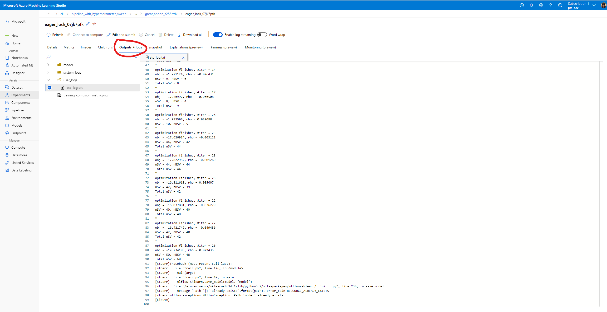

# How to do hyperparameter sweep in pipeline (V2)

In this artilce, you will learn how to do hyperparameter sweep in Azure Machine Learning pipeline.

## Prerequisite
1. Understand what is hyperparameter sweep, and how to do sweep in Azure Machine Learning start form a single step job. **[to-do](link to single step sweep doc)** It's highly suggested to go through the single step sweep example to understand how sweep works in Azure Machine Learning, before using it in a pipeline. 
2. Understand what is Azure Machine Learning pipeline and how to build your first pipeline. [to-do](link to pipeline value prop article.) 
3. Build a command commponent following [this atcile] (add a link to Blanca's article). 

## How to use sweep in Azure Machine Learning pipeline

This sections explains how to use sweep to do hyperparameter tuning in Azure Machine Learning piepline using CLI and Python SDK. All the approaches share the same prerquisite: you already have a command component created and the command component takes hyperparameters as inputs. If you don't have a command component yet. Please follow [this article](link to Blanca's article) to create a command component first. 

### CLI 

Assume you already have a command component defined in `train.yaml`. A two step pipeline job YAML looks like below. 

:::code language="yaml" source"~/azureml-examples-april-sdk-preview/cli/jobs/pipelines-with-components/pipeline_with_hyperparameter_sweep/pipeline.yml":::

The `sweep_step` is the step for hyperparameter sweep. Step type needs to be `sweep`.  And `trial` refers to the `train.yaml`. After submit this pipeline job, Azure Machine Learning will run the trial componenet multiple times to sweep over hypermaters based on the search space and terminate policy you defined in `sweep_step`. Check [sweep job YAML schema](https://docs.microsoft.com/en-us/azure/machine-learning/reference-yaml-job-sweep) for full schema of sweep job. 

Aslo Make sure in your training script, you log the metric with exactly the same name as `primary_metric` value in pipeline YAML. In this example we use `mlflow.autolog()`. We suggest to use mlflow to track and monitorning your training.  

And below is the trial component (`train.yml`) defination. It takes the hyperparamter as input. 

```yaml
$schema: https://azuremlschemas.azureedge.net/latest/commandComponent.schema.json
type: command

name: train_model
display_name: train_model
version: 1

inputs: 
  data:
    type: uri_folder
  c_value:
    type: number
    default: 1.0
  kernel:
    type: string
    default: rbf
  degree:
    type: integer
    default: 3
  gamma:
    type: string
    default: scale
  coef0: 
    type: number
    default: 0
  shrinking:
    type: boolean
    default: false
  probability:
    type: boolean
    default: false
  tol:
    type: number
    default: 1e-3
  cache_size:
    type: number
    default: 1024
  verbose:
    type: boolean
    default: false
  max_iter:
    type: integer
    default: -1
  decision_function_shape:
    type: string
    default: ovr
  break_ties:
    type: boolean
    default: false
  random_state:
    type: integer
    default: 42

outputs:
  model_output:
    type: mlflow_model
  test_data:
    type: uri_folder
  
code: ./train-src

environment: azureml:AzureML-sklearn-0.24-ubuntu18.04-py37-cpu@latest

command: >-
  python train.py 
    --data ${{inputs.data}}
    --C ${{inputs.c_value}}
    --kernel ${{inputs.kernel}}
    --degree ${{inputs.degree}}
    --gamma ${{inputs.gamma}}
    --coef0 ${{inputs.coef0}}
    --shrinking ${{inputs.shrinking}}
    --probability ${{inputs.probability}}
    --tol ${{inputs.tol}}
    --cache_size ${{inputs.cache_size}}
    --verbose ${{inputs.verbose}}
    --max_iter ${{inputs.max_iter}}
    --decision_function_shape ${{inputs.decision_function_shape}}
    --break_ties ${{inputs.break_ties}}
    --random_state ${{inputs.random_state}}
    --model_output ${{outputs.model_output}}
    --test_data ${{outputs.test_data}}
```


### Python SDK

In Azure Machine Learning Python SDK, sweep is a method of command component class. You can enable sweep for any command component by calling the .sweep() method of a command component . 

Below code snipe shows how to enable sweep for command component "train". It assumes you already define the "train" component that takes 15 inputs. Now let's enable hyperparameter sweep for `c_value`, `kernel` and `coef0`.


```Python
from azure.ml import dsl
from azure.ml.entities import load_component
from azure.ml.entities import (
    BanditPolicy, 
    Choice,
    Randint,
    QUniform,
    QLogNormal,
    QLogUniform,
    QNormal,
    LogNormal,
    LogUniform,
    Normal,
    Uniform,
)

train_component_func = load_component(yaml_file="./train.yml")
score_component_func = load_component(yaml_file="./predict.yml")

# define a pipeline with dsl component
@dsl.pipeline(
    description="Tune hyperparameters using sample components",
    default_compute="cpu-cluster",
)
def pipeline_with_hyperparameter_sweep():
    train_model = train_component_func(
        data=JobInput(type="uri_file", path="wasbs://datasets@azuremlexamples.blob.core.windows.net/iris.csv"),
        c_value=Uniform(min_value=0.5, max_value=0.9),
        kernel=Choice(["rbf", "linear", "poly"]),
        coef0=Uniform(min_value=0.1, max_value=1),
        degree=3,
        gamma="scale",
        shrinking=False,
        probability=False,
        tol=0.001,
        cache_size=1024,
        verbose=False,
        max_iter=-1,
        decision_function_shape="ovr",
        break_ties=False,
        random_state=42
    )
    sweep_step = train_model.sweep(
        primary_metric="training_f1_score",
        goal="minimize",
        sampling_algorithm="random",
        compute="cpu-cluster",
    )
    sweep_step.set_limits(max_total_trials=20, max_concurrent_trials=10, timeout=7200)

    score_data = score_component_func(
        model=sweep_step.outputs.model_output, 
        test_data=sweep_step.outputs.test_data
    )
    

pipeline = pipeline_with_hyperparameter_sweep()
```

**[to-do] add code snnip of train.py**


<!-- 
### UI will release post //build. comment out for now

Assume you already have defined a command component. You can enable sweep easily in designer, the pipeline authoring GUI experience. 

Similarly to CLI and SDK, the prerequest to enable sweep in UI is to have a command component already defined. And the command component need to take sweepable parameter as input. 

If you build your command component using CLI or SDK. clone the pipeline in pipeline page. it will lead you to designer, the UI authoring page of pipeline. then right click the command component you want to sweep. 

1. clone the pipeline. it will link you to designer, the pipeline authoring GUI in where you can eanble sweep in UI.


2. enable sweep


3. Add a parameter to search space.  and set sweep settings.


**[to-do]call out the settings are in which section in the right panel**

If you build your pipeline using designer directly. Select the component-
**[to-do] add screenshot of find component in designer**

then enable sweep for the command that do the training, set the sweep related settings in right panel. The last two step is the same as above.  -->


## Debug pipeline job with sweep node in Studio

After submit a pipeline job, the SDK or CLI widget will give you a web view link to Studio.The link will guide you to the pipeline graph view by default. To check details of the sweep step, double click the sweep node and navigate to the **child run** tab in the panel on the left.




This will link you to the sweep job detail like below. Navigate to **child run** tab, here you can see the metrics of all child runs and list of all child runs. 



If a child run failed, click the name of that child run. The useful debug information is under **Outputs + Logs**.




