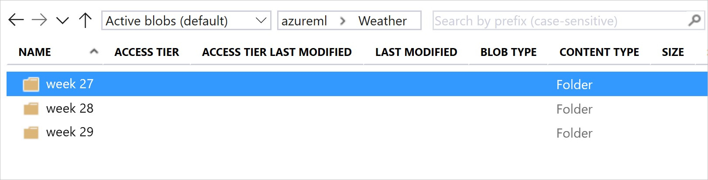

# Version and track datasets in experiments
[!INCLUDE [applies-to-skus](../../includes/aml-applies-to-basic-enterprise-sku.md)]

In this article, you'll learn how to version and track Azure Machine Learning datasets for reproducibility. Dataset versioning is a way to bookmark the state of your data so that you can apply a specific version of the dataset for future experiments.

Typical versioning scenarios:

* When new data is available for retraining
* When you're applying different data preparation or feature engineering approaches

## Prerequisites

For this tutorial, you need:

- [Azure Machine Learning SDK for Python installed](https://docs.microsoft.com/python/api/overview/azure/ml/install?view=azure-ml-py). This SDK includes the [azureml-datasets](https://docs.microsoft.com/python/api/azureml-core/azureml.core.dataset?view=azure-ml-py) package.
    
- An [Azure Machine Learning workspace](concept-workspace.md). Retrieve an existing one by running the following code, or [create a new workspace](how-to-manage-workspace.md).

    ```Python
    import azureml.core
    from azureml.core import Workspace
    
    ws = Workspace.from_config()
    ```
- An [Azure Machine Learning dataset](how-to-create-register-datasets.md).

<a name="register"></a>

## Register and retrieve dataset versions

By registering a dataset, you can version, reuse, and share it across experiments and with colleagues. You can register multiple datasets under the same name and retrieve a specific version by name and version number.

### Register a dataset version

The following code registers a new version of the `titanic_ds` dataset by setting the `create_new_version` parameter to `True`. If there's no existing `titanic_ds` dataset registered with the workspace, the code creates a new dataset with the name `titanic_ds` and sets its version to 1.

```Python
titanic_ds = titanic_ds.register(workspace = workspace,
                                 name = 'titanic_ds',
                                 description = 'titanic training data',
                                 create_new_version = True)
```

### Retrieve a dataset by name

By default, the [get_by_name()](https://docs.microsoft.com/python/api/azureml-core/azureml.core.dataset.dataset?view=azure-ml-py#get-by-name-workspace--name--version--latest--) method on the `Dataset` class returns the latest version of the dataset registered with the workspace. 

The following code gets version 1 of the `titanic_ds` dataset.

```Python
from azureml.core import Dataset
# Get a dataset by name and version number
titanic_ds = Dataset.get_by_name(workspace = workspace,
                                 name = 'titanic_ds', 
                                 version = 1)
```

<a name="best-practice"></a>

## Versioning best practice

When you create a dataset version, you're *not* creating an extra copy of data with the workspace. Because datasets are references to the data in your storage service, you have a single source of truth, managed by your storage service.

>[!IMPORTANT]
> If the data referenced by your dataset is overwritten or deleted, calling a specific version of the dataset does *not* revert the change.

When you load data from a dataset, the current data content referenced by the dataset is always loaded. If you want to make sure that each dataset version is reproducible, we recommend that you not modify data content referenced by the dataset version. When new data comes in, save new data files into a separate data folder and then create a new dataset version to include data from that new folder.

The following image and sample code show the recommended way to structure your data folders and to create dataset versions that reference those folders:



```Python
from azureml.core import Dataset

# get the default datastore of the workspace
datastore = workspace.get_default_datastore()

# create & register weather_ds version 1 pointing to all files in the folder of week 27
datastore_path1 = [(datastore, 'Weather/week 27')]
dataset1 = Dataset.File.from_files(path=datastore_path1)
dataset1.register(workspace = workspace,
                  name = 'weather_ds',
                  description = 'weather data in week 27',
                  create_new_version = True)

# create & register weather_ds version 2 pointing to all files in the folder of week 27 and 28
datastore_path2 = [(datastore, 'Weather/week 27'), (datastore, 'Weather/week 28')]
dataset2 = Dataset.File.from_files(path = datastore_path2)
dataset2.register(workspace = workspace,
                  name = 'weather_ds',
                  description = 'weather data in week 27, 28',
                  create_new_version = True)

```

<a name="pipeline"></a>

## Version a pipeline output dataset

You can use a dataset as the input and output of each Machine Learning pipeline step. When you rerun pipelines, the output of each pipeline step is registered as a new dataset version.

Because Machine Learning pipelines populate the output of each step into a new folder every time the pipeline reruns, the versioned output datasets are reproducible. Learn more about [datasets in pipelines](how-to-create-your-first-pipeline.md#steps).

```Python
from azureml.core import Dataset
from azureml.pipeline.steps import PythonScriptStep
from azureml.pipeline.core import Pipeline, PipelineData
from azureml.core. runconfig import CondaDependencies, RunConfiguration

# get input dataset 
input_ds = Dataset.get_by_name(workspace, 'weather_ds')

# register pipeline output as dataset
output_ds = PipelineData('prepared_weather_ds', datastore=datastore).as_dataset()
output_ds = output_ds.register(name='prepared_weather_ds', create_new_version=True)

conda = CondaDependencies.create(
    pip_packages=['azureml-defaults', 'azureml-dataprep[fuse,pandas]'], 
    pin_sdk_version=False)

run_config = RunConfiguration()
run_config.environment.docker.enabled = True
run_config.environment.python.conda_dependencies = conda

# configure pipeline step to use dataset as the input and output
prep_step = PythonScriptStep(script_name="prepare.py",
                             inputs=[input_ds.as_named_input('weather_ds')],
                             outputs=[output_ds],
                             runconfig=run_config,
                             compute_target=compute_target,
                             source_directory=project_folder)
```

<a name="track"></a>

## Track datasets in experiments

For each Machine Learning experiment, you can easily trace the datasets used as the input through the experiment `Run` object.

The following code uses the [`get_details()`](https://docs.microsoft.com/python/api/azureml-core/azureml.core.run.run?view=azure-ml-py#get-details--) method to track which input datasets were used with the experiment run:

```Python
# get input datasets
inputs = run.get_details()['inputDatasets']
input_dataset = inputs[0]['dataset']

# list the files referenced by input_dataset
input_dataset.to_path()
```

You can also find the `input_datasets` from experiments by using https://ml.azure.com/. 

The following image shows where to find the input dataset of an experiment on Azure Machine Learning studio. For this example, go to your **Experiments** pane and open the **Properties** tab for a specific run of your experiment, `keras-mnist`.


Use the following code to register models with datasets:

```Python
model = run.register_model(model_name='keras-mlp-mnist',
                           model_path=model_path,
                           datasets =[('training data',train_dataset)])
```

After registration, you can see the list of models registered with the dataset by using Python or go to https://ml.azure.com/.

The following view is from the **Datasets** pane under **Assets**. Select the dataset and then select the **Models** tab for a list of the models that are registered with the dataset. 


## Next steps

* [Train with datasets](how-to-train-with-datasets.md)
* [More sample dataset notebooks](https://aka.ms/dataset-tutorial)
