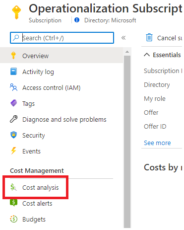
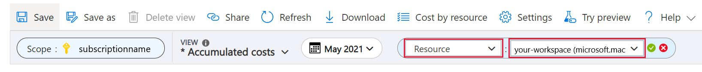
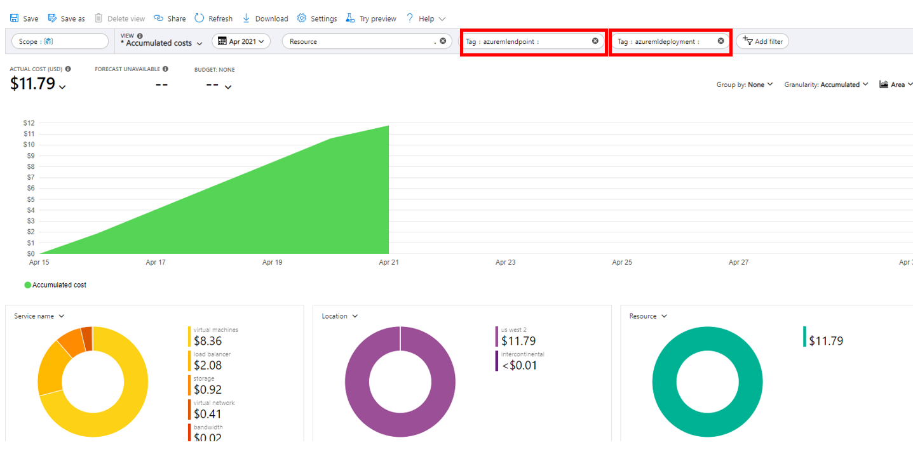

# View costs for an Azure Machine Learning managed online endpoint

Learn how to view costs for a managed online endpoint. Costs for your endpoints will accrue to the associated workspace. You can see costs for a specific endpoint using tags.

> [!IMPORTANT]
> This article only applies to viewing costs for Azure Machine Learning managed online endpoints. Managed online endpoints are different from other resources since they must use tags to track costs. For more information on viewing the costs of other Azure resources, see [Quickstart: Explore and analyze costs with cost analysis](../cost-management-billing/costs/quick-acm-cost-analysis.md).

## Prerequisites

- Deploy an Azure Machine Learning managed online endpoint.
- Have at least [Billing Reader](../role-based-access-control/role-assignments-portal.md) access on the subscription where the endpoint is deployed

## View costs

Navigate to the **Cost Analysis** page for your subscription:

1. In the [Azure portal](https://portal.azure.com), Select **Cost Analysis** for your subscription.

    

Create a filter to scope data to your Azure Machine Learning workspace resource:

1. At the top navigation bar, select **Add filter**.

1. In the first filter dropdown, select **Resource** for the filter type.

1. In the second filter dropdown, select your Azure Machine Learning workspace.

    

Create a tag filter to show your managed online endpoint and/or managed online deployment:
1. Select **Add filter** > **Tag** > **azuremlendpoint**: "\<your endpoint name>" 
1. Select **Add filter** > **Tag** > **azuremldeployment**: "\<your deployment name>".

    > [!NOTE]
    > Dollar values in this image are fictitious and do not reflect actual costs.

    

## Next steps
- [What are endpoints?](concept-endpoints.md)
- Learn how to [monitor your managed online endpoint](./how-to-monitor-online-endpoints.md).
- [How to deploy an ML model with an online endpoint (CLI)](how-to-deploy-online-endpoints.md)
- [How to deploy managed online endpoints with the studio](how-to-use-managed-online-endpoint-studio.md)
