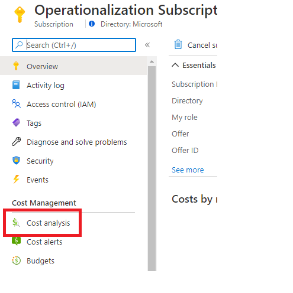
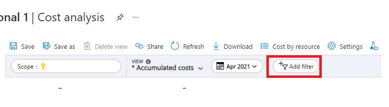
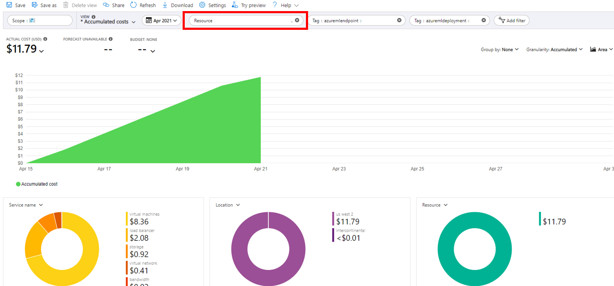

# View costs for an Azure Machine Learning managed online endpoint

Learn how to view costs for an online Azure Machine Learning managed online endpoint. Costs for your endpoints will accrue to the associated workspace. You can see costs for a specific endpoint using tags.

> [!TIP]
> This article only applies to Azure Machine Learning managed online endpoints. For viewing the costs of other Azure resources, see [Quickstart: Explore and analyze costs with cost analysis](../cost-management-billing/costs/quick-acm-cost-analysis.md).

## Prerequisites

In order to use the steps in this article, you must:

- Have a deployed Azure Machine Learning managed online endpoint
- Have at least [Billing Reader](../role-based-access-control/role-assignments-portal.md) access on the subscription where the endpoint is deployed

## Viewing costs

To view costs for an Azure Machine Learning managed online endpoint:

1. Select **Cost Analysis** for your subscription in the [Azure portal](https://portal.azure.com).

    

1. Choose **Add filter** at the top navigation bar.

    

1. Select your workspace.

    

1. Select **Tag**, then **azuremlendpoint**: "<your endpoint name>" and **azuremldeployment**: "<your deployment name>".

    

## Next steps

* Learn how to [monitor your endpoint](./how-to-monitor-online-endpoints.md).