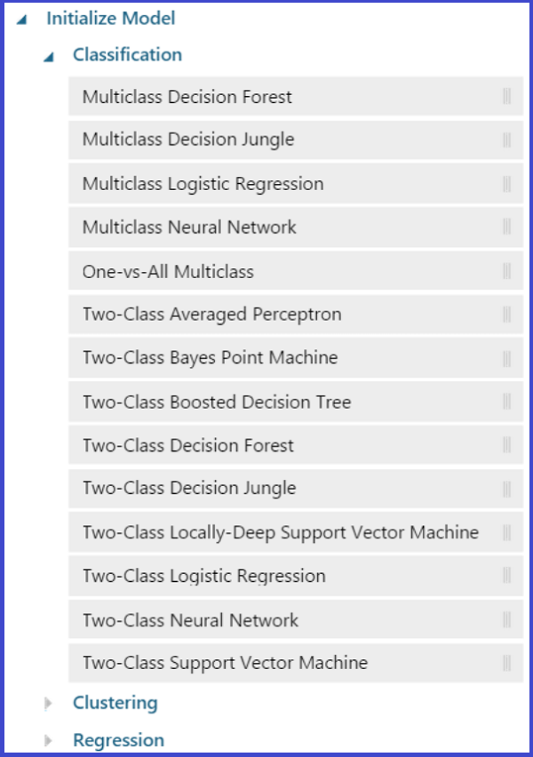

<properties 
	title="" 
	pageTitle="How to choose machine learning algorithms | Microsoft Azure" 
	description="How to choose Azure Machine Learning algorithms for supervised and unsupervised learning in clustering, classification, or regression experiments." 
	keywords="machine learning algorithms,types of machine learning algorithms,types of machine learning,clustering,clustering algorithm"	
	services="machine-learning"
	documentationCenter="" 
	authors="garyericson" 
	manager="paulettm" 
	editor="cgronlun"/>

<tags 
	ms.service="machine-learning" 
	ms.workload="data-services" 
	ms.tgt_pltfrm="na" 
	ms.devlang="na" 
	ms.topic="article" 
	ms.date="06/01/2015" 
	ms.author="bradsev;garye" />

# How to choose Azure Machine Learning algorithms for clustering, classification, or regression

This topic explains some basic aspects of the machine learning approach. In particular, you'll learn how to choose appropriate machine learning algorithms to analyze given types of data, to answer questions posed, to accomplish specified tasks, or to provide criteria for making decisions. 

> [AZURE.TIP] The [Microsoft Azure Machine Learning Algorithm Cheat Sheet](machine-learning-algorithm-cheat-sheet.md) is a handy reference to accompany this article.

When using machine learning to do analytics, we are usually faced with two questions: 

* What kind of analysis do we need to accomplish our objectives with the data available? 
* What is the most appropriate algorithm or model to use to do this analysis?

Three types of machine learning analysis are discussed and their use cases are compared: 

* **Clustering**
* **Classification** 
* **Regression** 

[AZURE.INCLUDE [machine-learning-free-trial](../../includes/machine-learning-free-trial.md)]

## Machine Learning algorithms learn from data

Machine Learning is a discipline that studies a class of algorithms that are designed to learn from the data and do not impose a specific, predetermined model to test against the data. The idea is to acquire knowledge more inductively by examining the patterns in a dataset rather than by using the *hypothetical-deductive* method where you try to guess the appropriate model for the entire dataset first and then test it empirically. 

Types of machine learning - also thought of as learning from data - come in two flavors: *supervised learning* and *unsupervised learning*. 

## Supervised Learning  

Supervised learning requires that the target variable be well-defined and that a sufficient number of its values are given. 

Supervised learning is the type of machine learning that takes place when the correct output results (or target variables) for the training instances to be input are known. The objective of training a machine learning algorithm is to find the model (that is, a rule or function) that maps the inputs into the known output values. This is similar to having a supervisor who can tell the algorithmic agent whether or not it's mapping the inputs to the outputs correctly. Once the learning process is complete and we have a workable model, it can be applied to new input data to predict the expected output where, unlike the training dataset, the target value are not known in advance.

The type of model is determined by the nature of the target variable.

There are two broad categories of analysis that employ supervised learning: *classification* and *regression*. Supervised learning is fairly common in classification problems because the goal is often to get the computer to learn a classification system that we have created. The responses usually are just a few known values(labels), such as 'true' or 'false', or 'high', 'medium', or 'low'. Classification algorithms apply to nominal values, not ordinal response values. Digit recognition is a common example of classification learning. More generally, classification learning is appropriate for any problem where it's both useful and easy to determine the classification.

In supervised learning the variables under investigation can be split into two groups: explanatory variables (also called predictors) and dependent variables (also called response variables). The objective of the analysis is to define a relationship between the explanatory variables and the dependent variables as it's done in *regression analysis*. The values of the dependent variable must be known for a sufficiently large part of the dataset. In regression the responses or output variable take continuous values, such as miles per gallon for a particular car, a person's age etc.

Supervised learning is also the most common technique for training neural networks and decision trees: 

> Both of these techniques are highly dependent on the information given by the pre-determined classifications. In the case of neural networks, the classification is used to determine the error of the network and then adjust the network to minimize it, and in decision trees, the classifications are used to determine what attributes provide the most information that can be used to solve the classification puzzle. ... both of these examples thrive on having some "supervision" in the form of pre-determined classifications. 

>  Speech recognition using hidden Markov models and Bayesian networks relies on some elements of supervision as well in order to adjust parameters to, as usual, minimize the error on the given inputs. [[Machine Learning, Part II: Supervised and Unsupervised Learning](http://www.aihorizon.com/essays/generalai/supervised_unsupervised_machine_learning.htm), [AI Horizon](http://www.aihorizon.com/)]

##Unsupervised Learning

In machine learning, the problem of unsupervised learning is to determine if there are patterns or a hidden structure in unlabeled data. The model is not provided with the "correct results" for a dataset on which to train. Since unlabeled examples are given to the learner, there is no feedback - neither error nor reward - to evaluate a potential solution. The goal is to have the computer learn how to do something even though we don't explicitly tell it how to accomplish that task. In unsupervised learning situations, all variables are treated in the same way. There is no distinction between explanatory variables and dependent variables. However, there is still some objective to achieve, which might be a general objective, such as data reduction, or a more specific goal like finding clusters. 

In Azure Machine Learning we can perform both unsupervised and supervised learning via **Clustering**, **Classification**, and **Regression**.

   

##Clustering
Clustering is an example of unsupervised learning. In this type of learning, the goal is to find similarities in the training data and to partition the dataset into subsets that are demarcated by these similarities. 
The expectation that the most significant clusters discovered by these data-driven procedures are consistent with our intuitive classification is often, but not always, satisfied. 

Although the clustering algorithm won't assign appropriate names to these clusters, it can produce them and then use them to anticipate similarities expected in new examples by classifying them into the most appropriate cluster. This data-driven approach can work well when sufficient data is available. For instance, social information filtering algorithms, such as those used by Amazon.com to recommend books, are based on finding similar groups of people and then assigning new users to these groups for the purpose of making recommendations.

The clustering algorithm available in Azure Machine Learning is [K-Means Clustering][k-means-clustering].

K-means is one of the simplest unsupervised clustering algorithms that solve well known clustering problems. 
The KMeans algorithm clusters data by trying to separate samples into N groups of equal variance, minimizing 
the "inertia" or "within-cluster sum-of-squares" criterion.
This algorithm requires the number of clusters to be specified. K-means can scale to a large number of samples and has been used in a wide range of application areas across many different fields.

The [K-Means Clustering][k-means-clustering] algorithm module returns an untrained K-means clustering model that can be passed to the [Train Clustering Model][train-clustering-model] module for training.

This figure shows that there are options to be configured when using K-Means Clustering. The K-means method finds a specified number of clusters for a set of D-dimensional data points. Starting with an *initial set of K centroids*, the method uses Lloyd's algorithm to iteratively refine the locations of the centroids. The algorithm terminates when the centroids stabilize or when a *specified number of iterations* are completed.
The module initializes a K-by-D array with the final centroids that define the K clusters found in the N data points. The algorithm also uses a vector of length N with the assignment of each data point to one of the K clusters.
If given a specific number of clusters (K) to find, the module assigns the first K data points in order to the K clusters.

This module also accepts or generates initial points to define its initial cluster configuration.
*Metric* defines the method used to measure the distance between a data point and the centroid.
Each data point is assigned to the cluster that has the closest centroid to the data point. By default, the method uses the *Euclidean metric*. You can specify the *cosine metric* as an alternate metric for the method.
Note that the K-means method might only find a locally optimum cluster configuration for a dataset. The method could find a different, perhaps superior, configuration given a different initial configuration.

##Classification 
In classification analysis we divide the samples into classes and use a trained set of previously-labeled data. The technique is used to predict group membership for data instances. 
In Azure Machine Learning the following classification algorithms are available.

The *Two-Class algorithms* are used for binary response variables (yes or no, 0 or 1, true or false etc) whereas *Multiclass algorithms* are used for any nominal response variable that classifies instances into more than two classes

### Guidelines for selecting a classification algorithm
This long list of algorithms gives rise to a series of questions: 

* How do you know which of these many classifiers is the best one to use on a particular dataset? 
* Are there cases where one classifier is a "natural" choice? 
* What are the principles for making the choice?

One approach that is recommended is to test several different classifiers, as well as different parameter sets within each algorithm, and then select the best one by using cross-validation. 

> [AZURE.TIP] [Azure Machine Learning Studio](https://studio.azureml.net/) allows you to try multiple algorithms side-by-side against the same data and compare the results. Here's an example from the [Azure Machine Learning Gallery](http://gallery.azureml.net/): [Compare Multi-class Classifiers: Letter recognition](http://gallery.azureml.net/Details/a635502fc98b402a890efe21cec65b92). 

Here are some general guidelines that can provide a place to start this deliberation. Consider the following issues when choosing which algorithm to use: [outline suggested by [Choosing a Machine Learning Classifier](http://blog.echen.me/2011/04/27/choosing-a-machine-learning-classifier/), Edwin Chen]

**How large is your training data?**
If your training set is small, and you're going to train a supervised classifier, then machine learning theory says you should stick to a classifier with high bias/low variance, such as Naive Bayes. These have an advantage over low bias/high variance classifiers such as kNN since the latter tends to overfit. But low bias/high variance classifiers are more appropriate if you have a larger training set because they have a smaller asymptotic error - in these cases a high bias classifier isn't powerful enough to provide an accurate model. There are theoretical and empirical results that indicate that Naive Bayes does well in such circumstances. But note that having better data and good features usually can give you a greater advantage than having a better algorithm. Also, if you have a very large dataset classification performance may not be affected as much by the algorithm you use, so in that case it's better to choose your algorithm based on such things as its scalability, speed, or ease of use.

**Do you need to train incrementally or in a batched mode?** 
If you have a lot of data, or your data is updated frequently, you probably want to use Bayesian algorithms that update well. Both neural nets and SVMs need to work on the training data in batch mode.

**Is your data exclusively categorical or exclusively numeric or a mixture of both kinds?** 
Bayesian works best with categorical/binomial data. Decision trees can't predict numerical values.

**Do you or your audience need to understand how the classifier works?**  Bayesian or decision trees are more easily explained. It's much harder to see or explain how neural networks and SVMs classify data.

**How fast does your classification need to be generated?** 
Decision trees can be slow when the tree is complex.
SVMs, on the other hand, classify more quickly since they only need to determine which side of the "line" your data is on. 

**How much complexity does the problem present or require?** Neural nets and SVMs can handle complex non-linear classification.

### Advantages and disadvantages of classification algorithms
Each of these classification algorithms has some advantages and  some disadvantages:

**Advantages and Disadvantages of Logistic Regression:**   
"Logistic regression analysis is based on calculating the odds of the outcome as the ratio of the probability of having the outcome divided by the probability of not having it." [[Logistic Regression and Linear Discriminant Analyses in Evaluating Factors Associated with Asthma Prevalence among 10- to 12-Years-Old Children: Divergence and Similarity of the Two Statistical Methods](http://www.hindawi.com/journals/ijpedi/2009/952042/), George Antonogeorgos, et al (International Journal of Pediatrics, 2009) Article ID 952042]
 
The logistic model is parametric and so has the advantage that it provides insight into the impact of each predictor variable on the response variable. 

With natural probabilistic interpretations available (unlike decision trees or SVMs), you can easily update your model to incorporate new data. There are many ways to regularize your model, and, unlike Naive Bayes, you don’t have to worry as much about your features being correlated. Logistic regression is useful if you want:

* a probabilistic framework for adjusting classification thresholds
* to quickly incorporate additional training data  

Logistic regression works better than decision trees for high dimension data. For example, in text classification you might have over 100 thousand documents with 500 thousand distinct words (features). A simple rule like learning of a linear hyperplane is better, since decision trees have far too many degrees of freedom and are prone to overfitting. You could do feature selection to use a decision tree on text data, but a lot of valuable information will be lost for text classification if you pick a much reduced subset of the features. When learning models are used with high dimensional data, it's very easy for variance-based errors to grow. In that case it's better to use simple models with higher bias. 

One disadvantage of logistic regression is that it's unstable when one predictor could almost explain the response variable, because the coefficient of this variable will become extremely large.

**Advantages and Disadvantages of Decision Trees:**   
[Decision trees](http://research.microsoft.com/pubs/155552/decisionForests_MSR_TR_2011_114.pdf) are easy to interpret and explain.

> [Decision trees] easily handle feature interactions and they’re non-parametric, so you don’t have to worry about outliers or whether the data is linearly separable (e.g., decision trees easily take care of cases where you have class A at the low end of some feature x, class B in the mid-range of feature x, and A again at the high end). One disadvantage is that they don’t support online learning, so you have to rebuild your tree when new examples come on. Another disadvantage is that they easily overfit, but that’s where ensemble methods like random forests (or boosted trees) come in. Plus, random forests are often the winner for lots of problems in classification (usually slightly ahead of SVMs, I believe), they’re fast and scalable, and you don’t have to worry about tuning a bunch of parameters like you do with SVMs. [[Choosing a Machine Learning Classifier](http://blog.echen.me/2011/04/27/choosing-a-machine-learning-classifier/), Edwin Chen]

Decision trees will generate the output as rules along with metrics such as *support*, *confidence* and *lift*. 

**Advantages and Disadvantages of SVMs:**   
Support Vector Machines (SVMs) are effective in high dimensional spaces. Even in cases where the number of dimensions is greater than the number of samples it's still effective. 
However, the method is likely to perform poorly if the number of features is much greater than the number of samples. It's also memory efficient as it uses a subset of training points in the decision function (known as support vectors). It's very versatile: different Kernel functions, both common and custom, can be specified for the decision function. Kernel functions are used to transform low dimensional training samples to higher dimensions, which is useful for linear separability problems. 

SVMs however do not directly provide probability estimates. These are calculated using an expensive five-fold cross-validation. 

>[With] high accuracy, nice theoretical guarantees regarding overfitting, and with an appropriate kernel they can work well even if your data isn’t linearly separable in the base feature space. [SVMs are] especially popular in text classification problems where very high-dimensional spaces are the norm. [[Choosing a Machine Learning Classifier](http://blog.echen.me/2011/04/27/choosing-a-machine-learning-classifier/), Edwin Chen]

Unlike forests, SVMs originated as two-class classifiers, although recently they have been adapted to work with multiple classes. We can use something like "one-vs-rest" training to make a multi-class classifier which may be less optimal. 
Since SVMs can only handle two-class outputs (i.e., a categorical output variable with variety 2), with N classes, it learns N SVM’s (SVM 1 learns “Output==1” vs “Output != 1”, SVM 2 learns  “Output==2” vs “Output != 2”, ..., SVM N learns “Output==N” vs “Output != N”). Then to predict the output for a new input, it just predicts with each SVM and then discovers which one puts the prediction the furthest into the positive region. [[Support Vector Machines](http://www.astro.caltech.edu/~george/aybi199/AMooreTutorials/svm.ppt), Andrew W. Moore (Carnegie Mellon University 2001)]

**Advantages and Disadvantages of Naive Bayes:**   
[Naive Bayes (NB)](http://www.aaai.org/Papers/FLAIRS/2004/Flairs04-097.pdf) classifiers are a popular choice for classification problems. They assume the features are independent - this is what makes the technique 'naive'. 

> If the NB conditional independence assumption actually holds, a Naive Bayes classifier will converge quicker than discriminative models like logistic regression, so you need less training data. And even if the NB assumption doesn’t hold, a NB classifier still often does a great job in practice. ... Its main disadvantage is that it can’t learn interactions between features (e.g., it can’t learn that although you love movies with Brad Pitt and Tom Cruise, you hate movies where they’re together). [[Choosing a Machine Learning Classifier](http://blog.echen.me/2011/04/27/choosing-a-machine-learning-classifier/), Edwin Chen]

**One-vs-all:**  
One-vs-all is a strategy for reducing the problem of multi-class classification to a set of multiple binary classification problems. 
This strategy involves training a single classifier per class, with the samples of that class as positive samples and all other samples as negatives.
This strategy requires the base classifiers to produce a real-valued confidence score for its decision, rather than just a class label; discrete class labels alone can lead to ambiguities, where multiple classes are predicted for a single sample. [[Multiclass classification](http://en.wikipedia.org/wiki/Multiclass_classification) (Wikipedia 2006)]

##Regression
 
In regression analysis we predict new values based on the past inference. The new values for a dependent variable are computed based on the value of one or more measured attributes. The various regression algorithms available in Azure Machine Learning are:

Depending upon the use case and the data at hand we choose one algorithm over another. Below we will describe some regression algorithms and their principal use cases.

**[Bayesian Linear Regression][bayesian-linear-regression]**                      
Bayesian Linear Regression is an approach to linear regression in which the statistical analysis is undertaken within the context of Bayesian inference. Explicit results are available for the posterior probability distributions of the model's parameters when the regression model has normal distributed errors and a particular form of prior distribution can be assumed. [[Linear regression](http://en.wikipedia.org/wiki/Bayesian_linear_regression) ([Wikipedia](http://en.wikipedia.org))]

**[Boosted Decision Tree Regression][boosted-decision-tree-regression]**  
Boosted Decision Tree Regression calculates a relationship between predictor and response variables. Regression tree structure is similar to a classification tree. Terminal nodes are predicted function (model) values. Predicted values are limited to the values in the terminal nodes. Some of the advantages of using decision trees are: 

* it's easy to interpret the decision rules 
* they are nonparametric so it's easy to use a range of numerical or categorical data layers, and unimodal training data is not required
* they are robust with regard to outliers in training data 
* classification can be done quickly once the rules are developed 

However, there are some drawbacks to using decision trees:

* they tend to overfit training data, yielding poor results when applied to the full data set
* it's not possible to predict beyond the minimum and maximum limits of the response variable in the training data

**[Decision Forest Regression][decision-forest-regression]**  
Decision Forests can be used for classification (categorical variables) or regression (continuous variables) applications. 
Regression forests may be used for the non-linear regression of dependent variables given independent input, and both inputs and outputs may be multi-dimensional. Regression forests aren't used as much as their classification counterparts. The main difference is that the output labels of the decision forests associated with input data (and the training labels) must be continuous. This means that the objective function has to be adapted appropriately. Regression forests share many of the advantages of classification forests, such as efficiency and flexibility.

**[Linear Regression][linear-regression]**  
Linear regression is widely used for modeling the relationship between a scalar dependent variable Y and one or more explanatory variables denoted X. It can be, and typically is, applied for prediction, forecasting, or reduction. It can be used to fit a predictive model to an observed dataset of Y and X values. Linear regression assumes that the underlying structure of Y is a linear combination of the X variables. If an additional value of X is then given without its accompanying y value, the fitted linear regression model can be used to predict that Y value. Linear regression models are typically fitted using the least squares approach, but other options also exist to measure which fit is best. [[Linear regression](http://en.wikipedia.org/wiki/Bayesian_linear_regression) ([Wikipedia](http://en.wikipedia.org))]

**[Neural Network Regression][neural-network-regression]**  
Neural networks are a useful statistical tool for nonparametric regression. Nonparametric regression addresses the problem of trying to fit a model for a variable Y on a set of possible explanatory variables X1; : : : ;Xp, and where the relationship between X and Y may be more complicated than a simple linear relationship. [[A Framework for Nonparametric Regression Using Neural Networks](http://ftp.isds.duke.edu/WorkingPapers/00-32.pdf), Herbert K. H. Lee (ISDS, Duke University)]

**[Ordinal Regression][ordinal-regression]**   
Ordinal regression is a type of regression analysis used for modeling or predicting an ordinal dependent variable. For ordinal dependent variables, you can rank the values, but the real distance between categories is unknown. Only the relative ordering between different values is significant. Since the labels or target values have a natural ordering or ranking, any numeric column can be used as an ordinal target. The natural ordering of numbers is used for ranking them. For example, diseases are graded on a scale from least severe to most severe; survey respondents choose answers from 'strongly agree' to 'strongly disagree'; students are graded on a scale from A to F. Essentially, though, ordinal regression is an extension of logistic regression and is based on the *proportional odds* model.

**[Poisson Regression][poisson-regression]**  
Poisson regression is often used for modeling count data. Poisson regression assumes that the response variable has a Poisson distribution. Poisson distributed data is intrinsically integer-valued (discrete and positive), which makes sense for count data. Given a training dataset, Poisson regression tries to find the optimal values by maximizing the log likelihood of the parameters given the inputs. The likelihood of the parameters is the probability that the training data was sampled from a distribution with these parameters. For example, Poisson regression would be useful for: 

* Modeling the number of colds associated with airplane flights 
* Estimating the number of calls related to an event or promotion 
* Creating contingency tables

## References

For a complete list with the types of machine learning algorithms available in Machine Learning Studio, see [Initialize Model](https://msdn.microsoft.com/library/azure/0c67013c-bfbc-428b-87f3-f552d8dd41f6/) in [Machine Learning Studio: Algorithm and Module Help](https://msdn.microsoft.com/library/azure/dn905974.aspx).

You can find more detailed information about all types of machine learning algorithms in the following references, many of which were used in creating this article.

* [Choosing a Machine Learning Classifier](http://blog.echen.me/2011/04/27/choosing-a-machine-learning-classifier/), Edwin Chen.

* [Decision Forests for Classification, Regression, Density Estimation, Manifold Learning and Semi-Supervised Learning](http://research.microsoft.com/pubs/155552/decisionForests_MSR_TR_2011_114.pdf), A. Criminisi1, J. Shotton2 and E. Konukoglu (Microsoft Research, 2011) technical report TR-2011-114.

* [A Framework for Nonparametric Regression Using Neural Networks](http://ftp.isds.duke.edu/WorkingPapers/00-32.pdf), Herbert K. H. Lee (ISDS, Duke University).

* Handbook of Computational Statistics: Concepts and Methods edited by James E. Gentle, Wolfgang Karl Härdle, Yuichi Mori (Springer-Verlag Berlin Heidelberg New York, 2004). 

* [Logistic Regression and Linear Discriminant Analyses in Evaluating Factors Associated with Asthma Prevalence among 10- to 12-Years-Old Children: Divergence and Similarity of the Two Statistical Methods](http://www.hindawi.com/journals/ijpedi/2009/952042/), George Antonogeorgos, Demosthenes B. Panagiotakos, Kostas N. Priftis, and Anastasia Tzonou (International Journal of Pediatrics, 2009) Article ID 952042.

* [The Optimality of Naive Bayes](http://www.aaai.org/Papers/FLAIRS/2004/Flairs04-097.pdf) (University of New Brunswick 2004) Harry Zhang.

* [Support Vector Machines](http://www.astro.caltech.edu/~george/aybi199/AMooreTutorials/svm.ppt), Andrew W. Moore (Carnegie Mellon University 2001).

* [Machine Learning, Part II: Supervised and Unsupervised Learning](http://www.aihorizon.com/essays/generalai/supervised_unsupervised_machine_learning.htm), [AI Horizon](http://www.aihorizon.com/).

* [What are the advantages of logistic regression over decision trees?](http://www.quora.com/What-are-the-advantages-of-logistic-regression-over-decision-trees) ([Quora](http://www.quora.com/)).

* [What is the difference between supervised learning and unsupervised learning?](http://stackoverflow.com/questions/1832076/what-is-the-difference-between-supervised-learning-and-unsupervised-learning) ([Stackoverflow](http://stackoverflow.com/)).

* [When to choose which machine learning classifier?](http://stackoverflow.com/questions/2595176/when-to-choose-which-machine-learning-classifier) ([Stackoverflow](http://stackoverflow.com/)).

* [Wikipedia](http://en.wikipedia.org):
	* [Bayesian linear regression](http://en.wikipedia.org/wiki/Bayesian_linear_regression)
	* [Linear regression](http://en.wikipedia.org/wiki/Linear_regression)
	* [Multiclass classification](http://en.wikipedia.org/wiki/Multiclass_classification)
	* [Unsupervised learning](http://en.wikipedia.org/wiki/Unsupervised_learning)

Also:

* [Microsoft Azure Machine Learning Algorithm Cheat Sheet](machine-learning-algorithm-cheat-sheet.md) (Microsoft).

* [Choosing the right estimator](http://scikit-learn.org/stable/tutorial/machine_learning_map/) ([scikit-learn](http://scikit-learn.org/stable/index.html)).

<!-- Module References -->
[k-means-clustering]: https://msdn.microsoft.com/library/azure/5049a09b-bd90-4c4e-9b46-7c87e3a36810/
[train-clustering-model]: https://msdn.microsoft.com/library/azure/bb43c744-f7fa-41d0-ae67-74ae75da3ffd/
[bayesian-linear-regression]: https://msdn.microsoft.com/library/azure/ee12de50-2b34-4145-aec0-23e0485da308/
[boosted-decision-tree-regression]: https://msdn.microsoft.com/library/azure/0207d252-6c41-4c77-84c3-73bdf1ac5960/
[decision-forest-regression]: https://msdn.microsoft.com/library/azure/562988b2-e740-4e3a-8131-358391bad755/
[linear-regression]: https://msdn.microsoft.com/library/azure/31960a6f-789b-4cf7-88d6-2e1152c0bd1a/
[neural-network-regression]: https://msdn.microsoft.com/library/azure/d7ee222c-669f-4200-a576-a761a9c1a928/
[ordinal-regression]: https://msdn.microsoft.com/library/azure/ffb557f8-dc7f-44bd-8fd0-b25666dd23f1/
[poisson-regression]: https://msdn.microsoft.com/library/azure/80e21b9d-3827-40d8-b733-b53148becbc2/

 