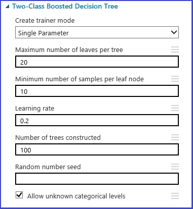

<properties 
	pageTitle="How to choose parameters to optimize your algorithms in Azure Machine Learning | Microsoft Azure" 
	description="Explains how to choose the optimal parameter set for an algorithm in Azure Machine Learning." 
	services="machine-learning"
	documentationCenter="" 
	authors="bradsev" 
	manager="paulettm" 
	editor="cgronlun"/>

<tags 
	ms.service="machine-learning" 
	ms.workload="data-services" 
	ms.tgt_pltfrm="na" 
	ms.devlang="na" 
	ms.topic="article" 
	ms.date="05/27/2016" 
	ms.author="bradsev" />

# How to choose parameters to optimize your algorithms in Azure Machine Learning

This topic describes how to choose the right hyperparameter set for an algorithm in Azure Machine Learning. Most machine learning algorithms are dependent on various parameters. When we train a model, we need to provide values for those parameters. The efficacy of the trained model is dependent on the model parameters that we choose. The process of finding out the optimal set of parameters is known as model selection. 

[AZURE.INCLUDE [machine-learning-free-trial](../../includes/machine-learning-free-trial.md)]

There are various ways in which model selection can be done. In machine learning, cross-validation is one of the most widely used methods for model selection and it is the default model selection mechanism in Azure Machine Learning. Since both R and Python are supported by Azure Machine Learning, users can always implement their own model selection mechanism using either R or Python. 

There are four steps in the process of finding the best parameter set. 

1.	**Define parameter space**: For the algorithm, we first decide the exact parameter values we would like to consider. 
2.	**Define cross-validation settings**: For the dataset, we need to decide how to choose cross-validation folds. 
3.	**Define metric**: Then we decide what metric to use for determining the best set of parameters, e.g. accuracy, root mean squared error, precision, recall, or f-score. 
4.	**Train, evaluate and compare**: For each unique combination of the parameter values, cross-validation is carried out and based on the error metric defined by the user, the best performing model can be chosen.

The following experiment shows how this can be achieved in Azure Machine Learning. 

 
## Define parameter space
The parameter set can be defined at the model initialization step. The parameter pane of all machine learning algorithms has two trainer modes – **Single Parameter** and **Parameter Range**. We need to choose the **Parameter Range** mode (Fig. 1). That enables entering multiple values for each parameter: comma-separated values can be entered into the text box. Alternately **Use Range Builder** can be used to define the maximum and minimum points of the grid and the total number of points to be generated. By default the parameter values are generated on a liner scale. But if the **Log Scale** box is checked, then the values are generated in the log scale (i.e. the ratio of the adjacent points is constant instead of their difference). For integer parameters a range can be defined with a hyphen “-“, e.g. “1-10” which means all integers between 1 and 10 (both inclusive) will form the parameter set. A mixed mode is also supported, e.g. “1-10, 20, 50”. In this case in addition to integers 1-10, 20 and 50 will also be added to the parameter set. 
  

## Cross-validation fold definition
The [Partition and Sample][partition-and-sample] module can be used to assign folds to the data randomly. In the following figure, we see an example configuration for the module where we define 5 folds and randomly assign fold number to the sample instances. 

## Define Metric
The [Tune Model Hyperparameters][tune-model-hyperparameters] module provides support for empirically choosing the best set of parameters for a given algorithm and dataset. The properties pane of this module includes, in addition to other information regarding training the model, the metric to be used for determining the best parameter set. It has two different drop down lists for classification and regression algorithms, respectively. If the algorithm under consideration is a classification algorithm the regression metric is ignored and vice versa. In this specific example, we chose **Accuracy** as the metric.   
 

## Train, evaluate and compare  
The same [Tune Model Hyperparameters][tune-model-hyperparameters] module trains all the models corresponding to the parameter set, evaluates various metrics and then outputs the best trained model based on the metric chosen by the user. This module has two mandatory inputs

* the untrained learner 
* the dataset 

and an optional dataset input. We connect the dataset with fold information to the mandatory dataset input. If the dataset is not assigned any fold information, then a 10 fold cross-validation is automatically executed by default. If the fold assignment is not done and a validation dataset is provided at the optional dataset port, then a train-test mode chosen and the first dataset is used to train the model for each parameter combination, and is then evaluated on the validation dataset. The left output port of the module shows different metrics as a function of parameter values. The right output port gives the trained model corresponding to the best performing model as per the metric chosen by the user (accuracy in this case).  

 
We can see the exact parameters chosen by visualizing the right output port. This model can be used in scoring a test set or in an operationalized web service after saving as a trained model. 

<!-- Module References -->
[partition-and-sample]: https://msdn.microsoft.com/library/azure/a8726e34-1b3e-4515-b59a-3e4a475654b8/
[tune-model-hyperparameters]: https://msdn.microsoft.com/library/azure/038d91b6-c2f2-42a1-9215-1f2c20ed1b40/
 
