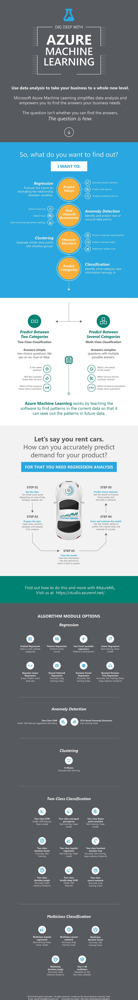

<properties
	pageTitle="Infographic: Machine learning basics - algorithm examples | Microsoft Azure"
	description="An easy-to-understand overview of machine learning basics includes algorithm examples. The downloadable infographic covers most machine learning questions."
	keywords="machine learning basics,algorithm examples,machine learning for beginners,machine learning questions,popular algorithms,algorithm infographic"
	services="machine-learning"
	documentationCenter=""
	authors="garyericson"
	manager="paulettm"
	editor="cgronlun"/>

<tags
	ms.service="machine-learning"
	ms.workload="data-services"
	ms.tgt_pltfrm="na"
	ms.devlang="na"
	ms.topic="article"
	ms.date="05/17/2016"
	ms.author="garye" />

# Downloadable Infographic: Machine learning basics with algorithm examples

Download this easy-to-understand infographic overview of machine learning basics. Learn about popular algorithms used to answer common machine learning questions. Algorithm examples help the machine learning beginner understand which algorithms to use and what they are used for.

## Popular algorithms in Machine Learning Studio

[Azure Machine Learning Studio](https://studio.azureml.net/) comes with a large library of algorithms for predictive analytics. The infographic shows popular families of algorithms: **regression**, **anomaly detection**, **clustering**, and **classification**.

[Cortana Intelligence Gallery](https://gallery.cortanaintelligence.com/) shows how these algorithms can be applied in many real-world solutions. Follow links in the infographic to see working examples.

## Download the infographic with algorithm examples

**[Download: Infographic of machine learning basics with links to algorithm examples (PDF)](http://download.microsoft.com/download/0/5/A/05AE6B94-E688-403E-90A5-6035DBE9EEC5/machine-learning-basics-infographic-with-algorithm-examples.pdf)**

## More help with algorithms for beginners and advanced users

* For a deeper discussion of the different types of machine learning algorithms, how they're used, and how to choose the right one for your solution, see [How to choose algorithms for Microsoft Azure Machine Learning](machine-learning-algorithm-choice.md).
* For a list by category of all the machine learning algorithms available in Machine Learning Studio, see [Initialize Model][initialize-model] in the Machine Learning Studio Algorithm and Module Help.
* For a complete list of algorithms and modules in Machine Learning Studio, see [A-Z list of Machine Learning Studio modules][a-z-list] in Machine Learning Studio Algorithm and Module Help.
* To download and print a diagram that gives an overview of the capabilities of Machine Learning Studio, see [Overview diagram of Azure Machine Learning Studio capabilities](machine-learning-studio-overview-diagram.md).

[AZURE.INCLUDE [machine-learning-free-trial](../../includes/machine-learning-free-trial.md)]

<!-- Module References -->
[a-z-list]: https://msdn.microsoft.com/library/azure/dn906033.aspx
[initialize-model]: https://msdn.microsoft.com/library/azure/0c67013c-bfbc-428b-87f3-f552d8dd41f6/
[k-means-clustering]: https://msdn.microsoft.com/library/azure/5049a09b-bd90-4c4e-9b46-7c87e3a36810/
[one-vs-all-multiclass]: https://msdn.microsoft.com/library/azure/7191efae-b4b1-4d03-a6f8-7205f87be664/
