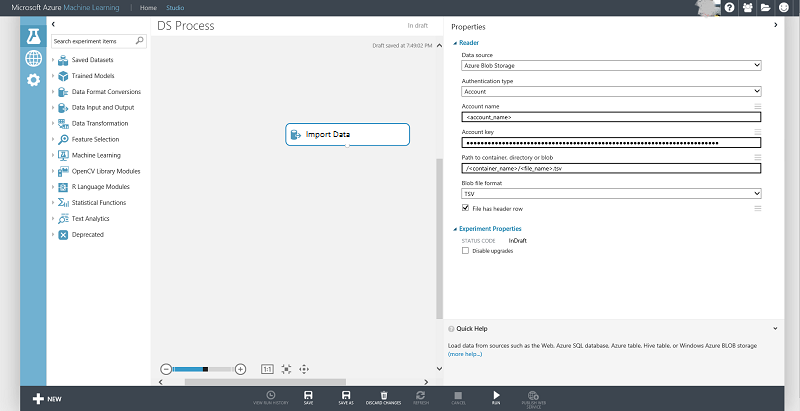

<properties 
	pageTitle="Create features for Azure blob storage data using Panda | Microsoft Azure" 
	description="How to create features for data that is stored in Azure blob container with the Panda Python package." 
	services="machine-learning,storage" 
	documentationCenter="" 
	authors="bradsev" 
	manager="paulettm" 
	editor="cgronlun" />

<tags 
	ms.service="machine-learning" 
	ms.workload="data-services" 
	ms.tgt_pltfrm="na" 
	ms.devlang="na" 
	ms.topic="article" 
	ms.date="06/14/2016" 
	ms.author="bradsev;garye" /> 

#Create features for Azure blob storage data using Panda

This document shows how to create features for data that is stored in Azure blob container using the [Pandas](http://pandas.pydata.org/) Python package. After outlining how to load the data into a Panda data frame, it shows how to generate categorical features using Python scripts with indicator values and binning features.

[AZURE.INCLUDE [cap-create-features-data-selector](../../includes/cap-create-features-selector.md)]
This **menu** links to topics that describe how to create features for data in various environments. This task is a step in the [Team Data Science Process (TDSP)](https://azure.microsoft.com/documentation/learning-paths/cortana-analytics-process/).

## Prerequisites
This article assumes that you have created an Azure blob storage account and have stored your data there. If you need instructions to set up an account, see [Create an Azure Storage account](../hdinsight-get-started.md#storage)

## Load the data into a Pandas data frame
In order to do explore and manipulate a dataset, it must be downloaded from the blob source to a local file which can then be loaded in a Pandas data frame. Here are the steps to follow for this procedure:

1. Download the data from Azure blob with the following sample Python code using blob service. Replace the variable in the code below with your specific values: 

	    from azure.storage.blob import BlobService
    	import tables
    	
		STORAGEACCOUNTNAME= <storage_account_name>
		STORAGEACCOUNTKEY= <storage_account_key>
		LOCALFILENAME= <local_file_name>		
		CONTAINERNAME= <container_name>
		BLOBNAME= <blob_name>

    	#download from blob
    	t1=time.time()
    	blob_service=BlobService(account_name=STORAGEACCOUNTNAME,account_key=STORAGEACCOUNTKEY)
    	blob_service.get_blob_to_path(CONTAINERNAME,BLOBNAME,LOCALFILENAME)
    	t2=time.time()
    	print(("It takes %s seconds to download "+blobname) % (t2 - t1))

2. Read the data into a Pandas data-frame from the downloaded file.

	    #LOCALFILE is the file path	
    	dataframe_blobdata = pd.read_csv(LOCALFILE)

Now you are ready to explore the data and generate features on this dataset.
	
##Feature Generation
	
The next two sections show how to generate categorical features with indicator values and binning features using Python scripts.

###Indicator value based Feature Generation

Categorical features can be created as follows:

1. Inspect the distribution of the categorical column:
	
		dataframe_blobdata['<categorical_column>'].value_counts()

2. Generate indicator values for each of the column values

		#generate the indicator column
		dataframe_blobdata_identity = pd.get_dummies(dataframe_blobdata['<categorical_column>'], prefix='<categorical_column>_identity')

3. Join the indicator column with the original data frame 
 
			#Join the dummy variables back to the original data frame
			dataframe_blobdata_with_identity = dataframe_blobdata.join(dataframe_blobdata_identity)

4. Remove the original variable itself:

		#Remove the original column rate_code in df1_with_dummy
		dataframe_blobdata_with_identity.drop('<categorical_column>', axis=1, inplace=True)
	
###Binning Feature Generation

For generating binned features, we proceed as follows:

1. Add a sequence of columns to bin a numeric column
 
		bins = [0, 1, 2, 4, 10, 40]
		dataframe_blobdata_bin_id = pd.cut(dataframe_blobdata['<numeric_column>'], bins)
		
2. Convert binning to a sequence of boolean variables

		dataframe_blobdata_bin_bool = pd.get_dummies(dataframe_blobdata_bin_id, prefix='<numeric_column>')
	
3. Finally, Join the dummy variables back to the original data frame

		dataframe_blobdata_with_bin_bool = dataframe_blobdata.join(dataframe_blobdata_bin_bool)	

##Writing data back to Azure blob and consuming in Azure Machine Learning

After you have explored the data and created the necessary features, you can upload the data (sampled or featurized) to an Azure blob and consume it in Azure Machine Learning using the following steps:
Note that additional features can be created in the Azure Machine Learning Studio as well. 
1. Write the data frame to local file

		dataframe.to_csv(os.path.join(os.getcwd(),LOCALFILENAME), sep='\t', encoding='utf-8', index=False)

2. Upload the data to Azure blob as follows:

		from azure.storage.blob import BlobService
    	import tables

		STORAGEACCOUNTNAME= <storage_account_name>
		LOCALFILENAME= <local_file_name>
		STORAGEACCOUNTKEY= <storage_account_key>
		CONTAINERNAME= <container_name>
		BLOBNAME= <blob_name>

	    output_blob_service=BlobService(account_name=STORAGEACCOUNTNAME,account_key=STORAGEACCOUNTKEY)    
	    localfileprocessed = os.path.join(os.getcwd(),LOCALFILENAME) #assuming file is in current working directory
	    
	    try:
	   
	    #perform upload
	    output_blob_service.put_block_blob_from_path(CONTAINERNAME,BLOBNAME,localfileprocessed)
	    
	    except:	        
		    print ("Something went wrong with uploading blob:"+BLOBNAME)

3. Now the data can be read from the blob using the Azure Machine Learning [Import Data](https://msdn.microsoft.com/library/azure/4e1b0fe6-aded-4b3f-a36f-39b8862b9004/) module as shown in the screen below:
 

 