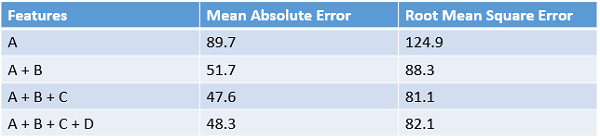

<properties
	pageTitle="Feature engineering in the Cortana Analytics Process | Microsoft Azure" 
	description="Explains the purposes of feature engineering and provides examples of its role in the data enhancement process of machine learning."
	services="machine-learning"
	documentationCenter=""
	authors="bradsev"
	manager="paulettm"
	editor="cgronlun"/>

<tags
	ms.service="machine-learning"
	ms.workload="data-services"
	ms.tgt_pltfrm="na"
	ms.devlang="na"
	ms.topic="article"
	ms.date="06/14/2016"
	ms.author="zhangya;bradsev" />

# Feature engineering in the Cortana Analytics Process 

This topic explains the purposes of feature engineering and provides examples of its role in the data enhancement process of machine learning. The examples used to illustrate this process are drawn from Azure Machine Learning Studio. 

[AZURE.INCLUDE [cap-create-features-data-selector](../../includes/cap-create-features-selector.md)]

This **menu** links to topics that describe how to create features for data in various environments. This task is a step in the [Team Data Science Process (TDSP)](https://azure.microsoft.com/documentation/learning-paths/cortana-analytics-process/).

Feature engineering attempts to increase the predictive power of learning algorithms by creating features from raw data that help facilitate the learning process. The engineering and selection of features is one part of the TDSP outlined in the [What is the Team Data Science Process?](data-science-process-overview.md) Feature engineering and selection are parts of the **Develop features** step of the CAP. 
* **feature engineering**: This process attempts to create additional relevant features from the existing raw features in the data, and to increase the predictive power of the learning algorithm.
* **feature selection**: This process selects the key subset of original data features in an attempt to reduce the dimensionality of the training problem.

Normally **feature engineering** is applied first to generate additional features, and then the **feature selection** step is performed to eliminate irrelevant, redundant, or highly correlated features.

The training data used in machine learning can often be enhanced by extraction of features from the raw data collected. An example of an engineered feature in the context of learning how to classify the images of handwritten characters is creation of a bit density map constructed from the raw bit distribution data. This map can help locate the edges of the characters more efficiently than simply using the raw distribution directly.

[AZURE.INCLUDE [machine-learning-free-trial](../../includes/machine-learning-free-trial.md)]

## Creating Features from Your Data - Feature Engineering

The training data consists of a matrix composed of examples (records or observations stored in rows), each of which has a set of features (variables or fields stored in columns). The features specified in the experimental design are expected to characterize the patterns in the data. Although many of the raw data fields can be directly included in the selected feature set used to train a model, it is often the case that additional (engineered) features need to be constructed from the features in the raw data to generate an enhanced training dataset.

What kind of features should be created to enhance the dataset when training a model? Engineered features that enhance the training provide information that better differentiates the patterns in the data. We expect the new features to provide additional information that is not clearly captured or easily apparent in the original or existing feature set. But this process is something of an art. Sound and productive decisions often require some domain expertise.

When starting with Azure Machine Learning, it is easiest to grasp this process concretely using samples provided in the Studio. Two examples are presented here:

* A regression example [Prediction of the number of bike rentals](http://gallery.cortanaintelligence.com/Experiment/Regression-Demand-estimation-4) in a supervised experiment where the target values are known
* A text mining classification example using [Feature Hashing](https://msdn.microsoft.com/library/azure/c9a82660-2d9c-411d-8122-4d9e0b3ce92a/)

### Example 1: Adding Temporal Features for Regression Model ###

Let's use the experiment "Demand forecasting of bikes" in Azure Machine Learning Studio to demonstrate how to engineer features for a regression task. The objective of this experiment is to predict the demand for the bikes, that is, the number of bike rentals within a specific month/day/hour. The dataset "Bike Rental UCI dataset" is used as the raw input data. This dataset is based on real data from the Capital Bikeshare company that maintains a bike rental network in Washington DC in the United States. The dataset represents the number of bike rentals within a specific hour of a day in the years 2011 and year 2012 and contains 17379 rows and 17 columns. The raw feature set contains weather conditions (temperature/humidity/wind speed) and the type of the day (holiday/weekday). The field to predict is "cnt", a count which represents the bike rentals within a specific hour and which ranges ranges from 1 to 977.

With the goal of constructing effective features in the training data, four regression models are built using the same algorithm but with four different training datasets. The four datasets represent the same raw input data, but with an increasing number of features set. These features are grouped into four categories:

1. A = weather + holiday + weekday + weekend features for the predicted day
2. B = number of bikes that were rented in each of the previous 12 hours
3. C = number of bikes that were rented in each of the previous 12 days at the same hour
4. D = number of bikes that were rented in each of the previous 12 weeks at the same hour and the same day

Besides feature set A, which already exist in the original raw data, the other three sets of features are created through the feature engineering process. Feature set B captures very recent demand for the bikes. Feature set C captures the demand for bikes at a particular hour. Feature set D captures demand for bikes at particular hour and particular day of the week. The four training datasets each includes feature set A, A+B, A+B+C, and A+B+C+D, respectively.

In the Azure Machine Learning experiment, these four training datasets are formed via four branches from the pre-processed input dataset. Except the left most branch, each of these branches contains an [Execute R Script](https://msdn.microsoft.com/library/azure/30806023-392b-42e0-94d6-6b775a6e0fd5/) module, in which a set of derived features (feature set B, C, and D) are respectively constructed and appended to the imported dataset. The following figure demonstrates the R script used to create feature set B in the second left branch.

The comparison of the performance results of the four models are summarized in the following table. The best results are shown by features A+B+C. Note that the error rate decreases when additional feature set are included in the training data. It verifies our presumption that the feature set B, C provide additional relevant information for the regression task. But adding the D feature does not seem to provide any additional reduction in the error rate.

###  Example 2: Creating Features in Text Mining  

Feature engineering is widely applied in tasks related to text mining, such as document classification and sentiment analysis. For example, when we want to classify documents into several categories, a typical assumption is that the word/phrases included in one doc category are less likely to occur in another doc category. In another words, the frequency of the words/phrases distribution is able to characterize different document categories. In text mining applications, because individual pieces of text-contents usually serve as the input data, the feature engineering process is needed to create the features involving word/phrase frequencies.

To achieve this task, a technique called **feature hashing** is applied to efficiently turn arbitrary text features into indices. Instead of associating each text feature (words/phrases) to a particular index, this method functions by applying a hash function to the features and using their hash values as indices directly.

In Azure Machine Learning, there is a [Feature Hashing](https://msdn.microsoft.com/library/azure/c9a82660-2d9c-411d-8122-4d9e0b3ce92a/) module that creates these word/phrase features conveniently. Following figure shows an example of using this module. The input dataset contains two columns: the book rating ranging from 1 to 5, and the actual review content. The goal of this [Feature Hashing](https://msdn.microsoft.com/library/azure/c9a82660-2d9c-411d-8122-4d9e0b3ce92a/) module is to retrieve a bunch of new features that show the occurrence frequency of the corresponding word(s)/phrase(s) within the particular book review. To use this module, we need to complete the following steps:

* First, select the column that contains the input text ("Col2" in this example).
* Second, set the "Hashing bitsize" to 8, which means 2^8=256 features will be created. The word/phase in all the text will be hashed to 256 indices. The parameter "Hashing bitsize" ranges from 1 to 31. The word(s)/phrase(s) are less likely to be hashed into the same index if setting it to be a larger number.
* Third, set the parameter "N-grams" to 2. This gets the occurrence frequency of unigrams (a feature for every single word) and bigrams (a feature for every pair of adjacent words) from the input text. The parameter "N-grams" ranges from 0 to 10, which indicates the maximum number of sequential words to be included in a feature.  

The following figure shows what the these new feature look like.

## Conclusion

Engineered and selected features increase the efficiency of the training process which attempts to extract the key information contained in the data. They also improve the power of these models to classify the input data accurately and to predict outcomes of interest more robustly. Feature engineering and selection can also combine to make the learning more computationally tractable. It does so by enhancing and then reducing the number of features needed to calibrate or train a model. Mathematically speaking, the features selected to train the model are a minimal set of independent variables that explain the patterns in the data and then predict outcomes successfully.

Note that it is not always necessarily to perform feature engineering or feature selection. Whether it is needed or not depends on the data we have or collect, the algorithm we pick, and the objective of the experiment.
 
