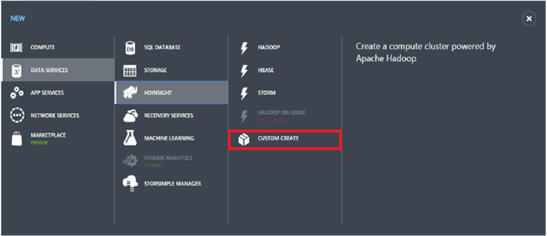
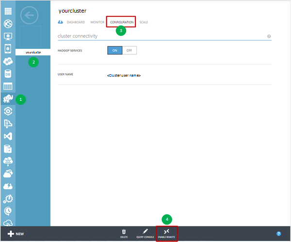
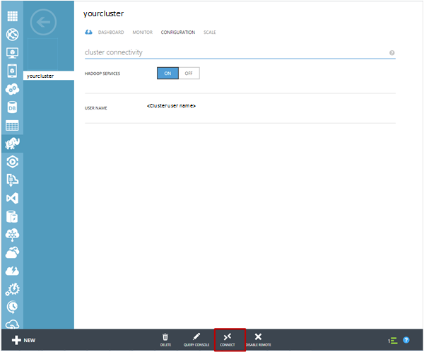

<properties 
	pageTitle="Customize Hadoop clusters for the Team Data Science Process | Microsoft Azure" 
	description="Popular Python modules made available in custom Azure HDInsight Hadoop clusters."
	services="machine-learning" 
	documentationCenter="" 
	authors="bradsev" 
	manager="paulettm" 
	editor="cgronlun"  />

<tags 
	ms.service="machine-learning" 
	ms.workload="data-services" 
	ms.tgt_pltfrm="na" 
	ms.devlang="na" 
	ms.topic="article" 
	ms.date="06/14/2016" 
	ms.author="hangzh;bradsev" />

# Customize Azure HDInsight Hadoop clusters for the Team Data Science Process 

This article describes how to customize an HDInsight Hadoop cluster by installing 64-bit Anaconda (Python 2.7) on each node when the cluster is provisioned as an HDInsight service. It also shows how to access the headnode to submit custom jobs to the cluster. This customization makes many popular Python modules that are included in Anaconda conveniently available for use in user defined functions (UDFs) that are designed to process Hive records in the cluster. For instructions on the procedures used in this scenario, see [How to submit Hive queries](machine-learning-data-science-move-hive-tables.md#submit).

The menu below links to topics that describe how to set up the various data science environments used by the Team Data Science Process (TDSP).

[AZURE.INCLUDE [data-science-environment-setup](../../includes/cap-setup-environments.md)]

## Customize Azure HDInsight Hadoop Cluster

To create a customized HDInsight Hadoop cluster, users need to log on to [**Classic Portal of Azure**](https://manage.windowsazure.com/), click **New** at the left bottom corner, and then select DATA SERVICES -> HDINSIGHT -> **CUSTOM CREATE** to bring up the **Cluster Details** window. 

Input the name of the cluster to be created on configuration page 1, and accept default values for the other fields. Click on the arrow to go to the next configuration page. 

On configuration page 2, input the number of **DATA NODES**, select the **REGION/VIRTUAL NETWORK**, and select the sizes of the **HEAD NODE** and the **DATA NODE**. Click the arrow to go to the next configuration page.

>[AZURE.NOTE] The **REGION/VIRTUAL NETWORK** has to be the same as the region of the storage account that is going to be used for the HDInsight Hadoop cluster. Otherwise, in fourth configuration page, the storage account that the users want to use will not appear on the dropdown list of **ACCOUNT NAME**.

On configuration page 3, provide a user name and password for the HDInsight Hadoop cluster. **Do not** select the _Enter the Hive/Oozie Metastore_. Then, click the arrow to go to the next configuration page. 

On configuration page 4, specify the storage account name, the default container of the HDInsight Hadoop cluster. If users select _Create default container_ in the **DEFAULT CONTAINER** drop down list, a container with the same name as the cluster will be created. Click the arrow to go to the last configuration page.

On the final **Script Actions** configuration page, click **add script action** button, and fill the text fields with the following values.
 
* **NAME** - any string as the name of this script action. 
* **NODE TYPE** - select **All nodes**. 
* **SCRIPT URI** - *http://getgoing.blob.core.windows.net/publicscripts/Azure_HDI_Setup_Windows.ps1* 
	* *publicscripts* is a public container in storage account 
	* *getgoing* we use to share PowerShell script files to facilitate users work in Azure. 
* **PARAMETERS** - (leave blank)

Finally, click on the check mark to start the creation of the customized HDInsight Hadoop cluster. 

##  Access the Head Node of Hadoop Cluster

Users must enable remote access to the Hadoop cluster in Azure before they can access the head node of the Hadoop cluster through RDP. 

1. Log in to the [**Classic Portal of Azure**](https://manage.windowsazure.com/), select **HDInsight** on the left, select your Hadoop cluster from the list of clusters, click the **CONFIGURATION** tab, and then click the **ENABLE REMOTE** icon at the bottom of the page.
	
	

2. In the **Configure Remote Desktop** window, enter the USER NAME and PASSWORD fields, and select the expiration date for remote access. Then click the check mark to enable the remote access to the head node of the Hadoop cluster.

	
	
>[AZURE.NOTE] The user name and password for the remote access are not the user name and password that you use when you created the Hadoop cluster. These are a separate set of credentials. Also, the expiration date of the remote access has to be within 7 days from the current date.

After remote access is enabled, click **CONNECT** at the bottom of the page to remote into the head node. You log on to the head node of the Hadoop cluster by entering the credentials for the remote access user that you specified earlier.

The next steps in the advanced analytics process are mapped in the [Team Data Science Process (TDSP)](https://azure.microsoft.com/documentation/learning-paths/cortana-analytics-process/) and may include steps that move data into HDInsight, process and sample it there in preparation for learning from the data with Azure Machine Learning.

See [How to submit Hive queries](machine-learning-data-science-move-hive-tables.md#submit) for instructions on how to access the Python modules that are included in Anaconda from the head node of the cluster in user defined functions (UDFs) that are used to process Hive records stored in the cluster.

 