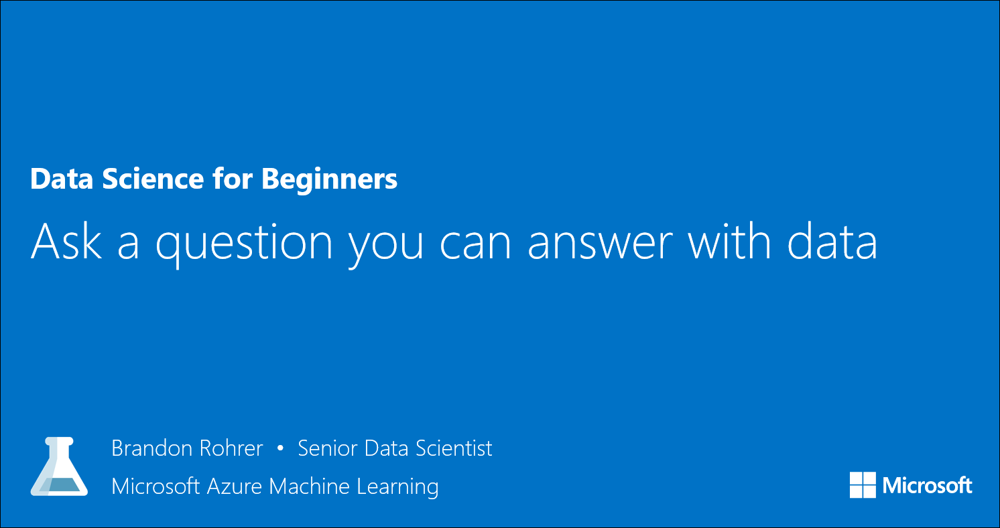

<properties
   pageTitle="Ask a question you can answer with data | Microsoft Azure"
   description="Learn how to formulate a data science question in Data Science for Beginners video 3. Includes a comparison of classification and regression questions."
   keywords="choose a question,data science questions,formulate question,formulate questions,regression questions,classification questions"
   services="machine-learning"
   documentationCenter="na"
   authors="brohrer-ms"
   manager="paulettm"
   editor="cjgronlund"/>

<tags
   ms.service="machine-learning"
   ms.devlang="na"
   ms.topic="article"
   ms.tgt_pltfrm="na"
   ms.workload="na"
   ms.date="06/24/2016"
   ms.author="cgronlun;brohrer;garye"/>

# Ask a question you can answer with data: Data Science for Beginners video 3

Learn how to formulate a data science question in Data Science for Beginners video 3. This video includes a comparison of questions for classification and regression algorithms.

**"Ask a question you can answer with data" will be available June 28**.

## Other videos in the series

*Data Science for Beginners* is a quick introduction to data science in five short videos.

  * Video 1: [The 5 questions data science can answer](machine-learning-data-science-for-beginners-the-5-questions-data-science-answers.md). **Available now.**
  * Video 2: [Is your data ready for data science?](machine-learning-data-science-for-beginners-is-your-data-ready-for-data-science.md) Available June 27.
  * Video 4: [Predict an answer with a simple model](machine-learning-data-science-for-beginners-predict-an-answer-with-a-simple-model.md). Available June 29.
  * Video 5: [Copy other people's work to do data science](machine-learning-data-science-for-beginners-copy-other-peoples-work-to-do-data-science.md). Available June 30.

  ## Next steps

    * [Try your first data science experiment with Azure Machine Learning](machine-learning-create-experiment.md)
    * [Get an introduction to Machine Learning on Microsoft Azure](machine-learning-what-is-machine-learning.md)
