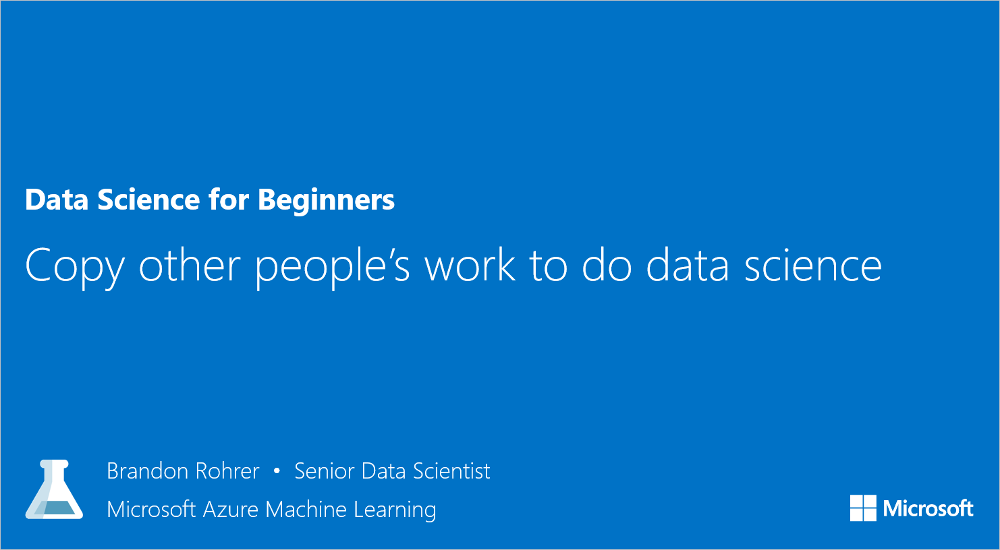

<properties
   pageTitle="Copy other people's work to do data science | Microsoft Azure"
   description="Trade secret of data science: Get others to do your work for you. See examples in Cortana Analytics Gallery such as a clustering algorithm example."
   keywords="data science examples,algorithm example,experiment example,machine learning example,clustering algorithm"
   services="machine-learning"
   documentationCenter="na"
   authors="brohrer-ms"
   manager="paulettm"
   editor="cjgronlund"/>

<tags
   ms.service="machine-learning"
   ms.devlang="na"
   ms.topic="article"
   ms.tgt_pltfrm="na"
   ms.workload="na"
   ms.date="06/27/2016"
   ms.author="cgronlun;brohrer;garye"/>

# Copy other people's work to do data science: Data Science for Beginners video 5

One of the trade secrets of data science is getting other people to do your work for you. Find a clustering algorithm example to use for your own experiment.

**"Copy other people's work to do data science" will be available June 30.**

## Other videos in the series

*Data Science for Beginners* is a quick introduction to data science in five short videos.

  * Video 1: [The 5 questions data science answers](machine-learning-data-science-for-beginners-the-5-questions-data-science-answers.md). **Available now.**
  * Video 2: [Is your data ready for data science?](machine-learning-data-science-for-beginners-is-your-data-ready-for-data-science.md) **Available now.**
  * Video 3: [Ask a question you can answer with data](machine-learning-data-science-for-beginners-ask-a-question-you-can-answer-with-data.md). **Available now.**
  * Video 4: [Predict an answer with a simple model](machine-learning-data-science-for-beginners-predict-an-answer-with-a-simple-model.md). Available June 29.

## Next steps

  * [Try your first data science experiment with Azure Machine Learning](machine-learning-create-experiment.md)
  * [Get an introduction to Machine Learning on Microsoft Azure](machine-learning-what-is-machine-learning.md)
