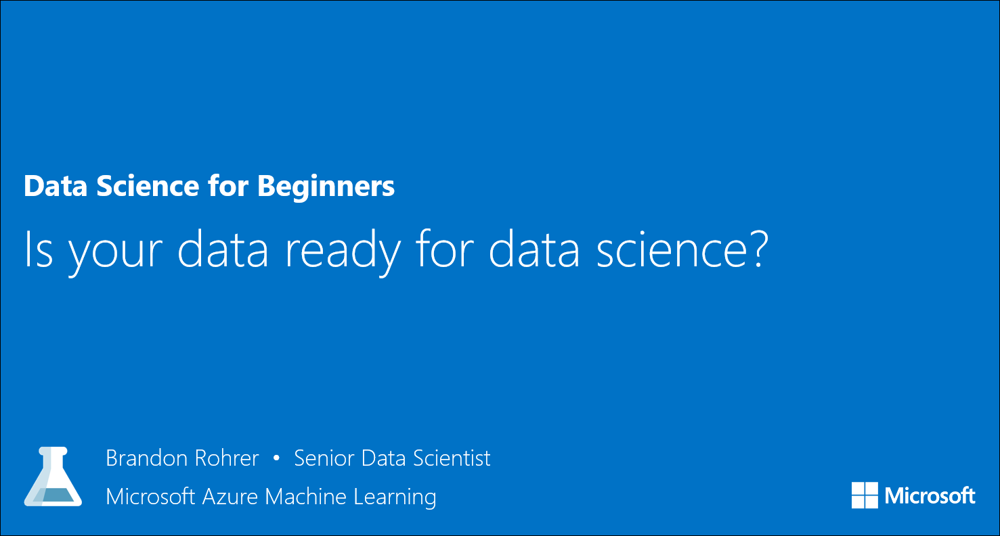

<properties
   pageTitle="Is your data ready for data science? - data evaluation | Microsoft Azure"
   description="Learn the 4 criteria for data to be ready for data science. Data Science for Beginners video 2 has concrete examples to help with basic data evaluation."
   keywords="data evaluation,relevant data,evaluate data,prepare data,data criteria,data ready"
   services="machine-learning"
   documentationCenter="na"
   authors="brohrer-ms"
   manager="paulettm"
   editor="cjgronlund"/>

<tags
   ms.service="machine-learning"
   ms.devlang="na"
   ms.topic="article"
   ms.tgt_pltfrm="na"
   ms.workload="na"
   ms.date="06/24/2016"
   ms.author="cgronlun;brohrer;garye"/>

# Is your data ready for data science? Data Science for Beginners video 2

Learn about evaluating your data to make sure it meets some basic criteria so that it's ready for data science. This second video in the Data Science for Beginners series has concrete examples to help you evaluate data.

**"Is your data ready for data science?" will be available June 27.**

## Other videos in the series

*Data Science for Beginners* is a quick introduction to data science in five short videos.

  * Video 1: [The 5 questions data science can answer](machine-learning-data-science-for-beginners-the-5-questions-data-science-answers.md). **Available now.**
  * Video 3: [Ask a question you can answer with data](machine-learning-data-science-for-beginners-ask-a-question-you-can-answer-with-data.md). Available June 28.
  * Video 4: [Predict an answer with a simple model](machine-learning-data-science-for-beginners-predict-an-answer-with-a-simple-model.md). Available June 29.
  * Video 5: [Copy other people's work to do data science](machine-learning-data-science-for-beginners-copy-other-peoples-work-to-do-data-science.md). Available June 30.

## Next steps

  * [Try your first data science experiment with Azure Machine Learning](machine-learning-create-experiment.md)
  * [Get an introduction to Machine Learning on Microsoft Azure](machine-learning-what-is-machine-learning.md)
