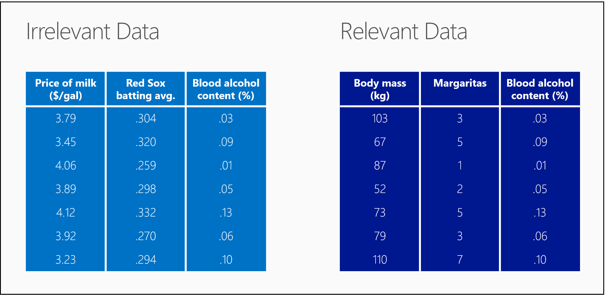

<properties
   pageTitle="Is your data ready for data science? Data evaluation | Microsoft Azure"
   description="Learn the 4 criteria for data to be ready for data science. Data Science for Beginners video 2 has concrete examples to help with basic data evaluation."
   keywords="data evaluation,relevant data,evaluate data,prepare data,data criteria,data ready"
   services="machine-learning"
   documentationCenter="na"
   authors="brohrer-ms"
   manager="paulettm"
   editor="cjgronlund"/>

<tags
   ms.service="machine-learning"
   ms.devlang="na"
   ms.topic="article"
   ms.tgt_pltfrm="na"
   ms.workload="na"
   ms.date="07/15/2016"
   ms.author="cgronlun;brohrer;garye"/>

# Is your data ready for data science?

## Video 2: Data Science for Beginners series

Learn about evaluating your data to make sure it meets the basic criteria for data science.

To get the most out of the series, watch them in order. [Go to the list of videos](#other-videos-in-this-series)

> [AZURE.VIDEO data-science-for-beginners-series-is-your-data-ready-for-data-science]

## Other videos in this series

*Data Science for Beginners* is a quick introduction to data science in five short videos.

  * Video 1: [The 5 questions data science answers](machine-learning-data-science-for-beginners-the-5-questions-data-science-answers.md) *(5 min 14 sec)*
  * Video 2: Is your data ready for data science?
  * Video 3: [Ask a question you can answer with data](machine-learning-data-science-for-beginners-ask-a-question-you-can-answer-with-data.md) *(4 min 17 sec)*
  * Video 4: [Predict an answer with a simple model](machine-learning-data-science-for-beginners-predict-an-answer-with-a-simple-model.md) *(7 min 42 sec)*
  * Video 5: [Copy other people's work to do data science](machine-learning-data-science-for-beginners-copy-other-peoples-work-to-do-data-science.md) *(3 min 18 sec)*

## Transcript: Is your data ready for data science?

Welcome to "Is your data is ready for data science?" the second video in the series *Data Science for Beginners*.  

Before data science can give you the answers you want, you have to give it some high quality raw materials to work with. Just like making a pizza, the better the ingredients you start with, the better the final product.

## Criteria for data

So, in the case of data science, there are some ingredients that we need to pull together.

We need data that is:

  *	Relevant
  *	Connected
  *	Accurate
  *	Enough to work with

## Is your data relevant?

So the first ingredient - we need data that's relevant.

Look at the table on the left. We met seven people outside of Boston bars, measured their blood alcohol level, the Red Sox batting average in their last game, and the price of milk in the nearest convenience store.

This is all perfectly legitimate data. It’s only fault is that it isn’t relevant. There's no obvious relationship between these numbers. If I gave you the current price of milk and the Red Sox batting average, there's no way you could guess my blood alcohol content.

Now look at the table on the right. This time we measured each person’s body mass and counted the number of drinks they’ve had.  The numbers in each row are now relevant to each other. If I gave you my body mass and the number of margaritas I've had, you could make a guess at my blood alcohol content.

## Do you have connected data?

The next ingredient is connected data.

Here is some relevant data on the quality of hamburgers: grill temperature, patty weight and rating in the local food magazine. But notice the gaps in the table on the left.

Most data sets are missing some values. It's common to have holes like this and there are ways to work around them. But if there's too much missing, your data begins to look like Swiss cheese.

If you look at the table on the left, there's so much missing data, it's hard to come up with any kind of relationship between grill temperature and patty weight. This is an example of disconnected data.

The table on the right, though, is full and complete - an example of connected data.

## Is your data accurate?

The next ingredient we need is accuracy. Here are 4 targets that we’d like to hit with arrows.

Look at the target in the upper-right. We’ve got a tight grouping right around the bullseye. That, of course, is accurate. Oddly, in the language of data science, our performance on the target right below it is also considered accurate.

If you were to map out the center of these arrows, you'd see that it's very close to the bullseye. The arrows are spread out all around the target, so they're considered imprecise, but they're centered around the bullseye, so they're considered accurate.

Now look at the upper-left target. Here our arrows hit very close together, a tight grouping. They're precise, but they're inaccurate because the center is way off the bullseye. And, of course, the arrows in the bottom-left target are both inaccurate and imprecise. This archer needs more practice.

## Do you have enough data to work with?

Finally, ingredient #4 - we need to have enough data.

Think of each data point in your table as being a brush stroke in a painting. If you have only a few of them, the painting can be pretty fuzzy - it's hard to tell what it is.

If you add some more brush strokes, then your painting starts to get a little sharper.

When you have barely enough strokes, you can see just enough to make some broad decisions. Is it somewhere I might want to visit? It looks bright, that looks like clean water – yes, that’s where I’m going on vacation.

As you add more data, the picture becomes clearer and you can make more detailed decisions. Now I can look at the three hotels on the left bank. You know, I really like the architectural features of the one in the foreground. I’ll stay there, on the third floor.

With data that's relevant, connected, accurate, and enough, we have all the ingredients we need to do some high quality data science.

Be sure to check out the other 4 videos in *Data Science for Beginners* from Microsoft Azure Machine Learning.

## Next steps

  * [Try your first data science experiment with Azure Machine Learning](machine-learning-create-experiment.md)
  * [Get an introduction to Machine Learning on Microsoft Azure](machine-learning-what-is-machine-learning.md)
