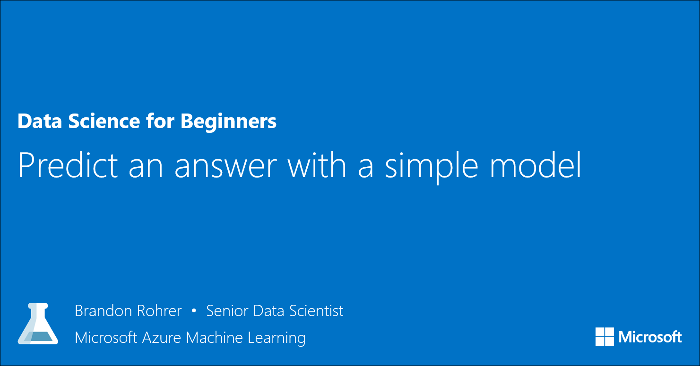

<properties
   pageTitle="Predict an answer with a simple model | Microsoft Azure"
   description="How to create a simple model to predict the price of a diamond in Data Science for Beginners video 4. Includes a basic linear regression with target data."                                  
   keywords="create a model,simple model,simple data model,price prediction,simple regression model"
   services="machine-learning"
   documentationCenter="na"
   authors="brohrer-ms"
   manager="paulettm"
   editor="cjgronlund"/>

<tags
   ms.service="machine-learning"
   ms.devlang="na"
   ms.topic="article"
   ms.tgt_pltfrm="na"
   ms.workload="na"
   ms.date="06/24/2016"
   ms.author="cgronlun;brohrer;garye"/>

# Predict an answer with a simple model: Data Science for Beginners video 4

Learn how to create a simple model to predict the price of a diamond in Data Science for Beginners video 4. We'll draw a regression model with target data.

**"Predict an answer with a simple model" will be available June 29.**

## Other videos in the series

*Data Science for Beginners* is a quick introduction to data science in five short videos.

  * Video 1: [The 5 questions data science can answer](machine-learning-data-science-for-beginners-the-5-questions-data-science-answers.md). **Available now.**
  * Video 2: [Is your data ready for data science?](machine-learning-data-science-for-beginners-is-your-data-ready-for-data-science.md) Available June 27.
  * Video 3: [Ask a question you can answer with data](machine-learning-data-science-for-beginners-ask-a-question-you-can-answer-with-data.md). Available June 28.
  * Video 5: [Copy other people's work to do data science](machine-learning-data-science-for-beginners-copy-other-peoples-work-to-do-data-science.md). Available June 30.

## Next steps

  * [Try your first data science experiment with Azure Machine Learning](machine-learning-create-experiment.md)
  * [Get an introduction to Machine Learning on Microsoft Azure](machine-learning-what-is-machine-learning.md)
