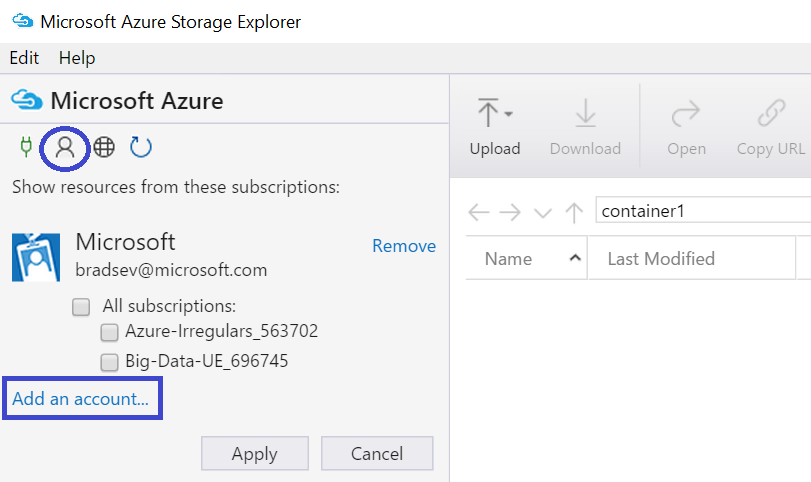

<properties 
	pageTitle="Move Data to and from Azure Blob Storage using Azure Storage Explorer | Microsoft Azure" 
	description="Move Data to and from Azure Blob Storage using Azure Storage Explorer" 
	services="machine-learning,storage" 
	documentationCenter="" 
	authors="bradsev" 
	manager="paulettm" 
	editor="cgronlun" />

<tags 
	ms.service="machine-learning" 
	ms.workload="data-services" 
	ms.tgt_pltfrm="na" 
	ms.devlang="na" 
	ms.topic="article" 
	ms.date="08/30/2016"
	ms.author="bradsev" />

# Move Data to and from Azure Blob Storage using Azure Storage Explorer

Azure Storage Explorer is a free tool from Microsoft that allows you to easily work with Azure Storage data on Windows, macOS and Linux. This topic describes how to use it to upload and download data from Azure blob storage. The tool can be downloaded from [Microsoft Azure Storage Explorer](http://storageexplorer.com/).

Guidance on technologies used to move data to and/or from Azure Blob storage are linked here:
 
[AZURE.INCLUDE [blob-storage-tool-selector](../../includes/machine-learning-blob-storage-tool-selector.md)]   
 
&nbsp; 
 
> [AZURE.NOTE] If you are using VM that was set up with the scripts provided by [Data Science Virtual machines in Azure](machine-learning-data-science-virtual-machines.md), then Azure Storage Explorer is already installed on the VM.  
 
&nbsp; 
 
> [AZURE.NOTE] For a complete introduction to Azure blob storage, please refer to [Azure Blob Basics](../storage/storage-dotnet-how-to-use-blobs.md) and  [Azure Blob Service](https://msdn.microsoft.com/library/azure/dd179376.aspx).   

## Prerequisites

This document assumes that you have an Azure subscription, a storage account and the corresponding storage key for that account. Before uploading/downloading data, you must know your Azure storage account name and account key. 

- To set up an Azure subscription, see [Free one-month trial](https://azure.microsoft.com/pricing/free-trial/).
- For instructions on creating a storage account and for getting account and key information, see [About Azure storage accounts](../storage/storage-create-storage-account.md). Make a note the access key for your storage account as you need this key to connect to the account with the Azure Storage Explorer tool.
- The Azure Storage Explorer tool can be downloaded from [Microsoft Azure Storage Explorer](http://storageexplorer.com/). Accept the defaults during install.

## Use Azure Storage Explorer 

The following steps document how to upload/download data using Azure Storage Explorer. 

1.  Launch Microsoft Azure Storage Explorer.
2.  Select **Azure account settings** icon and then **Add an account** to bring up the **Sign in to your account...** wizard and enter you credentials. 
3.  Select the **Connect to Azure storage** icon to bring up the **Connect to Azure Storage** wizard. 
4. Enter the access key from your Azure storage account on the **Connect to Azure Storage** wizard and then **Next**. 
5. Enter storage account name in the **Account name** box and then select **Next**. 
6. The storage account added should now be listed. Upload data by clicking the **Upload** button. Select one or multiple files to upload from the file system and click "Open" to begin uploading the file(s).
7. Download data by selecting the blob in the corresponding container and clicking the "Download" button .

