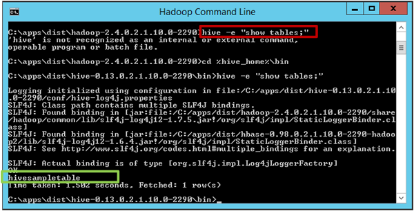
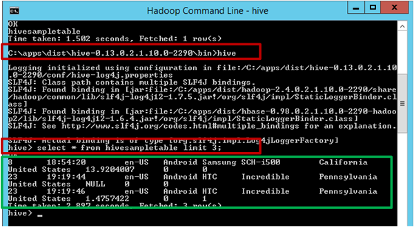
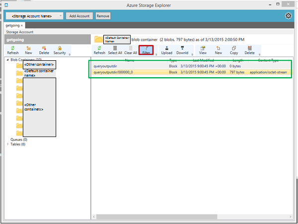

<properties 
	pageTitle="Create and load data into Hive tables from Blob storage | Microsoft Azure" 
	description="Create Hive tables and load data in blob to hive tables" 
	services="machine-learning,storage" 
	documentationCenter="" 
	authors="bradsev"
	manager="paulettm"
	editor="cgronlun" />

<tags 
	ms.service="machine-learning" 
	ms.workload="data-services" 
	ms.tgt_pltfrm="na" 
	ms.devlang="na" 
	ms.topic="article" 
	ms.date="06/14/2016" 
	ms.author="hangzh;bradsev" />

 
#Create and load data into Hive tables from Azure blob storage

This topic presents generic Hive queries that create Hive tables and load data from Azure blob storage. Some guidance is also provided on partitioning Hive tables and on using the Optimized Row Columnar (ORC) formatting to improve query performance.

This **menu** links to topics that describe how to ingest data into target environments where the data can be stored and processed during the Team Data Science Process (TDSP).

[AZURE.INCLUDE [cap-ingest-data-selector](../../includes/cap-ingest-data-selector.md)]

## Prerequisites
This article assumes that you have:
 
* Created an Azure storage account. If you need instructions, see [Create an Azure Storage account](../hdinsight-get-started.md#storage) 
* Provisioned a customized Hadoop cluster with the HDInsight service.  If you need instructions, see [Customize Azure HDInsight Hadoop clusters for advanced analytics](machine-learning-data-science-customize-hadoop-cluster.md).
* Enabled remote access to the cluster, logged in, and opened the Hadoop Command Line console. If you need instructions, see [Access the Head Node of Hadoop Cluster](machine-learning-data-science-customize-hadoop-cluster.md#headnode). 

## Upload data to Azure blob storage
If you created an Azure virtual machine by following the instructions provided in [Set up an Azure virtual machine for advanced analytics](machine-learning-data-science-setup-virtual-machine.md), this script file should have been downloaded to the *C:\\Users\\\<user name\>\\Documents\\Data Science Scripts* directory on the virtual machine. These Hive queries only require that you plug in your own data schema and Azure blob storage configuration in the appropriate fields to be ready for submission.

We assume that the data for Hive tables is in an **uncompressed** tabular format, and that the data has been uploaded to the default (or to an additional) container of the storage account used by the Hadoop cluster. 

If you want to practice on the _NYC Taxi Trip Data_, you need to first  download the 24 <a href="http://www.andresmh.com/nyctaxitrips/" target="_blank">NYC Taxi Trip Data</a> files (12 Trip files, and 12 Fare files), **unzip** all files into .csv files, and then upload them to the default (or appropriate container) of the Azure storage account that was created by the procedure outlined in the [Customize Azure HDInsight Hadoop clusters for Advanced Analytics Process and Technology](machine-learning-data-science-customize-hadoop-cluster.md) topic. The process to upload the .csv files to the default container on the storage account can be found on this [page](machine-learning-data-science-process-hive-walkthrough.md#upload). 

## How to submit Hive queries

Hive queries can be submitted by using:

1. [Submit Hive queries through Hadoop Command Line in headnode of Hadoop cluster](#headnode)
2. [Submit Hive queries with the Hive Editor](#hive-editor)
3. [Submit Hive queries with Azure PowerShell Commands](#ps)
 
Hive queries are SQL-like. Users familiar with SQL may find the [Hive for SQL Users Cheat Sheet](http://hortonworks.com/wp-content/uploads/2013/05/hql_cheat_sheet.pdf) useful.

When submitting a Hive query, you can also control the destination of the output from Hive queries, whether it be on the screen or to a local file on the head node or to an Azure blob.

### 1. Submit Hive queries through Hadoop Command Line in headnode of Hadoop cluster

If the Hive query is complex, submitting it directly in the head node of the Hadoop cluster typically leads to faster turn around than submitting it with a Hive Editor or Azure PowerShell scripts. 

Log in to the head node of the Hadoop cluster, open the Hadoop Command Line on the desktop of the head node, and enter command `cd %hive_home%\bin`.

Users have three ways to submit Hive queries in the Hadoop Command Line: 

* directly
* using .hql files
* with the Hive command console

#### Submit Hive queries directly in Hadoop Command Line. 

Users can run command like `hive -e "<your hive query>;` to submit simple Hive queries directly in Hadoop Command Line. Here is an example, where the red box outlines the command that submits the Hive query, and the green box outlines the output from the Hive query.

#### Submit Hive queries in .hql files

When the Hive query is more complicated and has multiple lines, editing queries in command line or Hive command console is not practical. An alternative is to use a text editor in the head node of the Hadoop cluster to save the Hive queries in a .hql file in a local directory of the head node. Then the Hive query in the .hql file can be submitted by using the `-f` argument as follows:
	
	hive -f "<path to the .hql file>"

**Suppress progress status screen print of Hive queries**

By default, after Hive query is submitted in Hadoop Command Line, the progress of the Map/Reduce job will be printed out on screen. To suppress the screen print of the Map/Reduce job progress, you can use an argument `-S` ("S" in upper case) in the command line as follows:

	hive -S -f "<path to the .hql file>"
	hive -S -e "<Hive queries>"

#### Submit Hive queries in Hive command console.

Users can also first enter the Hive command console by running command `hive` in Hadoop Command Line, and then submit Hive queries in Hive command console. Here is an example. In this example, the two red boxes highlight the commands used to enter the Hive command console, and the Hive query submitted in Hive command console, respectively. The green box highlights the output from the Hive query. 

The previous examples directly output the Hive query results on screen. Users can also write the output to a local file on the head node, or to an Azure blob. Then, users can use other tools to further analyze the output of Hive queries.

**Output Hive query results to a local file.** 

To output Hive query results to a local directory on the head node, users have to submit the Hive query in the Hadoop Command Line as follows:

	hive -e "<hive query>" > <local path in the head node>

In the following example, the output of Hive query is written into a file `hivequeryoutput.txt` in directory `C:\apps\temp`.

**Output Hive query results to an Azure blob**

Users can also output the Hive query results to an Azure blob, within the default container of the Hadoop cluster. The Hive query has to be like this:

	insert overwrite directory wasb:///<directory within the default container> <select clause from ...>

In the following example, the output of Hive query is written to a blob directory `queryoutputdir` within the default container of the Hadoop cluster. Here, you only need to provide the directory name, without the blob name. An error will be thrown out if you provide both directory and blob names, such as `wasb:///queryoutputdir/queryoutput.txt`. 

If you open the default container of the Hadoop cluster using tools like Azure Storage Explorer, you will see the output of the Hive query as follows. You can apply the filter (highlighted by red box) to only retrieve the blob with specified letters in names.

### 2. Submit Hive queries with the Hive Editor

Users can also use the Query Console (Hive Editor) by entering the URL of the form

*https://&#60;Hadoop cluster name>.azurehdinsight.net/Home/HiveEditor*  

into a web browser. Note that you will be asked to input the Hadoop cluster credentials to log in. 

### 3. Submit Hive queries with Azure PowerShell Commands

Users can also us PowerShell to submit Hive queries. For instructions, see [Submit Hive jobs using PowerShell](../hdinsight/hdinsight-submit-hadoop-jobs-programmatically.md#hive-powershell). 

## Create Hive database and tables

The Hive queries are shared in the [Github repository](https://github.com/Azure/Azure-MachineLearning-DataScience/tree/master/Misc/DataScienceProcess/DataScienceScripts/sample_hive_create_db_tbls_load_data_generic.hql) and can be downloaded from there.

Here is the Hive query that creates a Hive table.

    create database if not exists <database name>;
	CREATE EXTERNAL TABLE if not exists <database name>.<table name>
	(
		field1 string, 
		field2 int, 
		field3 float, 
		field4 double, 
		...,
		fieldN string
	) 
	ROW FORMAT DELIMITED FIELDS TERMINATED BY '<field separator>' lines terminated by '<line separator>' 
	STORED AS TEXTFILE LOCATION '<storage location>' TBLPROPERTIES("skip.header.line.count"="1");

Here are the descriptions of the fields that users need to plug in and other configurations:

- **&#60;database name>**: the name of the database users want to create. If users just want to use the default database, the query *create database...* can be omitted. 
- **&#60;table name>**: the name of the table users want to create within the specified database. If users want to use the default database, the table can be directly referred by *&#60;table name>* without &#60;database name>.
- **&#60;field separator>**: the separator that delimits fields in the data file to be uploaded to the Hive table. 
- **&#60;line separator>**: the separator that delimits lines in the data file. 
- **&#60;storage location>**: the Azure storage location to save the data of Hive tables. If users do not specify *LOCATION &#60;storage location>*, the database and the tables are stored in *hive/warehouse/* directory in the default container of the Hive cluster by default. If a user wants to specify the storage location, the storage location has to be within the default container for the database and tables. This location has to be referred as location relative to the default container of the cluster in the format of *'wasb:///&#60;directory 1>/'* or *'wasb:///&#60;directory 1>/&#60;directory 2>/'*, etc. After the query is executed, the relative directories will be created within the default container. 
- **TBLPROPERTIES("skip.header.line.count"="1")**: If the data file has a header line, users have to add this property **at the end** of the *create table* query. Otherwise, the header line will be loaded as a record to the table. If the data file does not have a header line, this configuration can be omitted in the query. 

## Load data to Hive tables
Here is the Hive query that loads data into a Hive table.

    LOAD DATA INPATH '<path to blob data>' INTO TABLE <database name>.<table name>;

- **&#60;path to blob data>**: If the blob file to be uploaded to the Hive table is in the default container of the HDInsight Hadoop cluster, the *&#60;path to blob data>* should be in the format *'wasb:///&#60;directory in this container>/&#60;blob file name>'*. The blob file can also be in an additional container of the HDInsight Hadoop cluster. In this case, *&#60;path to blob data>* should be in the format *'wasb://&#60;container name>@&#60;storage account name>.blob.core.windows.net/&#60;blob file name>'*.

	>[AZURE.NOTE] The blob data to be uploaded to Hive table has to be in the default or additional container of the storage account for the Hadoop cluster. Otherwise, the *LOAD DATA* query will fail complaining that it cannot access the data. 

## Advanced topics: partitioned table and store Hive data in ORC format

If the data is large, partitioning the table is beneficial for queries that only need to scan a few partitions of the table. For instance, it is reasonable to partition the log data of a web site by dates. 

In addition to partitioning Hive tables, it is also beneficial to store the Hive data in the Optimized Row Columnar (ORC) format. For more information on ORC formatting, see <a href="https://cwiki.apache.org/confluence/display/Hive/LanguageManual+ORC#LanguageManualORC-ORCFiles" target="_blank">Using ORC files improves performance when Hive is reading, writing, and processing data</a>.

### Partitioned table
Here is the Hive query that creates a partitioned table and loads data into it.

    CREATE EXTERNAL TABLE IF NOT EXISTS <database name>.<table name>
	(field1 string,
	...
	fieldN string
	)
    PARTITIONED BY (<partitionfieldname> vartype) ROW FORMAT DELIMITED FIELDS TERMINATED BY '<field separator>'
		 lines terminated by '<line separator>' TBLPROPERTIES("skip.header.line.count"="1");
	LOAD DATA INPATH '<path to the source file>' INTO TABLE <database name>.<partitioned table name> 
		PARTITION (<partitionfieldname>=<partitionfieldvalue>);

When querying partitioned tables, it is recommended to add the partition condition in the **beginning** of the `where` clause as this improves the efficacy of searching significantly. 

    select 
		field1, field2, ..., fieldN
	from <database name>.<partitioned table name> 
	where <partitionfieldname>=<partitionfieldvalue> and ...;

### Store Hive data in ORC format

Users cannot directly load data from blob storage into Hive tables that is stored in the ORC format. Here are the steps that the users need to take in order to load data from Azure blobs to Hive tables stored in ORC format. 

1. Create an external table **STORED AS TEXTFILE** and load data from blob storage to the table.

		CREATE EXTERNAL TABLE IF NOT EXISTS <database name>.<external textfile table name>
		(
			field1 string,
			field2 int,
			...
			fieldN date
		)
		ROW FORMAT DELIMITED FIELDS TERMINATED BY '<field separator>' 
			lines terminated by '<line separator>' STORED AS TEXTFILE 
			LOCATION 'wasb:///<directory in Azure blob>' TBLPROPERTIES("skip.header.line.count"="1");

		LOAD DATA INPATH '<path to the source file>' INTO TABLE <database name>.<table name>;

2. Create an internal table with the same schema as the external table in step 1, with the same field delimiter, and store the Hive data in the ORC format.

		CREATE TABLE IF NOT EXISTS <database name>.<ORC table name> 
		(
			field1 string,
			field2 int,
			...
			fieldN date
		) 
		ROW FORMAT DELIMITED FIELDS TERMINATED BY '<field separator>' STORED AS ORC;

3. Select data from the external table in step 1 and insert into the ORC table

		INSERT OVERWRITE TABLE <database name>.<ORC table name>
            SELECT * FROM <database name>.<external textfile table name>;

	>[AZURE.NOTE] If the TEXTFILE table *&#60;database name>.&#60;external textfile table name>* has partitions, in STEP 3, the `SELECT * FROM <database name>.<external textfile table name>` command will select the partition variable as a field in the returned data set. Inserting it into the *&#60;database name>.&#60;ORC table name>* will fail since *&#60;database name>.&#60;ORC table name>* does not have the partition variable as a field in the table schema. In this case, users need to specifically select the fields to be inserted to *&#60;database name>.&#60;ORC table name>* as follows:

		INSERT OVERWRITE TABLE <database name>.<ORC table name> PARTITION (<partition variable>=<partition value>)
		   SELECT field1, field2, ..., fieldN
		   FROM <database name>.<external textfile table name> 
		   WHERE <partition variable>=<partition value>;

4. It is safe to drop the *&#60;external textfile table name>* when using the following query after all data has been inserted into *&#60;database name>.&#60;ORC table name>*:

		DROP TABLE IF EXISTS <database name>.<external textfile table name>;

After following this procedure, you should have a table with data in the ORC format ready to use.  

