<properties
	pageTitle="TBD | Microsoft Azure"
	description="TBD"  
	services="machine-learning"
	documentationCenter=""
	authors="bradsev,wguo123"
	manager="paulettm"
	editor="cgronlun" />

<tags
	ms.service="machine-learning"
	ms.workload="data-services"
	ms.tgt_pltfrm="na"
	ms.devlang="na"
	ms.topic="article"
	ms.date="05/23/2016"
	ms.author="bradsev;weig"/>

# Scalable Data Science in Azure Data Lake: An end to end Walkthrough

This walkthrough shows how to use Azure Data Lake to do data exploration and binary classification tasks on a sample of the NYC taxi trip and fare dataset to predict whether or not a tip will be paid by a fare. It walks you through the steps of the [Data Science Process](http://aka.ms/datascienceprocess), end-to-end, from data acquisition to model training, and then to the deployment of a web service that publishes the model.

**Azure Data Lake Analytics**

The [Microsoft Azure Data Lake](https://azure.microsoft.com/solutions/data-lake/) has all the capabilities required to make it easy for data scientists to store data of any size, shape and speed, and to conduct data processing, advanced analytics, and machine learning modeling with high scalability in a cost-effective way.   You pay on a per-job basis, only when data is actually being processed. Azure Data Lake Analytics includes U-SQL, a language that blends the declarative nature of SQL with the expressive power of C# to provide scalable distributed query capability. It enables you to process unstructured data by applying schema on read, insert custom logic and UDFs, and includes extensibility to enable fine grained control over how to execute at scale. To learn more about the design philosophy behind U-SQL, see [Visual Studio blog post](https://blogs.msdn.microsoft.com/visualstudio/2015/09/28/introducing-u-sql-a-language-that-makes-big-data-processing-easy/).

Data Lake Analytics is also a key part of Cortana Analytics Suite and works with Azure SQL Data Warehouse, Power BI, and Data Factory. This gives you a complete cloud big data and advanced analytics platform.

This walkthrough begins by describing the prerequisites and resources that are needed to complete the tasks with Data Lake Analytics that form the data science process and how to install them. Then it outlines the steps of this process accomplished using U-SQL and Azure Machine Learning and then how to use Python to accomplish similar tasks. 

**U-SQL and Azure Machine Learning**

This walkthrough uses Visual Studio to edit U-SQL scripts to process the dataset. The U-SQL scripts are described here and provided in a separate file. The process includes ingesting, exploring, and sampling the data. It then shows how to run a U-SQL scripted job from the Azure portal. Hive tables are created for the data in an associated HDInsight cluster to facilitate the building and deployment of a binary classification model in Azure Machine Learning Studio.  

**Python**

This walkthrough also contains a section that shows how to do these data science tasks using Python on a sample of the NYC taxi trip and fare dataset. We provide a Jupyter notebook with the Python scripts for each of the steps in this process. The notebook includes code for some additional feature engineering steps and models construction such as multiclass classification and regression modeling in addition to the binary classification model outlined here. The regression task is to predict the amount of the tip based on other tip features. 

**Scripts**

Only the principal steps are outlined In this walkthrough. You can download the full **U-SQL scripts** and **IPython Notebook** from [GitHub](https://github.com/Azure/Azure-MachineLearning-DataScience/tree/master/Misc/AzureDataLakeWalkthrough).

## Prerequisites

Before you begin these topics, you must have the following:

1. An Azure subscription. If you do not already have one, see [Get Azure free trial](https://azure.microsoft.com/documentation/videos/get-azure-free-trial-for-testing-hadoop-in-hdinsight/).

2. Visual Studio 2012, 2013, or 2015. If you do not already have one of these installed, you can download a free Community edition from [here](https://www.visualstudio.com/visual-studio-homepage-vs.aspx). Click on the **Download Community 2015** button under the Visual Studio section. 

 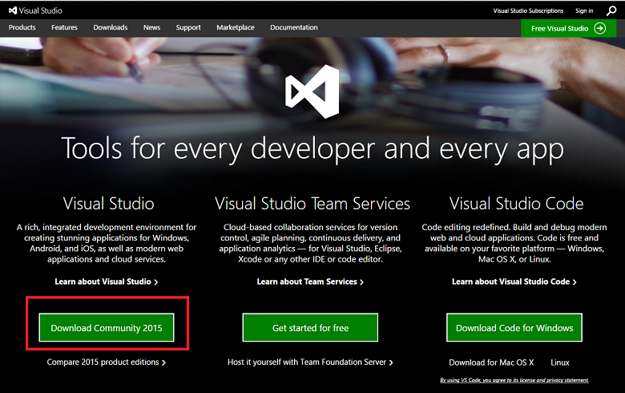

>[AZURE.NOTE] You need to get approval to use Azure Data Lake Store (ADLS) and Azure Data Lake Analytics (ADLA) as these services are in preview. You will be prompted to sign up when you create your first ADLS or ADLA. To sigh up, click on **Sign up to preview**, read the agreement, and click **OK**. Here, for example, is the ADLS sign up page:

 
 

## Prepare data science environment for Azure Data Lake
To prepare the data science environment for this walkthrough, create the following resources:

- Azure Data Lake Store (ADLS) 
- Azure Data Lake Analytics (ADLA)
- Azure Blob storage account
- HDInsight Linux Cluster
- Azure Machine Learning Studio account
- Azure Data Lake Tools for Visual Studio

This section provides instructions on how to create each of these resources. Note that the Azure Data Lake Store can be created either separately or when you create the Azure Data Lake Analytics as the default storage, and, similarly, the Azure Blob storage account can be created either separately or as the default storage when your create an HDInsight Linux Cluster. Instructions are referenced for creating each of these resources separately below, but the two storage accounts need not be created in separate steps.

### Create an Azure Data Lake Store

Create an ADLS from the [Azure Portal](http://ms.portal.azure.com). For details, see [Create an HDInsight cluster with Data Lake Store using Azure Portal](../data-lake-store/data-lake-store-hdinsight-hadoop-use-portal.md). Be sure to set up the Cluster AAD Identity in the **DataSource** blade of the **Optional Configuration** blade described there. 

 

### Create an Azure Data Lake Analytics account
Create an ADLA account from the [Azure Portal](http://ms.portal.azure.com). For details, see [Tutorial: get started with Azure Data Lake Analytics using Azure Portal](../data-lake-analytics/data-lake-analytics-get-started-portal.md). 

 

### Create an Azure Blob storage account
Create an Azure Blob storage account from the [Azure Portal](http://ms.portal.azure.com). For details, see [Create a storage account](../storage/storage-create-storage-account.md/#create-a-storage-account).
	
 

### Create an HDInsight Linux Cluster
Create an HDInsight Cluster (Linux) from the [Azure Portal](http://ms.portal.azure.com).For details, see [Create an HDInsight cluster with access to Azure Data Lake Store](../data-lake-store/data-lake-store-hdinsight-hadoop-use-portal/#create-an-hdinsight-cluster-with-access-to-azure-data-lake-store).

 

### Set up an Azure Machine Learning Studio account
Sign up/into Azure Machine Learning Studio from the [Azure Machine Learning](https://azure.microsoft.com/services/machine-learning/) page. Click on the **Get started now** button.

 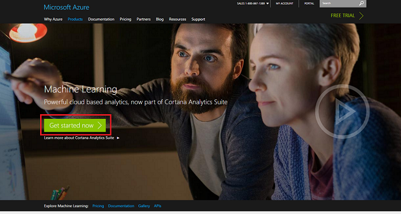

Choose the **Free Workspace** (or one of the other options) and sign in with your Microsoft account. 

 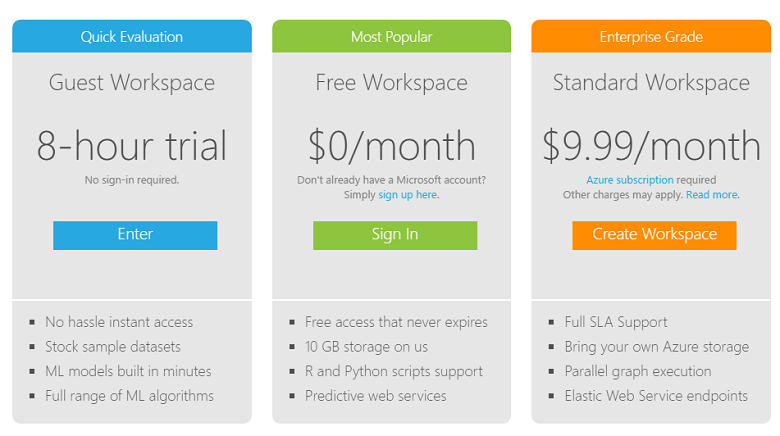

Then you will be able to create experiments in Azure ML studio:

 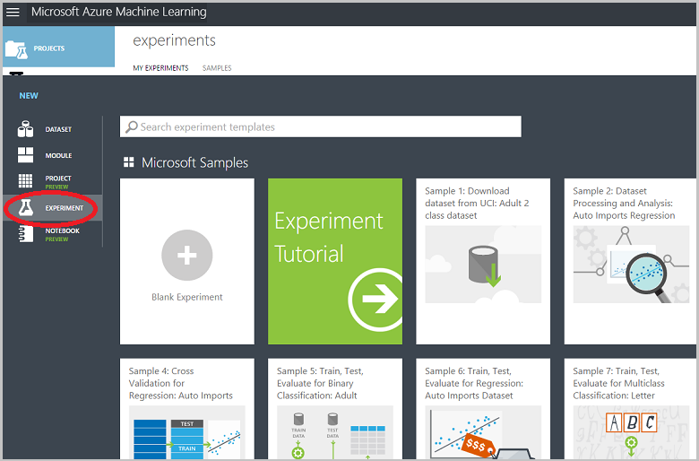

### Install Azure Data Lake Tools 
Install Azure Data Lake Tools for your version of Visual Studio from [Azure Data Lake Tools for Visual Studio](https://www.microsoft.com/download/details.aspx?id=49504).

 

After the installation finishes successfully, open up Visual Studio. You should see the Data Lake tab the menu at the top. Your Azure resources should appear in the left panel when you sign into your Azure account.

 

## The NYC Taxi Trips dataset
The data set we used here is a publicly available dataset -- the [NYC Taxi Trips dataset](http://www.andresmh.com/nyctaxitrips/). The NYC Taxi Trip data consists of about 20GB of compressed CSV files (~48GB uncompressed), recording more than 173 million individual trips and the fares paid for each trip. Each trip record includes the pickup and drop-off locations and times, anonymized hack (driver's) license number, and the medallion (taxi’s unique id) number. The data covers all trips in the year 2013 and is provided in the following two datasets for each month:

 - The 'trip_data' CSV contains trip details, such as number of passengers, pickup and dropoff points, trip duration, and trip length. Here are a few sample records:

		medallion,hack_license,vendor_id,rate_code,store_and_fwd_flag,pickup_datetime,dropoff_datetime,passenger_count, trip_time_in_secs,trip_distance,pickup_longitude,pickup_latitude,dropoff_longitude,dropoff_latitude
		89D227B655E5C82AECF13C3F540D4CF4,BA96DE419E711691B9445D6A6307C170,CMT,1,N,2013-01-01 15:11:48,2013-01-01 15:18:10,4,382,1.00,-73.978165,40.757977,-73.989838,40.751171
		0BD7C8F5BA12B88E0B67BED28BEA73D8,9FD8F69F0804BDB5549F40E9DA1BE472,CMT,1,N,2013-01-06 00:18:35,2013-01-06 00:22:54,1,259,1.50,-74.006683,40.731781,-73.994499,40.75066
		0BD7C8F5BA12B88E0B67BED28BEA73D8,9FD8F69F0804BDB5549F40E9DA1BE472,CMT,1,N,2013-01-05 18:49:41,2013-01-05 18:54:23,1,282,1.10,-74.004707,40.73777,-74.009834,40.726002
		DFD2202EE08F7A8DC9A57B02ACB81FE2,51EE87E3205C985EF8431D850C786310,CMT,1,N,2013-01-07 23:54:15,2013-01-07 23:58:20,2,244,.70,-73.974602,40.759945,-73.984734,40.759388
		DFD2202EE08F7A8DC9A57B02ACB81FE2,51EE87E3205C985EF8431D850C786310,CMT,1,N,2013-01-07 23:25:03,2013-01-07 23:34:24,1,560,2.10,-73.97625,40.748528,-74.002586,40.747868

 - The 'trip_fare' CSV contains details of the fare paid for each trip, such as payment type, fare amount, surcharge and taxes, tips and tolls, and the total amount paid. Here are a few sample records:

		medallion, hack_license, vendor_id, pickup_datetime, payment_type, fare_amount, surcharge, mta_tax, tip_amount, tolls_amount, total_amount
		89D227B655E5C82AECF13C3F540D4CF4,BA96DE419E711691B9445D6A6307C170,CMT,2013-01-01 15:11:48,CSH,6.5,0,0.5,0,0,7
		0BD7C8F5BA12B88E0B67BED28BEA73D8,9FD8F69F0804BDB5549F40E9DA1BE472,CMT,2013-01-06 00:18:35,CSH,6,0.5,0.5,0,0,7
		0BD7C8F5BA12B88E0B67BED28BEA73D8,9FD8F69F0804BDB5549F40E9DA1BE472,CMT,2013-01-05 18:49:41,CSH,5.5,1,0.5,0,0,7
		DFD2202EE08F7A8DC9A57B02ACB81FE2,51EE87E3205C985EF8431D850C786310,CMT,2013-01-07 23:54:15,CSH,5,0.5,0.5,0,0,6
		DFD2202EE08F7A8DC9A57B02ACB81FE2,51EE87E3205C985EF8431D850C786310,CMT,2013-01-07 23:25:03,CSH,9.5,0.5,0.5,0,0,10.5

The unique key to join trip\_data and trip\_fare is composed of the following three fields: medallion, hack\_license and pickup\_datetime. The raw CSV files can be accessed from a public Azure storage blob.

## Process data with U-SQL

The data processing tasks illustrated in this section include ingesting, checking quality, exploring, and sampling the data. We also show how to join trip and fare tables. The final section shows run a U-SQL scripted job from the Azure portal. Here are links to each subsection:

- [Data ingestion: read in data from public blob](#ingest)
- [Data quality checks](#quality)
- [Data exploration](#explore)
- [Join trip and fare tables](#join)
- [Data sampling](#sample)
- [Run U-SQL jobs from the portal](#run)

The U-SQL scripts are described here and provided in a separate file. You can download the full **U-SQL scripts** from [GitHub](https://github.com/Azure/Azure-MachineLearning-DataScience/tree/master/Misc/AzureDataLakeWalkthrough).

### Data Ingestion: Read in data from public blob

Open Visual Studio, click **File --> New --> Project**, choose **U-SQL Project**, name and save it to a folder.

The location of the data is referenced as **wasb://container_name@blob_storage_account_name.blob.core.windows.net/blob_name** and can be extracted using **Extractors.Csv()**. Since the file names are in same format, we can use **trip\_data_{\*\}.csv** to read in all 12 trip files. 

	///Read in Trip data
	@trip0 =
	    EXTRACT 
	    medallion string,
	    hack_license string,
	    vendor_id string,
	    rate_code string,
	    store_and_fwd_flag string,
	    pickup_datetime string,
	    dropoff_datetime string,
	    passenger_count string,
	    trip_time_in_secs string,
	    trip_distance string,
	    pickup_longitude string,
	    pickup_latitude string,
	    dropoff_longitude string,
	    dropoff_latitude string
    // This is reading 12 trip data from blob
    FROM "wasb://test1@weigstoragefordsvm.blob.core.windows.net/nyctaxitrip/trip_data_{*}.csv"
    USING Extractors.Csv();

Since there are headers in the first row, we need to remove the headers and change column types into appropriate ones. We can either save the processed data to Azure Data Lake Storage using **swebhdfs://data_lake_storage_name.azuredatalakestorage.net/folder_name/file_name**_ or to Azure Blob storage account using  **wasb://container_name@blob_storage_account_name.blob.core.windows.net/blob_name**. 

	// change data types
	@trip =
	    SELECT 
	    medallion,
	    hack_license,
	    vendor_id,
	    rate_code,
	    store_and_fwd_flag,
	    DateTime.Parse(pickup_datetime) AS pickup_datetime,
	    DateTime.Parse(dropoff_datetime) AS dropoff_datetime,
	    Int32.Parse(passenger_count) AS passenger_count,
	    Double.Parse(trip_time_in_secs) AS trip_time_in_secs,
	    Double.Parse(trip_distance) AS trip_distance,
	    (pickup_longitude==string.Empty ? 0: float.Parse(pickup_longitude)) AS pickup_longitude,
	    (pickup_latitude==string.Empty ? 0: float.Parse(pickup_latitude)) AS pickup_latitude,
	    (dropoff_longitude==string.Empty ? 0: float.Parse(dropoff_longitude)) AS dropoff_longitude,
	    (dropoff_latitude==string.Empty ? 0: float.Parse(dropoff_latitude)) AS dropoff_latitude
    FROM @trip0
    WHERE medallion != "medallion";

	////output data to ADL
	OUTPUT @trip   
	TO "swebhdfs://cdsp.azuredatalakestore.net/nyctaxi_weig/demo_trip.csv"
	USING Outputters.Csv(); 

	////Output data to blob
	OUTPUT @trip   
	TO "wasb://test1@weigstoragefordsvm.blob.core.windows.net/demo_trip.csv"
	USING Outputters.Csv();  

Similarly we can read in the fare data sets. Right click Azure Data Lake Store, you can choose to look at your data in **Azure Portal --> Data Explorer** or **File Explorer** within Visual Studio. 

 

 

### Data quality checks

After trip and fare tables have been read in, data quality checks can be done in the following way. The resulting CSV files can be output to Azure Blob storage or Azure Data Lake Store. 

Find the number of medallions and unique number of medallions:

	///check the number of medallions and unique number of medallions
	@trip2 =
	    SELECT
	    medallion,
	    vendor_id,
	    pickup_datetime.Month AS pickup_month
	    FROM @trip;
	
	@ex_1 =
	    SELECT
	    pickup_month, 
	    COUNT(medallion) AS cnt_medallion,
	    COUNT(DISTINCT(medallion)) AS unique_medallion
	    FROM @trip2
	    GROUP BY pickup_month;
	    OUTPUT @ex_1   
	TO "wasb://test1@weigstoragefordsvm.blob.core.windows.net/demo_ex_1.csv"
	USING Outputters.Csv(); 

Find those medallions that had more than 100 trips:

	///find those medallions that had more than 100 trips
	@ex_2 =
	    SELECT medallion,
	           COUNT(medallion) AS cnt_medallion
	    FROM @trip2
	    //where pickup_datetime >= "2013-01-01t00:00:00.0000000" and pickup_datetime <= "2013-04-01t00:00:00.0000000"
	    GROUP BY medallion
	    HAVING COUNT(medallion) > 100;
	    OUTPUT @ex_2   
	TO "wasb://test1@weigstoragefordsvm.blob.core.windows.net/demo_ex_2.csv"
	USING Outputters.Csv(); 

Find those invalid records in terms of pickup_longitude:

	///find those invalid records in terms of pickup_longitude
	@ex_3 =
	    SELECT COUNT(medallion) AS cnt_invalid_pickup_longitude
	    FROM @trip
	    WHERE
	    pickup_longitude <- 90 OR pickup_longitude > 90;
	    OUTPUT @ex_3   
	TO "wasb://test1@weigstoragefordsvm.blob.core.windows.net/demo_ex_3.csv"
	USING Outputters.Csv(); 

Find missing values for some variables:

	//check missing values
	@res =
	    SELECT *,
	           (medallion == null? 1 : 0) AS missing_medallion
	    FROM @trip;
	
	@trip_summary6 =
	    SELECT 
	        vendor_id,
	    SUM(missing_medallion) AS medallion_empty, 
	    COUNT(medallion) AS medallion_total,
	    COUNT(DISTINCT(medallion)) AS medallion_total_unique  
	    FROM @res
	    GROUP BY vendor_id;
	OUTPUT @trip_summary6
	TO "wasb://test1@weigstoragefordsvm.blob.core.windows.net/demo_ex_16.csv"
	USING Outputters.Csv();

### Data exploration

We can do some data exploration to get a better understanding of the data.

Find the distribution of tipped and non-tipped trips:

	///tipped vs. not tipped distribution
	@tip_or_not =
	    SELECT *,
	           (tip_amount > 0 ? 1: 0) AS tipped
	    FROM @fare;
	
	@ex_4 =
	    SELECT tipped,
	           COUNT(*) AS tip_freq
	    FROM @tip_or_not
	    GROUP BY tipped;
	    OUTPUT @ex_4   
	TO "wasb://test1@weigstoragefordsvm.blob.core.windows.net/demo_ex_4.csv"
	USING Outputters.Csv(); 

Find the distribution of tip amount with cut-off values: 0,5,10,and 20 dollars.

	//tip class/range distribution
	@tip_class =
	    SELECT *,
	           (tip_amount >20? 4: (tip_amount >10? 3:(tip_amount >5 ? 2:(tip_amount > 0 ? 1: 0)))) AS tip_class
	    FROM @fare;
	@ex_5 =
	    SELECT tip_class,
	           COUNT(*) AS tip_freq
	    FROM @tip_class
	    GROUP BY tip_class;
	    OUTPUT @ex_5   
	TO "wasb://test1@weigstoragefordsvm.blob.core.windows.net/demo_ex_5.csv"
	USING Outputters.Csv(); 

Find basic statistics of trip distance:

	// find basic statistics for trip_distance
	@trip_summary4 =
	    SELECT 
	        vendor_id,
	        COUNT(*) AS cnt_row,
	        MIN(trip_distance) AS min_trip_distance,
	        MAX(trip_distance) AS max_trip_distance,
	        AVG(trip_distance) AS avg_trip_distance 
	    FROM @trip
	    GROUP BY vendor_id;
	OUTPUT @trip_summary4
	TO "wasb://test1@weigstoragefordsvm.blob.core.windows.net/demo_ex_14.csv"
	USING Outputters.Csv();

Find the percentiles of trip distance:

	// find percentiles of trip_distance
	@trip_summary3 =
	    SELECT DISTINCT vendor_id AS vendor,
	                    PERCENTILE_DISC(0.25) WITHIN GROUP(ORDER BY trip_distance) OVER(PARTITION BY vendor_id) AS median_trip_distance_disc,
	                    PERCENTILE_DISC(0.5) WITHIN GROUP(ORDER BY trip_distance) OVER(PARTITION BY vendor_id) AS median_trip_distance_disc,
	                    PERCENTILE_DISC(0.75) WITHIN GROUP(ORDER BY trip_distance) OVER(PARTITION BY vendor_id) AS median_trip_distance_disc
	    FROM @trip;
	   // group by vendor_id;
	OUTPUT @trip_summary3
	TO "wasb://test1@weigstoragefordsvm.blob.core.windows.net/demo_ex_13.csv"
	USING Outputters.Csv(); 

### Join trip and fare tables

Trip and fare tables can be joined by medallion, hack_license, and pickup_time.

	//join trip and fare table

    @model_data_full =
    SELECT t.*, 
    f.payment_type, f.fare_amount, f.surcharge, f.mta_tax, f.tolls_amount,  f.total_amount, f.tip_amount,
    (f.tip_amount > 0 ? 1: 0) AS tipped,
    (f.tip_amount >20? 4: (f.tip_amount >10? 3:(f.tip_amount >5 ? 2:(f.tip_amount > 0 ? 1: 0)))) AS tip_class
    FROM @trip AS t JOIN  @fare AS f
    ON   (t.medallion == f.medallion AND t.hack_license == f.hack_license AND t.pickup_datetime == f.pickup_datetime)
    WHERE   (pickup_longitude != 0 AND dropoff_longitude != 0 );

	//// output to blob
	OUTPUT @model_data_full   
	TO "wasb://test1@weigstoragefordsvm.blob.core.windows.net/demo_ex_7_full_data.csv"
	USING Outputters.Csv(); 

	////output data to ADL
	OUTPUT @model_data_full   
	TO "swebhdfs://cdsp.azuredatalakestore.net/nyctaxi_weig/demo_ex_7_full_data.csv"
	USING Outputters.Csv(); 

For each level of passenger count, calculate the number of records, average tip amount, variance of tip amount, percentage of tipped trips.

	// contigency table
	@trip_summary8 =
	    SELECT passenger_count,
	           COUNT(*) AS cnt,
	           AVG(tip_amount) AS avg_tip_amount,
	           VAR(tip_amount) AS var_tip_amount,
	           SUM(tipped) AS cnt_tipped,
	           (float)SUM(tipped)/COUNT(*) AS pct_tipped
	    FROM @model_data_full
	    GROUP BY passenger_count;
	    OUTPUT @trip_summary8
	TO "wasb://test1@weigstoragefordsvm.blob.core.windows.net/demo_ex_17.csv"
	USING Outputters.Csv();

### Data sampling

First we randomly select 0.1% of data from the joined table:

	//random select 1/1000 data for modeling purpose
	@addrownumberres_randomsample =
	SELECT *,
	        ROW_NUMBER() OVER() AS rownum
	FROM @model_data_full;
	
	@model_data_random_sample_1_1000 =
	SELECT *
	FROM @addrownumberres_randomsample
	WHERE rownum % 1000 == 0;
	
	OUTPUT @model_data_random_sample_1_1000   
	TO "wasb://test1@weigstoragefordsvm.blob.core.windows.net/demo_ex_7_random_1_1000.csv"
	USING Outputters.Csv(); 

Then we do stratified sampling by binary variable tip_class:

	//stratified random select 1/1000 data for modeling purpose
	@addrownumberres_stratifiedsample =
	SELECT *,
	        ROW_NUMBER() OVER(PARTITION BY tip_class) AS rownum
	FROM @model_data_full;
	
	@model_data_stratified_sample_1_1000 =
	SELECT *
	FROM @addrownumberres_stratifiedsample
	WHERE rownum % 1000 == 0;
	//// output to blob
	OUTPUT @model_data_stratified_sample_1_1000   
	TO "wasb://test1@weigstoragefordsvm.blob.core.windows.net/demo_ex_9_stratified_1_1000.csv"
	USING Outputters.Csv(); 
	////output data to ADL
	OUTPUT @model_data_stratified_sample_1_1000   
	TO "swebhdfs://cdsp.azuredatalakestore.net/nyctaxi_weig/demo_ex_9_stratified_1_1000.csv"
	USING Outputters.Csv(); 

### Run U-SQL jobs

When you finish editing U-SQL scripts, you can submit them to the server using your Azure Data Lake Analytics account. Click **Data Lake**, **Submit Job**, select your **Analytics Account**, choose **Parallelism**, and click **Submit** button.  

 

When the job is complied successfully, the status of your job will be displayed in Visual Studio for monitoring. After the job finishes running, you can even replay the job execution process and find out the bottleneck steps to improve your job efficiency. You can also go to Azure Portal to check the status of your U-SQL jobs.

 

 

Now you can check the output files in either Azure Blob storage or Azure Portal. We will use the stratified sample data for our modeling in the next step.

 

 

## Create Hive table in HDInsight

Now we create Hive tables in HDInsight cluster using the data stored in Azure Data Lake Store in the previous step. The Hive tables will be used in Azure Machine Learning Studio in the next step. Go to the HDInsight cluster created at the beginning of the walkthrough. Click **Settings** --> **Properties** --> **Cluster AAD Identity** --> **ADLS Access**, make sure your Azure Data Lake Store account is added in the list with read, write and execute rights. 

 

Then click **Dashboard** next to the Settings button and a window will pop up. Click **Hive View** in the upper right corner of the page and you will see the **Query Editor**.

 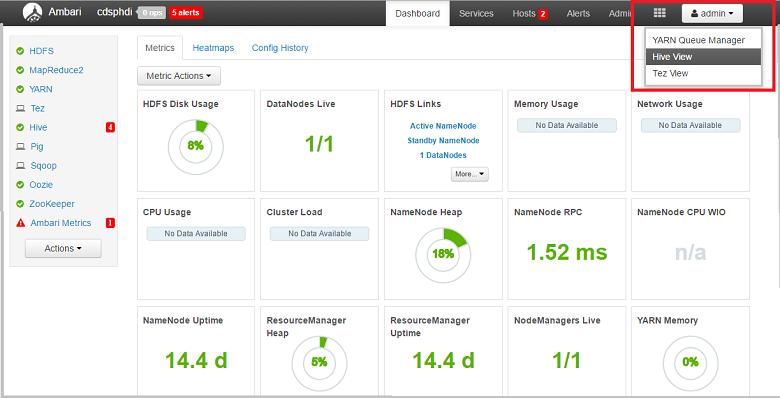

 

Paste the following Hive scripts to create a table. The location of data source is in Azure Data Lake Store reference in this way: **adl://data_lake_store_name.azuredatalakestore.net:443/folder_name/file_name**.

	CREATE EXTERNAL TABLE nyc_stratified_sample
	(
	    medallion string,
	    hack_license string,
	    vendor_id string,
	    rate_code string,
	    store_and_fwd_flag string,
	    pickup_datetime string,
	    dropoff_datetime string,
	    passenger_count string,
	    trip_time_in_secs string,
	    trip_distance string,
	    pickup_longitude string,
	    pickup_latitude string,
	    dropoff_longitude string,
	    dropoff_latitude string,
	  payment_type string,
	  fare_amount string,
	  surcharge string,
	  mta_tax string,
	  tolls_amount string,
	  total_amount string,
	  tip_amount string,
	  tipped string,
	  tip_class string,
	  rownum string
	  )
	ROW FORMAT DELIMITED FIELDS TERMINATED BY ',' lines terminated by '\n'
	LOCATION 'adl://cdsp.azuredatalakestore.net:443/nyctaxi_weig/demo_ex_9_stratified_1_1000_copy.csv';

When the query finishes running, you will see the results like this:

 

## Build and deploy models in Azure Machine Learning Studio

We are now ready to proceed to model building and model deployment in Azure Machine Learning. The data is ready to be used in those prediction problems with our sampled data: binary classification (tip or not), multiclass classification (tip_class), and regression (tip_amount). Here we will illustrate how to build and deploy a binary classification model in Azure Machine Learning Studio.

1. Get the data into Azure ML using the **Reader** module, available in the **Data Input and Output** section. For more information, see the [Reader module](https://msdn.microsoft.com/library/azure/4e1b0fe6-aded-4b3f-a36f-39b8862b9004/) reference page.
2. Select **Hive Query** as the **Data source** in the **Properties** panel.
3. Paste the following Hive script in the **Hive database query** editor

    	select * from nyc_stratified_sample;

4. Enter the URI of HDInsight cluster (this can be found in Azure Portal), Hadoop credentials, location of output data, and Azure storage account name/key/container name.

   

An example of a binary classification experiment reading data from Hive table is shown in the figure below.

 

After the experiment is created, click  **Set Up Web Service** --> **Predictive Web Service**

 

Run the automatically created scoring experiment, when it finishes, click **Deploy Web Service**

 

The web service dashboard will be displayed shortly:

 

## Use Python to build and deploy machine learning models

Now let's build and deploy machine learning models using Python.  We can use Python to read the processed data from Azure Blob storage (saved with U-SQL in step 2 above) and build models. Create an IPython Notebook in your local machine or Azure Machine Learning Studio. 

Only the major steps are described here:

- [Step 0. Import Python libraries](#step0)
- [Step 1. Read in the data from blob](#step1)
- [Step 2. Check data quality](#step2)
- [Step 3. Handle Missing Value](#step3)
- [Step 4. Data exploration with single variables](#step4)
- [Step 5. Data exploration with multiple variables](#step5)
- [Step 6. Feature engineering](#step6)
- [Step 7. Build machine learning models](#step7)
- [Step 8. Build Web Service API and consume it in Python](#step8)

Only the principal steps are outlined in this walkthrough. You can download the whole **IPython Notebook** that contains some additional tasks from [GitHub](https://github.com/Azure/Azure-MachineLearning-DataScience/tree/master/Misc/AzureDataLakeWalkthrough).

###  Step 0. Import Python libraries

In order to run the sample IPython Notebook or the Python script file, the following Python packages are needed. If you are using the AzureML IPython Notebook service, these packages have been pre-installed.

	import pandas as pd
	from pandas import Series, DataFrame
	import numpy as np
	import matplotlib.pyplot as plt
	from time import time
	import pyodbc
	import os
	from azure.storage.blob import BlobService
	import tables
	import time
	import zipfile
	import random
	import sklearn
	from sklearn.linear_model import LogisticRegression
	from sklearn.cross_validation import train_test_split
	from sklearn import metrics
	from __future__ import division
	from sklearn import linear_model
	from azureml import services

###  Step 1. Read in the data from blob

- Connection String   

		CONTAINERNAME = 'test1'
		STORAGEACCOUNTNAME = 'weigstoragefordsvm'
		STORAGEACCOUNTKEY = 'FUyNCM83pY4K2srBfZv4yDr6ru7d+BfbmHPPtucqS7EIgvUSQBG4zPkznpCuClWVOMitAQXG3aJFbvuD7mBkhQ=='
		BLOBNAME = 'demo_ex_9_stratified_1_1000_copy.csv'
		blob_service = BlobService(account_name=STORAGEACCOUNTNAME,account_key=STORAGEACCOUNTKEY)
	
- Read in as text

		t1 = time.time()
		data = blob_service.get_blob_to_text(CONTAINERNAME,BLOBNAME).split("\n")
		t2 = time.time()
		print(("It takes %s seconds to read in "+BLOBNAME) % (t2 - t1))

 	
 
- Add column names and separate columns

		colnames = ['medallion','hack_license','vendor_id','rate_code','store_and_fwd_flag','pickup_datetime','dropoff_datetime',
		'passenger_count','trip_time_in_secs','trip_distance','pickup_longitude','pickup_latitude','dropoff_longitude','dropoff_latitude',
		'payment_type', 'fare_amount', 'surcharge', 'mta_tax', 'tolls_amount',  'total_amount', 'tip_amount', 'tipped', 'tip_class', 'rownum']
		df1 = pd.DataFrame([sub.split(",") for sub in data], columns = colnames)
	

- Change some columns to numeric

		cols_2_float = ['trip_time_in_secs','pickup_longitude','pickup_latitude','dropoff_longitude','dropoff_latitude',
		'fare_amount', 'surcharge','mta_tax','tolls_amount','total_amount','tip_amount', 'passenger_count','trip_distance'
		,'tipped','tip_class','rownum']
		for col in cols_2_float:
		    df1[col] = df1[col].astype(float)

###  Step 2. Check data quality

- Check the data frame

		print df1.head(5)
		print df1.tail(5)
		print df1.shape

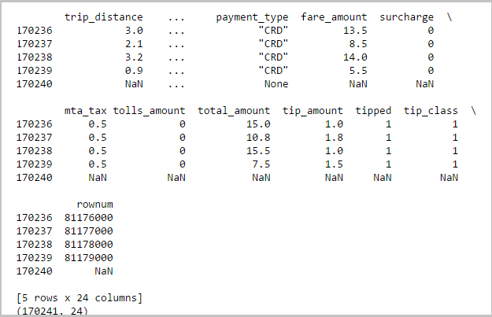

- The last row of data is NaN, remove it
	
		df1 = df1.iloc[0:len(df1)-2,:]
	
- Remove the double quote in some columns

		df1.medallion = df1.medallion.str.replace('"','')
		df1.hack_license = df1.hack_license.str.replace('"','')
		df1.vendor_id = df1.vendor_id.str.replace('"','')
		df1.rate_code = df1.rate_code.str.replace('"','')
		df1.store_and_fwd_flag = df1.store_and_fwd_flag.str.replace('"','')
		df1.payment_type = df1.payment_type.str.replace('"','')

- Show column names and types of the data frame

		for col in df1.columns:
		    print df1[col].name, ':\t', df1[col].dtype

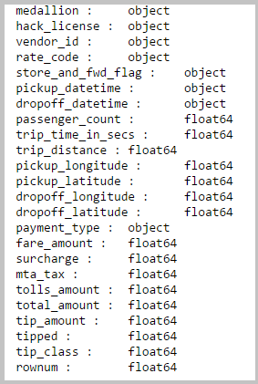

- Check the number of valid values (non-NA) for each column

		cnts = df1.count()
		print cnts

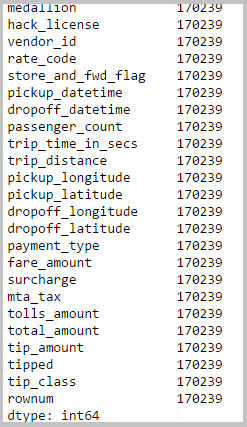

- Check the basic statistics for all columns (only applied to numeric columns)
		
		df1.describe()

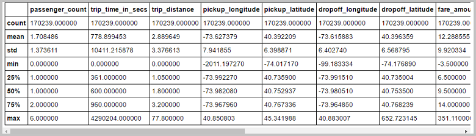

###  Step 3. Handle missing values

- Check all possible values of store_and_fwd_flg

		df1['store_and_fwd_flag'].value_counts()

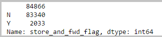

- Set all missing values of store\_and\_fwd_flg as 'M'

		df2 = df1.replace('', np.nan, regex=True)
		df3 = df2.fillna({'store_and_fwd_flag':'M'})
		df3.ix[990:1000,]

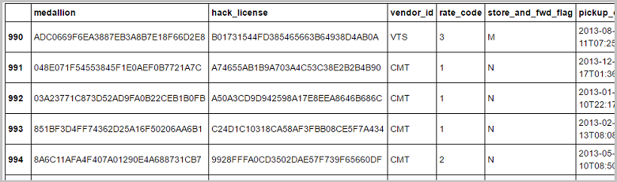

		df3.shape

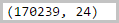

		df3['store_and_fwd_flag'].value_counts()

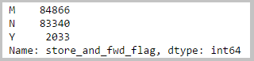

- Drop rows containing missing values

		df1_noNA = df2.dropna()
		df1_noNA.shape

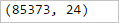

###  Step 4. Data Exploration with single variables

- Show the distribution of vendor_id in bar chart

		df1['vendor_id'].value_counts().plot(kind='bar')

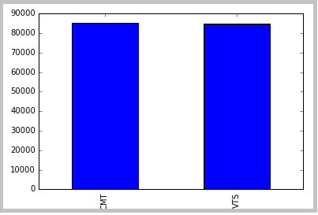

- Check categorical variable rate_code

		df1['rate_code'].value_counts()

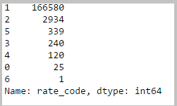

- Show the corresponding bar chart for rate_code

		df1['rate_code'].value_counts().plot(kind='bar')

       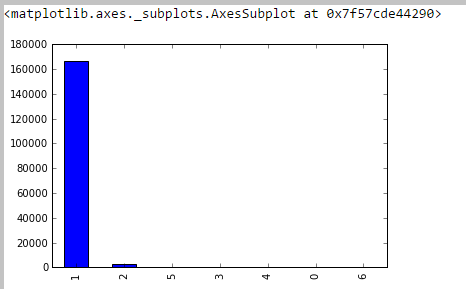

- Show the bar chart for rate_code in log scale

		np.log(df1['rate_code'].value_counts()).plot(kind='bar')

       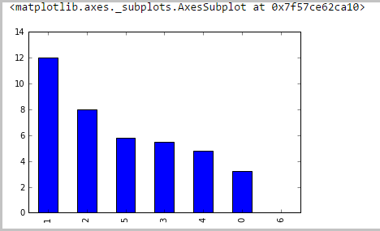

- Plot the kernel density estimate of trip\_time\_in_secs. Since plotting the kernel density estimate is relatively slow, we sample the data to draw it; you can change the sampling ratio as desired.

		sample_ratio = 0.01
		sample_size = np.round(df1.shape[0] * sample_ratio)
		sample_rows = np.random.choice(df1.index.values, sample_size)
		df1_sample = df1.ix[sample_rows]
		df1_sample.shape

       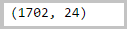

- Show histogram and kernel density estimate plot simultaneously for trip_time_in_secs

		df1_sample['trip_time_in_secs'].hist(bins=50, color='k', normed=True)
		df1_sample['trip_time_in_secs'].plot(kind='kde', style='b-')

       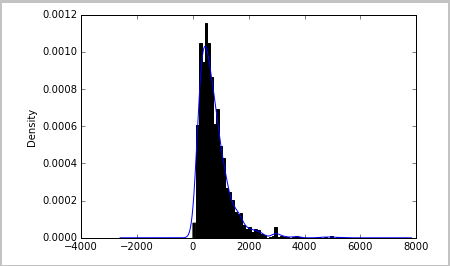

- Two plots can be shown together and each one is a separate subplot

		fig = plt.figure()
		ax1 = fig.add_subplot(1,2,1)
		ax2 = fig.add_subplot(1,2,2)
		df1_sample['trip_time_in_secs'].plot(ax=ax1,kind='kde', style='b-')
		df1_sample['trip_time_in_secs'].hist(ax=ax2, bins=50, color='k')

       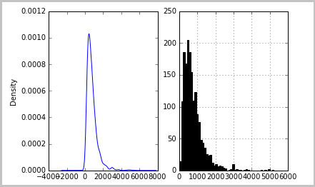

- Calculate the number of trip_distance in different groups

		trip_dist_bins = [0, 1, 2, 4, 10, 1000]
		df1['trip_distance']
		trip_dist_bin_id = pd.cut(df1['trip_distance'], trip_dist_bins)
		trip_dist_bin_id
		trip_dist_bin_id.value_counts()
		trip_dist_bin_id.value_counts().plot(kind='bar')
		trip_dist_bin_id.value_counts().plot(kind='line')

	   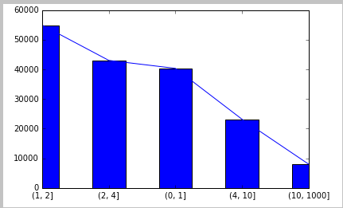

###  Step 5. Data Exploration with multiple variables

- Explore multiple columns simultaneously using scatter plot, histogram and kde

		df1_sample_3col = df1_sample[['passenger_count', 'trip_time_in_secs', 'trip_distance']]
		pd.scatter_matrix(df1_sample_3col, diagonal='hist', color='r', alpha=0.7, hist_kwds={'bins':100})
		pd.scatter_matrix(df1_sample_3col, diagonal='kde', color='r', alpha=0.7)

       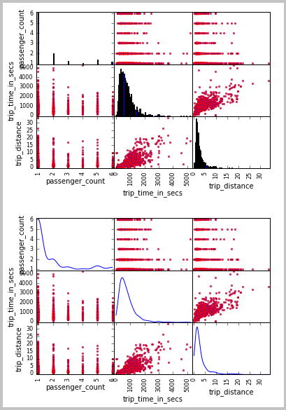

- Explore the relationship between trip_distance and passenger_count

		df1.boxplot(column='trip_distance', by='passenger_count')

       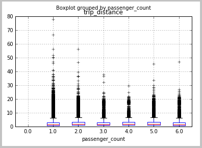

###  Step 6. Feature engineering 

This section describes the code for procedures used to prepare data for use in ML modeling. It shows, for example, how to create a new feature by binning travel distances into buckets. See the IPython Notebook for details.

###  Step 7. Build machine learning models

Here we built a binary classification model to predict whether a trip is tipped or not. In the IPython Notebook you can find other two models: multiclass classification, and regression models.

- First we need to create dummy variables that can be used in scikit-learn models

		df1_payment_type_dummy = pd.get_dummies(df1['payment_type'], prefix='payment_type_dummy')
		df1_vendor_id_dummy = pd.get_dummies(df1['vendor_id'], prefix='vendor_id_dummy')

- Create data frame for the modeling

		cols_to_keep = ['tipped', 'trip_distance', 'passenger_count']
		data = df1[cols_to_keep].join([df1_payment_type_dummy,df1_vendor_id_dummy])
		
		X = data.iloc[:,1:]
		Y = data.tipped

- Training and testing 60-40 split

		X_train, X_test, Y_train, Y_test = train_test_split(X, Y, test_size=0.4, random_state=0)

- Logistic Regression in training set

		model = LogisticRegression()
		logit_fit = model.fit(X_train, Y_train)
		print ('Coefficients: \n', logit_fit.coef_)
		Y_train_pred = logit_fit.predict(X_train)

       

- Score testing data set

		Y_test_pred = logit_fit.predict(X_test)

- Calculate Evaluation metrics

		fpr_train, tpr_train, thresholds_train = metrics.roc_curve(Y_train, Y_train_pred)
		print fpr_train, tpr_train, thresholds_train
		
		fpr_test, tpr_test, thresholds_test = metrics.roc_curve(Y_test, Y_test_pred) 
		print fpr_test, tpr_test, thresholds_test
		
		#AUC
		print metrics.auc(fpr_train,tpr_train)
		print metrics.auc(fpr_test,tpr_test)
		
		#Confusion Matrix
		print metrics.confusion_matrix(Y_train,Y_train_pred)
		print metrics.confusion_matrix(Y_test,Y_test_pred)

       

 
###  Step 8. Build Web Service API and consume it in Python

We want to operationalize the machine learning model after it has been built. Here we use the binary logistic model as an example. Make sure the scikit-learn version in your local machine is 0.15.1. You don't have to worry about this if you use Azure ML studio service.

- Find your workspace credentials from Azure ML studio settings. In Azure Machine Learning Studio, click **Settings** --> **Name** --> **Authorization Tokens**. 

	

		workspaceid = 'xxxxxxxxxxxxxxxxxxxxxxxxxxx'
		auth_token = 'xxxxxxxxxxxxxxxxxxxxxxxxxxx'

- Create Web Service

		@services.publish(workspaceid, auth_token) 
		@services.types(trip_distance = float, passenger_count = float, payment_type_dummy_CRD = float, payment_type_dummy_CSH=float, payment_type_dummy_DIS = float, payment_type_dummy_NOC = float, payment_type_dummy_UNK = float, vendor_id_dummy_CMT = float, vendor_id_dummy_VTS = float)
		@services.returns(int) #0, or 1
		def predictNYCTAXI(trip_distance, passenger_count, payment_type_dummy_CRD, payment_type_dummy_CSH,payment_type_dummy_DIS, payment_type_dummy_NOC, payment_type_dummy_UNK, vendor_id_dummy_CMT, vendor_id_dummy_VTS ):
		    inputArray = [trip_distance, passenger_count, payment_type_dummy_CRD, payment_type_dummy_CSH, payment_type_dummy_DIS, payment_type_dummy_NOC, payment_type_dummy_UNK, vendor_id_dummy_CMT, vendor_id_dummy_VTS]
		    return logit_fit.predict(inputArray)

- Get web service credentials

		url = predictNYCTAXI.service.url
		api_key =  predictNYCTAXI.service.api_key
		
		print url
		print api_key

		@services.service(url, api_key)
		@services.types(trip_distance = float, passenger_count = float, payment_type_dummy_CRD = float, payment_type_dummy_CSH=float,payment_type_dummy_DIS = float, payment_type_dummy_NOC = float, payment_type_dummy_UNK = float, vendor_id_dummy_CMT = float, vendor_id_dummy_VTS = float)
		@services.returns(float)
		def NYCTAXIPredictor(trip_distance, passenger_count, payment_type_dummy_CRD, payment_type_dummy_CSH,payment_type_dummy_DIS, payment_type_dummy_NOC, payment_type_dummy_UNK, vendor_id_dummy_CMT, vendor_id_dummy_VTS ):
		    pass

- Call Web service API. You have to wait 5-10 seconds after the previous step.

		NYCTAXIPredictor(1,2,1,0,0,0,0,0,1)

       

## Summary

To recap what we have done in this walkthrough:

- created a data science environment for building end-to-end solutions in Azure Data Lake, 
- worked with a large public dataset using both U-SQL and Python, taking it through the Data Science Process, from data acquisition to model training, and then to the deployment of the model as a web service.

