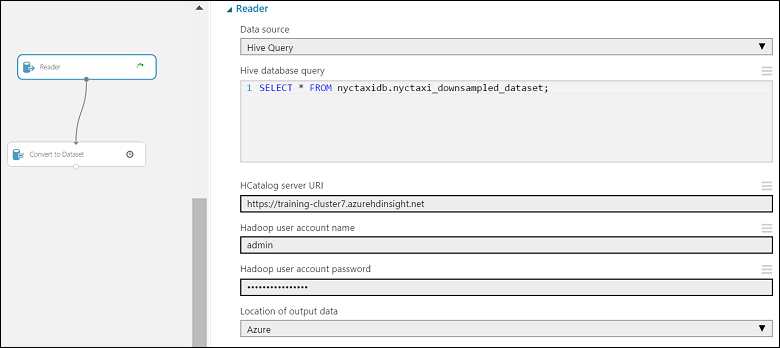
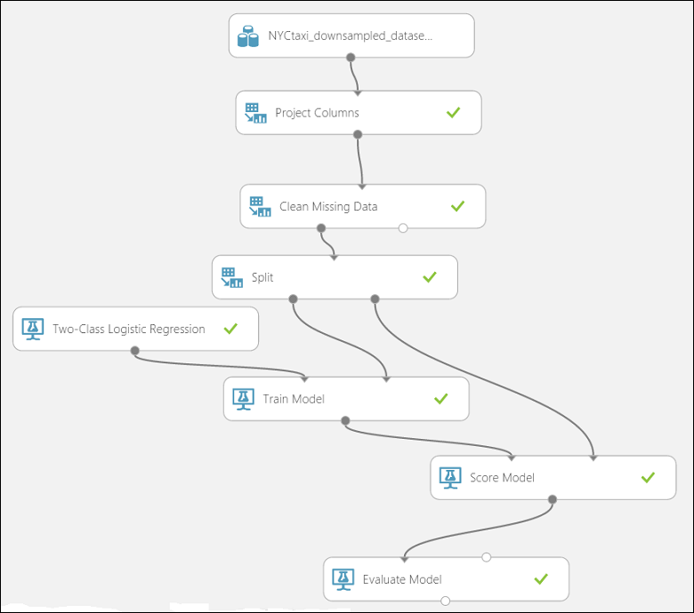
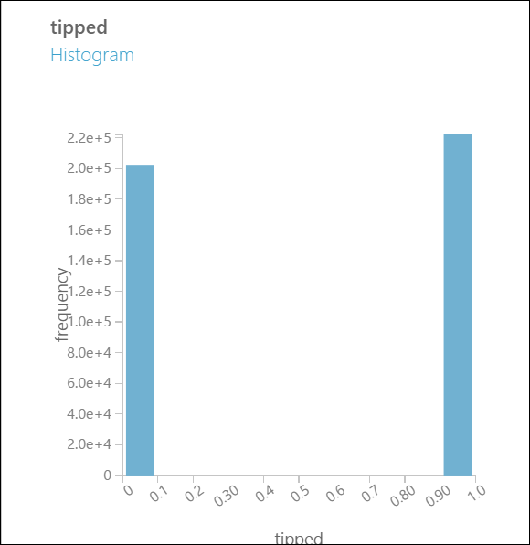
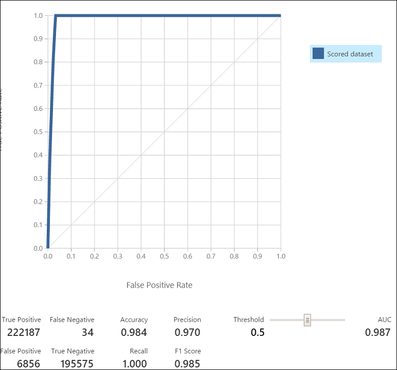
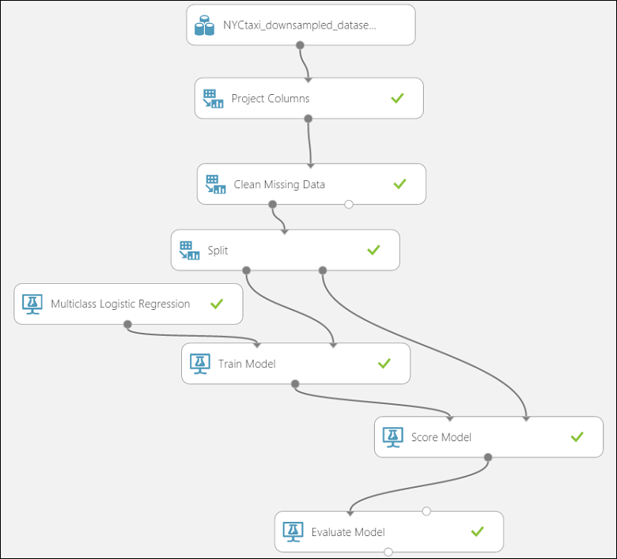
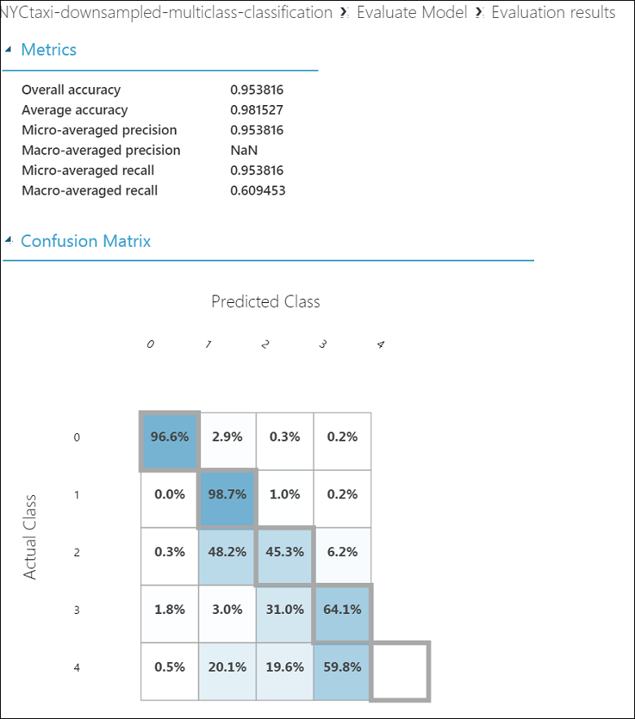

<properties
	pageTitle="The Team Data Science Process in action: Use Hadoop clusters | Microsoft Azure"
	description="Using the Team Data Science Process for an end-to-end scenario employing an HDInsight Hadoop cluster to build and deploy a model using a publicly available dataset."
	services="machine-learning,hdinsight"
	documentationCenter=""
	authors="bradsev"
	manager="paulettm"
	editor="cgronlun" />

<tags
	ms.service="machine-learning"
	ms.workload="data-services"
	ms.tgt_pltfrm="na"
	ms.devlang="na"
	ms.topic="article"
	ms.date="06/14/2016"
	ms.author="hangzh;bradsev" />

# The Team Data Science Process in action: using HDInsight Hadoop clusters

In this walkthrough, we use the Team Data Science Process in an end-to-end scenario using an [Azure HDInsight Hadoop cluster](https://azure.microsoft.com/services/hdinsight/) to store, explore and feature engineer data from the publicly available [NYC Taxi Trips](http://www.andresmh.com/nyctaxitrips/) dataset, and to down sample the data. Models of the data are built with Azure Machine Learning to handle binary and multiclass classification and regression predictive tasks.

For a walkthrough that shows how to handle a larger (1 terabyte) dataset for a similar scenario using HDInsight Hadoop clusters for data processing, see [Team Data Science Process - Using Azure HDInsight Hadoop Clusters on a 1 TB dataset](machine-learning-data-science-process-hive-criteo-walkthrough.md).

It is also possible to use an IPython notebook to accomplish the tasks presented the walkthrough using the 1 TB dataset. Users who would like to try this approach should consult the [Criteo walkthrough using a Hive ODBC connection](https://github.com/Azure/Azure-MachineLearning-DataScience/blob/master/Misc/DataScienceProcess/iPythonNotebooks/machine-Learning-data-science-process-hive-walkthrough-criteo.ipynb) topic.

## NYC Taxi Trips Dataset description

The NYC Taxi Trip data is about 20GB of compressed comma-separated values (CSV) files (~48GB uncompressed), comprising more than 173 million individual trips and the fares paid for each trip. Each trip record includes the pickup and drop-off location and time, anonymized hack (driver's) license number and medallion (taxi’s unique id) number. The data covers all trips in the year 2013 and is provided in the following two datasets for each month:

1. The 'trip_data' CSV files contain trip details, such as number of passengers, pickup and dropoff points, trip duration, and trip length. Here are a few sample records:

		medallion,hack_license,vendor_id,rate_code,store_and_fwd_flag,pickup_datetime,dropoff_datetime,passenger_count,trip_time_in_secs,trip_distance,pickup_longitude,pickup_latitude,dropoff_longitude,dropoff_latitude
		89D227B655E5C82AECF13C3F540D4CF4,BA96DE419E711691B9445D6A6307C170,CMT,1,N,2013-01-01 15:11:48,2013-01-01 15:18:10,4,382,1.00,-73.978165,40.757977,-73.989838,40.751171
		0BD7C8F5BA12B88E0B67BED28BEA73D8,9FD8F69F0804BDB5549F40E9DA1BE472,CMT,1,N,2013-01-06 00:18:35,2013-01-06 00:22:54,1,259,1.50,-74.006683,40.731781,-73.994499,40.75066
		0BD7C8F5BA12B88E0B67BED28BEA73D8,9FD8F69F0804BDB5549F40E9DA1BE472,CMT,1,N,2013-01-05 18:49:41,2013-01-05 18:54:23,1,282,1.10,-74.004707,40.73777,-74.009834,40.726002
		DFD2202EE08F7A8DC9A57B02ACB81FE2,51EE87E3205C985EF8431D850C786310,CMT,1,N,2013-01-07 23:54:15,2013-01-07 23:58:20,2,244,.70,-73.974602,40.759945,-73.984734,40.759388
		DFD2202EE08F7A8DC9A57B02ACB81FE2,51EE87E3205C985EF8431D850C786310,CMT,1,N,2013-01-07 23:25:03,2013-01-07 23:34:24,1,560,2.10,-73.97625,40.748528,-74.002586,40.747868

2. The 'trip_fare' CSV files contain details of the fare paid for each trip, such as payment type, fare amount, surcharge and taxes, tips and tolls, and the total amount paid. Here are a few sample records:

		medallion, hack_license, vendor_id, pickup_datetime, payment_type, fare_amount, surcharge, mta_tax, tip_amount, tolls_amount, total_amount
		89D227B655E5C82AECF13C3F540D4CF4,BA96DE419E711691B9445D6A6307C170,CMT,2013-01-01 15:11:48,CSH,6.5,0,0.5,0,0,7
		0BD7C8F5BA12B88E0B67BED28BEA73D8,9FD8F69F0804BDB5549F40E9DA1BE472,CMT,2013-01-06 00:18:35,CSH,6,0.5,0.5,0,0,7
		0BD7C8F5BA12B88E0B67BED28BEA73D8,9FD8F69F0804BDB5549F40E9DA1BE472,CMT,2013-01-05 18:49:41,CSH,5.5,1,0.5,0,0,7
		DFD2202EE08F7A8DC9A57B02ACB81FE2,51EE87E3205C985EF8431D850C786310,CMT,2013-01-07 23:54:15,CSH,5,0.5,0.5,0,0,6
		DFD2202EE08F7A8DC9A57B02ACB81FE2,51EE87E3205C985EF8431D850C786310,CMT,2013-01-07 23:25:03,CSH,9.5,0.5,0.5,0,0,10.5

The unique key to join trip\_data and trip\_fare is composed of the fields: medallion, hack\_licence and pickup\_datetime.

To get all of the details relevant to a particular trip, it is sufficient to join with three keys: the "medallion", "hack\_license" and "pickup\_datetime".

We describe some more details of the data when we store them into Hive tables shortly.

## Examples of prediction tasks
When approaching data, determining the kind of predictions you want to make based on its analysis helps clarify the tasks that you will need to include in your process.
Here are three examples of prediction problems that we address in this walkthrough whose formulation is based on the *tip\_amount*:

1. **Binary classification**: Predict whether or not a tip was paid for a trip, i.e. a *tip\_amount* that is greater than $0 is a positive example, while a *tip\_amount* of $0 is a negative example.

		Class 0 : tip_amount = $0
		Class 1 : tip_amount > $0

2. **Multiclass classification**: To predict the range of tip amounts paid for the trip. We divide the *tip\_amount* into five bins or classes:

		Class 0 : tip_amount = $0
		Class 1 : tip_amount > $0 and tip_amount <= $5
		Class 2 : tip_amount > $5 and tip_amount <= $10
		Class 3 : tip_amount > $10 and tip_amount <= $20
		Class 4 : tip_amount > $20

3. **Regression task**: To predict the amount of the tip paid for a trip.  

## Set up an HDInsight Hadoop cluster for advanced analytics

>[AZURE.NOTE] This is typically an **Admin** task.

You can set up an Azure environment for advanced analytics that employs an HDInsight cluster in three steps:

1. [Create a storage account](../storage/storage-create-storage-account.md): This storage account is used for storing data in Azure Blob Storage. The data used in HDInsight clusters also resides here.

2. [Customize Azure HDInsight Hadoop clusters for the Advanced Analytics Process and Technology](machine-learning-data-science-customize-hadoop-cluster.md). This step creates an Azure HDInsight Hadoop cluster with 64-bit Anaconda Python 2.7 installed on all nodes. There are two important steps to remember while customizing your HDInsight cluster.

	* Remember to link the storage account created in step 1 with your HDInsight cluster when creating it. This storage account is used to access data that is processed within the cluster.

	* After the cluster is created, enable Remote Access to the head node of the cluster. Navigate to the **Configuration** tab and click **Enable Remote**. This step specifies the user credentials used for remote login.

3. [Create an Azure Machine Learning workspace](machine-learning-create-workspace.md): This Azure Machine Learning workspace is used to build machine learning models. This task is addressed after completing an initial data exploration and down sampling using the HDInsight cluster.

## Get the data from a public source

>[AZURE.NOTE] This is typically an **Admin** task.

To get the [NYC Taxi Trips](http://www.andresmh.com/nyctaxitrips/) dataset from its public location, you may use any of the methods described in [Move Data to and from Azure Blob Storage](machine-learning-data-science-move-azure-blob.md) to copy the data to your machine.

Here we describe how use AzCopy to transfer the files containing data. To download and install AzCopy follow the instructions at [Getting Started with the AzCopy Command-Line Utility](../storage/storage-use-azcopy.md).

1. From a Command Prompt window, issue the following AzCopy commands, replacing *<path_to_data_folder>* with the desired destination:

		"C:\Program Files (x86)\Microsoft SDKs\Azure\AzCopy\azcopy" /Source:https://nyctaxitrips.blob.core.windows.net/data /Dest:<path_to_data_folder> /S

2. When the copy completes, a total of 24 zipped files are in the data folder chosen. Unzip the downloaded files to the same directory on your local machine. Make a note of the folder where the uncompressed files reside. This folder will be referred to as the *<path\_to\_unzipped_data\_files\>* is what follows.

## Upload the data to the default container of Azure HDInsight Hadoop cluster

>[AZURE.NOTE] This is typically an **Admin** task.

In the following AzCopy commands, replace the following parameters with the actual values that you specified when creating the Hadoop cluster and unzipping the data files.

* ***&#60;path_to_data_folder>*** the directory (along with path) on your machine that contain the unzipped data files  
* ***&#60;storage account name of Hadoop cluster>*** the storage account associated with your HDInsight cluster
* ***&#60;default container of Hadoop cluster>*** the default container used by your cluster. Note that the name of the default container is usually the same name as the cluster itself. For example, if the cluster is called "abc123.azurehdinsight.net", the default container is abc123.
* ***&#60;storage account key>*** the key for the storage account used by your cluster

From a Command Prompt or a Windows PowerShell window in your machine, run the following two AzCopy commands.

This command uploads the trip data to ***nyctaxitripraw*** directory in the default container of the Hadoop cluster.

		"C:\Program Files (x86)\Microsoft SDKs\Azure\AzCopy\azcopy" /Source:<path_to_unzipped_data_files> /Dest:https://<storage account name of Hadoop cluster>.blob.core.windows.net/<default container of Hadoop cluster>/nyctaxitripraw /DestKey:<storage account key> /S /Pattern:trip_data_*.csv

This command uploads the fare data to ***nyctaxifareraw*** directory in the default container of the Hadoop cluster.

		"C:\Program Files (x86)\Microsoft SDKs\Azure\AzCopy\azcopy" /Source:<path_to_unzipped_data_files> /Dest:https://<storage account name of Hadoop cluster>.blob.core.windows.net/<default container of Hadoop cluster>/nyctaxifareraw /DestKey:<storage account key> /S /Pattern:trip_fare_*.csv

The data should now in Azure Blob Storage and ready to be consumed within the HDInsight cluster.

## Log into the head node of Hadoop cluster and and prepare for exploratory data analysis

>[AZURE.NOTE] This is typically an **Admin** task.

To access the head node of the cluster for exploratory data analysis and down sampling of the data, follow the procedure outlined in [Access the Head Node of Hadoop Cluster](machine-learning-data-science-customize-hadoop-cluster.md#headnode).

In this walkthrough, we primarily use queries written in [Hive](https://hive.apache.org/), a SQL-like query language, to perform preliminary data explorations. The Hive queries are stored in .hql files. We then down sample this data to be used within Azure Machine Learning for building models.

To prepare the cluster for exploratory data analysis, we download the .hql files containing the relevant Hive scripts from [github](https://github.com/Azure/Azure-MachineLearning-DataScience/tree/master/Misc/DataScienceProcess/DataScienceScripts) to a local directory (C:\temp) on the head node. To do this, open the **Command Prompt** from within the head node of the cluster and issue the following two commands:

	set script='https://raw.githubusercontent.com/Azure/Azure-MachineLearning-DataScience/master/Misc/DataScienceProcess/DataScienceScripts/Download_DataScience_Scripts.ps1'

	@powershell -NoProfile -ExecutionPolicy unrestricted -Command "iex ((new-object net.webclient).DownloadString(%script%))"

These two commands will download all .hql files needed in this walkthrough to the local directory ***C:\temp&#92;*** in the head node.

## Create Hive database and tables partitioned by month

>[AZURE.NOTE] This is typically an **Admin** task.

We are now ready to create Hive tables for our NYC taxi dataset.
In the head node of the Hadoop cluster, open the ***Hadoop Command Line*** on the desktop of the head node, and enter the Hive directory by entering the command

    cd %hive_home%\bin

>[AZURE.NOTE] **Run all Hive commands in this walkthrough from the above Hive bin/ directory prompt. This will take care of any path issues automatically. We use the terms "Hive directory prompt", "Hive bin/ directory prompt",  and "Hadoop Command Line" interchangeably in this walkthrough.**

From the Hive directory prompt, enter the following command in Hadoop Command Line of the head node to submit the Hive query to create Hive database and tables:

	hive -f "C:\temp\sample_hive_create_db_and_tables.hql"

Here is the content of the ***C:\temp\sample\_hive\_create\_db\_and\_tables.hql*** file which creates Hive database ***nyctaxidb*** and tables ***trip*** and ***fare***.

	create database if not exists nyctaxidb;

	create external table if not exists nyctaxidb.trip
	(
	    medallion string,
	    hack_license string,
	    vendor_id string,
	    rate_code string,
	    store_and_fwd_flag string,
	    pickup_datetime string,
	    dropoff_datetime string,
	    passenger_count int,
	    trip_time_in_secs double,
	    trip_distance double,
	    pickup_longitude double,
	    pickup_latitude double,
	    dropoff_longitude double,
	    dropoff_latitude double)  
	PARTITIONED BY (month int)
	ROW FORMAT DELIMITED FIELDS TERMINATED BY ',' lines terminated by '\n'
	STORED AS TEXTFILE LOCATION 'wasb:///nyctaxidbdata/trip' TBLPROPERTIES('skip.header.line.count'='1');

	create external table if not exists nyctaxidb.fare
	(
	    medallion string,
	    hack_license string,
	    vendor_id string,
	    pickup_datetime string,
	    payment_type string,
	    fare_amount double,
	    surcharge double,
	    mta_tax double,
	    tip_amount double,
	    tolls_amount double,
	    total_amount double)
	PARTITIONED BY (month int)
	ROW FORMAT DELIMITED FIELDS TERMINATED BY ',' lines terminated by '\n'
	STORED AS TEXTFILE LOCATION 'wasb:///nyctaxidbdata/fare' TBLPROPERTIES('skip.header.line.count'='1');

This Hive script creates two tables:

* the "trip" table contains trip details of each ride (driver details, pickup time, trip distance and times)
* the "fare" table contains fare details (fare amount, tip amount, tolls and surcharges).

If you need any additional assistance with these procedures or want to investigate alternative ones, see the section [Submit Hive queries directly from the Hadoop Command Line ](machine-learning-data-science-process-hive-tables.md#submit).

## Load Data to Hive tables by partitions

>[AZURE.NOTE] This is typically an **Admin** task.

The NYC taxi dataset has a natural partitioning by month, which we use to enable faster processing and query times. The PowerShell commands below (issued from the Hive directory using the **Hadoop Command Line**) load data to the "trip" and "fare" Hive tables partitioned by month.

	for /L %i IN (1,1,12) DO (hive -hiveconf MONTH=%i -f "C:\temp\sample_hive_load_data_by_partitions.hql")

The *sample\_hive\_load\_data\_by\_partitions.hql* file contains the following **LOAD** commands.

	LOAD DATA INPATH 'wasb:///nyctaxitripraw/trip_data_${hiveconf:MONTH}.csv' INTO TABLE nyctaxidb.trip PARTITION (month=${hiveconf:MONTH});
	LOAD DATA INPATH 'wasb:///nyctaxifareraw/trip_fare_${hiveconf:MONTH}.csv' INTO TABLE nyctaxidb.fare PARTITION (month=${hiveconf:MONTH});

Note that a number of Hive queries we use here in the exploration process involve looking at just a single partition or at only a couple of partitions. But these queries could be run across the entire data.

### Show databases in the HDInsight Hadoop cluster

To show the databases created in HDInsight Hadoop cluster inside the Hadoop Command Line window, run the following command in Hadoop Command Line:

	hive -e "show databases;"

### Show the Hive tables in the nyctaxidb database

To show the tables in the nyctaxidb database, run the following command in Hadoop Command Line:

	hive -e "show tables in nyctaxidb;"

We can confirm that the tables are partitioned by issuing the command below:

	hive -e "show partitions nyctaxidb.trip;"

The expected output is shown below:

	month=1
	month=10
	month=11
	month=12
	month=2
	month=3
	month=4
	month=5
	month=6
	month=7
	month=8
	month=9
	Time taken: 2.075 seconds, Fetched: 12 row(s)

Similarly, we can ensure that the fare table is partitioned by issuing the command below:

	hive -e "show partitions nyctaxidb.fare;"

The expected output is shown below:

	month=1
	month=10
	month=11
	month=12
	month=2
	month=3
	month=4
	month=5
	month=6
	month=7
	month=8
	month=9
	Time taken: 1.887 seconds, Fetched: 12 row(s)

## Data exploration and feature engineering in Hive

>[AZURE.NOTE] This is typically a **Data Scientist** task.

The data exploration and feature engineering tasks for the data loaded into the Hive tables can be accomplished using Hive queries. Here are examples of such tasks that we walk you through in this section:

- View the top 10 records in both tables.
- Explore data distributions of a few fields in varying time windows.
- Investigate data quality of the longitude and latitude fields.
- Generate binary and multiclass classification labels based on the **tip\_amount**.
- Generate features by computing the direct trip distances.

### Exploration: View the top 10 records in table trip

>[AZURE.NOTE] This is typically a **Data Scientist** task.

To see what the data looks like, we examine 10 records from each table. Run the following two queries separately from the Hive directory prompt in the Hadoop Command Line console to inspect the records.

To get the top 10 records in the table "trip" from the first month:

	hive -e "select * from nyctaxidb.trip where month=1 limit 10;"

To get the top 10 records in the table "fare" from the first month:

	hive -e "select * from nyctaxidb.fare where month=1 limit 10;"

It is often useful to save the records to a file for convenient viewing. A small change to the above query accomplishes this:

	hive -e "select * from nyctaxidb.fare where month=1 limit 10;" > C:\temp\testoutput

### Exploration: View the number of records in each of the 12 partitions

>[AZURE.NOTE] This is typically a **Data Scientist** task.

Of interest is the how the number of trips varies during the calendar year. Grouping by month allows us to see what this distribution of trips looks like.

	hive -e "select month, count(*) from nyctaxidb.trip group by month;"

This gives us the output :

	1       14776615
	2       13990176
	3       15749228
	4       15100468
	5       15285049
	6       14385456
	7       13823840
	8       12597109
	9       14107693
	10      15004556
	11      14388451
	12      13971118
	Time taken: 283.406 seconds, Fetched: 12 row(s)

Here, the first column is the month and the second is the number of trips for that month.

We can also count the total number of records in our trip data set by issuing the following command at the Hive directory prompt.

	hive -e "select count(*) from nyctaxidb.trip;"

This yields:

	173179759
	Time taken: 284.017 seconds, Fetched: 1 row(s)

Using commands similar to those shown for the trip data set, we can issue Hive queries from the Hive directory prompt for the fare data set to validate the number of records.

	hive -e "select month, count(*) from nyctaxidb.fare group by month;"

This gives us the output:

	1       14776615
	2       13990176
	3       15749228
	4       15100468
	5       15285049
	6       14385456
	7       13823840
	8       12597109
	9       14107693
	10      15004556
	11      14388451
	12      13971118
	Time taken: 253.955 seconds, Fetched: 12 row(s)

Note that the exact same number of trips per month is returned for both data sets. This provides the first validation that the data has been loaded correctly.

Counting the total number of records in the fare data set can be done using the command below from the Hive directory prompt:

	hive -e "select count(*) from nyctaxidb.fare;"

This yields :

	173179759
	Time taken: 186.683 seconds, Fetched: 1 row(s)

The total number of records in both tables is also the same. This provides a second validation that the data has been loaded correctly.

### Exploration: Trip distribution by medallion

>[AZURE.NOTE] This is typically a **Data Scientist** task.

This example identifies the medallion (taxi numbers) with more than 100 trips within a given time period. The query benefits from the partitioned table access since it is conditioned by the partition variable **month**. The query results are written to a local file queryoutput.tsv in `C:\temp` on the head node.

	hive -f "C:\temp\sample_hive_trip_count_by_medallion.hql" > C:\temp\queryoutput.tsv

Here is the content of *sample\_hive\_trip\_count\_by\_medallion.hql* file for inspection.

	SELECT medallion, COUNT(*) as med_count
	FROM nyctaxidb.fare
	WHERE month<=3
	GROUP BY medallion
	HAVING med_count > 100
	ORDER BY med_count desc;

The medallion in the NYC taxi data set identifies a unique cab. We can identify which cabs are "busy" by asking which ones made more than a certain number of trips in a particular time period. The following example identifies cabs that made more than a hundred trips in the first three months, and saves the query results to a local file, C:\temp\queryoutput.tsv.

Here is the content of *sample\_hive\_trip\_count\_by\_medallion.hql* file for inspection.

	SELECT medallion, COUNT(*) as med_count
	FROM nyctaxidb.fare
	WHERE month<=3
	GROUP BY medallion
	HAVING med_count > 100
	ORDER BY med_count desc;

From the Hive directory prompt, issue the command below :

	hive -f "C:\temp\sample_hive_trip_count_by_medallion.hql" > C:\temp\queryoutput.tsv

### Exploration: Trip distribution by medallion and hack_license

>[AZURE.NOTE] This is typically a **Data Scientist** task.

When exploring a dataset, we frequently want to examine the number of co-occurences of groups of values. This section provide an example of how to do this for cabs and drivers.

The *sample\_hive\_trip\_count\_by\_medallion\_license.hql* file groups the fare data set on "medallion" and "hack_license" and returns counts of each combination. Below are its contents.

    SELECT medallion, hack_license, COUNT(*) as trip_count
	FROM nyctaxidb.fare
	WHERE month=1
	GROUP BY medallion, hack_license
	HAVING trip_count > 100
	ORDER BY trip_count desc;

This query returns cab and particular driver combinations ordered by descending number of trips.

From the Hive directory prompt, run :

	hive -f "C:\temp\sample_hive_trip_count_by_medallion_license.hql" > C:\temp\queryoutput.tsv

The query results are written to a local file C:\temp\queryoutput.tsv.

### Exploration: Assessing data quality by checking for invalid longitude/latitude records

>[AZURE.NOTE] This is typically a **Data Scientist** task.

A common objective of exploratory data analysis is to weed out invalid or bad records. The example in this section determines whether either the longitude or latitude fields contain a value far outside the NYC area. Since it is likely that such records have an erroneous longitude-latitude values, we want to eliminate them from any data that is to be used for modeling.

Here is the content of *sample\_hive\_quality\_assessment.hql* file for inspection.

    	SELECT COUNT(*) FROM nyctaxidb.trip
    	WHERE month=1
    	AND  (CAST(pickup_longitude AS float) NOT BETWEEN -90 AND -30
    	OR    CAST(pickup_latitude AS float) NOT BETWEEN 30 AND 90
	    OR    CAST(dropoff_longitude AS float) NOT BETWEEN -90 AND -30
	    OR    CAST(dropoff_latitude AS float) NOT BETWEEN 30 AND 90);

From the Hive directory prompt, run :

	hive -S -f "C:\temp\sample_hive_quality_assessment.hql"

The *-S* argument included in this command suppresses the status screen printout of the Hive Map/Reduce jobs. This is useful because it makes the screen print of the Hive query output more readable.

### Exploration: Binary class distributions of trip tips

**Note:** This is typically a **Data Scientist** task.

For the binary classification problem outlined in the [Examples of prediction tasks](machine-learning-data-science-process-hive-walkthrough.md#mltasks) section, it is useful to know whether a tip was given or not. This distribution of tips is binary:

* tip given(Class 1, tip\_amount > $0)  
* no tip (Class 0, tip\_amount = $0).

The *sample\_hive\_tipped\_frequencies.hql* file shown below does this.

    SELECT tipped, COUNT(*) AS tip_freq
    FROM
    (
        SELECT if(tip_amount > 0, 1, 0) as tipped, tip_amount
        FROM nyctaxidb.fare
    )tc
    GROUP BY tipped;

From the Hive directory prompt, run:

	hive -f "C:\temp\sample_hive_tipped_frequencies.hql"

### Exploration: Class distributions in the multiclass setting

**Note:** This is typically a **Data Scientist** task.

For the multiclass classification problem outlined in the [Examples of prediction tasks](machine-learning-data-science-process-hive-walkthrough.md#mltasks) section this data set also lends itself to a natural classification where we would like to predict the amount of the tips given. We can use bins to define tip ranges in the query. To get the class distributions for the various tip ranges, we use the *sample\_hive\_tip\_range\_frequencies.hql* file. Below are its contents.

	SELECT tip_class, COUNT(*) AS tip_freq
    FROM
    (
        SELECT if(tip_amount=0, 0,
            if(tip_amount>0 and tip_amount<=5, 1,
            if(tip_amount>5 and tip_amount<=10, 2,
            if(tip_amount>10 and tip_amount<=20, 3, 4)))) as tip_class, tip_amount
        FROM nyctaxidb.fare
    )tc
    GROUP BY tip_class;

Run the following command from Hadoop Command Line console:

	hive -f "C:\temp\sample_hive_tip_range_frequencies.hql"

### Exploration: Compute Direct Distance Between Two Longitude-Latitude Locations

**Note:** This is typically a **Data Scientist** task.

Having a measure of the direct distance allows us to find out the discrepancy between it and the actual trip distance. We motivate this feature by pointing out that a passenger might be less likely to tip if they figure out that the driver has intentionally taken them by a much longer route.

To see the comparison between actual trip distance and the [Haversine distance](http://en.wikipedia.org/wiki/Haversine_formula) between two longitude-latitude points (the "great circle" distance), we use the trigonometric functions available within Hive, thus :

    set R=3959;
    set pi=radians(180);

	insert overwrite directory 'wasb:///queryoutputdir'

    select pickup_longitude, pickup_latitude, dropoff_longitude, dropoff_latitude, trip_distance, trip_time_in_secs,
    ${hiveconf:R}*2*2*atan((1-sqrt(1-pow(sin((dropoff_latitude-pickup_latitude)
     *${hiveconf:pi}/180/2),2)-cos(pickup_latitude*${hiveconf:pi}/180)
     *cos(dropoff_latitude*${hiveconf:pi}/180)*pow(sin((dropoff_longitude-pickup_longitude)*${hiveconf:pi}/180/2),2)))
     /sqrt(pow(sin((dropoff_latitude-pickup_latitude)*${hiveconf:pi}/180/2),2)
     +cos(pickup_latitude*${hiveconf:pi}/180)*cos(dropoff_latitude*${hiveconf:pi}/180)*
     pow(sin((dropoff_longitude-pickup_longitude)*${hiveconf:pi}/180/2),2))) as direct_distance
    from nyctaxidb.trip
    where month=1
    and pickup_longitude between -90 and -30
    and pickup_latitude between 30 and 90
    and dropoff_longitude between -90 and -30
    and dropoff_latitude between 30 and 90;

In the query above, R is the radius of the Earth in miles, and pi is converted to radians. Note that the longitude-latitude points are "filtered" to remove values that are far from the NYC area.

In this case, we write our results to a directory called "queryoutputdir". The sequence of commands shown below first creates this output directory, and then runs the Hive command.

From the Hive directory prompt, run:

	hdfs dfs -mkdir wasb:///queryoutputdir

	hive -f "C:\temp\sample_hive_trip_direct_distance.hql"

The query results are written to 9 Azure blobs ***queryoutputdir/000000\_0*** to  ***queryoutputdir/000008\_0*** under the default container of the Hadoop cluster.

To see the size of the individual blobs, we run the following command from the Hive directory prompt :

	hdfs dfs -ls wasb:///queryoutputdir

To see the contents of a given file, say 000000\_0, we use Hadoop's `copyToLocal` command, thus.

	hdfs dfs -copyToLocal wasb:///queryoutputdir/000000_0 C:\temp\tempfile

**Warning:** `copyToLocal` can be very slow for large files, and is not recommended for use with them.  

A key advantage of having this data reside in an Azure blob is that we may explore the data within Azure Machine Learning using the [Import Data][import-data] module.

## Down sample data and build models in Azure Machine Learning

**Note:** This is typically a **Data Scientist** task.

After the exploratory data analysis phase, we are now ready to down sample the data for building models in Azure Machine Learning. In this section, we show how to use a Hive query to down sample the data, which is then accessed from the [Import Data][import-data] module in Azure Machine Learning.

### Down sampling the data

There are two steps in this procedure. First we join the **nyctaxidb.trip** and **nyctaxidb.fare** tables on three keys that are present in all records : "medallion", "hack\_license", and "pickup\_datetime". We then generate a binary classification label **tipped** and a multi-class classification label **tip\_class**.

To be able to use the down sampled data directly from the [Import Data][import-data] module in Azure Machine Learning, it is necessary to store the results of the above query to an internal Hive table. In what follows, we create an internal Hive table and populate its contents with the joined and down sampled data.

The query applies standard Hive functions directly to generate the hour of day, week of year, weekday (1 stands for Monday, and 7 stands for Sunday) from the "pickup\_datetime" field,  and the direct distance between the pickup and dropoff locations. Users can refer to [LanguageManual UDF](https://cwiki.apache.org/confluence/display/Hive/LanguageManual+UDF) for a complete list of such functions.

The query then down samples the data so that the query results can fit into the Azure Machine Learning Studio. Only about 1% of the original dataset is imported into the Studio.

Below are the contents of *sample\_hive\_prepare\_for\_aml\_full.hql* file that prepares data for model building in Azure Machine Learning.

		set R = 3959;
	    set pi=radians(180);

		create table if not exists nyctaxidb.nyctaxi_downsampled_dataset (

        medallion string,
        hack_license string,
        vendor_id string,
        rate_code string,
        store_and_fwd_flag string,
        pickup_datetime string,
        dropoff_datetime string,
        pickup_hour string,
        pickup_week string,
        weekday string,
        passenger_count int,
        trip_time_in_secs double,
        trip_distance double,
        pickup_longitude double,
        pickup_latitude double,
        dropoff_longitude double,
        dropoff_latitude double,
        direct_distance double,
        payment_type string,
        fare_amount double,
        surcharge double,
        mta_tax double,
        tip_amount double,
        tolls_amount double,
        total_amount double,
        tipped string,
        tip_class string
		)
		row format delimited fields terminated by ','
		lines terminated by '\n'
		stored as textfile;

		--- now insert contents of the join into the above internal table

    	insert overwrite table nyctaxidb.nyctaxi_downsampled_dataset
    	select
        t.medallion,
        t.hack_license,
        t.vendor_id,
        t.rate_code,
        t.store_and_fwd_flag,
        t.pickup_datetime,
        t.dropoff_datetime,
        hour(t.pickup_datetime) as pickup_hour,
        weekofyear(t.pickup_datetime) as pickup_week,
        from_unixtime(unix_timestamp(t.pickup_datetime, 'yyyy-MM-dd HH:mm:ss'),'u') as weekday,
        t.passenger_count,
        t.trip_time_in_secs,
        t.trip_distance,
        t.pickup_longitude,
        t.pickup_latitude,
        t.dropoff_longitude,
        t.dropoff_latitude,
		t.direct_distance,
        f.payment_type,
        f.fare_amount,
        f.surcharge,
        f.mta_tax,
        f.tip_amount,
        f.tolls_amount,
        f.total_amount,
        if(tip_amount>0,1,0) as tipped,
        if(tip_amount=0,0,
        if(tip_amount>0 and tip_amount<=5,1,
        if(tip_amount>5 and tip_amount<=10,2,
        if(tip_amount>10 and tip_amount<=20,3,4)))) as tip_class

    	from
    	(
        select
		medallion,
        hack_license,
        vendor_id,
        rate_code,
        store_and_fwd_flag,
        pickup_datetime,
        dropoff_datetime,
        passenger_count,
        trip_time_in_secs,
        trip_distance,
        pickup_longitude,
        pickup_latitude,
        dropoff_longitude,
        dropoff_latitude,
		${hiveconf:R}*2*2*atan((1-sqrt(1-pow(sin((dropoff_latitude-pickup_latitude)
        *${hiveconf:pi}/180/2),2)-cos(pickup_latitude*${hiveconf:pi}/180)
        *cos(dropoff_latitude*${hiveconf:pi}/180)*pow(sin((dropoff_longitude-pickup_longitude)*${hiveconf:pi}/180/2),2)))
        /sqrt(pow(sin((dropoff_latitude-pickup_latitude)*${hiveconf:pi}/180/2),2)
        +cos(pickup_latitude*${hiveconf:pi}/180)*cos(dropoff_latitude*${hiveconf:pi}/180)*pow(sin((dropoff_longitude-pickup_longitude)*${hiveconf:pi}/180/2),2))) as direct_distance,
        rand() as sample_key

        from nyctaxidb.trip
        where pickup_latitude between 30 and 90
            and pickup_longitude between -90 and -30
            and dropoff_latitude between 30 and 90
            and dropoff_longitude between -90 and -30
        )t
        join
        (
        select
        medallion,
        hack_license,
        vendor_id,
        pickup_datetime,
        payment_type,
        fare_amount,
        surcharge,
        mta_tax,
        tip_amount,
        tolls_amount,
        total_amount
        from nyctaxidb.fare
        )f
        on t.medallion=f.medallion and t.hack_license=f.hack_license and t.pickup_datetime=f.pickup_datetime
        where t.sample_key<=0.01

To run this query, from the Hive directory prompt :

	hive -f "C:\temp\sample_hive_prepare_for_aml_full.hql"

We now have an internal table "nyctaxidb.nyctaxi_downsampled_dataset" which can be accessed using the [Import Data][import-data] module from Azure Machine Learning. Furthermore, we may use this dataset for building Machine Learning models.  

### Use the Import Data module in Azure Machine Learning to access the down sampled data

As prerequisites for issuing Hive queries in the [Import Data][import-data] module of Azure Machine Learning, we need access to an Azure Machine Learning workspace and access to the credentials of the cluster and its associated storage account.

Some details on the [Import Data][import-data] module and the parameters to input :

**HCatalog server URI**: If the cluster name is abc123, then this is simply : https://abc123.azurehdinsight.net

**Hadoop user account name** : The user name chosen for the cluster (**not** the remote access user name)

**Hadoop ser account password** : The password chosen for the cluster (**not** the remote access password)

**Location of output data** : This is chosen to be Azure.

**Azure storage account name** : Name of the default storage account associated with the cluster.

**Azure container name** : This is the default container name for the cluster, and is typically the same as the cluster name. For a cluster called "abc123", this is just abc123.

**Important Note:** **Any table we wish to query using the [Import Data][import-data] module in Azure Machine Learning must be an internal table.** A tip for determining if a table T in a database D.db is an internal table is as follows.

From the Hive directory prompt, issue the command :

	hdfs dfs -ls wasb:///D.db/T

If the table is an internal table and it is populated, its contents must show here. Another way to determine whether a table is an internal table is to use the Azure Storage Explorer. Use it to navigate to the default container name of the cluster, and then filter by the table name. If the table and its contents show up, this confirms that it is an internal table.

Here is a snapshot of the Hive query and the [Import Data][import-data] module:

Note that since our down sampled data resides in the default container, the resulting Hive query from Azure Machine Learning is very simple and is just a "SELECT * FROM nyctaxidb.nyctaxi\_downsampled\_data".

The dataset may now be used as the starting point for building Machine Learning models.

### Build models in Azure Machine Learning

We are now able to proceed to model building and model deployment in [Azure Machine Learning](https://studio.azureml.net). The data is ready for us to use in addressing the prediction problems identified above:

**1. Binary classification**: To predict whether or not a tip was paid for a trip.

**Learner used:** Two-class logistic regression

a. For this problem, our target (or class) label is "tipped". Our original down-sampled dataset has a few columns that are target leaks for this classification experiment. In particular : tip\_class, tip\_amount, and total\_amount reveal information about the target label that is not available at testing time. We remove these columns from consideration using the [Select Columns in Dataset][select-columns] module.

The snapshot below shows our experiment to predict whether or not a tip was paid for a given trip.

b. For this experiment, our target label distributions were roughly 1:1.

The snapshot below shows the distribution of tip class labels for the binary classification problem.

As a result, we obtain an AUC of 0.987 as shown in the figure below.

**2. Multiclass classification**: To predict the range of tip amounts paid for the trip, using the previously defined classes.

**Learner used:** Multiclass logistic regression

a. For this problem, our target (or class) label is "tip\_class" which can take one of five values (0,1,2,3,4). As in the binary classification case, we have a few columns that are target leaks for this experiment. In particular : tipped, tip\_amount, total\_amount reveal information about the target label that is not available at testing time. We remove these columns using the [Select Columns in Dataset][select-columns] module.

The snapshot below shows our experiment to predict in which bin a tip is likely to fall ( Class 0: tip = $0, class 1 : tip > $0 and tip <= $5, Class 2 : tip > $5 and tip <= $10, Class 3 : tip > $10 and tip <= $20, Class 4 : tip > $20)

We now show what our actual test class distribution looks like. We see that while Class 0 and Class 1 are prevalent, the other classes are rare.

b. For this experiment, we use a confusion matrix to look at our prediction accuracies. This is shown below.

Note that while our class accuracies on the prevalent classes is quite good, the model does not do a good job of "learning" on the rarer classes.

**3. Regression task**: To predict the amount of tip paid for a trip.

**Learner used:** Boosted decision tree

a. For this problem, our target (or class) label is "tip\_amount". Our target leaks in this case are : tipped, tip\_class, total\_amount ; all these variables reveal information about the tip amount that is typically unavailable at testing time. We remove these columns using the [Select Columns in Dataset][select-columns] module.

The snapshot belows shows our experiment to predict the amount of the given tip.

b. For regression problems, we measure the accuracies of our prediction by looking at the squared error in the predictions, the coefficient of determination, and the like. We show these below.

We see that about the coefficient of determination is 0.709, implying about 71% of the variance is explained by our model coefficients.

**Important note:** To learn more about Azure Machine Learning and how to access and use it, please refer to [What's Machine Learning?](machine-learning-what-is-machine-learning.md). A very useful resource for playing with a bunch of Machine Learning experiments on Azure Machine Learning is the [Cortana Intelligence Gallery](https://gallery.cortanaintelligence.com/). The Gallery covers a gamut of experiments and provides a thorough introduction into the range of capabilities of Azure Machine Learning.

## License Information

This sample walkthrough and its accompanying scripts are shared by Microsoft under the MIT license. Please check the LICENSE.txt file in in the directory of the sample code on GitHub for more details.

## References

•	[Andrés Monroy NYC Taxi Trips Download Page](http://www.andresmh.com/nyctaxitrips/)  
•	[FOILing NYC’s Taxi Trip Data by Chris Whong](http://chriswhong.com/open-data/foil_nyc_taxi/)   
•	[NYC Taxi and Limousine Commission Research and Statistics](https://www1.nyc.gov/html/tlc/html/about/statistics.shtml)

[2]: ./media/machine-learning-data-science-process-hive-walkthrough/output-hive-results-3.png
[11]: ./media/machine-learning-data-science-process-hive-walkthrough/hive-reader-properties.png
[12]: ./media/machine-learning-data-science-process-hive-walkthrough/binary-classification-training.png
[13]: ./media/machine-learning-data-science-process-hive-walkthrough/create-scoring-experiment.png
[14]: ./media/machine-learning-data-science-process-hive-walkthrough/binary-classification-scoring.png
[15]: ./media/machine-learning-data-science-process-hive-walkthrough/amlreader.png

<!-- Module References -->
[select-columns]: https://msdn.microsoft.com/library/azure/1ec722fa-b623-4e26-a44e-a50c6d726223/
[import-data]: https://msdn.microsoft.com/library/azure/4e1b0fe6-aded-4b3f-a36f-39b8862b9004/
