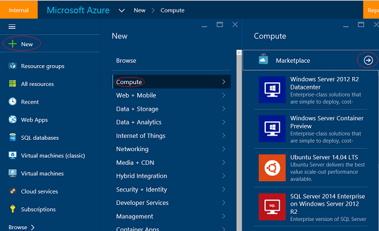

<properties 
	pageTitle="Provision a Data Science Virtual Machine | Microsoft Azure" 
	description="Configure and create a Data Science Virtual Machine on Azure to do analytics and machine learning." 
	services="machine-learning" 
	documentationCenter="" 
	authors="bradsev" 
	manager="paulettm" 
	editor="cgronlun" />

<tags 
	ms.service="machine-learning" 
	ms.workload="data-services" 
	ms.tgt_pltfrm="na" 
	ms.devlang="na" 
	ms.topic="article" 
	ms.date="10/20/2015" 
	ms.author="bradsev" />

# Provision a Data Science Virtual Machine

## Introduction

The Data Science Virtual Machine is an Azure virtual machine (VM) image pre-installed and configured with several popular tools that are commonly used for data analytics and machine learning. The tools included are:

- Revolution R Open
- Anaconda Python distribution
- Visual Studio Community Edition
- Power BI desktop
- SQL Server Express edition

Doing Data Science involves iterating on a sequence of tasks: finding, loading, and pre-processing data, building and testing models, and deploying the models for consumption in intelligent applications. It is not uncommon for data scientists to use a variety of tools to to complete these tasks. It can be quite time consuming to find the right versions of the software, and then download and install them. The Data Science virtual machine can ease away much of that burden. 

Use the Data Science VM to ease this burden. Jump start your analytics project by creating an image that includes the software commonly used for analytics and machine learning tasks in a variety of languages, including R, Python, SQL, C#. Visual Studio provides an IDE to develop and test your code that is easy to use. The Azure SDK included in the VM allows you to build your applications using various services on Microsoft’s cloud platform. 

## Prerequisites

Before you can create an Azure VM, you must have the following:

- **An Azure subscription**: See [Get Azure free trial](http://azure.microsoft.com/documentation/videos/get-azure-free-trial-for-testing-hadoop-in-hdinsight/).

*   **An Azure storage account**: See [Create an Azure storage account](storage-whatis-account.md) The storage account can be created as part of the process of creating the VM if you do not want to use an existing account.

## Create your data science VM

The steps involved in creating your instance of the data science VM are as follows:

1.	Login to Azure portal
2.	Navigate to **New** -> **Compute** -> **Marketplace** and search for *Data Science Virtual Machine*. Select the one VM titled “**Data Science Virtual Machine**” published by Microsoft to see a panel describing the Data Science Virtual Machine
3.	Click on the **Create** button at the bottom to be taken into a wizard.

4.	 The following sections provide the inputs for each step in the wizard used to create the Data Science VM

 **1. Basics**: 

- **Name**: Name of your data science server you are creating.
- **User Name**: Admin account login id
- **Password**: Admin account password
- **Subscription**: If you have more than one subscription, select the one on which the machine will be created and billed
- **Resource Group**: You can create a new one or use an existing group
- **Location**: Select the data center that is most appropriate. Usually it is the data center that has most of your data or is closest to your physical location for fastest network access

 **2. Size**: 

- Select one of the server types that meets your functional requirement and cost constraints. You can get more choices of VM sizes by selecting “View All”

 **3. Settings**

 **4. Disk Type**: 

- Choose Premium if you prefer SSD else choose “Standard”

 **5. Storage Account**: 

- You can create a new Azure storage account in your subscription or use an existing one in the same Location that was chosen on the Basics step of the wizard.
- In most cases you will just use the default for rest of the parameters. You can hover over the informational link for help on the specific field in case you want to use non-default.
- Verify that all information you entered is correct.
- Click on **Buy** to start the provisioning. A link is provided to the terms of the transaction. The VM does not have any additional charges beyond the compute for the server size you chose in the **Size** step. 

The provisioning should take about 10-20 minutes. The status of the provisioning is displayed on the Azure Portal.

## How to access the Data Science VM

Once the VM is created you can login to it using remote desktop with the Admin account credentials you created in the BAsics section of step 4. 

Once your VM is created and provisioned, you are ready to start using the tools that are installed and configured on it. There are desktop icons and start menu tiles for many of the tools. 

## Tools installed on the Data Science VM

### R
If you wish to use R for your analytics, the VM has Revolution R Open (RRO) installed. This is an Open source distribution of R and it is completely compatible with CRAN-R. It contains the latest open source R engine along with the Intel Math Kernel Library. An IDE called “RRO RGui” is also packaged in the VM. You are free to download and use other IDEs as well such as [RStudio](http://www.rstudio.com). 

### Python
For development using Python, Anaconda Python distribution 2.7 has been installed. This distribution contains the base Python along with about 300 of the most popular math, engineering and data analytics packages. You can use IDEs bundled with Anaconda like IDLE or Spyder. You can launch one of these by searching on the search bar (**Win** + **S** key). 

### IPython Notebook
Anaconda distribution also comes with an IPython notebook, an environment to share code and analysis. An Ipython notebook server has been pre-configured. There is a desktop icon to launch the browser to access the Notebook server. If you are on the VM via remote desktop you can also visit [https://localhost:9999/](https://localhost:9999/) to access the IPython notebook server (Note: Simply continue if you get any certificate warnings.) 

### Visual Studio 2015 Community edition
Visual Studio Community edition installed on the VM. It is a free version of the popular IDE from Microsoft that you can use for evaluation purposes and for very small teams. You can check out the terms of use ***here*** (Link TBD).  Open Visual Studio by double clicking the desktop icon or the **Start** menu. You can also search for programs with **Win** + **S** and entering “Visual Studio”. 

Note: You may get a message stating that your evaluation period has expired. You can enter a Microsoft Account credentials or create one and enter them to get access to the Visual Studio Community Edition. Once there you can create projects in languages like C#, Python

### SQL Server Express
A limited version of SQL Server is also packaged with Visual Studio Community edition. You can access the SQL server by launching **SQL Server Management Studio**. Your VM name will be populated as the Server Name. Use Windows Authentication when logged in as the admin on Windows. Once you are in SQL Server Management Studio you can create other users, create databases, import data, and run SQL queries. 

### Azure 
Several Azure tools are installed on the VM:
- There is a desktop shortcut to access the Azure SDK documentation. 
- **AzCopy** used to move data in and out of your Microsoft Azure Storage Account. 
- **Azure Storage Explorer** used to browse through the objects that you have stored within your Azure Storage Account. 
- **Microsoft Azure Powershell** - a script language used to administer your Azure resources in a script language is also installed on your VM. 

###Power BI

To help you build dashboards and great visualizations, the **Power BI Desktop** has been installed. Use this tool to pull data from different sources, to author your dashboards and reports, and to publish them to the cloud. For information, see the [Power BI](http://powerbi.microsoft.com) site. 

Note: You will need an Office 365 account to access Power BI. 

## Additional Microsoft development tools
The [**Microsoft Web Platform Installer**](https://www.microsoft.com/web/downloads/platform.aspx) can be used to discover and download other Microsoft development tools. There is also a shortcut to the tool provided on the VM desktop.  

