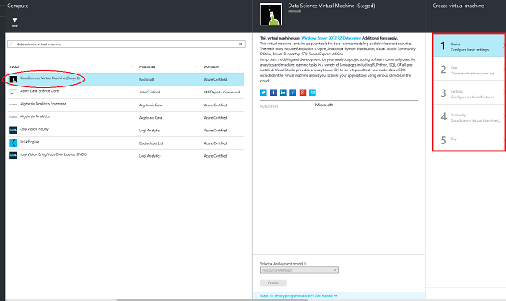

# Provision the Microsoft Data Science Virtual Machine
The Microsoft Data Science Virtual Machine is an Azure virtual machine (VM) image pre-installed and configured with several popular tools that are commonly used for data analytics and machine learning. The tools included are:

* Microsoft R Server Developer Edition
* Anaconda Python distribution
* Jupyter notebook (with R, Python kernels)
* Visual Studio Community Edition
* Power BI desktop
* SQL Server 2016 Developer Edition
* Machine learning and Data Analytics tools
  * [Computational Network Toolkit (CNTK)](https://github.com/Microsoft/CNTK): A deep learning software toolkit from Microsoft Research.
  * [Vowpal Wabbit](https://github.com/JohnLangford/vowpal_wabbit): A fast machine learning system supporting techniques such as online, hashing, allreduce, reductions, learning2search, active, and interactive learning.
  * [XGBoost](https://xgboost.readthedocs.org/en/latest/): A tool providing fast and accurate boosted tree implementation.
  * [Rattle](http://rattle.togaware.com/) (the R Analytical Tool To Learn Easily): A tool that makes getting started with data analytics and machine learning in R easy, with GUI-based data exploration, and modeling with automatic R code generation.
  * [mxnet](https://github.com/dmlc/mxnet): a deep learning framework designed for both efficiency and flexibility
  * [Weka](http://www.cs.waikato.ac.nz/ml/weka/) : A visual data mining and machine learning software in Java.
  * [Apache Drill](https://drill.apache.org/): A schema-free SQL Query Engine for Hadoop, NoSQL and Cloud Storage.  Supports ODBC and JDBC interfaces to enable querying NoSQL and files from standard BI tools like PowerBI, Excel, Tableau.
* Libraries in R and Python for use in Azure Machine Learning and other Azure services
* Git including Git Bash to work with source code repositories including GitHub, Visual Studio Team Services
* Windows ports of several popular Linux command-line utilities (including awk, sed, perl, grep, find, wget, curl etc) accessible through command prompt. 

Doing data science involves iterating on a sequence of tasks: finding, loading, and pre-processing data, building and testing models, and deploying the models for consumption in intelligent applications. Data scientists use a variety of tools to complete these tasks. It can be quite time consuming to find the appropriate versions of the software, and then download and install them. The Microsoft Data Science Virtual Machine can ease this burden by providing a ready-to-use image that can be provisioned on Azure with all several popular tools pre-installed and configured. 

The Microsoft Data Science Virtual Machine jump-starts your analytics project. It enables you to work on tasks in various languages including R, Python, SQL, and C#. Visual Studio provides an IDE to develop and test your code that is easy to use. The Azure SDK included in the VM allows you to build your applications using various services on Microsoft’s cloud platform. 

There are no software charges for this data science VM image. You only pay for the Azure usage fees which dependent on the size of the virtual machine you provision. More details on the compute fees can be found in the Pricing details section on the [Data Science Virtual Machine](https://azure.microsoft.com/marketplace/partners/microsoft-ads/standard-data-science-vm/) page. 

## Other Versions of the Data Science Virtual Machine
A [CentOS](machine-learning-data-science-linux-dsvm-intro.md) image is also available, with many of the same tools as the Windows image. An [Ubuntu](machine-learning-data-science-dsvm-ubuntu-intro.md) image is available as well, with many similar tools plus deep learning frameworks.

## Prerequisites
Before you can create a Microsoft Data Science Virtual Machine, you must have the following:

* **An Azure subscription**: To obtain one, see [Get Azure free trial](https://azure.microsoft.com/documentation/videos/get-azure-free-trial-for-testing-hadoop-in-hdinsight/).
* **An Azure storage account**: To create one, see [Create an Azure storage account](../storage/storage-create-storage-account.md#create-a-storage-account). Alternatively, the storage account can be created as part of the process of creating the VM if you do not want to use an existing account.

## Create your Microsoft Data Science Virtual Machine
Here are the steps to create an instance of the Microsoft Data Science Virtual Machine:

1. Navigate to the virtual machine listing on [Azure portal](https://portal.azure.com/#create/microsoft-ads.standard-data-science-vmstandard-data-science-vm).
2. Select the **Create** button at the bottom to be taken into a wizard.
3. The wizard used to create the Microsoft Data Science Virtual Machine requires **inputs** for each of the **five steps** enumerated on the right of this figure. Here are the inputs needed to configure each of these steps:
   
   1. **Basics**
      
      1. **Name**: Name of your data science server you are creating.
      2. **User Name**: Admin account login id.
      3. **Password**: Admin account password.
      4. **Subscription**: If you have more than one subscription, select the one on which the machine is to be created and billed.
      5. **Resource Group**: You can create a new one or use an existing group.
      6. **Location**: Select the data center that is most appropriate. Usually it is the data center that has most of your data or is closest to your physical location for fastest network access.
   2. **Size**: Select one of the server types that meets your functional requirement and cost constraints. You can get more choices of VM sizes by selecting “View All”.
   3. **Settings**:
      
      1. **Disk Type**: Choose Premium if you prefer a solid-state drive (SSD), else choose “Standard”.
      2. **Storage Account**: You can create a new Azure storage account in your subscription or use an existing one in the same *Location* that was chosen on the **Basics** step of the wizard.
      3. **Other parameters**: Usually you just use the default values. You can hover over the informational link for help on the specific fields in case you want to consider the use of non-default values.
   4. **Summary**: Verify that all information you entered is correct.
   5. **Buy**: Click **Buy** to start the provisioning. A link is provided to the terms of the transaction. The VM does not have any additional charges beyond the compute for the server size you chose in the **Size** step. 

> [!NOTE]
> The provisioning should take about 10-20 minutes. The status of the provisioning is displayed on the Azure portal.
> 
> 

## How to access the Microsoft Data Science Virtual Machine
Once the VM is created, you can remote desktop into it using the Admin account credentials that you configured in the preceding **Basics** section. 

Once your VM is created and provisioned, you are ready to start using the tools that are installed and configured on it. There are start menu tiles and desktop icons for many of the tools. 

## How to create a strong password for Jupyter and start the notebook server
By default, the Jupyter notebook server is pre-configured but disabled on the VM until you set a Jupyter password. To create a strong password for the Jupyter notebook server installed on the machine, run the following command from a command-prompt on the Data Science Virtual Machine OR double click the desktop shortcut we have provided called **Jupyter Set Password & Start** from a local VM administrator account.

    C:\dsvm\tools\setup\JupyterSetPasswordAndStart.cmd

Follow the messages and choose a strong password when prompted.

The above script will create a password hash and store it in the Jupyter configuration file located at: **C:\ProgramData\jupyter\jupyter_notebook_config.py** under the parameter name ***c.NotebookApp.password***.

The script will also enable and run the Jupyter server in the background. Jupyter server is created as a windows task in the WIndows Task Scheduler called **Start_IPython_Notebook**.  You may have to wait for a few seconds after setting the password before opening the notebook on your browser. See the section below titled **Jupyter Notebook** on how to access the Jupyter notebook server. 

## Tools installed on the Microsoft Data Science Virtual Machine
### Microsoft R Server Developer Edition
If you wish to use R for your analytics, the VM has Microsoft R Server Developer edition installed. Microsoft R Server is a broadly deployable enterprise-class analytics platform based on R that is supported, scalable, and secure. Supporting a variety of big data statistics, predictive modeling and machine learning capabilities, R Server supports the full range of analytics – exploration, analysis, visualization, and modeling. By using and extending open source R, Microsoft R Server is fully compatible with R scripts, functions and CRAN packages, to analyze data at enterprise scale. It also addresses the in-memory limitations of Open Source R by adding parallel and chunked processing of data. This enables you to run analytics on data much bigger than what fits in main memory.  Visual Studio Community Edition included on the VM contains the R Tools for Visual Studio extension that provides a full IDE for working with R. You can also download and use other IDEs as well such as [RStudio](http://www.rstudio.com). 

### Python
For development using Python, Anaconda Python distribution 2.7 and 3.5 has been installed. This distribution contains the base Python along with about 300 of the most popular math, engineering, and data analytics packages. You can use Python Tools for Visual Studio (PTVS) that is installed within the Visual Studio 2015 Community edition or one of the IDEs bundled with Anaconda like IDLE or Spyder. You can launch one of these by searching on the search bar (**Win** + **S** key).

> [!NOTE]
> To point the Python Tools for Visual Studio at Anaconda Python 2.7 and 3.5, you need to create custom environments for each version. To set these environment paths in the Visual Studio 2015 Community Edition, navigate to **Tools** -> **Python Tools** -> **Python Environments** and then click **+ Custom**. 
> 
> 

Anaconda Python 2.7 is installed under C:\Anaconda and Anaconda Python 3.5 is installed under c:\Anaconda\envs\py35. See [PTVS documentation](https://github.com/Microsoft/PTVS/wiki/Selecting-and-Installing-Python-Interpreters#hey-i-already-have-an-interpreter-on-my-machine-but-ptvs-doesnt-seem-to-know-about-it) for detailed steps. 

### Jupyter Notebook
Anaconda distribution also comes with a Jupyter notebook, an environment to share code and analysis. A Jupyter notebook server has been pre-configured with Python 2.7, Python 3.4, Python 3.5, and R kernels. There is a desktop icon named "Jupyter Notebook to launch the browser to access the Notebook server. If you are on the VM via remote desktop, you can also visit [https://localhost:9999/](https://localhost:9999/) to access the Jupyter notebook server when logged in to the VM.

> [!NOTE]
> Continue if you get any certificate warnings. 
> 
> 

We have packaged several sample notebooks in Python and in R. The Jupyter notebooks show how to work with Microsoft R Server, SQL Server 2016 R Services (In-database analytics), Python, Microsoft Cognitive ToolKit (CNTK) for deep learning and other Azure technologies once you log in to Jupyter. You can see the link to the samples on the notebook home page after you authenticate to the Jupyter notebook using the password you created in an earlier step. 

### Visual Studio 2015 Community edition
Visual Studio Community edition installed on the VM. It is a free version of the popular IDE from Microsoft that you can use for evaluation purposes and for small teams. You can check out the licensing terms [here](https://www.visualstudio.com/support/legal/mt171547).  Open Visual Studio by double-clicking the desktop icon or the **Start** menu. You can also search for programs with **Win** + **S** and entering “Visual Studio”. Once there you can create projects in languages like C#, Python, R, node.js. Plugins are also installed that make it convenient to work with Azure services like Azure Data Catalog, Azure HDInsight (Hadoop, Spark), and Azure Data Lake. 

> [!NOTE]
> You may get a message stating that your evaluation period has expired. Enter your Microsoft account credentials or create a new free account to get access to the Visual Studio Community Edition. 
> 
> 

### SQL Server 2016 Developer edition
A developer version of SQL Server 2016 with R Services to run in-database analytics is provided on the VM. R Services provide a platform for developing and deploying intelligent applications. You can use the rich and powerful R language and the many packages from the community to create models and generate predictions for your SQL Server data. You can keep analytics close to the data because R Services (In-database) integrate the R language with SQL Server. This eliminates the costs and security risks associated with data movement.

> [!NOTE]
> The SQL Server 2016 developer edition can only be used for development and test purposes. You need a license to run it in production. 
> 
> 

You can access the SQL server by launching **SQL Server Management Studio**. Your VM name is populated as the Server Name. Use Windows Authentication when logged in as the admin on Windows. Once you are in SQL Server Management Studio you can create other users, create databases, import data, and run SQL queries. 

To enable In-database analytics using Microsoft R, run the following command as a one time action in SQL Server management studio after logging in as the server administrator. 

        CREATE LOGIN [%COMPUTERNAME%\SQLRUserGroup] FROM WINDOWS 

        (Please replace the %COMPUTERNAME% with your VM name)

### Azure
Several Azure tools are installed on the VM:

* There is a desktop shortcut to access the Azure SDK documentation. 
* **AzCopy**: used to move data in and out of your Microsoft Azure Storage Account. To see usage, type **Azcopy** at a command prompt to see the usage. 
* **Microsoft Azure Storage Explorer**: used to browse through the objects that you have stored within your Azure Storage Account and transfer data to and from Azure storage. You can type **Storage Explorer** in search or find it on the Windows Start menu to access this tool. 
* **Adlcopy**: used to move data to Azure Data Lake. To see usage, type **adlcopy** in a command prompt. 
* **dtui**: used to move data to and from Azure DocumentDB, a NoSQL database on the cloud. Type **dtui** on command prompt. 
* **Microsoft Data Management Gateway**:  enables data movement between on-premises data sources and cloud. It is used within tools like Azure Data Factory. 
* **Microsoft Azure Powershell**:  a tool used to administer your Azure resources in the Powershell scripting language is also installed on your VM. 

### Power BI
To help you build dashboards and great visualizations, the **Power BI Desktop** has been installed. Use this tool to pull data from different sources, to author your dashboards and reports, and to publish them to the cloud. For information, see the [Power BI](http://powerbi.microsoft.com) site. You can find Power BI desktop on the Start menu. 

> [!NOTE]
> You need an Office 365 account to access Power BI. 
> 
> 

## Additional Microsoft development tools
The [**Microsoft Web Platform Installer**](https://www.microsoft.com/web/downloads/platform.aspx) can be used to discover and download other Microsoft development tools. There is also a shortcut to the tool provided on the Microsoft Data Science Virtual Machine desktop.  

## Important directories on the VM
| Item | Directory |
| --- | --- |
| Jupyter notebook server configurations |C:\ProgramData\jupyter |
| Jupyter Notebook samples home directory |c:\dsvm\notebooks |
| Other samples |c:\dsvm\samples |
| Anaconda (default: Python 2.7) |c:\Anaconda |
| Anaconda Python 3.5 environment |c:\Anaconda\envs\py35 |
| R Server Standalone instance directory (Default R instance based on R3.2.2) |C:\Program Files\Microsoft SQL Server\130\R_SERVER |
| R Server In-database instance directory (R3.2.2) |C:\Program Files\Microsoft SQL Server\MSSQL13.MSSQLSERVER\R_SERVICES |
| Microsoft R Open (R3.3.1) instance directory |C:\Program Files\Microsoft\MRO-3.3.1 |
| Miscellaneous tools |c:\dsvm\tools |

> [!NOTE]
> Instances of the Microsoft Data Science Virtual Machine created before 1.5.0 (before September 3, 2016) used a slightly different directory structure than specified in the preceding table. 
> 
> 

## Next Steps
Here are some next steps to continue your learning and exploration. 

* Explore the various data science tools on the data science VM by clicking the start menu and checking out the tools listed on the menu.
* Navigate to **C:\Program Files\Microsoft SQL Server\130\R_SERVER\library\RevoScaleR\demoScripts** for samples using the RevoScaleR library in R that supports data analytics at enterprise scale.  
* Read the article: [10 things you can do on the Data science Virtual Machine](http://aka.ms/dsvmtenthings)
* Learn how to build end to end analytical solutions systematically using the [Team Data Science Process](https://azure.microsoft.com/documentation/learning-paths/data-science-process/).
* Visit the [Cortana Intelligence Gallery](http://gallery.cortanaintelligence.com) for machine learning and data analytics samples that use the Cortana Intelligence Suite. We have also provided an icon on the **Start** menu and on the desktop of the virtual machine to this gallery.

