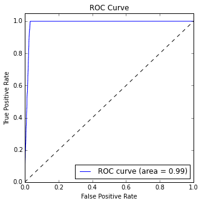
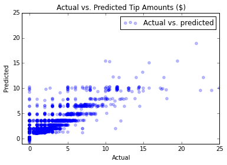

<properties
	pageTitle="Data exploration and modeling with Spark | Microsoft Azure"
	description="Showcases the data exploration and modeling capabilities of the Spark MLlib toolkit."
	services="machine-learning"
	documentationCenter=""
	authors="bradsev,deguhath,gokuma"
	manager="paulettm"
	editor="cgronlun" />

<tags
	ms.service="machine-learning"
	ms.workload="data-services"
	ms.tgt_pltfrm="na"
	ms.devlang="na"
	ms.topic="article"
	ms.date="05/02/2016"
	ms.author="deguhath;bradsev" />

# Data exploration and modeling with Spark

[AZURE.INCLUDE [machine-learning-spark-modeling](../../includes/machine-learning-spark-modeling.md)]

This walkthrough uses HDInsight Spark to do data exploration and binary classification and regression modeling tasks on a sample of the NYC taxi trip and fare 2013 dataset.  It walks you through the steps of the [Data Science Process](http://aka.ms/datascienceprocess), end-to-end, using an HDInsight Spark cluster for processing and Azure blobs to store the data and the models. The process explores and visualizes data brought in from an Azure Storage Blob and then prepares the data to build predictive models. These models are build using the Spark MLlib toolkit to do binary classification and regression modeling tasks.

- The **binary classification** task is to predict whether or not a tip is paid for the trip. 
- The **regression** task is to predict the amount of the tip based on other tip features. 

The models we use include logistic and linear regression, random forests and gradient boosted trees:

- [Linear regression with SGD](https://spark.apache.org/docs/latest/api/python/pyspark.mllib.html#pyspark.mllib.regression.LinearRegressionWithSGD) is a linear regression model that uses a Stochastic Gradient Descent (SGD) method and for optimization and feature scaling to predict the tip amounts paid. 
- [Logistic regression with LBFGS](https://spark.apache.org/docs/latest/api/python/pyspark.mllib.html#pyspark.mllib.classification.LogisticRegressionWithLBFGS) or "logit" regression, is a regression model that can be used when the dependent variable is categorical to do data classification. LBFGS is a quasi-Newton optimization algorithm that approximates the Broyden–Fletcher–Goldfarb–Shanno (BFGS) algorithm using a limited amount of computer memory and that is widely used in machine learning.
- [Random forests](http://spark.apache.org/docs/latest/mllib-ensembles.html#Random-Forests) are ensembles of decision trees.  They combine many decision trees in order to reduce the risk of overfitting. Random forests are used for regression and classification and can handle categorical features, extend to the multiclass classification setting, do not require feature scaling, and are able to capture non-linearities and feature interactions. Random forests are one of the most successful machine learning models for classification and regression.
- [Gradient boosted trees](http://spark.apache.org/docs/latest/ml-classification-regression.html#gradient-boosted-trees-gbts) (GBTs) are ensembles of decision trees. GBTs train decision trees iteratively to minimize a loss function. GBTs are used for regression and classification and can handle categorical features, do not require feature scaling, and are able to capture non-linearities and feature interactions. They can also be used in a multiclass-classification setting.

The modeling steps also contain code showing how to train, evaluate and save each type of model. Python has been used to code the solution and to show the relevant plots.   

>[AZURE.NOTE] Although the Spark MLlib toolkit is designed to work on large datasets, for purposes of demonstrating its modeling capabilities, a relatively small sample (~30 Mb using 170K rows, about 0.1% of the original NYC dataset) is used, for convenience. The exercise given here runs efficiently on an HDInsight cluster with 2 worker nodes (in about 10 mins). The same code, with minor modifications, can be used to process larger data-sets, with appropriate modifications for caching data in memory or changing the cluster size.

## Prerequisites

You need an Azure account and an HDInsight Spark You need an HDInsight 3.4 Spark 1.6 cluster to complete this walkthrough. See the [Overview of Data Science using Spark on Azure HDInsight](machine-learning-data-science-spark-overview.md) for these requirements, for a description of the NYC 2013 Taxi data used here, and for instructions on how execute code from a Jupyter notebook on the Spark cluster. The **machine-learning-data-science-spark-data-exploration-modeling.ipynb** notebook that contains the code samples in this topic are available in [Github](https://github.com/Azure/Azure-MachineLearning-DataScience/tree/master/Misc/Spark/pySpark). 

[AZURE.INCLUDE [delete-cluster-warning](../../includes/hdinsight-delete-cluster-warning.md)]

## Setup: storage locations, libraries and Spark context

Spark is able to read and write to Azure Storage Blob (also known as WASB). So any of your existing data stored there can be processed using Spark and the results stored again in WASB.

To save models or files in WASB, the path needs to be specified properly. The default container attached to the Spark cluster can be referenced using a path beginning with: "wasb///". Other locations are referenced by “wasb://”.

Set up also requires importing necessary libraries and set ting the spark context.

TBD Explaining about pyspark magic for context.

### Set directory paths for storage locations in WASB

The following code sample specifies the location of the data to be read and the path for the model storage directory to which the model output will be saved. 

	# SET PATHS TO FILE LOCATIONS: DATA AND MODEL STORAGE

	# LOCATION OF TRAINING DATA
	taxi_train_file_loc = "wasb://mllibwalkthroughs@cdspsparksamples.blob.core.windows.net/Data/NYCTaxi/JoinedTaxiTripFare.Point1Pct.Train.tsv";

	# SET THE MODEL STORAGE DIRECTORY PATH 
	# NOTE THAT THE FINAL BACKSLASH IN THE PATH IS NEEDED.
	modelDir = "wasb:///user/remoteuser/NYCTaxi/Models/" 

TBD: Explain how:
Creating SparkContext as 'sc'
Creating HiveContext as 'sqlContext'

### Import libraries needed and set Spark context 

Set spark context and import necessary libraries with the following code.

	# IMPORT LIBRARIES
	import pyspark
	from pyspark import SparkConf
	from pyspark import SparkContext
	from pyspark.sql import SQLContext
	import matplotlib
	import matplotlib.pyplot as plt
	from pyspark.sql import Row
	from pyspark.sql.functions import UserDefinedFunction
	from pyspark.sql.types import *
	import atexit
	from numpy import array
	import numpy as np
	import datetime

## Data ingestion

This section contains the code for a series of tasks required to ingest the data sample to be modeled. Read in a joined 0.1% sample of the taxi trip and fare file (stored as a .tsv file), format and clean the data, create and cache a data frame in memory, and then register it as a temp-table in SQL-context.

The first step in the data science process is to ingest the data to be analyzed from external sources or systems where is resides into your data exploration and modeling environment. This environment is Spark in this walkthrough. This section contains the code to complete a series of tasks:

- ingest the data sample to be modeled
- read in the input dataset (stored as a .tsv file)
- format and clean the data
- create and cache objects (RDDs or data-frames) in memory
- register it as a temp-table in SQL-context.

Here is the code for data ingestion.

	# INGEST DATA

	# RECORD START TIME
	timestart = datetime.datetime.now()

	# IMPORT FILE FROM PUBLIC BLOB
	taxi_train_file = sc.textFile(taxi_train_file_loc)
	
	# GET SCHEMA OF THE FILE FROM HEADER
	schema_string = taxi_train_file.first()
	fields = [StructField(field_name, StringType(), True) for field_name in schema_string.split('\t')]
	fields[7].dataType = IntegerType() #Pickup hour
	fields[8].dataType = IntegerType() # Pickup week
	fields[9].dataType = IntegerType() # Weekday
	fields[10].dataType = IntegerType() # Passenger count
	fields[11].dataType = FloatType() # Trip time in secs
	fields[12].dataType = FloatType() # Trip distance
	fields[19].dataType = FloatType() # Fare amount
	fields[20].dataType = FloatType() # Surcharge
	fields[21].dataType = FloatType() # Mta_tax
	fields[22].dataType = FloatType() # Tip amount
	fields[23].dataType = FloatType() # Tolls amount
	fields[24].dataType = FloatType() # Total amount
	fields[25].dataType = IntegerType() # Tipped or not
	fields[26].dataType = IntegerType() # Tip class
	taxi_schema = StructType(fields)
	
	## PARSE FIELDS AND CONVERT DATA TYPE FOR SOME FIELDS
	taxi_header = taxi_train_file.filter(lambda l: "medallion" in l)
	taxi_temp = taxi_train_file.subtract(taxi_header).map(lambda k: k.split("\t"))\
	        .map(lambda p: (p[0],p[1],p[2],p[3],p[4],p[5],p[6],int(p[7]),int(p[8]),int(p[9]),int(p[10]),
	                        float(p[11]),float(p[12]),p[13],p[14],p[15],p[16],p[17],p[18],float(p[19]),
	                        float(p[20]),float(p[21]),float(p[22]),float(p[23]),float(p[24]),int(p[25]),int(p[26])))
	
	
	## CREATE DATA FRAME
	taxi_train_df = sqlContext.createDataFrame(taxi_temp, taxi_schema)
	
	## CREATE A CLEANED DATA-FRAME BY DROPPING SOME UN-NECESSARY COLUMNS & FILTERING FOR UNDESIRED VALUES OR OUTLIERS
	taxi_df_train_cleaned = taxi_train_df.drop('medallion').drop('hack_license').drop('store_and_fwd_flag').drop('pickup_datetime')\
	    .drop('dropoff_datetime').drop('pickup_longitude').drop('pickup_latitude').drop('dropoff_latitude')\
	    .drop('dropoff_longitude').drop('tip_class').drop('total_amount').drop('tolls_amount').drop('mta_tax')\
	    .drop('direct_distance').drop('surcharge')\
	    .filter("passenger_count > 0 and passenger_count < 8 AND payment_type in ('CSH', 'CRD') AND tip_amount >= 0 AND tip_amount < 30 AND fare_amount >= 1 AND fare_amount < 150 AND trip_distance > 0 AND trip_distance < 100 AND trip_time_in_secs > 30 AND trip_time_in_secs < 7200" )

	
	## CACHE DATA-FRAME IN MEMORY & MATERIALIZE DF IN MEMORY
	taxi_df_train_cleaned.cache()
	taxi_df_train_cleaned.count()
	
	## REGISTER DATA-FRAME AS A TEMP-TABLE IN SQL-CONTEXT
	taxi_df_train_cleaned.registerTempTable("taxi_train")
	
	## PRINT HOW MUCH TIME IT TOOK TO RUN THE CELL
	timeend = datetime.datetime.now()
	timedelta = round((timeend-timestart).total_seconds(), 2) 
	print "Time taken to execute above cell: " + str(timedelta) + " seconds";

**OUTPUT:**

Time taken to execute above cell: 339.0 seconds

## Data exploration & visualization

Once the data has been brought into Spark, the next step in the data science process is to gain deeper understanding of the data through exploration and visualization. In this section we examine the taxi data using SQL queries and plot the target variables and prospective features for visual inspection. Specifically, we plot the frequency of passenger counts in taxi trips, the frequency of tip amounts, and how tips vary by payment amount and type.

### Plot a histogram of passenger count frequencies in the sample of taxi trips

The code uses a SQL squery to sample and plot the data.

	# PLOT FREQUENCY OF PASSENGER COUNTS IN TAXI TRIPS

	# SQL SQUERY
	%%sql -q -o sqlResults
	SELECT passenger_count, COUNT(*) as trip_counts 
	FROM taxi_train 
	WHERE passenger_count > 0 and passenger_count < 7 
	GROUP BY passenger_count 

	
	#SET LOCAL CONTEXT AND IMPORT PYPLOT
	%%local
	import matplotlib.pyplot as plt
	%matplotlib inline
	
	# PLOT PASSENGER NUMBER VS. TRIP COUNTS
	x_labels = sqlResults['passenger_count'].values
	fig = sqlResults[['trip_counts']].plot(kind='bar', facecolor='lightblue')
	fig.set_xticklabels(x_labels)
	fig.set_title('Counts of trips by passenger count')
	fig.set_xlabel('Passenger count in trips')
	fig.set_ylabel('Trip counts')
	plt.show()

**OUTPUT:**

	
### Plot a histogram of tip amounts and how tip amount varies by passenger count and fare amounts.

The code uses a SQL squery to sample and plot the data.

	#PLOT HISTOGRAM OF TIP AMOUNTS AND VARIATION BY PASSENGER COUNT AND PAYMENT TYPE
	
	# SQL SQUERY
	%%sql -q -o sqlResults
	SELECT fare_amount, passenger_count, tip_amount, tipped 
	FROM taxi_train 
	WHERE passenger_count > 0 
	AND passenger_count < 7 
	AND fare_amount > 0 
	AND fare_amount < 200 
	AND payment_type in ('CSH', 'CRD') 
	AND tip_amount > 0 
	AND tip_amount < 25

	
	# HISTOGRAM OF TIP AMOUNTS AND PASSENGER COUNT
	ax1 = sqlResults[['tip_amount']].plot(kind='hist', bins=25, facecolor='lightblue')
	ax1.set_title('Tip amount distribution')
	ax1.set_xlabel('Tip Amount ($)')
	ax1.set_ylabel('Counts')
	plt.suptitle('')
	plt.show()
	
	# TIP BY PASSENGER COUNT
	ax2 = sqlResults.boxplot(column=['tip_amount'], by=['passenger_count'])
	ax2.set_title('Tip amount by Passenger count')
	ax2.set_xlabel('Passenger count')
	ax2.set_ylabel('Tip Amount ($)')
	plt.suptitle('')
	plt.show()
	
	# TIP AMOUNT BY FARE AMOUNT, POINTS ARE SCALED BY PASSENGER COUNT
	ax = sqlResults.plot(kind='scatter', x= 'fare_amount', y = 'tip_amount', c='blue', alpha = 0.10, s=5*(sqlResults.passenger_count))
	ax.set_title('Tip amount by Fare amount')
	ax.set_xlabel('Fare Amount ($)')
	ax.set_ylabel('Tip Amount ($)')
	plt.axis([-2, 100, -2, 20])
	plt.show()

**OUTPUT:** 

Time taken to execute above cell: 10.61 seconds

## Feature engineering, transformation and data preparation for modeling
This section describes and provides the code for procedures used to prepare data for use in ML modeling. It shows how to do the following tasks:

- Create a new feature by binning hours into traffic time buckets
- Index and encode categorical features
- Create labeled point objects for input into ML functions
- Create a random sub-sampling of the data and split it into training and testing sets
- Feature scaling
- Cache objects in memory

### Create a new feature by binning hours into traffic time buckets

This code shows how to create a new feature by binning hours into traffic time buckets and then how to cache the resulting data frame in memory. Where Resilient Distributed Datasets (RDDs) and data-frames are used repeatedly, caching leads to improved execution times. Accordingly, we cache RDDs and data-frames at several stages in the walkthrough. 

	## CREATE FOUR BUCKETS FOR TRAFFIC TIMES
	sqlStatement = """
	    SELECT *,
	    CASE
	     WHEN (pickup_hour <= 6 OR pickup_hour >= 20) THEN "Night" 
	     WHEN (pickup_hour >= 7 AND pickup_hour <= 10) THEN "AMRush" 
	     WHEN (pickup_hour >= 11 AND pickup_hour <= 15) THEN "Afternoon"
	     WHEN (pickup_hour >= 16 AND pickup_hour <= 19) THEN "PMRush"
	    END as TrafficTimeBins
	    FROM taxi_train 
	"""
	taxi_df_train_with_newFeatures = sqlContext.sql(sqlStatement)
	
	## CACHE DATA FRAME IN MEMORY & MATERIALIZE IT IN MEMORY
	taxi_df_train_with_newFeatures.cache()
	taxi_df_train_with_newFeatures.count()

**OUTPUT:** 

126050

### Index and encode categorical features for input into modeling functions

This section shows how to index or encode categorical features for input into the modeling functions. The modeling and predict functions of MLlib require features with categorical input data to be indexed or encoded prior to use. Depending on the model, you need to index or encode them in different ways:  

- **Tree based modeling** requires categories to be encoded as numerical values (e.g. a feature with 3 categories may be encoded with 0, 1, 2). This is provided by MLlib’s [StringIndexer](http://spark.apache.org/docs/latest/ml-features.html#stringindexer) function. This function encodes a string column of labels to a column of label indices that are ordered by label frequencies. Note that although indexed with numerical values for input and data handling, the tree based algorithms can be specified to treat them appropriately as categories. 

- **Logistic and Linear Regression models** require one-hot encoding, where, for example, a feature with 3 categories can be expanded into 3 feature columns, with each containing 0 or 1 depending on the category of an observation. MLlib provides [OneHotEncoder](http://scikit-learn.org/stable/modules/generated/sklearn.preprocessing.OneHotEncoder.html#sklearn.preprocessing.OneHotEncoder) function to do one-hot encoding. This encoder maps a column of label indices to a column of binary vectors, with at most a single one-value. This encoding allows algorithms which expect numerical valued features, such as logistic regression, to be applied to categorical features.

Here is the code to index and encode categorical features:

	# INDEX AND ENCODE CATEGORICAL FEATURES

	# RECORD START TIME
	timestart = datetime.datetime.now()

	# LOAD PYSPARK LIBRARIES	
	from pyspark.ml.feature import OneHotEncoder, StringIndexer, VectorAssembler, VectorIndexer
	
	# INDEX AND ENCODE VENDOR_ID
	stringIndexer = StringIndexer(inputCol="vendor_id", outputCol="vendorIndex")
	model = stringIndexer.fit(taxi_df_train_with_newFeatures) # Input data-frame is the cleaned one from above
	indexed = model.transform(taxi_df_train_with_newFeatures)
	encoder = OneHotEncoder(dropLast=False, inputCol="vendorIndex", outputCol="vendorVec")
	encoded1 = encoder.transform(indexed)
	
	# INDEX AND ENCODE RATE_CODE
	stringIndexer = StringIndexer(inputCol="rate_code", outputCol="rateIndex")
	model = stringIndexer.fit(encoded1)
	indexed = model.transform(encoded1)
	encoder = OneHotEncoder(dropLast=False, inputCol="rateIndex", outputCol="rateVec")
	encoded2 = encoder.transform(indexed)
	
	# INDEX AND ENCODE PAYMENT_TYPE
	stringIndexer = StringIndexer(inputCol="payment_type", outputCol="paymentIndex")
	model = stringIndexer.fit(encoded2)
	indexed = model.transform(encoded2)
	encoder = OneHotEncoder(dropLast=False, inputCol="paymentIndex", outputCol="paymentVec")
	encoded3 = encoder.transform(indexed)
	
	# INDEX AND TRAFFIC TIME BINS
	stringIndexer = StringIndexer(inputCol="TrafficTimeBins", outputCol="TrafficTimeBinsIndex")
	model = stringIndexer.fit(encoded3)
	indexed = model.transform(encoded3)
	encoder = OneHotEncoder(dropLast=False, inputCol="TrafficTimeBinsIndex", outputCol="TrafficTimeBinsVec")
	encodedFinal = encoder.transform(indexed)
	
	# PRINT ELAPSED TIME
	timeend = datetime.datetime.now()
	timedelta = round((timeend-timestart).total_seconds(), 2) 
	print "Time taken to execute above cell: " + str(timedelta) + " seconds"; 

**OUTPUT:**

Time taken to execute above cell: 1.28 seconds

### Create labeled point objects for input into ML functions

This section contains code that shows how to index categorical text data as a labeled point data type and encode it so that it can be used to train and test MLlib logistic regression and other classification models. Labeled point objects are Resilient Distributed Datasets (RDD) formatted in a way that is needed as input data by most of ML algorithms in MLlib. A [labeled point](https://spark.apache.org/docs/latest/mllib-data-types.html#labeled-point) is a local vector, either dense or sparse, associated with a label/response.  

This section contains code that shows how to index categorical text data as a [labeled point](https://spark.apache.org/docs/latest/mllib-data-types.html#labeled-point) data type and encode it so that it can be used to train and test MLlib logistic regression and other classification models. Labeled point objects are Resilient Distributed Datasets (RDD) consisting of a label (target/response variable) and feature vector. This format is needed as input by many ML algorithms in MLlib.

	# FUNCTIONS FOR BINARY CLASSIFICATION

	# LOAD PYSPARK LIBRARIES
	from pyspark.mllib.regression import LabeledPoint
	from numpy import array

	# INDEXING CATEGORICAL TEXT FEATURES FOR INPUT INTO TREE-BASED MODELS
	def parseRowIndexingBinary(line):
	    features = np.array([line.paymentIndex, line.vendorIndex, line.rateIndex, line.TrafficTimeBinsIndex,
	                         line.pickup_hour, line.weekday, line.passenger_count, line.trip_time_in_secs, 
	                         line.trip_distance, line.fare_amount])
	    labPt = LabeledPoint(line.tipped, features)
	    return  labPt
	
	# ONE-HOT ENCODING OF CATEGORICAL TEXT FEATURES FOR INPUT INTO LOGISTIC RERESSION MODELS
	def parseRowOneHotBinary(line):
	    features = np.concatenate((np.array([line.pickup_hour, line.weekday, line.passenger_count,
	                                        line.trip_time_in_secs, line.trip_distance, line.fare_amount]), 
	                                        line.vendorVec.toArray(), line.rateVec.toArray(), 
	                                        line.paymentVec.toArray(), line.TrafficTimeBinsVec.toArray()), axis=0)
	    labPt = LabeledPoint(line.tipped, features)
	    return  labPt

	# FUNCTIONS FOR REGRESSION WITH TIP AMOUNT AS TARGET VARIABLE

	# ONE-HOT ENCODING OF CATEGORICAL TEXT FEATURES FOR INPUT INTO TREE-BASED MODELS
	def parseRowIndexingRegression(line):
	    features = np.array([line.paymentIndex, line.vendorIndex, line.rateIndex, line.TrafficTimeBinsIndex, 
	                         line.pickup_hour, line.weekday, line.passenger_count, line.trip_time_in_secs, 
	                         line.trip_distance, line.fare_amount])

	    labPt = LabeledPoint(line.tip_amount, features)
	    return  labPt
	
	# INDEXING CATEGORICAL TEXT FEATURES FOR INPUT INTO LINEAR REGRESSION MODELS
	def parseRowOneHotRegression(line):
	    features = np.concatenate((np.array([line.pickup_hour, line.weekday, line.passenger_count,
	                                        line.trip_time_in_secs, line.trip_distance, line.fare_amount]), 
	                                        line.vendorVec.toArray(), line.rateVec.toArray(), 
	                                        line.paymentVec.toArray(), line.TrafficTimeBinsVec.toArray()), axis=0)
	    labPt = LabeledPoint(line.tip_amount, features)
	    return  labPt

### Create a random sub-sampling of the data and split it into training and testing sets

This code creates a random sampling of the data (25% is used here). Although it is not required for this example due to the size of the dataset, we demonstrate how you can sample here so you know how to use it for your own problem when needed. When samples are large, this can save significant time while training models. Next we split the sample into a training part (75% here) and a testing part (25% here) to use in classification and regression modeling.

	# RECORD START TIME
	timestart = datetime.datetime.now()
	
	# LOAD PYSPARK LIBRARIES
	from pyspark.sql.functions import rand

	# SPECIFY SAMPLING AND SPLITTING FRACTIONS
	samplingFraction = 0.25;
	trainingFraction = 0.75; testingFraction = (1-trainingFraction);
	seed = 1234;
	encodedFinalSampled = encodedFinal.sample(False, samplingFraction, seed=seed)
	
	# SPLIT SAMPLED DATA-FRAME INTO TRAIN/TEST
	# INCLUDE RAND COLUMN FOR CREATING CROSS-VALIDATION FOLDS (FOR USE LATER IN AN ADVANCED TOPIC)
	dfTmpRand = encodedFinalSampled.select("*", rand(0).alias("rand"));
	trainData, testData = dfTmpRand.randomSplit([trainingFraction, testingFraction], seed=seed);
	
	# FOR BINARY CLASSIFICATION TRAINING AND TESTING
	indexedTRAINbinary = trainData.map(parseRowIndexingBinary)
	indexedTESTbinary = testData.map(parseRowIndexingBinary)
	oneHotTRAINbinary = trainData.map(parseRowOneHotBinary)
	oneHotTESTbinary = testData.map(parseRowOneHotBinary)
	
	# FOR REGRESSION TRAINING AND TESTING
	indexedTRAINreg = trainData.map(parseRowIndexingRegression)
	indexedTESTreg = testData.map(parseRowIndexingRegression)
	oneHotTRAINreg = trainData.map(parseRowOneHotRegression)
	oneHotTESTreg = testData.map(parseRowOneHotRegression)
	
	# PRINT ELAPSED TIME
	timeend = datetime.datetime.now()
	timedelta = round((timeend-timestart).total_seconds(), 2) 
	print "Time taken to execute above cell: " + str(timedelta) + " seconds"; 

**OUTPUT:**

Time taken to execute above cell: 0.16 seconds

### Feature scaling

Feature scaling, also known as data normalization, insures that features with widely disbursed values are not given excessive weigh in the objective function. The code for feature scaling uses the [StandardScaler](https://spark.apache.org/docs/latest/api/python/pyspark.mllib.html#pyspark.mllib.feature.StandardScaler) to scale the features to unit variance. It is provided by MLlib for use in linear regression with Stochastic Gradient Descent (SGD), a popular algorithm for training a wide range of other machine learning models such as regularized regressions or support vector machines (SVM).

>[AZURE.NOTE] We have found the LinearRegressionWithSGD algorithm to be sensitive to feature scaling.

Here is the code to scale to scale variables for use with the regularized linear SGD algorithm.

	# FEATURE SCALING

	# RECORD START TIME
	timestart = datetime.datetime.now()

	# LOAD PYSPARK LIBRARIES
	from pyspark.mllib.regression import LabeledPoint
	from pyspark.mllib.linalg import Vectors
	from pyspark.mllib.feature import StandardScaler, StandardScalerModel
	from pyspark.mllib.util import MLUtils
	
	# SCALE VARIABLES FOR REGULARIZED LINEAR SGD ALGORITHM
	label = oneHotTRAINreg.map(lambda x: x.label)
	features = oneHotTRAINreg.map(lambda x: x.features)
	scaler = StandardScaler(withMean=False, withStd=True).fit(features)
	dataTMP = label.zip(scaler.transform(features.map(lambda x: Vectors.dense(x.toArray()))))
	oneHotTRAINregScaled = dataTMP.map(lambda x: LabeledPoint(x[0], x[1]))
	
	label = oneHotTESTreg.map(lambda x: x.label)
	features = oneHotTESTreg.map(lambda x: x.features)
	scaler = StandardScaler(withMean=False, withStd=True).fit(features)
	dataTMP = label.zip(scaler.transform(features.map(lambda x: Vectors.dense(x.toArray()))))
	oneHotTESTregScaled = dataTMP.map(lambda x: LabeledPoint(x[0], x[1]))
	
	# PRINT ELAPSED TIME
	timeend = datetime.datetime.now()
	timedelta = round((timeend-timestart).total_seconds(), 2) 
	print "Time taken to execute above cell: " + str(timedelta) + " seconds"; 

**OUTPUT:**

Time taken to execute above cell: 7.63 seconds

### Cache objects in memory

The time taken for training and testing of ML algorithms can be reduced by caching the input data frame objects used for classification, regression and scaled features.

	# RECORD START TIME
	timestart = datetime.datetime.now()
	
	# FOR BINARY CLASSIFICATION TRAINING AND TESTING
	indexedTRAINbinary.cache()
	indexedTESTbinary.cache()
	oneHotTRAINbinary.cache()
	oneHotTESTbinary.cache()
	
	# FOR REGRESSION TRAINING AND TESTING
	indexedTRAINreg.cache()
	indexedTESTreg.cache()
	oneHotTRAINreg.cache()
	oneHotTESTreg.cache()
	
	# SCALED FEATURES
	oneHotTRAINregScaled.cache()
	oneHotTESTregScaled.cache()
	
	# PRINT ELAPSED TIME
	timeend = datetime.datetime.now()
	timedelta = round((timeend-timestart).total_seconds(), 2) 
	print "Time taken to execute above cell: " + str(timedelta) + " seconds"; 

**OUTPUT:** 

Time taken to execute above cell: 0.14 seconds

## Predict whether or not a tip is paid with binary classification models

This section shows how use three models for the binary classification task of predicting whether or not a tip is paid for a taxi trip. The models presented are:

- Regularized logistic regression 
- Random forest model
- Gradient Boosting Trees

Each model building code section will be split into steps: 

1. **Model training** data with one parameter set
2. **Model evaluation** on a test data set with metrics
3. **Saving model** in blob for future consumption

### Classification using logistic regression

The code in this section shows how to train evaluate, and save a logistic regression model with [LBFGS](https://en.wikipedia.org/wiki/Broyden%E2%80%93Fletcher%E2%80%93Goldfarb%E2%80%93Shanno_algorithm) that predicts whether or not a tip is paid for a trip in the NYC taxi trip and fare dataset.

	#PREDICT WHETHER A TIP IS PAID OR NOT USING LOGISTIC REGRESSION WITH LBFGS

	# RECORD START TIME
	timestart = datetime.datetime.now()
	
	# LOAD PYSPARK LIBRARIES
	from pyspark.mllib.classification import LogisticRegressionWithLBFGS 
	from sklearn.metrics import roc_curve,auc
	from pyspark.mllib.evaluation import BinaryClassificationMetrics
	from pyspark.mllib.evaluation import MulticlassMetrics
	
	
	# CREATE MODEL WITH ONE SET OF PARAMETERS
	logitModel = LogisticRegressionWithLBFGS.train(oneHotTRAINbinary, iterations=20, initialWeights=None, 
	                                               regParam=0.01, regType='l2', intercept=True, corrections=10, 
	                                               tolerance=0.0001, validateData=True, numClasses=2)
	
	# PREDICT ON TEST DATA WITH MODEL
	predictionAndLabels = oneHotTESTbinary.map(lambda lp: (float(logitModel.predict(lp.features)), lp.label))
	
	# INSTANTIATE METRICS OBJECT
	metrics = BinaryClassificationMetrics(predictionAndLabels)

	# AREA UNDER PRECISION-RECALL CURVE
	print("Area under PR = %s" % metrics.areaUnderPR)

	# AREA UNDER ROC CURVE
	print("Area under ROC = %s" % metrics.areaUnderROC)
	metrics = MulticlassMetrics(predictionAndLabels)

	# OVERALL STATISTICS
	precision = metrics.precision()
	recall = metrics.recall()
	f1Score = metrics.fMeasure()
	print("Summary Stats")
	print("Precision = %s" % precision)
	print("Recall = %s" % recall)
	print("F1 Score = %s" % f1Score)

	## SAVE MODEL WITH DATE-STAMP
	datestamp = unicode(datetime.datetime.now()).replace(' ','').replace(':','_');
	logisticregressionfilename = "LogisticRegressionWithLBFGS_" + datestamp;
	dirfilename = modelDir + logisticregressionfilename;
	logitModel.save(sc, dirfilename);
	
	# OUTPUT PROBABILITIES AND REGISTER TEMP TABLE
	logitModel.clearThreshold(); # This clears threshold for classification (0.5) and outputs probabilities
	predictionAndLabelsDF = predictionAndLabels.toDF()
	predictionAndLabelsDF.registerTempTable("tmp_results");
	
	timeend = datetime.datetime.now()
	timedelta = round((timeend-timestart).total_seconds(), 2) 
	print "Time taken to execute above cell: " + str(timedelta) + " seconds";

**OUTPUT:** 

Area under PR = 0.98430709802

Area under ROC = 0.9824181769

Summary Stats

Precision = 0.983136593592

Recall = 0.983136593592

F1 Score = 0.983136593592

Time taken to execute above cell: 21.43 seconds

	
	# MAKE PREDICTIONS AND PLOT ROC-CURVE

	# SET CONTEXT AND SELECT RESULTS                              
	%%sql -q -o sqlResults
	SELECT * from tmp_results

	# MAKE PREDICTIONS
	predictions_pddf = test_predictions.rename(columns={'_1': 'probability', '_2': 'label'})
	prob = predictions_pddf["probability"] 
	fpr, tpr, thresholds = roc_curve(predictions_pddf['label'], prob, pos_label=1);
	roc_auc = auc(fpr, tpr)

	# PLOT ROC CURVE
	plt.figure(figsize=(5,5))
	plt.plot(fpr, tpr, label='ROC curve (area = %0.2f)' % roc_auc)
	plt.plot([0, 1], [0, 1], 'k--')
	plt.xlim([0.0, 1.0])
	plt.ylim([0.0, 1.05])
	plt.xlabel('False Positive Rate')
	plt.ylabel('True Positive Rate')
	plt.title('ROC Curve')
	plt.legend(loc="lower right")
	plt.show()
	

**OUTPUT:**

### Random forest classification

The code in this section shows how to train evaluate, and save a random forest model that predicts whether or not a tip is paid for a trip in the NYC taxi trip and fare dataset.
	
	#PREDICT WHETHER A TIP IS PAID OR NOT USING RANDOM FOREST

	# RECORD START TIME
	timestart = datetime.datetime.now()
	
	# LOAD PYSPARK LIBRARIES
	from pyspark.mllib.tree import RandomForest, RandomForestModel
	from pyspark.mllib.util import MLUtils
	from pyspark.mllib.evaluation import BinaryClassificationMetrics
	from pyspark.mllib.evaluation import MulticlassMetrics
	
	# SPECIFY NUMBER OF CATEGORIES FOR CATEGORICAL FEATURES. FEATURE #0 HAS 2 CATEGORIES, FEATURE #2 HAS 2 CATEGORIES, AND SO ON
	categoricalFeaturesInfo={0:2, 1:2, 2:6, 3:4}
	
	# TRAIN RANDOMFOREST MODEL
	rfModel = RandomForest.trainClassifier(indexedTRAINbinary, numClasses=2, 
	                                       categoricalFeaturesInfo=categoricalFeaturesInfo,
	                                       numTrees=25, featureSubsetStrategy="auto",
	                                       impurity='gini', maxDepth=5, maxBins=32)
	## UN-COMMENT IF YOU WANT TO PRINT TREES
	#print('Learned classification forest model:')
	#print(rfModel.toDebugString())
	
	# PREDICT ON TEST DATA AND EVALUATE
	predictions = rfModel.predict(indexedTESTbinary.map(lambda x: x.features))
	predictionAndLabels = indexedTESTbinary.map(lambda lp: lp.label).zip(predictions)
	
	# AREA UNDER ROC CURVE
	metrics = BinaryClassificationMetrics(predictionAndLabels)
	print("Area under ROC = %s" % metrics.areaUnderROC)
	
	# PERSIST MODEL IN BLOB
	datestamp = unicode(datetime.datetime.now()).replace(' ','').replace(':','_');
	rfclassificationfilename = "RandomForestClassification_" + datestamp;
	dirfilename = modelDir + rfclassificationfilename;
	
	rfModel.save(sc, dirfilename);
	
	# PRINT ELAPSED TIME
	timeend = datetime.datetime.now()
	timedelta = round((timeend-timestart).total_seconds(), 2) 
	print "Time taken to execute above cell: " + str(timedelta) + " seconds"; 

**OUTPUT:**

Area under ROC = 0.98430709802

Time taken to execute above cell: 19.04 seconds

### Gradient boosting trees classification

The code in this section shows how to train evaluate, and save a gradient boosting trees model that predicts whether or not a tip is paid for a trip in the NYC taxi trip and fare dataset.

	#PREDICT WHETHER A TIP IS PAID OR NOT USING GRADIENT BOOSTING TREES

	# RECORD START TIME
	timestart = datetime.datetime.now()
	
	# LOAD PYSPARK LIBRARIES
	from pyspark.mllib.tree import GradientBoostedTrees, GradientBoostedTreesModel
	
	# SPECIFY NUMBER OF CATEGORIES FOR CATEGORICAL FEATURES. FEATURE #0 HAS 2 CATEGORIES, FEATURE #2 HAS 2 CATEGORIES, AND SO ON
	categoricalFeaturesInfo={0:2, 1:2, 2:6, 3:4}
	
	gbtModel = GradientBoostedTrees.trainClassifier(indexedTRAINbinary, categoricalFeaturesInfo=categoricalFeaturesInfo, numIterations=5)
	## UNCOMMENT IF YOU WANT TO PRINT TREE DETAILS
	#print('Learned classification GBT model:')
	#print(bgtModel.toDebugString())
	
	# PREDICT ON TEST DATA AND EVALUATE
	predictions = gbtModel.predict(indexedTESTbinary.map(lambda x: x.features))
	predictionAndLabels = indexedTESTbinary.map(lambda lp: lp.label).zip(predictions)
	
	# AREA UNDER ROC CURVE
	metrics = BinaryClassificationMetrics(predictionAndLabels)
	print("Area under ROC = %s" % metrics.areaUnderROC)
	
	# PERSIST MODEL IN A BLOB
	datestamp = unicode(datetime.datetime.now()).replace(' ','').replace(':','_');
	btclassificationfilename = "GradientBoostingTreeClassification_" + datestamp;
	dirfilename = modelDir + btclassificationfilename;
	
	gbtModel.save(sc, dirfilename)
	
	# PRINT ELAPSED TIME
	timeend = datetime.datetime.now()
	timedelta = round((timeend-timestart).total_seconds(), 2) 
	print "Time taken to execute above cell: " + str(timedelta) + " seconds"; 

**OUTPUT:**

Area under ROC = 0.98430709802

Time taken to execute above cell: 12.0 seconds

## Predict tip amounts for taxi trips with regression models

This section shows how use three models for the regression task of predicting the amount of the tip paid for a taxi trip based on other tip features. The models presented are:

- Regularized linear regression
- Random forest
- Gradient Boosting Trees

These models were described in the introduction. Each model building code section will be split into steps: 

1. **Model training** data with one parameter set
2. **Model evaluation** on a test data set with metrics
3. **Saving model** in blob for future consumption

### Linear regression with SGD 

The code in this section shows how to use scaled features to train a linear regression that uses stochastic gradient descent (SGD) for optimization, and how to score, evaluate, and save the model in Azure Blob Storage (WASB).

In our experience, there can be issues with the convergence of LinearRegressionWithSGD models, and parameters need to be changed/optimized carefully for obtaining a valid model. Scaling of variables significantly helps with convergence. 

	#PREDICT TIP AMOUNTS USING LINEAR REGRESSION WITH SGD

	# RECORD START TIME
	timestart = datetime.datetime.now()
	
	# LOAD PYSPARK LIBRARIES
	from pyspark.mllib.regression import LabeledPoint, LinearRegressionWithSGD, LinearRegressionModel
	from pyspark.mllib.evaluation import RegressionMetrics
	from scipy import stats
	
	# USE SCALED FEATURES TO TRAIN MODEL
	linearModel = LinearRegressionWithSGD.train(oneHotTRAINregScaled, iterations=100, step = 0.1, regType='l2', regParam=0.1, intercept = True)
	
	# SCORE ON SCALED TEST DATA-SET & EVALUATE
	predictionAndLabels = oneHotTESTregScaled.map(lambda lp: (float(linearModel.predict(lp.features)), lp.label))
	testMetrics = RegressionMetrics(predictionAndLabels)
	
	# PRINT TEST METRICS
	print("RMSE = %s" % testMetrics.rootMeanSquaredError)
	print("R-sqr = %s" % testMetrics.r2)
	
	# SAVE MODEL IN BLOB
	datestamp = unicode(datetime.datetime.now()).replace(' ','').replace(':','_');
	linearregressionfilename = "LinearRegressionWithSGD_" + datestamp;
	dirfilename = modelDir + linearregressionfilename;
	
	linearModel.save(sc, dirfilename)
	
	# PRINT ELAPSED TIME
	timeend = datetime.datetime.now()
	timedelta = round((timeend-timestart).total_seconds(), 2) 
	print "Time taken to execute above cell: " + str(timedelta) + " seconds"; 

**OUTPUT:**

RMSE = 1.33845976353

R-sqr = 0.588874759849

Time taken to execute above cell: 35.29 seconds

### Random Forest regression

The code in this section shows how to train evaluate, and save a random forest regression that predicts tip amount for the NYC taxi trip data.

	#PREDICT TIP AMOUNTS USING RANDOM FOREST

	# RECORD START TIME
	timestart= datetime.datetime.now()

	# LOAD PYSPARK LIBRARIES
	from pyspark.mllib.tree import RandomForest, RandomForestModel
	from pyspark.mllib.util import MLUtils
	from pyspark.mllib.evaluation import RegressionMetrics
	
	
	## TRAIN MODEL
	categoricalFeaturesInfo={0:2, 1:2, 2:6, 3:4}
	rfModel = RandomForest.trainRegressor(indexedTRAINreg, categoricalFeaturesInfo=categoricalFeaturesInfo,
	                                    numTrees=25, featureSubsetStrategy="auto",
	                                    impurity='variance', maxDepth=10, maxBins=32)
	## UN-COMMENT IF YOU WANT TO PRING TREES
	#print('Learned classification forest model:')
	#print(rfModel.toDebugString())
	
	## PREDICT AND EVALUATE ON TEST DATA-SET
	predictions = rfModel.predict(indexedTESTreg.map(lambda x: x.features))
	predictionAndLabels = oneHotTESTreg.map(lambda lp: lp.label).zip(predictions)

	# TEST METRICS
	testMetrics = RegressionMetrics(predictionAndLabels)
	print("RMSE = %s" % testMetrics.rootMeanSquaredError)
	print("R-sqr = %s" % testMetrics.r2)
	
	# SAVE MODEL IN BLOB
	datestamp = unicode(datetime.datetime.now()).replace(' ','').replace(':','_');
	rfregressionfilename = "RandomForestRegression_" + datestamp;
	dirfilename = modelDir + rfregressionfilename;
	
	rfModel.save(sc, dirfilename);
	
	# PRINT ELAPSED TIME
	timeend = datetime.datetime.now()
	timedelta = round((timeend-timestart).total_seconds(), 2) 
	print "Time taken to execute above cell: " + str(timedelta) + " seconds"; 

**OUTPUT:**

RMSE = 1.01249305361

R-sqr = 0.678614669757

Time taken to execute above cell: 24.26 seconds

### Gradient boosting trees regression

The code in this section shows how to train evaluate, and save a gradient boosting trees model that predicts tip amount for the NYC taxi trip data.

	#PREDICT TIP AMOUNTS USING GRADIENT BOOSTING TREES

	# RECORD START TIME
	timestart= datetime.datetime.now()
	
	# LOAD PYSPARK LIBRARIES
	from pyspark.mllib.tree import GradientBoostedTrees, GradientBoostedTreesModel
	from pyspark.mllib.util import MLUtils
	
	## TRAIN MODEL
	categoricalFeaturesInfo={0:2, 1:2, 2:6, 3:4}
	gbtModel = GradientBoostedTrees.trainRegressor(indexedTRAINreg, categoricalFeaturesInfo=categoricalFeaturesInfo, 
	                                                numIterations=10, maxBins=32, maxDepth = 4, learningRate=0.1)
	
	## EVALUATE A TEST DATA-SET
	predictions = gbtModel.predict(indexedTESTreg.map(lambda x: x.features))
	predictionAndLabels = indexedTESTreg.map(lambda lp: lp.label).zip(predictions)

	# TEST METRICS
	testMetrics = RegressionMetrics(predictionAndLabels)
	print("RMSE = %s" % testMetrics.rootMeanSquaredError)
	print("R-sqr = %s" % testMetrics.r2)

	# SAVE MODEL IN BLOB
	datestamp = unicode(datetime.datetime.now()).replace(' ','').replace(':','_');
	btregressionfilename = "GradientBoostingTreeRegression_" + datestamp;
	dirfilename = modelDir + btregressionfilename;
	gbtModel.save(sc, dirfilename)
	
	# CONVER RESULTS TO DF AND REGISER TEMP TABLE
	test_predictions = sqlContext.createDataFrame(predictionAndLabels)
	test_predictions.registerTempTable("tmp_results");
	
	# PRINT ELAPSED TIME
	timeend = datetime.datetime.now()
	timedelta = round((timeend-timestart).total_seconds(), 2) 
	print "Time taken to execute above cell: " + str(timedelta) + " seconds"; 

**OUTPUT:**

RMSE = 0.991445895771

R-sqr = 0.687257397384

Time taken to execute above cell: 41.93 seconds

	# PLOT SCATTER-PLOT BETWEEN ACTUAL AND PREDICTED TIP VALUES

	# SELECT RESULTS
	%%sql -q -o sqlResults
	SELECT * from tmp_results

	# IMPORT NUMPY
	%%local
	%matplotlib inline
	import numpy as np

	# PLOT 
	ax = test_predictions_pddf.plot(kind='scatter', figsize = (6,6), x='_1', y='_2', color='blue', alpha = 0.25, label='Actual vs. predicted');
	fit = np.polyfit(test_predictions_pddf['_1'], test_predictions_pddf['_2'], deg=1)
	ax.set_title('Actual vs. Predicted Tip Amounts ($)')
	ax.set_xlabel("Actual")
	ax.set_ylabel("Predicted")
	ax.plot(test_predictions_pddf['_1'], fit[0] * test_predictions_pddf['_1'] + fit[1], color='magenta')
	plt.axis([-1, 20, -1, 20])
	plt.show(ax)
	

**OUTPUT:**

	
## Cleanup objects from memory

Use `unpersist()` to delete objects cached in memory.​
		
	# REMOVE ORIGINAL DFs
	taxi_df_train_cleaned.unpersist()
	taxi_df_train_with_newFeatures.unpersist()
	
	# FOR BINARY CLASSIFICATION TRAINING AND TESTING
	indexedTRAINbinary.unpersist()
	indexedTESTbinary.unpersist()
	oneHotTRAINbinary.unpersist()
	oneHotTESTbinary.unpersist()
	
	# FOR REGRESSION TRAINING AND TESTING
	indexedTRAINreg.unpersist()
	indexedTESTreg.unpersist()
	oneHotTRAINreg.unpersist()
	oneHotTESTreg.unpersist()
	
	# SCALED FEATURES
	oneHotTRAINregScaled.unpersist()
	oneHotTESTregScaled.unpersist()

## Record storage locations of the models for consumption and scoring

For the consumption and scoring an independent dataset described in the [Score and evaluate Spark-built machine learning models](machine-learning-data-science-spark-model-consumption.md) topic, you will need to copy and paste these file names containing the saved models created here into the Consumption Jupyter notebook. Here is the code to print out the paths to model files you need there.

	# MODEL FILE LOCATIONS FOR CONSUMPTION
	print "logisticRegFileLoc = modelDir + \"" + logisticregressionfilename + "\"";
	print "linearRegFileLoc = modelDir + \"" + linearregressionfilename + "\"";
	print "randomForestClassificationFileLoc = modelDir + \"" + rfclassificationfilename + "\"";
	print "randomForestRegFileLoc = modelDir + \"" + rfregressionfilename + "\"";
	print "BoostedTreeClassificationFileLoc = modelDir + \"" + btclassificationfilename + "\"";
	print "BoostedTreeRegressionFileLoc = modelDir + \"" + btregressionfilename + "\"";

**OUTPUT**

logisticRegFileLoc = modelDir + "LogisticRegressionWithLBFGS_2016-04-2523_22_13.650522"

linearRegFileLoc = modelDir + "LinearRegressionWithSGD_2016-04-2523_23_30.590277"

randomForestClassificationFileLoc = modelDir + "RandomForestClassification_2016-04-2523_22_41.207697"

randomForestRegFileLoc = modelDir + "RandomForestRegression_2016-04-2523_23_53.380823"

BoostedTreeClassificationFileLoc = modelDir + "GradientBoostingTreeClassification_2016-04-2523_22_53.086531"

BoostedTreeRegressionFileLoc = modelDir + "GradientBoostingTreeRegression_2016-04-2523_24_11.828291"

## What's next?

Now that you have created regression and classification models with the Spark MlLib, you are ready to learn how to score and evaluate these models. The advanced data exploration and modeling notebook dives deeper into including cross-validation, hyper-parameter sweeping and model evaluation. 

**Model consumption:** To learn how to score and evaluate the classification and regression models created in this topic, see [Score and evaluate Spark-built machine learning models](machine-learning-data-science-spark-model-consumption.md).

**Cross-validation and hyperparameter sweeping**: See [Advanced data exploration and modeling with Spark](machine-learning-data-science-spark-advanced-data-exploration-modeling.md) on how models can be trained using cross-validation and hyper-parameter sweeping

