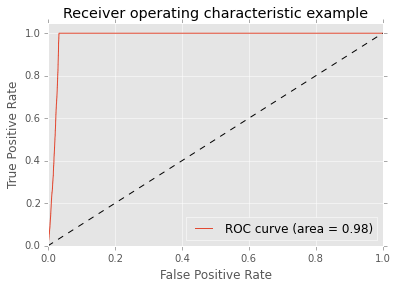
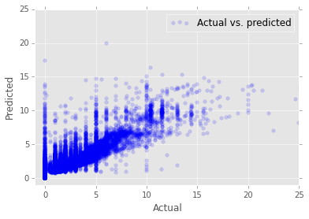

<properties
	pageTitle="Score and evaluate Spark-built machine learning models | Microsoft Azure"
	description="How to score and evaluate learning models that have been stored in Azure Blob Storage (WASB)."
	services="machine-learning"
	documentationCenter=""
	authors="bradsev"
	manager="paulettm"
	editor="cgronlun" />

<tags
	ms.service="machine-learning"
	ms.workload="data-services"
	ms.tgt_pltfrm="na"
	ms.devlang="na"
	ms.topic="article"
	ms.date="04/18/2016"
	ms.author="deguhath;bradsev" />

# Score and evaluate Spark-built machine learning models 

[AZURE.INCLUDE [machine-learning-spark-modeling](../../includes/machine-learning-spark-modeling.md)]

## Introduction

This topic describes how to access machine learning (ML) models that have been built using Spark MLlib and stored in Azure Blob Storage (WASB), and how to score them with datasets that have also been stored in WASB. It shows how to pre-process the input data, transform features using the indexing and encoding functions in the MLlib toolkit, and how to create a labeled point data object that can be used as input for scoring with the ML models. The models used for scoring and evaluation include Linear Regression, Logistic Regression, Random Forest Models, and Gradient Boosting Tree Models.

## Prerequisites

1. You need an Azure account and an HDInsight Spark cluster to begin this walkthrough. See the [Overview of Data Science using Spark on Azure HDInsight](machine-learning-data-science-spark-overview.md) for these requirements, for a description of the NYC 2013 Taxi data used here, and for instructions on how execute code from a Jupyter notebook on the Spark cluster. 

2. You must also create the machine learning models to be scored and evaluated here by working through the [Data exploration and modeling with Spark](machine-learning-data-science-spark-data-exploration-modeling.md) topic.

[AZURE.INCLUDE [delete-cluster-warning](../../includes/hdinsight-delete-cluster-warning.md)]
 

## Setup Spark and directory paths to stored data and models 

Spark is able to read and write to Azure Blob storage (WASB). So any of your existing data stored there can be processed using Spark and the results stored again in WASB.

To save models or files in WASB, the path needs to be specified properly. The default container attached to the Spark cluster can be referenced using a path beginning with: *"wasb//"*. The following code sample specifies the location of the data to be read and the path for the model storage directory to which the model output will be saved. 

Models are saved in: "wasb:///user/remoteuser/NYCTaxi/Models". If this path is not set properly, models will not be loaded for scoring.

The scored results have been saved in: "wasb:///user/remoteuser/NYCTaxi/ScoredResults". If the path to folder is incorrect, results will not be saved in that folder.

>AZURE.NOTE: The file path locations can be copied and pasted from the output of the last cell of the model training notebook) 

### Set directory paths for storage locations in WASB

	# LOCATION OF DATA TO BE SCORED
	taxi_test_file_loc = "wasb://mllibwalkthroughs@cdspsparksamples.blob.core.windows.net/Data/NYCTaxi/JoinedTaxiTripFare.Point1Pct.Test.tsv";
	
	# SET THE MODEL STORAGE DIRECTORY PATH 
	# Note that the final backslash in the path is needed.
	modelDir = "wasb:///user/remoteuser/NYCTaxi/Models/" 
	
	# SET SCORDED RESULT DIRECTORY PATH
	scoredResultDir = "wasb:///user/remoteuser/NYCTaxi/ScoredResults/"; # The last backslash is needed;
	
	# MODEL FILE LOCATIONS
	logisticRegFileLoc = modelDir + "LogisticRegressionWithLBFGS_2016-03-2618_38_19.171648";
	linearRegFileLoc = modelDir + "LinearRegressionWithSGD_2016-03-2618_49_19.425354";
	randomForestClassificationFileLoc = modelDir + "RandomForestClassification_2016-03-2618_47_50.524488";
	randomForestRegFileLoc = modelDir + "RandomForestRegression_2016-03-2618_49_43.812908";
	BoostedTreeClassificationFileLoc = modelDir + "GradientBoostingTreeClassification_2016-03-2618_48_30.850137";
	BoostedTreeRegressionFileLoc = modelDir + "GradientBoostingTreeRegression_2016-03-2618_50_25.701655";

### Import libraries needed and set Spark context 

Set spark context and import necessary libraries with the following code

	#IMPORT LIBRARIES
	import pyspark
	from pyspark import SparkConf
	from pyspark import SparkContext
	from pyspark.sql import SQLContext
	%matplotlib inline
	import matplotlib
	import matplotlib.pyplot as plt
	matplotlib.style.use('ggplot')
	from pyspark.sql import Row
	from pyspark.sql.functions import UserDefinedFunction
	from pyspark.sql.types import *
	import atexit
	from numpy import array
	import numpy as np
	import datetime
	datetime.datetime.now()
	
	# SET SPARK CONTEXT
	sc = SparkContext(conf=SparkConf().setMaster('yarn-client'))
	sqlContext = SQLContext(sc)
	atexit.register(lambda: sc.stop())
	
	sc.defaultParallelism

**OUTPUT:**

datetime.datetime(2016, 3, 26, 19, 16, 15, 532944)

4

## Ingest data and create a cleaned data frame

This section contains the code for a series of tasks required to ingest the data to be scored. Read in a joined 0.1% sample of the taxi trip and fare file (stored as a .tsv file), format the data, and then creates a clean data frame.

The taxi trip and fare files were joined based on the procedure provided in the: [The Cortana Analytics Process in action: using HDInsight Hadoop clusters](machine-learning-data-science-process-hive-walkthrough.md) topic.

	# IMPORT FILE FROM PUBLIC BLOB
	
	taxi_test_file = sc.textFile(taxi_test_file_loc)
	
	# GET SCHEMA OF THE FILE FROM HEADER
	taxi_header = taxi_test_file.filter(lambda l: "medallion" in l)
	
	# PARSE FIELDS AND CONVERT DATA TYPE FOR SOME FIELDS
	taxi_temp = taxi_test_file.subtract(taxi_header).map(lambda k: k.split("\t"))\
	        .map(lambda p: (p[0],p[1],p[2],p[3],p[4],p[5],p[6],int(p[7]),int(p[8]),int(p[9]),int(p[10]),
	                        float(p[11]),float(p[12]),p[13],p[14],p[15],p[16],p[17],p[18],float(p[19]),
	                        float(p[20]),float(p[21]),float(p[22]),float(p[23]),float(p[24]),int(p[25]),int(p[26])))
	    
	# GET SCHEMA OF THE FILE FROM HEADER
	schema_string = taxi_test_file.first()
	fields = [StructField(field_name, StringType(), True) for field_name in schema_string.split('\t')]
	fields[7].dataType = IntegerType() #Pickup hour
	fields[8].dataType = IntegerType() # Pickup week
	fields[9].dataType = IntegerType() # Weekday
	fields[10].dataType = IntegerType() # Passenger count
	fields[11].dataType = FloatType() # Trip time in secs
	fields[12].dataType = FloatType() # Trip distance
	fields[19].dataType = FloatType() # Fare amount
	fields[20].dataType = FloatType() # Surcharge
	fields[21].dataType = FloatType() # Mta_tax
	fields[22].dataType = FloatType() # Tip amount
	fields[23].dataType = FloatType() # Tolls amount
	fields[24].dataType = FloatType() # Total amount
	fields[25].dataType = IntegerType() # Tipped or not
	fields[26].dataType = IntegerType() # Tip class
	taxi_schema = StructType(fields)
	
	# CREATE DATA FRAME
	taxi_df_test = sqlContext.createDataFrame(taxi_temp, taxi_schema)
	
	# CREATE A CLEANED DATA-FRAME BY DROPPING SOME UN-NECESSARY COLUMNS & FILTERING FOR UNDESIRED VALUES OR OUTLIERS
	taxi_df_test_cleaned = taxi_df_test.drop('medallion').drop('hack_license').drop('store_and_fwd_flag').drop('pickup_datetime')\
	    .drop('dropoff_datetime').drop('pickup_longitude').drop('pickup_latitude').drop('dropoff_latitude')\
	    .drop('dropoff_longitude').drop('tip_class').drop('total_amount').drop('tolls_amount').drop('mta_tax')\
	    .drop('direct_distance').drop('surcharge')\
	    .filter("passenger_count > 0 AND passenger_count < 8 AND payment_type in('CSH','CRD') AND tip_amount >= 0 AND fare_amount > 0")

## Prepare data for scoring in Spark 

This section shows how to index, encode and scale categorical features to prepare them for use in MLlib supervised learning algorithms for classification and regression.

### Feature transformation: index and encode categorical features for input into models for scoring 

This section shows how to index categorical data using a `StringIndexer` and encode features with `OneHotEncoder` input into the models.

The [StringIndexer](http://spark.apache.org/docs/latest/ml-features.html#stringindexer) encodes a string column of labels to a column of label indices. The indices are ordered by label frequencies. 

The [OneHotEncoder](http://scikit-learn.org/stable/modules/generated/sklearn.preprocessing.OneHotEncoder.html#sklearn.preprocessing.OneHotEncoder) maps a column of label indices to a column of binary vectors, with at most a single one-value. This encoding allows algorithms which expect continuous valued features, such as logistic regression, to be applied to categorical features.
	
	# RECORD START TIME
	timestart = datetime.datetime.now()

	# LOAD PYSPARK LIBRARIES
	from pyspark.ml.feature import OneHotEncoder, StringIndexer, VectorAssembler, OneHotEncoder, VectorIndexer
	
	# INDEX AND ENCODE VENDOR_ID
	stringIndexer = StringIndexer(inputCol="vendor_id", outputCol="vendorIndex")
	model = stringIndexer.fit(taxi_df_test_cleaned)
	indexed = model.transform(taxi_df_test_cleaned)
	encoder = OneHotEncoder(dropLast=False, inputCol="vendorIndex", outputCol="vendorVec")
	encoded1 = encoder.transform(indexed)
	
	# INDEX AND ENCODE RATE_CODE
	stringIndexer = StringIndexer(inputCol="rate_code", outputCol="rateIndex")
	model = stringIndexer.fit(encoded1)
	indexed = model.transform(encoded1)
	encoder = OneHotEncoder(dropLast=False, inputCol="rateIndex", outputCol="rateVec")
	encoded2 = encoder.transform(indexed)
	
	# INDEX AND ENCODE PAYMENT_TYPE
	stringIndexer = StringIndexer(inputCol="payment_type", outputCol="paymentIndex")
	model = stringIndexer.fit(encoded2)
	indexed = model.transform(encoded2)
	encoder = OneHotEncoder(dropLast=False, inputCol="paymentIndex", outputCol="paymentVec")
	encodedFinal = encoder.transform(indexed)

	# PRINT ELAPSED TIME
	timeend = datetime.datetime.now()
	timeend-timestart

**OUTPUT:**

datetime.timedelta(0, 6, 375876)

### Create labeled point objects and scale data for input into the models

This section contains code that shows how to index categorical text data as a labeled point data type and encode it so it can be used to train and test MLlib logistic regression and tree-based models. It also contains code that shows how to scale data with the `StandardScalar` provided by MLlib for use in linear regression with Stochastic Gradient Descent (SGD), a popular algorithm for training a wide range of machine learning models.

A [labeled point](https://spark.apache.org/docs/latest/mllib-data-types.html#labeled-point) is a local vector, either dense or sparse, associated with a label/response. It contains the label (or the target variable) and the features in a format that can be used for model training or scoring. 

The [StandardScaler](https://spark.apache.org/docs/latest/api/python/pyspark.mllib.html#pyspark.mllib.feature.StandardScaler) is used to scale the features to unit variance. Feature scaling, also known as data normalization, insures that features with widely disbursed values are not given excessive weigh in the objective function. 

	# IMPORT LIBRARIES
	from pyspark.mllib.regression import LabeledPoint
	from pyspark.mllib.linalg import Vectors
	from pyspark.mllib.feature import StandardScaler, StandardScalerModel
	from pyspark.mllib.util import MLUtils
	from numpy import array
	
	# INDEXING CATEGORICAL TEXT VARIABLES FOR INPUT INTO TREE-BASED MODELS
	def parseRowIndexingBinary(line):
	    features = np.array([line.paymentIndex, line.vendorIndex, line.rateIndex, line.pickup_hour, line.weekday,
	                         line.passenger_count, line.trip_time_in_secs, line.trip_distance, line.fare_amount])
	    labPt = LabeledPoint(line.tipped, features)
	    return  labPt
	
	# ONE-HOT ENCODING OF CATEGORICAL TEXT VARIABLES FOR INPUT INTO LOGISTIC RERESSION MODELS
	def parseRowOneHotBinary(line):
	    features = np.concatenate((np.array([line.pickup_hour, line.weekday, line.passenger_count,
	                                        line.trip_time_in_secs, line.trip_distance, line.fare_amount]), 
	                               line.vendorVec.toArray(), line.rateVec.toArray(), line.paymentVec.toArray()), axis=0)
	    labPt = LabeledPoint(line.tipped, features)
	    return  labPt
	
	# ONE-HOT ENCODING OF CATEGORICAL TEXT VARIABLES FOR INPUT INTO TREE-BASED MODELS
	def parseRowIndexingRegression(line):
	    features = np.array([line.paymentIndex, line.vendorIndex, line.rateIndex, line.pickup_hour, line.weekday,
	                         line.passenger_count, line.trip_time_in_secs, line.trip_distance, line.fare_amount])
	    labPt = LabeledPoint(line.tip_amount, features)
	    return  labPt
	
	# INDEXING CATEGORICAL TEXT VARIABLES FOR INPUT INTO LOGISTIC RERESSION MODELS
	def parseRowOneHotRegression(line):
	    features = np.concatenate((np.array([line.pickup_hour, line.weekday, line.passenger_count,
	                                        line.trip_time_in_secs, line.trip_distance, line.fare_amount]), 
	                               line.vendorVec.toArray(), line.rateVec.toArray(), line.paymentVec.toArray()), axis=0)
	    labPt = LabeledPoint(line.tip_amount, features)
	    return  labPt
	
	# FOR BINARY CLASSIFICATION TRAINING AND TESTING
	indexedTESTbinary = encodedFinal.map(parseRowIndexingBinary)
	oneHotTESTbinary = encodedFinal.map(parseRowOneHotBinary)
	
	# FOR REGRESSION CLASSIFICATION TRAINING AND TESTING
	indexedTESTreg = encodedFinal.map(parseRowIndexingRegression)
	oneHotTESTreg = encodedFinal.map(parseRowOneHotRegression)
	
	# SCALING FEATURES FOR LINEARREGRESSIONWITHSGD MODEL
	label = oneHotTESTreg.map(lambda x: x.label)
	features = oneHotTESTreg.map(lambda x: x.features)
	scaler = StandardScaler(withMean=False, withStd=True).fit(features)
	dataTMP = label.zip(scaler.transform(features.map(lambda x: Vectors.dense(x.toArray()))))
	oneHotTESTregScaled = dataTMP.map(lambda x: LabeledPoint(x[0], x[1]))

## Score data with the Logistic Regression Model and evaluate the accuracy

The code in this section shows how to load a saved Logistic Regression Model for predicting whether or not a tip is paid, score and evaluate its accuracy with standard classification metrics, and then save and plot the results using Pandas data frame.

The scored results are stored in [Resilient Distributed Dataset (RDD)](http://spark.apache.org/docs/latest/api/java/org/apache/spark/rdd/RDD.html) objects. These are the basic abstraction in Spark. An RDD object represents an immutable, partitioned collection of elements that can be operated on in parallel with Spark.

	# timestart = datetime.datetime.now()
	
	from pyspark.mllib.classification import LogisticRegressionModel
	from sklearn.metrics import roc_curve,auc
	from pyspark.mllib.util import MLUtils
	from pyspark.mllib.evaluation import BinaryClassificationMetrics
	from pyspark.mllib.evaluation import MulticlassMetrics
	
	# LOAD SAVED MODEL
	savedModel = LogisticRegressionModel.load(sc, logisticRegFileLoc)
	predictionAndLabels = oneHotTESTbinary.map(lambda lp: (float(savedModel.predict(lp.features)), lp.label))
	
	# SAVE SCORED RESULTS (RDD) TO WASB
	datestamp = unicode(datetime.datetime.now()).replace(' ','').replace(':','_');
	filename = "LogisticRegressionWithLBFGS_" + datestamp + ".txt";
	dirfilename = scoredResultDir + filename;
	predictionAndLabels.saveAsTextFile(dirfilename)
	
	# EVALUATE SAVED MODEL USING ACCURACY METRICS

	# Instantiate metrics object
	metrics = BinaryClassificationMetrics(predictionAndLabels)
	# Area under precision-recall curve
	print("Area under PR = %s" % metrics.areaUnderPR)
	# Area under ROC curve
	print("Area under ROC = %s" % metrics.areaUnderROC)
	metrics = MulticlassMetrics(predictionAndLabels)
	# Overall statistics
	precision = metrics.precision()
	recall = metrics.recall()
	f1Score = metrics.fMeasure()
	print("Summary Stats")
	print("Precision = %s" % precision)
	print("Recall = %s" % recall)
	print("F1 Score = %s" % f1Score)
	
	
	# CREATE A PANDAS DATA-FRAME AND PLOT ROC-CURVE, FROM PREDICTED PROBS AND LABELS                                     
	savedModel.clearThreshold()# This clears threshold for classification (0.5) and outputs probabilities
	predictionAndLabels = oneHotTESTbinary.map(lambda lp: (float(savedModel.predict(lp.features)), lp.label))
	predictionAndLabelsDF = predictionAndLabels.toDF()
	test_predictions = predictionAndLabelsDF.toPandas()
	predictions_pddf = test_predictions.rename(columns={'_1': 'probability', '_2': 'label'})
	
	prob = predictions_pddf["probability"] 
	fpr, tpr, thresholds = roc_curve(predictions_pddf['label'], prob, pos_label=1);
	roc_auc = auc(fpr, tpr)
	
	plt.figure()
	plt.plot(fpr, tpr, label='ROC curve (area = %0.2f)' % roc_auc)
	plt.plot([0, 1], [0, 1], 'k--')
	plt.xlim([0.0, 1.0])
	plt.ylim([0.0, 1.05])
	plt.xlabel('False Positive Rate')
	plt.ylabel('True Positive Rate')
	plt.title('Receiver operating characteristic example')
	plt.legend(loc="lower right")
	plt.show()
	
	imeend = datetime.datetime.now()
	timeend-timestart

**OUTPUT:**

Area under PR = 0.985335502594
Area under ROC = 0.983445023579
Summary Stats
Precision = 0.984201800095
Recall = 0.984201800095
F1 Score = 0.984201800095

datetime.timedelta(0, 6, 375876)

## Score and evaluate Linear Regression Model

We used [LinearRegressionWithSGD](https://spark.apache.org/docs/latest/api/python/pyspark.mllib.html#pyspark.mllib.regression.LinearRegressionWithSGD) to train a linear regression model using Stochastic Gradient Descent (SGD) for optimization to predict the amount of tips paid. 

The code in this section shows how to load a Linear Regression Model, score using scaled variables, evaluate its performance with standard regression metrics, and then save the results.

	#LINEAR REGRESSION MODELS

	timestart = datetime.datetime.now()
	
	#LOAD LIBRARIES​
	from pyspark.mllib.regression import LabeledPoint, LinearRegressionWithSGD, LinearRegressionModel
	from pyspark.mllib.evaluation import RegressionMetrics
	from scipy import stats
	​
	# LOAD MODEL AND SCORE USING **SCALED VARIABLES**
	savedModel = LinearRegressionModel.load(sc, linearRegFileLoc)
	predictionAndLabels = oneHotTESTregScaled.map(lambda lp: (float(savedModel.predict(lp.features)), lp.label))
	​
	# EVALUATE MODEL
	testMetrics = RegressionMetrics(predictionAndLabels)
	print("RMSE = %s" % testMetrics.rootMeanSquaredError)
	print("R-sqr = %s" % testMetrics.r2)
	​
	# SAVE RESULTS
	datestamp = unicode(datetime.datetime.now()).replace(' ','').replace(':','_');
	filename = "LinearRegressionWithSGD_" + datestamp;
	dirfilename = scoredResultDir + filename;
	​
	predictionAndLabels.saveAsTextFile(dirfilename)
	​
	timeend = datetime.datetime.now()
	timeend-timestart

**OUTPUT:**

RMSE = 1.4615798053

R-sqr = 0.548240022305

datetime.timedelta(0, 35, 618163) 

## Score, evaluate and save classification and regression Random Forest Models

The code in this section shows how to load the saved classification and regression Random Forest Models, score and evaluate their performance with standard classifier and regression measures, and save and plot the results.

[Random forests](http://spark.apache.org/docs/latest/mllib-ensembles.html#Random-Forests) are ensembles of decision trees.  They combine many decision trees in order to reduce the risk of overfitting. Random forests can handle categorical features, extend to the multiclass classification setting, do not require feature scaling, and are able to capture non-linearities and feature interactions. Random forests are one of the most successful machine learning models for classification and regression.

[spark.mllib](http://spark.apache.org/mllib/) supports random forests for binary and multiclass classification and for regression, using both continuous and categorical features. 

	# RANDOM FOREST MODELS FOR CLASSIFICATION AND REGRESSION

	timestart = datetime.datetime.now()

	#IMPORT MLLIB LIBRARIES	
	from pyspark.mllib.tree import RandomForest, RandomForestModel

	# CLASSIFICATION: LOAD SAVED MODEL, SCORE AND SAVE RESULTS BACK TO WASB
	savedModel = RandomForestModel.load(sc, randomForestClassificationFileLoc)
	predictions = savedModel.predict(indexedTESTbinary.map(lambda x: x.features))
	predictionAndLabels = indexedTESTbinary.map(lambda lp: lp.label).zip(predictions)
	
	metrics = BinaryClassificationMetrics(predictionAndLabels)
	print("Area under ROC = %s" % metrics.areaUnderROC)
	
	# SAVE RESULTS
	datestamp = unicode(datetime.datetime.now()).replace(' ','').replace(':','_');
	filename = "RandomForestClassification_" + datestamp + ".txt";
	dirfilename = scoredResultDir + filename;
	predictionAndLabels.saveAsTextFile(dirfilename)
	
	
	# REGRESSION: LOAD SAVED MODEL, SCORE AND SAVE RESULTS BACK TO WASB
	savedModel = RandomForestModel.load(sc, randomForestRegFileLoc)
	predictions = savedModel.predict(indexedTESTreg.map(lambda x: x.features))
	predictionAndLabels = indexedTESTreg.map(lambda lp: lp.label).zip(predictions)
	
	testMetrics = RegressionMetrics(predictionAndLabels)
	print("RMSE = %s" % testMetrics.rootMeanSquaredError)
	print("R-sqr = %s" % testMetrics.r2)
	
	# SAVE RESULTS
	datestamp = unicode(datetime.datetime.now()).replace(' ','').replace(':','_');
	filename = "RandomForestRegression_" + datestamp + ".txt";
	dirfilename = scoredResultDir + filename;
	predictionAndLabels.saveAsTextFile(dirfilename)
	
	# PLOT SCATTER-PLOT BETWEEN ACTUAL AND PREDICTED TIP VALUES
	test_predictions= sqlContext.createDataFrame(predictionAndLabels)
	test_predictions_pddf = test_predictions.toPandas()
	
	ax = test_predictions_pddf.plot(kind='scatter', x='_1', y='_2', color='blue', alpha = 0.15, label='Actual vs. predicted');
	ax.set_xlabel("Actual")
	ax.set_ylabel("Predicted")
	plt.axis([-1, 25, -1, 25])
	plt.show(ax)

**OUTPUT:**

Area under ROC = 0.949940891117

RMSE = 1.12909746632

R-sqr = 0.623787375362

## Score, evaluate and save classification and regression Gradient Boosting Tree Models

The code in this section shows how to load the saved classification and regression Gradient Boosting Tree Models, score and evaluate their performance with standard classifier and regression measures, and save the results. 

**spark.mllib** supports GBTs for binary classification and for regression, using both continuous and categorical features. 

[Gradient Boosting Trees](http://spark.apache.org/docs/latest/ml-classification-regression.html#gradient-boosted-trees-gbts) (GBTs) are ensembles of decision trees. GBTs train decision trees iteratively to minimize a loss function. GBTs can handle categorical features, do not require feature scaling, and are able to capture non-linearities and feature interactions. They can also be used in a multiclass-classification setting.

	# GRADIENT BOOSTING TREE MODELS FOR CLASSIFICATION AND REGRESSION

	timestart = datetime.datetime.now()

	#IMPORT MLLIB LIBRARIES
	from pyspark.mllib.tree import GradientBoostedTrees, GradientBoostedTreesModel
	
	# CLASSIFICATION: LOAD SAVED MODEL AND SCORE 
	savedModel = GradientBoostedTreesModel.load(sc, BoostedTreeClassificationFileLoc)
	predictions = savedModel.predict(indexedTESTbinary.map(lambda x: x.features))
	predictionAndLabels = indexedTESTbinary.map(lambda lp: lp.label).zip(predictions)
	
	# EVALUATE CLASSIFICATION RESULTS
	metrics = BinaryClassificationMetrics(predictionAndLabels)
	print("Area under ROC = %s" % metrics.areaUnderROC)
	
	# SAVE CLASSIFICATION RESULTS TO WASB
	datestamp = unicode(datetime.datetime.now()).replace(' ','').replace(':','_');
	filename = "GradientBoostingTreeClassification_" + datestamp + ".txt";
	dirfilename = scoredResultDir + filename;
	predictionAndLabels.saveAsTextFile(dirfilename)
	

	# REGRESSION: LOAD SAVED MODEL AND SCORE 
	savedModel = GradientBoostedTreesModel.load(sc, BoostedTreeRegressionFileLoc)
	predictions = savedModel.predict(indexedTESTreg.map(lambda x: x.features))
	predictionAndLabels = indexedTESTreg.map(lambda lp: lp.label).zip(predictions)
	
	# EVALUATE REGRESSION RESULTS
	testMetrics = RegressionMetrics(predictionAndLabels)
	print("RMSE = %s" % testMetrics.rootMeanSquaredError)
	print("R-sqr = %s" % testMetrics.r2)
	
	
	# SAVE REGRESSION RESULTS TO WASB
	datestamp = unicode(datetime.datetime.now()).replace(' ','').replace(':','_');
	filename = "GradientBoostingTreeRegression_" + datestamp + ".txt";
	dirfilename = scoredResultDir + filename;
	predictionAndLabels.saveAsTextFile(dirfilename)
	
**OUTPUT:**
	
Area under ROC = 0.985335502594

RMSE = 1.10776865011

R-sqr = 0.648610183418

## Consume Spark Models through a web interface

Spark provides a mechanism to remotely submit batch jobs or interactive queries through a REST interface with a component called Livy. Livy is enabled by default on your HDInsight Spark cluster. For more information on Livy see: [Submit Spark jobs remotely using Livy](../hdinsight/hdinsight-apache-spark-livy-rest-interface.md). 

You can use Livy to remotely submit a job that batch scores a file that is stored in an Azure blob and then writes the results to another blob. To do this, you upload the Python script from  
[Github](https://raw.githubusercontent.com/Azure/Azure-MachineLearning-DataScience/master/Misc/Spark/Python/ConsumeGBNYCReg.py) to the blob of the Spark cluster. You can use a tool like **Microsoft Azure Storage Explorer** or **AzCopy** to copy the script to the cluster blob. In our case we uploaded  the script to ***wasb:///example/python/ConsumeGBNYCReg.py***.

>AZURE.NOTE: The access keys that you need can be found on the portal for the storage account associated with the Spark cluster. 

Once uploaded to this location, this script will run within the Spark cluster in a distributed context. It will load the model and run predictions on input files based on the model.  

You can invoke this script remotely by making a simple HTTPS/REST request on Livy.  Here is a curl command to construct the HTTP request to invoke the Python script remotely. 
You need to replace CLUSTERLOGIN, CLUSTERPASSWORD, CLUSTERNAME with the appropriate values for your Spark cluster.

	# CURL COMMAND TO INVOKE PYTHON SCRIPT WITH HTTP REQUEST

    curl -k --user "CLUSTERLOGIN:CLUSTERPASSWORD" -X POST --data "{\"file\": \"wasb:///example/python/ConsumeGBNYCReg.py\"}" -H "Content-Type: application/json" https://CLUSTERNAME.azurehdinsight.net/livy/batches

You can use any language on the remote system to invoke the Spark job through Livy by making a simple HTTPS call with Basic Authentication. 

>AZURE.NOTE: It would be convenient to use the Python Requests library when making this HTTP call, but it is not currently installed by default in Azure Functions. So older HTTP libraries are used instead.

Here is the Python code for the HTTP call:

	#MAKE AN HTTPS CALL ON LIVY. 

	import os

	# OLDER HTTP LIBRARIES USED HERE INSTEAD OF THE REQUEST LIBRARY AS THEY ARE AVAILBLE BY DEFAULT
	import httplib, urllib, base64
	
	# REPLACE VALUE WITH ONES FOR YOUR SPARK CLUSTER
	host = '<spark cluster name>.azurehdinsight.net:443'
	username='<username>'
	password='<password>'
	
	#AUTHORIZATION
	conn = httplib.HTTPSConnection(host)
	auth = base64.encodestring('%s:%s' % (username, password)).replace('\n', '')
	headers = {'Content-Type': 'application/json', 'Authorization': 'Basic %s' % auth}
	
	# SPECIFY THE PYTHON SCRIPT TO RUN ON THE SPARK CLUSTER
	# IN THE FILE PARAMETER OF THE JSON POST REQUEST BODY
	r=conn.request("POST", '/livy/batches', '{"file": "wasb:///example/python/ConsumeGBNYCReg.py"}', headers )
	response = conn.getresponse().read()
	print(response)
	conn.close()

You can also add this Python code to [Azure Functions](../functions/)  to trigger a Spark job submission that scores a blob based on various events like a timer, creation or update of a blob. 

If you prefer a code free client experience, use the [Azure Logic Apps](../app-service/logic/) to invoke the Spark batch scoring by defining a HTTP action on the **Logic Apps Designer** and setting its parameters. 

- From Azure Portal, create a new Logic App by selecting **+New** -> **Web + Mobile** -> **Logic App**. 
- Enter the name of the Logic App and App Service Plan to bring up the **Logic Apps Designer**.
- Select an HTTP action and enter the parameters shown in the following figure:

