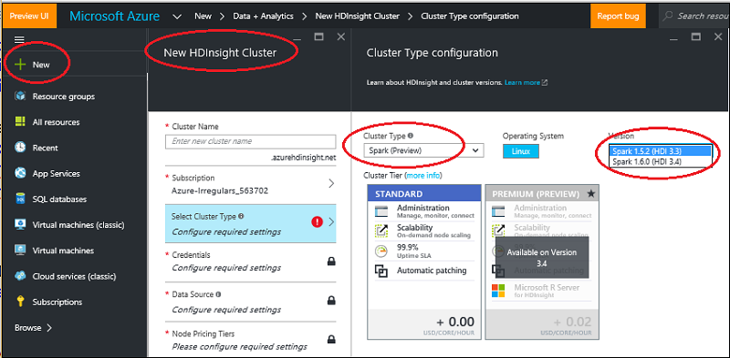
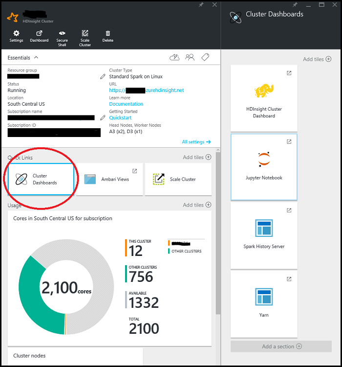
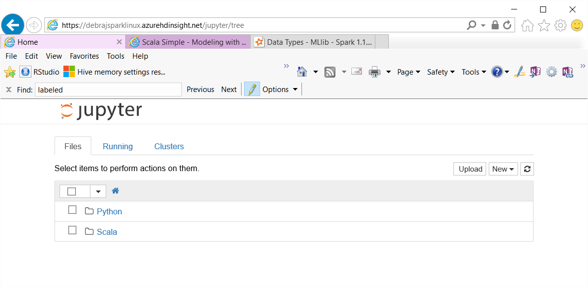
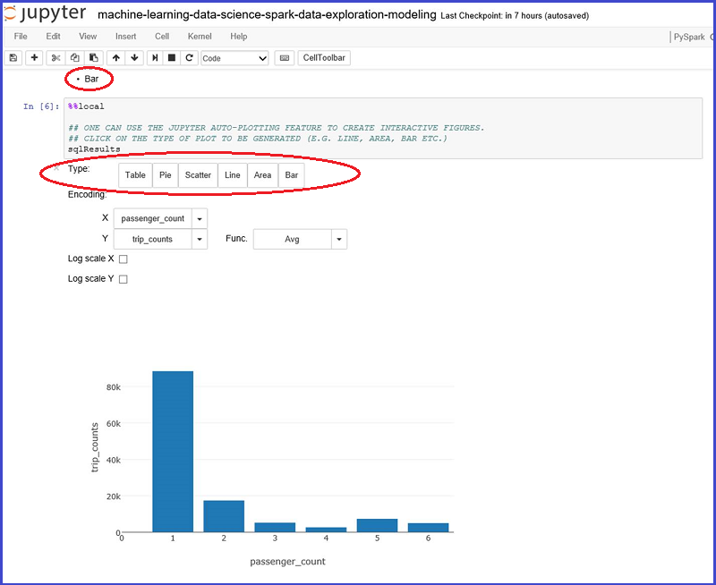

<properties
	pageTitle="Overview of Data Science using Spark on Azure HDInsight | Microsoft Azure"
	description="The Spark MLlib toolkit brings considerable machine learning modeling capabilities to the distributed HDInsight environment."
	services="machine-learning"
	documentationCenter=""
	authors="bradsev,deguhath,gokuma"
	manager="paulettm"
	editor="cgronlun"  />

<tags
	ms.service="machine-learning"
	ms.workload="data-services"
	ms.tgt_pltfrm="na"
	ms.devlang="na"
	ms.topic="article"
	ms.date="06/14/2016"
	ms.author="bradsev" />

# Overview of Data Science using Spark on Azure HDInsight

[AZURE.INCLUDE [machine-learning-spark-modeling](../../includes/machine-learning-spark-modeling.md)]

This suite of topics show how to use HDInsight Spark to complete common data science tasks such as data ingestion, feature engineering, modeling and model evaluation. The data used is a sample of the 2013 NYC taxi trip and fare dataset. The models built include logistic and linear regression, random forests and gradient boosted trees. The topics also show how to store these models in Azure blob storage (WASB) and how to score and evaluate their predictive performance. More advanced topics cover how models can be trained using cross-validation and hyper-parameter sweeping. This overview topic also describes how get set up with a Spark cluster that you need to complete the steps in the three walkthroughs provided. 

[Spark](http://spark.apache.org/) is an open-source parallel processing framework that supports in-memory processing to boost the performance of big-data analytic applications. Spark processing engine is built for speed, ease of use, and sophisticated analytics. Spark's in-memory distributed computation capabilities make it a good choice for iterative algorithms in machine learning and graph computations. [MLlib](http://spark.apache.org/mllib/) is Spark's scalable machine learning library that brings modeling capabilities to this distributed environment. 

[HDInsight Spark](../hdinsight/hdinsight-apache-spark-overview.md) is the Azure hosted offering of open-source Spark. It also includes support for **Jupyter PySpark notebooks** on the Spark cluster that can run Spark SQL interactive queries for transforming, filtering and visualizing data stored in Azure Blobs (WASB). PySpark is the Python API for Spark. The code snippets that provide the solutions and show the relevant plots to visualize the data here run in Jupyter notebooks installed on the Spark clusters. The modeling steps in these topics contain code that shows how to train, evaluate, save, and consume each type of model. 

The setup steps and code provided in this walkthrough is for HDInsight 3.4 Spark 1.6. However, the code here and in the notebooks is generic and should work on any Spark cluster. The cluster setup and management steps may be slightly different from what is shown here if you are not using HDInsight Spark.

## Prerequisites

1.Before you begin these topics, you must have an Azure subscription. If you do not already have one, see [Get Azure free trial](https://azure.microsoft.com/documentation/videos/get-azure-free-trial-for-testing-hadoop-in-hdinsight/).

2.You need an HDInsight 3.4 Spark 1.6 cluster to complete this walkthrough. To create one, see the instructions provided in [Get started: create Apache Spark on Azure HDInsight](../hdinsight/hdinsight-apache-spark-jupyter-spark-sql.md). The cluster type and version is specified from the **Select Cluster Type** menu. 

>[AZURE.INCLUDE [delete-cluster-warning](../../includes/hdinsight-delete-cluster-warning.md)]

## The NYC 2013 Taxi data

The NYC Taxi Trip data is about 20GB of compressed comma-separated values (CSV) files (~48GB uncompressed), comprising more than 173 million individual trips and the fares paid for each trip. Each trip record includes the pickup and drop-off location and time, anonymized hack (driver's) license number and medallion (taxi’s unique id) number. The data covers all trips in the year 2013 and is provided in the following two datasets for each month:

1. The 'trip_data' CSV files contain trip details, such as number of passengers, pickup and dropoff points, trip duration, and trip length. Here are a few sample records:

		medallion,hack_license,vendor_id,rate_code,store_and_fwd_flag,pickup_datetime,dropoff_datetime,passenger_count,trip_time_in_secs,trip_distance,pickup_longitude,pickup_latitude,dropoff_longitude,dropoff_latitude
		89D227B655E5C82AECF13C3F540D4CF4,BA96DE419E711691B9445D6A6307C170,CMT,1,N,2013-01-01 15:11:48,2013-01-01 15:18:10,4,382,1.00,-73.978165,40.757977,-73.989838,40.751171
		0BD7C8F5BA12B88E0B67BED28BEA73D8,9FD8F69F0804BDB5549F40E9DA1BE472,CMT,1,N,2013-01-06 00:18:35,2013-01-06 00:22:54,1,259,1.50,-74.006683,40.731781,-73.994499,40.75066
		0BD7C8F5BA12B88E0B67BED28BEA73D8,9FD8F69F0804BDB5549F40E9DA1BE472,CMT,1,N,2013-01-05 18:49:41,2013-01-05 18:54:23,1,282,1.10,-74.004707,40.73777,-74.009834,40.726002
		DFD2202EE08F7A8DC9A57B02ACB81FE2,51EE87E3205C985EF8431D850C786310,CMT,1,N,2013-01-07 23:54:15,2013-01-07 23:58:20,2,244,.70,-73.974602,40.759945,-73.984734,40.759388
		DFD2202EE08F7A8DC9A57B02ACB81FE2,51EE87E3205C985EF8431D850C786310,CMT,1,N,2013-01-07 23:25:03,2013-01-07 23:34:24,1,560,2.10,-73.97625,40.748528,-74.002586,40.747868

2. The 'trip_fare' CSV files contain details of the fare paid for each trip, such as payment type, fare amount, surcharge and taxes, tips and tolls, and the total amount paid. Here are a few sample records:

		medallion, hack_license, vendor_id, pickup_datetime, payment_type, fare_amount, surcharge, mta_tax, tip_amount, tolls_amount, total_amount
		89D227B655E5C82AECF13C3F540D4CF4,BA96DE419E711691B9445D6A6307C170,CMT,2013-01-01 15:11:48,CSH,6.5,0,0.5,0,0,7
		0BD7C8F5BA12B88E0B67BED28BEA73D8,9FD8F69F0804BDB5549F40E9DA1BE472,CMT,2013-01-06 00:18:35,CSH,6,0.5,0.5,0,0,7
		0BD7C8F5BA12B88E0B67BED28BEA73D8,9FD8F69F0804BDB5549F40E9DA1BE472,CMT,2013-01-05 18:49:41,CSH,5.5,1,0.5,0,0,7
		DFD2202EE08F7A8DC9A57B02ACB81FE2,51EE87E3205C985EF8431D850C786310,CMT,2013-01-07 23:54:15,CSH,5,0.5,0.5,0,0,6
		DFD2202EE08F7A8DC9A57B02ACB81FE2,51EE87E3205C985EF8431D850C786310,CMT,2013-01-07 23:25:03,CSH,9.5,0.5,0.5,0,0,10.5

The unique key to join trip\_data and trip\_fare is composed of the fields: medallion, hack\_licence and pickup\_datetime.

We have taken a 0.1% sample of these files and joined these into a single dataset that will be used as the input dataset for this walkthrough. The unique key to join trip\_data and trip\_fare is composed of the fields: medallion, hack\_licence and pickup\_datetime. Each record of the dataset contains the following attributes representing a NYC Taxi trip:

|Field| Brief Description
|------|---------------------------------
| medallion |Anonymized taxi medallion (unique taxi id)
| hack_license |	Anonymized Hackney Carriage License number
| vendor_id |	Taxi vendor id
| rate_code	| NYC taxi rate of fare
| store_and_fwd_flag | Store and forward flag
| pickup_datetime |	Pickup date & time
| dropoff_datetime | Dropoff date & time
| pickup_hour |	Pickup hour
| pickup_week |	Pickup week of the year
| weekday |	Weekday (range 1-7)
| passenger_count |	Number of passengers in a taxi trip
| trip_time_in_secs | Trip time in seconds
| trip_distance | Trip distance traveled in miles
| pickup_longitude | Pickup longitude
| pickup_latitude |	Pickup latitude
| dropoff_longitude | Dropoff longitude
| dropoff_latitude | Dropoff latitude
| direct_distance |	Direct distance between pickup and dropoff locations
| payment_type | Payment type (cas, credit-card etc.)
| fare_amount | Fare amount in
| surcharge	| Surcharge surcharge
| mta_tax |	Mta tax
| tip_amount | Tip amount
| tolls_amount | Tolls amount
| total_amount | Total amount
| tipped | Tipped tipped (0/1 for no or yes)
| tip_class | Tip class (0: $0, 1: $0-5, 2: $6-10, 3: $11-20, 4: >  $20)

## Execute code from a Jupyter notebook on the Spark cluster 

You can launch the Jupyter Notebook from the Azure portal. Find your Spark cluster on your dashboard and click on it to enter management page for your cluster. Then click on the **Cluster Dashboards** -> **Jupyter Notebook** to open the notebook associated with the Spark cluster.

You can also browse to ***https://CLUSTERNAME.azurehdinsight.net/jupyter*** to access the Jupyter Notebooks. Just replace the CLUSTERNAME part of this URL with the name of your own cluster. You will need the password for your admin account to access the notebooks.

Select PySpark to see a directory that contains a few examples of pre-packaged notebooks that use the PySpark API.The notebooks that contain the code samples for this suite of Spark topic are available at [Github](https://github.com/Azure/Azure-MachineLearning-DataScience/tree/master/Misc/Spark/pySpark)

You can upload the notebooks directly from Github to the Jupyter notebook server on your Spark cluster. On the home page of your Jupyter, click on the **Upload** button on the right part of the screen. It will open a file explorer. Here you can paste the Github (raw content) URL of the Notebook and click **Open**. The PySpark notebooks are available at the following URLs:

1.	[pySpark-machine-learning-data-science-spark-data-exploration-modeling.ipynb](https://github.com/Azure/Azure-MachineLearning-DataScience/blob/master/Misc/Spark/pySpark/pySpark-machine-learning-data-science-spark-data-exploration-modeling.ipynb)
2.	[pySpark-machine-learning-data-science-spark-model-consumption.ipynb](https://github.com/Azure/Azure-MachineLearning-DataScience/blob/master/Misc/Spark/pySpark/pySpark-machine-learning-data-science-spark-model-consumption.ipynb)
3.	[pySpark-machine-learning-data-science-spark-advanced-data-exploration-modeling.ipynb](https://github.com/Azure/Azure-MachineLearning-DataScience/blob/master/Misc/Spark/pySpark/pySpark-machine-learning-data-science-spark-advanced-data-exploration-modeling.ipynb)

You will see the file name on your Jupyter file list with an **Upload** button again. Click this **Upload** button. Now, you have imported the notebook. Repeat these steps to upload the following notebooks from this walkthrough.

> [AZURE.TIP] You can right click the links below on your browser and select **Copy Link** to get the github raw content URL that you can paste into the Jupyter Upload file explorer dialog box.

Now you can:

- Click on the notebook to see the code
- Execute each cell by pressing **SHIFT-ENTER**
- Run the entire notebook by clicking on **Cell** -> **Run**
- Use the automatic visualization of queries

> [AZURE.TIP] The PySpark kernel automatically visualizes the output of SQL (HiveQL) queries. You are given the option to select among several different types of visualizations (Table, Pie, Line, Area, or Bar) by using the **Type** menu buttons in the notebook:

## What's next?

Now that you are set up with an HDInsight Spark cluster and have uploaded the Jupyter notebooks, you are ready to work through the topics that correspond to these three PySpark notebooks, that show how to explore your data, create and consume models. The advanced data exploration and modeling notebook dives deeper into including cross-validation, hyper-parameter sweeping and model evaluation. 

**Data Exploration and modeling with Spark:** Explore the dataset, create the machine learning models to be scored and evaluated here by working through the [Create binary classification and regression models for data with the Spark MLlib toolkit](machine-learning-data-science-spark-data-exploration-modeling.md) topic.

**Model consumption:** To learn how to score the classification and regression models created in this topic, see [Score and evaluate Spark-built machine learning models](machine-learning-data-science-spark-model-consumption.md).

**Cross-validation and hyperparameter sweeping**: See [Advanced data exploration and modeling with Spark](machine-learning-data-science-spark-advanced-data-exploration-modeling.md) on how models can be trained using cross-validation and hyper-parameter sweeping

