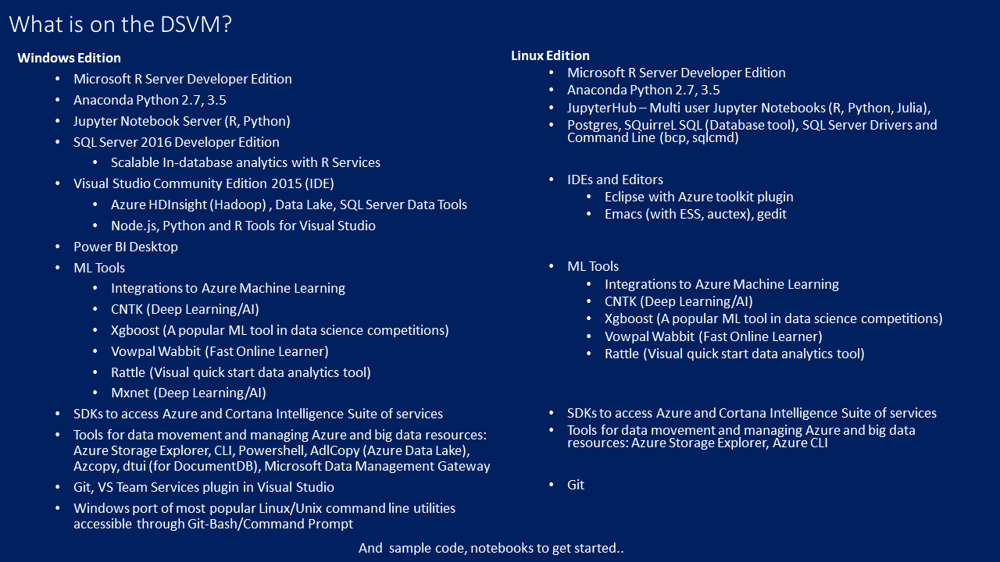

<properties 
	pageTitle="Overview of Data Science Virtual Machine | Azure" 
	description="The Data Science Virtual Machine is an Azure VM image available in both Windows and Linux editions, purpose built for doing data science productively." 
	services="machine-learning" 
	documentationCenter="" 
	authors="bradsev" 
	manager="jhubbard" 
	editor="cgronlun"/>

<tags 
	ms.service="machine-learning" 
	ms.workload="data-services" 
	ms.tgt_pltfrm="na" 
	ms.devlang="na" 
	ms.topic="article" 
	ms.date="10/06/2016" 
	ms.author="bradsev" /> 

# Overview of Data Science Virtual Machine

DSVM is a custom virtual machine image on Microsoft’s cloud specifically built for data science. It has many popular data science and other tools pre-installed and pre-configured to jump-start building intelligent applications using advanced analytics. These can be deployed on the cloud, on-premises or in a hybrid environment. It also includes tools that make it easy to work with various Azure Data and analytics products. You can explore and build predictive models on large-scale data sets using the Microsoft R Server (Developer Edition) on the VM along with a host of other tools from Open source community and from Microsoft. The DSVM is available on both Windows Server 2012 and Linux (OpenLogic CentOS 7 based). 

The goal of the DSVM is to provide data professionals at all skill levels and roles with a friction-free data science environment. This saves you considerable time that you would spend if you rolled out a comparable environment on your own. The DSVM is pre-configured for the broadest usage; scale up or down your environment as per your project needs; and most importantly provide you total control to use any language, install other tools, or customize the system to your exact needs.​​

The Microsoft Data Science Virtual Machine (DSVM) is available on Windows 2012 Server or OpenLogic 7.2 CentOS-based Linux operating systems. It contains popular tools for data science modeling and development activities and machine learning tools. All the tools are preinstalled and preconfigured to help you get started immediately after you create your instance of the virtual machine on Azure.

This topic discusses some of the **key scenarios** for using the DSVM, itemizes the **key features** available on the Windows and Linux versions, and outlines **how to get started** using them.

##Key usage scenarios

### Analytics Desktop on Cloud

The DSVM provides a baseline configuration for data science teams looking to replace their local desktops with a managed cloud desktop. This baseline ensures that all the data scientists on a team have a consistent setup with which to verify experiments and promote collaboration. It also lowers the total cost through reduced sysadmin burden and time saved to evaluate, install, and maintain various software packages needed to do advanced analytics.  

### Data Science Training and Education 

Enterprise trainers and educators teaching data science classes usually provide a virtual machine image to ensure that their students have a consistent setup and the samples work predictably. The DSVM creates an on-demand environment with a consistent setup, which eases the support and incompatibility challenges. Cases where these environments are built frequently, especially with shorter training classes, benefit substantially. 

### On-demand elastic capacity for large workloads 

Data science hackathons/competitions or large-scale data modeling and explorations require scaled out hardware capacity typically for short duration. The DSVM can help replicate the data science environment on demand, on scaled out servers that allow experiments requiring high powered computing resources to be run quickly. 

### Short-term experimentation and evaluation 

The DSVM can be used to evaluate or learn tools like Microsoft R Server, SQL Server, Visual Studio tools, Jupyter, deep learning / ML toolkits, new tools popular in the community with minimal setup effort. Since the DSVM can be set up quickly, it can be applied in other short-term usage scenarios like replicating published experiments, executing demos, following walkthroughs in online or conference tutorials sessions.

## Key features in Windows and Linux versions

## How to get started with the Data Science Virtual Machine

### Get started with the Windows version of the DSVM

- Create an instance of the VM on Windows by navigating to [this page](https://azure.microsoft.com/marketplace/partners/microsoft-ads/standard-data-science-vm/) and selecting the green **Create Virtual Machine** button.
- Sign in to the VM from your remote desktop using the credentials you specified when you created the VM.
- To discover and launch the tools available, click on the **Start** menu. 

### Get started with the Linux version of the DSVM

- Create an instance of the VM on Linux (OpenLogic CentOS-based) by navigating to [this page](https://azure.microsoft.com/marketplace/partners/microsoft-ads/linux-data-science-vm/) and selecting the **Create Virtual Machine** button. 
- Sign in to the VM from an SSH client, such as Putty or SSH Command, using the credentials you specified when you created the VM.
- In the shell prompt, enter dsvm-more-info. 
- For a graphical desktop, download the X2Go client for your client platform [here](http://wiki.x2go.org/doku.php/doc:installation:x2goclient) and follow the instructions in the Linux DSVM document [Provision the Linux Data Science Virtual Machine](machine-learning-data-science-linux-dsvm-intro.md#installing-and-configuring-x2go-client). 

## Next steps

### For the Windows DSVM

- For more information on how to run specific tools available on the Windows version, see [Provision the Microsoft Data Science Virtual Machine](machine-learning-data-science-provision-vm.md) and 
-  For more information on how to perform various tasks needed for your data science project, see [Ten things you can do on the Data science Virtual Machine](machine-learning-data-science-vm-do-ten-things.md).

### For the Linux DSVM

- For more information on how to run specific tools available on the Linux version, see [Provision the Linux Data Science Virtual Machine](machine-learning-data-science-linux-dsvm-intro.md). 
- For a walkthrough that shows you how to perform several common data science tasks with the Linux VM, see [Data science on the Linux Data Science Virtual Machine](machine-learning-data-science-linux-dsvm-walkthrough.md).

