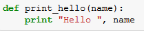
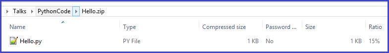

<properties 
	pageTitle="Execute Python machine learning scripts | Microsoft Azure" 
	description="Outlines design principles underlying support for Python scripts in Azure Machine Learning and basic usage scenarios, capabilities, and limitations." 
	keywords="python machine learning,pandas,python pandas,python scripts, execute python scripts"
	services="machine-learning"
	documentationCenter="" 
	authors="bradsev" 
	manager="paulettm" 
	editor="cgronlun"/>

<tags 
	ms.service="machine-learning" 
	ms.workload="data-services" 
	ms.tgt_pltfrm="na" 
	ms.devlang="na" 
	ms.topic="article" 
	ms.date="05/27/2016" 
	ms.author="bradsev" />

# Execute Python machine learning scripts in Azure Machine Learning Studio

This topic describes the design principles underlying the current support for Python scripts in Azure Machine Learning. The main capabilities are also outlined, including support for importing existing code, exporting visualizations and, finally, some of the limitations and ongoing work are discussed.

[Python](https://www.python.org/) is an indispensable tool in the tool chest of many data scientists. It has an elegant and concise syntax, cross-platform support, a vast collection of powerful libraries, and mature development tools. Python is being used in all phases of the workflow typically used in machine learning modeling, starting from data ingest and processing, to feature construction to training, validation and deployment of models. 

Azure Machine Learning Studio supports embedding Python scripts into various parts of a machine learning experiment and also seamlessly publishing them as scalable, operationalized web services on Microsoft Azure.

[AZURE.INCLUDE [machine-learning-free-trial](../../includes/machine-learning-free-trial.md)]

## Design principles of Python scripts in Machine Learning
The primary interface to Python in Azure Machine Learning Studio is via the [Execute Python Script][execute-python-script] module shown in Figure 1.

Figure 1. The **Execute Python Script** module.

The [Execute Python Script][execute-python-script] module accepts up to three inputs and produces up to two outputs (discussed below), just like its R analogue, the [Execute R Script][execute-r-script] module. The Python code to be executed is entered into the parameter box as a specially-named entry-point function called `azureml_main`. Here are the key design principles used to implement this module:

1.	*Must be idiomatic for Python users.* Most Python users factor their code as functions inside modules, so putting a lot of executable statements in a top-level module is relatively rare. As a result, the script box also takes a specially named Python function as opposed to just a sequence of statements. The objects exposed in the function are standard Python library types such as [Pandas](http://pandas.pydata.org/) data frames and [NumPy](http://www.numpy.org/) arrays.
2.	*Must have high-fidelity between local and cloud executions.* The backend used to execute the Python code is based on [Anaconda](https://store.continuum.io/cshop/anaconda/) 2.1, a widely-used cross-platform scientific Python distribution. It comes with close to 200 of the most common Python packages. Therefore, a data scientist can debug and qualify their code on his or her local Azure Machine Learning compatible Anaconda environment using existing development environments such as [IPython](http://ipython.org/) notebook or [Python Tools for Visual Studio](http://aka.ms/ptvs) and run it as part of an Azure Machine Learning experiment with high confidence. Further, the `azureml_main` entry point is a vanilla Python function and can be authored without Azure Machine Learning specific code or the SDK installed.
3.	*Must be seamlessly composable with other Azure Machine Learning modules.* The [Execute Python Script][execute-python-script] module accepts, as inputs and outputs, standard Azure Machine Learning datasets. The underlying framework transparently and efficiently bridges the Azure Machine Learning and Python runtimes (supporting features such as missing values). Python can therefore be used in conjunction with existing Azure Machine Learning workflows, including those that call into R and SQLite. One can therefore envisage workflows that:
  * use Python and Pandas for data pre-processing and cleaning, 
  * feed the data to a SQL transformation, joining multiple datasets to form features, 
  * train models using the extensive collection of algorithms in Azure Machine Learning, and 
  * evaluate and post-process the results using R.

## Basic usage scenarios in Machine Learning for Python scripts
In this section, we survey some of the basic uses of the [Execute Python Script][execute-python-script] module.
As mentioned earlier, any inputs to the Python module are exposed as Pandas data frames. More information on Python Pandas and how it can be used to manipulate data effectively and efficiently can be found in *Python for Data Analysis* (Sebastopol, CA.: O'Reilly, 2012) by W. McKinney. The function must return a single Pandas data frame packaged inside of a Python [sequence](https://docs.python.org/2/c-api/sequence.html) such as a tuple, list, or NumPy array. The first element of this sequence is then returned in the first output port of the module. This scheme is shown in Figure 2.

Figure 2. Mapping of input ports to parameters and return value to output port.

More detailed semantics of how the input ports get mapped to parameters of the `azureml_main` function are shown in Table 1:

Table 1. Mapping of input ports to function parameters.

Note that the mapping between input ports and function parameters is positional, i.e., the first connected input port is mapped to the first parameter of the function and the second input (if connected) is mapped to the second parameter of the function.

## Translation of input and output types
As explained earlier, input datasets in Azure Machine Learning are converted to data frames in Pandas and output data frames are converted back to Azure Machine Learning datasets. The following conversions are performed:

1.	String and numeric columns are converted as-is and missing values in a dataset are converted to ‘NA’ values in Pandas. The same conversion happens on the way back (NA values in Pandas are converted to missing values in Azure Machine Learning).
2.	Index vectors in Pandas are not supported in Azure Machine Learning and all input data frames in the Python function will always have a 64-bit numerical index from 0 through the number of rows minus 1. 
3.	Azure Machine Learning datasets cannot have duplicate column names and column names that are not strings. If an output data frame contains non-numeric columns, the framework calls `str` on the column names. Likewise, any duplicate column names are automatically mangled to insure the names are unique. The suffix (2) is added to the first duplicate, (3) to the second duplicate, etc.

## Operationalizing Python scripts
Any [Execute Python Script][execute-python-script] modules used in a scoring experiment are called when published as a web service. For example, Figure 3 shows a scoring experiment containing the code to evaluate a single Python expression. 

Figure 3. Web service for evaluating a Python expression.

A web service created from this experiment takes as input a Python expression (as a string), sends it to the Python interpreter and returns a table containing both the expression and the evaluated result.

## Importing existing Python script modules
A common use-case for many data scientists is to incorporate existing Python scripts into Azure Machine Learning experiments. Instead of concatenating and pasting all the code into a single script box, the [Execute Python Script][execute-python-script] module accepts a third input port to which a zip file that contains the Python modules can be connected. The file is then unzipped by the execution framework at runtime and the contents are added to the library path of the Python interpreter. The `azureml_main` entry point function can then import these modules directly.

As an example, consider the file Hello.py containing a simple “Hello, World” function.

Figure 4. User-defined function.

Next, we can create a file Hello.zip containing Hello.py:

Figure 5. Zip file containing user-defined Python code.

Then, upload this as a dataset into Azure Machine Learning Studio.
If we then create and run a simple experiment a uses the module:

Figure 6. Sample experiment with user-defined Python code uploaded as a zip file.

The module output shows that the zip file has been unpackaged and the function `print_hello` has indeed been run.
 

 
Figure 7. User-defined function in use inside the [Execute Python Script][execute-python-script] module.

## Working with visualizations
Plots created using MatplotLib that can be visualized on the browser can be returned by the [Execute Python Script][execute-python-script]. But the plots are not automatically redirected to images as they are when using R. So the user must explicitly save any plots to PNG files if they are to be returned back to Azure Machine Learning. 

In order to generate images from MatplotLib, you must compete the following procedure:

* switch the backend to “AGG” from the default Qt-based renderer 
* create a new figure object 
* get the axis and generate all plots into it 
* save the figure to a PNG file 

This process is illustrated in Figure 8 below that creates a scatter plot matrix using the scatter_matrix function in Pandas.
 

Figure 8. Saving MatplotLib figures to images.

Figure 9 shows an experiment that uses the script shown above to return plots via the second output port.

 
	 
 

Figure 9. Visualizing plots generated from Python code.

Note that it is possible to return multiple figures by saving them into different images, the Azure Machine Learning runtime picks up all images and concatenates them for visualization.

## Advanced examples
The Anaconda environment installed in Azure Machine Learning contains common packages such as NumPy, SciPy and Scikits-Learn and these can be effectively used for various data processing tasks in a typical machine learning pipeline. As an example, the following experiment and script illustrates the use of ensemble learners in Scikits-Learn to compute feature importance scores for a dataset. The scores can then be used to perform supervised feature selection before feeding into another machine learning model.

The Python function to compute the importance scores and order the features based on it is shown below:

Figure 10. Function to rank features by scores.
 
The following experiment then computes and returns the importance scores of features in the “Pima Indian Diabetes” dataset in Azure Machine Learning:

	
	
Figure 11. Experiment to rank features in the Pima Indian Diabetes dataset.

## Limitations 
The [Execute Python Script][execute-python-script] currently has the following limitations:

1.	*Sandboxed execution.* The Python runtime is currently sandboxed and, as a result, does not allow access to the network or to the local file system in a persistent manner. All files saved locally are isolated and deleted once the module finishes. The Python code cannot access most directories on the machine it runs on, the exception being the current directory and its sub-directories.
2.	*Lack of sophisticated development and debugging support.* The Python module currently does not support IDE features such as intellisense and debugging. Also, if the module fails at runtime, the full Python stack trace is available, but must be viewed in the output log for the module. We currently recommend that users develop and debug their Python scripts in an environment such as IPython and then import the code into the module.
3.	*Single data frame output.* The Python entry point is only permitted to return a single data frame as output. It is not currently possible to return arbitrary Python objects such as trained models directly back to the Azure Machine Learning runtime. Like [Execute R Script][execute-r-script], which has the same limitation, it is however possible in many cases to pickle objects into a byte array and then return that inside of a data frame.
4.	*Inability to customize Python installation*. Currently, the only way to add custom Python modules is via the zip file mechanism described earlier. While this is feasible for small modules, it is cumbersome for large modules (especially those with native DLLs) or a large number of modules. 

##Conclusions
The [Execute Python Script][execute-python-script] module allows a data scientist to incorporate existing Python code into cloud-hosted machine learning workflows in Azure Machine Learning and to seamlessly operationalize them as part of a web service. The Python script module interoperates naturally with other modules in Azure Machine Learning and can be used for a range of tasks from data exploration to pre-processing, to feature extraction, to evaluation and post-processing of the results. The backend runtime used for execution is based on Anaconda, a well-tested and widely-used Python distribution. This makes it simple for users to onboard existing code assets into the cloud.

Over the coming months, we expect to provide additional functionality to the [Execute Python Script][execute-python-script] module such as the ability to train and operationalize models in Python and to add better support for the development and debugging code in Azure Machine Learning Studio.

## Next steps

For more information, see the [Python Developer Center](/develop/python/).

<!-- Module References -->
[execute-python-script]: https://msdn.microsoft.com/library/azure/cdb56f95-7f4c-404d-bde7-5bb972e6f232/
[execute-r-script]: https://msdn.microsoft.com/library/azure/30806023-392b-42e0-94d6-6b775a6e0fd5/
